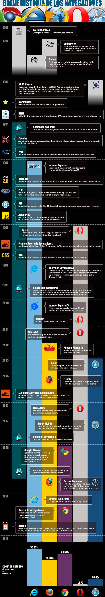
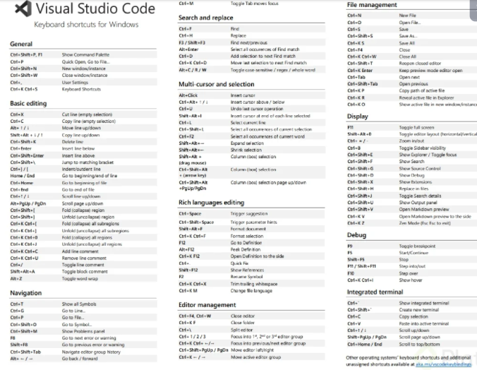
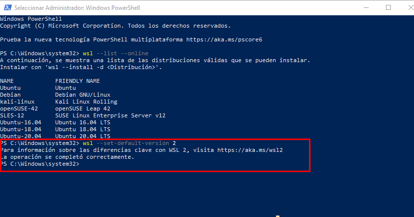
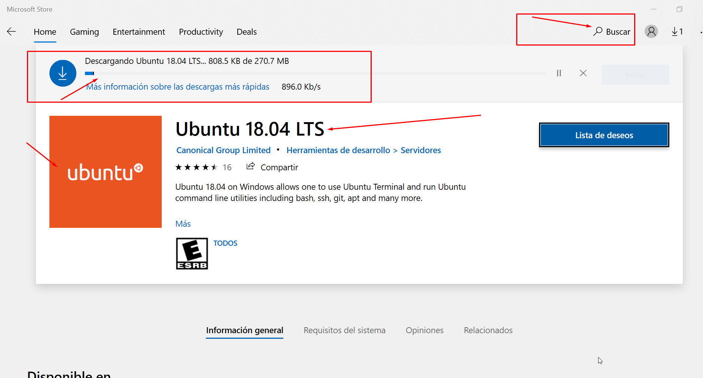
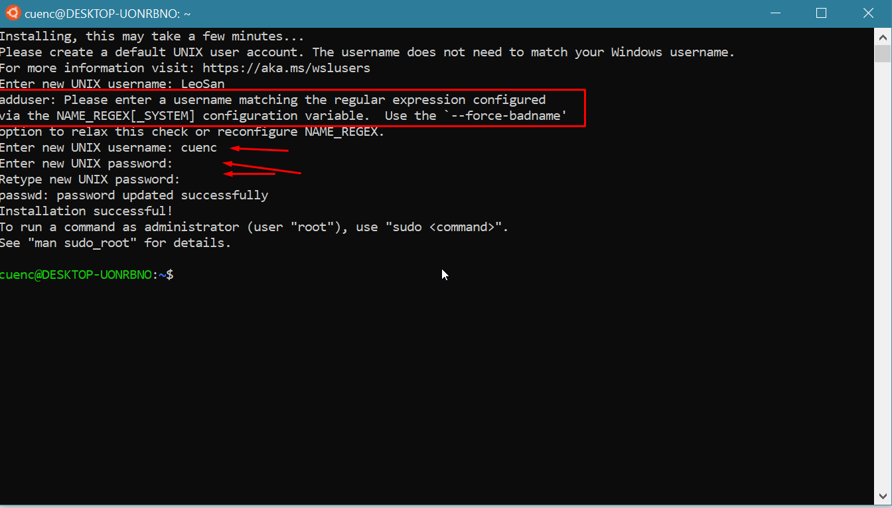
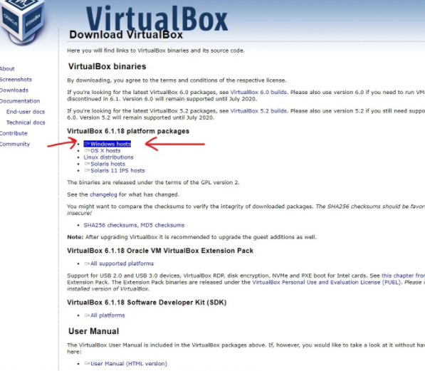

# Curso de Prework Configuración de Entorno de Desarrollo en Windows

## Clase 1: 
- Introducción al curso 
- SI o SI  a huevo debemos instalar entornos de trabajo. 

## Clase 2:  Navegador: qué es

**Los navegadores funcionan con un protocolo que define como se realiza la transferencia de datos a travel de internet. **

- HTTP : Hypertext Transfer Protocol (Protocolo de Transferencia de Hipertexto)
- HTTPS: Hypertext Transfer Protocol Secure (Protocolo de Transferencia de Hipertexto Seguro)

**En la actualida la manera de escribir, leer e interpretar los datos transferidos a travel de 3 lenguajes que todos los navegadores pueden entender. Estos son:**

- HTML: HyperText Markup Language
- CSS: Cascade Style Sheet
- Javascript: Es el lenguaje que le da interaction a las paginas

**Google Chrome es uno de los navegadores mas modernos y mas utilizado, el cual tiene 3 versiones:**

- Google Stable. Version que todos usamos
- Google Dev: Version para desarrolladores que contiene las nuevas funcionalidades y el navegador se actualiza semanalmente
- Google Canary: Version para desarrolladores que contiene las nuevas funcionalidades y el navegador se actualiza diariamente

**Otro navegador muy comun es Firefox que tambien cuenta con 2 versiones:**

- Firefox: Version normal
- Firefox Dev: Version para desarrolladores

**Temas**
- Histtoria del HTTP 
- Historia de los navegadores 
- Chrome, Firefox, Edge 
- Edege y sus  DevTools 




## Clase 3: Instalando Firefox, Chrome y usando sus DevTools
  
  **Enlaces**
  - [html5accessibility](https://www.html5accessibility.com/)
  - [Google Chrome](https://www.google.com/chrome/browser/index.html)
  - [Firefox Developer Edition](https://www.mozilla.org/en-US/firefox/developer/)
  - [Download New Microsoft Edge Browser](https://www.microsoft.com/edge)
  
## Clase 4: Editor de texto: instalando el tuyo

>Un **IDE **(Integrated Development Environment) representa un entorno de desarrollo integrado, un ambiente en donde puedes programar. Este IDE trae consigo herramientas que ayudan al desarrollador, como: debugger (depurador), consola, GIT, inteligencia (la cual te ayuda a corregir la sintaxis cuando estás escribiendo código), etc.

**Enlaces** 
- [WebStorm](https://www.jetbrains.com/es-es/webstorm/)
- [Atom](https://atom.io/)
- [Visual Studio](https://visualstudio.microsoft.com/es/)
- [Sublime Text](https://www.sublimetext.com/)
- [NotePadd ++ Clasico](https://notepad-plus-plus.org/downloads/)
> La clave correcta es que uses el editor que te sientas comodo para desarrollar, que sea amigable para ti y que puedas seguir aprendiendo ya que no hay edito definitivo

## Clase 5: Extensiones y personalización de Visual Studio Code

>La extensiones te ayudan a cometer menos errores a sentirte mas cómodo y confiado en tu codificación, no hay extensiones absolutas debes ir probando y tener tu propia lista de extensiones para tus desarrollos, te recomiendo hacer una lista en keep de google y tengas ahí tus extensiones favoritas por cada lenguaje. 



**Listado para JS**
- Color Highlight - Visual Studio Marketplace - https://marketplace.visualstudio.com/items?itemName=naumovs.color-highlight
- Live Server - Visual Studio Marketplace - https://marketplace.visualstudio.com/items?itemName=ritwickdey.LiveServer
- Path Intellisense - Visual Studio Marketplace - https://marketplace.visualstudio.com/items?itemName=christian-kohler.path-intellisense
- Auto Rename Tag - Visual Studio Marketplace - https://marketplace.visualstudio.com/items?itemName=formulahendry.auto-rename-tag
- Material Icon Theme - Visual Studio Marketplace - https://marketplace.visualstudio.com/items?itemName=PKief.material-icon-theme
- Prettier - Code formatter - Visual Studio Marketplace - https://marketplace.visualstudio.com/items?itemName=esbenp.prettier-vscode
- vscode-icons - Visual Studio Marketplace - https://marketplace.visualstudio.com/items?itemName=vscode-icons-team.vscode-icons
- Bracket Pair Colorizer - Visual Studio Marketplace - https://marketplace.visualstudio.com/items?itemName=CoenraadS.bracket-pair-colorizer

## Clase 6: Primer Hola mundo y uso de Live Server 

> No es mucho es clase basica 

## Clase 7 / 8 /9 : ¿Qué es Windows Subsystem for Linux?

> Vamos instalar esto para transformar windows en Linux 
- Paso 1: Debemos tener la ultima actualización de windows verificamos esto con el comando `winver`
- Paso 2: Ejecutamos elcomando `dism.exe /online /enable-feature /featurename:Microsoft-Windows-Subsystem-Linux /all /norestart`
- Paso 3: Habilitar la función de maquina virtual `dism.exe /online /enable-feature /featurename:VirtualMachinePlatform /all /norestart`
- Paso 4: Primero valida que versión tienes -> `wsl --list --online` ó `wsl --status` ó `wsl --list --all` ó `wsl --verbose`
- Paso 4.1: Primero valida que versión tienes -> `wsl --install -d Ubuntu` 
- Paso 5: Debemos ir a la Bios reiniciamos nuestra PC y le damos f2 para entrar a la bios buscamos la opción configuracion/avanzados/virtulization -> [Enable] luego f10 
- Paso 6: Debemos instalar ó actualizar el Kernel -> https://wslstorestorage.blob.core.windows.net/wslblob/wsl_update_x64.msi -> Instalamos
- Paso 7: Luego instalas `wsl --set-default-version 2` -> Debe salir "La operacion se completo correctamente"
- Paso 8: Felicidades ya deberias tenerlo instalado deberia salir este mensaje 

- Paso 9: Debemos instalar una version en la microsoft store ya que no tenemos ninguna la manera de validarlo es con el comando `wsl -l -v` 

- Paso 10: Damos clic en Iniciar y crear nuestro usuario y contraseña en este caso uso el nombre de la maquina cuenc/**** misma de la maquina



## Clase 10: Instalación de VirtualBox 

>  En caso que no se pueda usar el WSL para Win10, podemos usar el virtualizados 
- Descargamos en este link https://www.virtualbox.org/wiki/Downloads 
 


> Da clic derecho y ejecutar como administrador. Acepta las opciones de instalación como es común en los instaladores Windows. Posiblemente te pida permisos sobre el hardware, es normal, ya que utiliza algunos recursos a bajo nivel para emular sistemas.

Cuando termine el proceso de instalación se abrirá la ventana de VirtualBox y tendrás todo listo para empezar a emular sistemas completos dentro de tu computadora.


## Clase 11  Instalación de VirtualBox

> Si es que no puedes instalar WSL 2 en tu sistema Windows, debido a que no es compatible, existen otras maneras en las que podemos utilizar un sistema Linux en nuestros equipos, una técnica para ello es virtualizar. La virtualización es la forma en la que podemos crear recursos informáticos de manera virtual, como lo puede ser el hardware.

> Para poder realizar esta tarea primero instalaremos una herramienta de virtualización muy popular llamada VirtualBox. Solo necesitas dirigirte a su página oficial y descargar el instalador. Debes seleccionar la opción que dice “Windows hosts”.

- https://www.virtualbox.org/ 

Paso Para instalar la Maquina Virtual 

-> https://platzi.com/clases/2042-prework-windows/32466-instalando-ubuntu-en-una-maquina-virtual/


## Clase 12: Comandos básicos de la terminal e instalación de Node.js

Comando basicos 

-> Esto por si olvidaste la comtraseña en ubuntu 
https://www.youtube.com/watch?v=ZKsFm2ecedM&ab_channel=MichaelHoefer

```
En Ubuntu 

- sudo apt-get update
- sudo apt-get upgrade
- sudo chown -R user ~/nombrecarpeta
- sudo get install npm 

Comandos básicos en la terminal:
$pwd: Nos muestra la ruta de carpetas en la que te encuentras ahora mismo.

$mkdir: Nos permite crear carpetas (por ejemplo, mkdir Carpeta-Importante).

$touch: Nos permite crear archivos (por ejemplo, touch archivo.txt).

$rm: Nos permite borrar un archivo o carpeta (por ejemplo, rm archivo.txt). Mucho cuidado con este comando, puedes borrar todo tu disco duro.

$cat: Ver el contenido de un archivo (por ejemplo, cat nombre-archivo.txt).

$ls: Nos permite cambiar ver los archivos de la carpeta donde estamos ahora mismo. Podemos usar uno o más argumentos para ver más información sobre estos archivos (los argumentos pueden ser -- + el nombre del argumento o - + una sola letra o shortcut por cada argumento).
- ls -a: Mostrar todos los archivos, incluso los ocultos.
- ls -l: Ver todos los archivos como una lista.

$cd: Nos permite navegar entre carpetas.
- cd /: Ir a la ruta principal:
- cd o cd ~: Ir a la ruta de tu usuario
- cd carpeta/subcarpeta: Navegar a una ruta dentro de la carpeta donde estamos ahora mismo.
- cd .. (cd + dos puntos): Regresar una carpeta hacia atrás.
- Si quieres referirte al directorio en el que te encuentras ahora mismo puedes usar cd . (cd + un punto).

$history: Ver los últimos comandos que ejecutamos y un número especial con el que podemos repetir su ejecución.

$! + número: Ejecutar algún comando con el número que nos muestra el comando history (por ejemplo, !72).

$clear: Para limpiar la terminal. También podemos usar los atajos de teclado Ctrl + L o Command + L.

```

## Clase 13: Cómo configurar tu primer proyecto en React.js

> De esta clase me quedo con los comandos 

- npx create-react-app nombreProyecto
- sudo chown -R nombreUsuario ~/NombreCarpetaProyecto -> Es para darle persmiso a tus proyectos  
- git config --global user.email [email]
- git config --global user.name [name]
- git config --edit --global -> Ver las variables globale 
- cat ~/.gitconfig   

`
git init
git add .
git commit -m "message"
git remote add origin url
git push -u origin main
`
## Clase 14 - 15 - 16 - 17: Curso de Prework: Configuración de Entorno de Desarrollo en Windows


> Github: Es un sistema web, donde puedes hacer lo mismo, pero es mas abierto al publico en el sentido de tener una comunidad de tipo red social, donde puedes subir tus proyectos, repositorios o simplemente hacer backup de tu trabajo.
> Git es un software de control de versiones diseñado por Linus Torvalds, para el mantenimiento de versiones de aplicaciones cuando estas tienen un gran número de archivos de código fuente.

> rm -rf
- rm = remover
- r = recursivo
- f = forzado

Linux Comando 
- sudo apt-get update 
- sudp apt-get upgrade
- sudo apt install git 
- ssh-keygen -t rsa -b 4096 -C "email de github" -> Con esto creamos nuestra llave publica 
- eval "$(ssh-agent -s)" -> Para evaluar que hay un agente corriendo
- ssh-copy-id [email] -> Copiar ID SSH al agente -> si no funciona ssh-add ~/.ssh/id_rsa
- cd ~/.ssh -> Copiar llave publica
- cat id_rsa.pub -> llave publica 
- ssh-add RUTA-LLAVE
- ls -la ó dir 

> Ahora solo tienes que dirigirte a https://github.com/settings/keys (Con tu usuario) y agregar la llave copiada anteriormente

> Nota: Por seguridad no compartas tus llaves! 🔐


> Para los que ven el curso después del 13 de agosto del 2021

- Para crear un Token de GitHub entrar a: settings > developer settings > personal access tokens > generate new token.
- Si solo lo quieres usar para tu repositorio marcar la opción “repo” agrégale una nota y selecciona un tiempo de expiración.
- Copia el token y guárdalo en un lugar seguro, ya que después de cerrar la página no podrás verlo de nuevo.
- Ahora puedes usar ese token cuando te piden la contraseña al momento de hacer push

> Tip
- "Si habilitaste la autenticación de dos factores en tu cuenta Github no podrás hacer push vía HTTPS con la contraseña de tu cuenta. En su lugar, necesitas generar un token de acceso personal. Esto se puede hacer en la configuración de la aplicación de tu cuenta Github. Usando este token como contraseña deberías poder enviar a tu repositorio remoto a través de HTTPS. Utiliza tu nombre de usuario como siempre."
- https://help.github.com/articles/creating-a-personal-access-token-for-the-command-line/


> Pasos para generar token 
- Verificar la dirección de correo electrónico, si aún no ha sido verificada.
- Ingresar a la cuenta de GitHub.
- En la esquina superior derecha de la página, dar clic en la foto de perfil y después dar clic en Settings (Configuración).
- En la barra lateral izquierda, dar clic en Developer settings (Parámetros del desarrollador).
- En la barra lateral izquierda, dar clic en Personal Access tokens (Tokens de acceso personal).
- Hacer clic en Generate new token (Generar un nuevo token).
- En Note, Asígnar al token un nombre descriptivo.
- Para dar un vencimiento al token, seleccionar el menú desplegable de Expiration (Vencimiento).
- Seleccionar los alcances o permisos que deseas otorgarle a ese token. Para usar el token para acceder a repositorios desde la línea de comando, seleccionar repo.
- Hacer clic en Generate token (Generar token).
- Preservar los tokens de la misma manera que las contraseñas y no revelarlas a nadie.
- Listo!
- Ahora en vez de colocar la contraseña en la línea de comandos, sustituir por el token generado.


