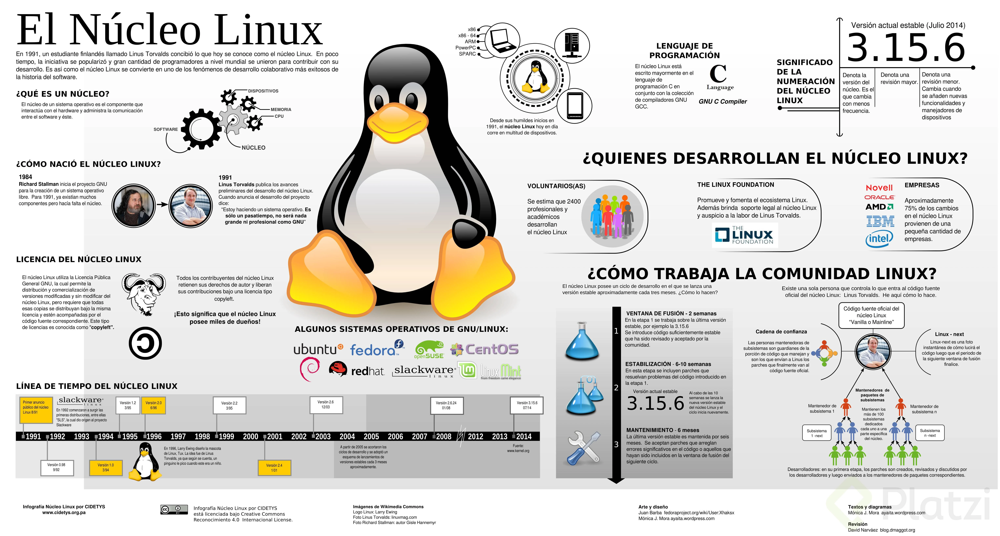
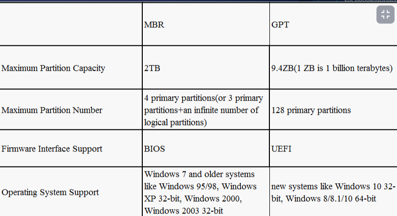

# Notas_Curso de  Prework Configuracion de Entorno de Desarrollo en Linux

## Clase 1:  ¿Qué es Linux y por qué instalarlo?

**¿Que es Linux?**
- Es una famiia de SO(Sistemas Operativos) los cuales tienen algo en comun, ya que todos usan el Kernel de Linux.

**¿Donde esta presente linux?**
- En muchos lados como por ejemplo:
 - Telefonos
 - Servidores
 - Terminales de punto de venta
- Distribuciones

**Tenemos muchas, cada una con su propio manejador de paquetes y herramientas, entre las mas usadas tenemos:**

- Fedora
- Arch Linux
- Ubuntu

## Clase 2:  Instalando Ubuntu en VirtualBox

Paso  para usar maquina virtual 
https://platzi.com/clases/2383-prework-linux/39133-instalando-ubuntu-en-virtualbox/

> Instalando Ubuntu en Virtual Box

- Descargar el Windows host de Virtual Box.
- Instalarlo en la maquina.
- Descarga Ubuntu Desktop (prefiérase la versión LTS).
- En Virtual Box
- Clic en el icono Nueva
- En la ventana emergente le asignamos un nombre
- Siguiente
- Asignamos tamaño de memoria (2GB - 2048MB)
- Siguiente
- Seleccionamos Crear un disco duro virtual ahora
- Crear
- Seleccionamos VDT (Virtual Disk Image) en tipo de archivo de disco duro
- Siguiente
- Seleccionamos Reservado dinámicamente en Almacenamiento en unidad de disco duro física
- Siguiente
- Seleccionamos 10GB en ubicación del archivo y tamaño
- Crear

## Clase 3: Creando una USB booteable con Ubuntu
  
https://platzi.com/clases/2383-prework-linux/39135-creando-una-usb-booteable-con-ubuntu/

- https://rufus.ie/es/
- https://ubuntu.com/download/desktop 

Para crear una usb booteable directamente desde linux se puede usar el comando dd

`dd bs=4M if=/home/gollum23/Downloads/manjaro-kde-21.0.4-210506-linux510.iso of=/dev/sdc status=progress oflag=sync`
bs -> tamaño de lo bloques al leer y escribir
if -> ruta absoluta donde se encuentra la imagen que quieres usar
of -> ruta absoluta de la memoria usb
status -> Muestra estadísticas de transferencia de los datos a la usb
oflag=sync -> Mantiene la terminal en el proceso hasta que termina la creación de la usb

Es muy practico de usar y bastante rápido.

Hay mas opciones y configuraciones que puedes usar las cuales encuentras usando el comando dd --help

> No recomendaría instalar un sistema con partición MBR, a menos que tengas una computadora ya algo antiugua.
Si tu computadora viene con UEFI en lugar de BIOS es mejor instalar un tipo de partición GPT.
Lo mencionó porque podría causar errores en la instalación.

> Hay que haces una aclaración para este metodo, si tu computadora no tiene el modo BIOS y solo tiene el modo UEFI en rufus debes igualmente seleccionar system type UEFI, hay computadoras que no soportan el modo predeterminado de rufus.
> Otra cosa es que en la bios de tu computadora debes desactivar el secure boot para poder arrancar el usb. Si quieres instalar ubuntu con windows en la misma computadora el proceso es ligeramente diferente y hay que ser bastante cuidadoso, porque si tu computadora tiene secure boot puedes dejar inaccesible windows sin embargo si buscas en google windows, linux dual secure boot encontraras como reparar el dual boot, esto basicamente es sobreescribir el sector de arranque de tu disco duro donde antes se usaba el windows boot manager por el grub uefi que instala ubuntu

- Alternativa Linux Live USB Creato

          <svg className="h-5 w-14" fill="none">
            <FilterIcon className="w-6" />
          </svg>

          <select
            id={idCate}
            name={idCate}
            className="rounded-md text-gray-700 text-center capitalize"
          >
            <option value="0" selected> Categorias </option>
            {
              !categoria ? null : categoria.map((list) => (
                <option key={list._id} value={list._id} > {list.nomCate} </option>
              ))

            }
          </select>