# Curso Práctico de Frontend Developer

## Clase 1: 
- Introducción al curso 
- SI o SI  a huevo debemos instalar entornos de trabajo. 
- [Manual Dummy](./info/manual-para-imprimir.pdf)

## Clase 2:  ¿Qué es HTML y CSS? ¿Para qué sirven?

**HTML**
> Son siglas en ingles de HyperText Markup Language o Lenguaje de Marcado de Hipertexto.

**¿Para qué sirve?**
- Nos sirve para estructurar toda nuestra página web, si hacemos la referencia con el cuerpo humano es como el sistema óseo, lo vamos a utilizar para colocar texto, imágenes, botones, videos, etc. Nos da una estructura inicial.

**CSS**
> Son siglas en inglés de Cascading Style Sheets u Hoja de estilos en cascada.

**¿Para qué sirve?**
- Lo usaremos para darle vida a nuestros sitios web, si hacemos referencia con el cuerpo humano sería el aspecto ya sea la altura, contextura física, color de piel, cabello, etc.

- Nos permite estilizar todo nuestra estructura de HTML ya sean textos, imágenes, botones, etc.

**JavaScript** 
- el lenguaje que hace que todo sea interactivo, es realmente el lenguaje de programación que nos permite crear sitios web, el formato de los archivos es .js

**¿Para qué sirve?**
Pues nos permite generar ineractividad con el usuario podemos generar validaciones de nuetsros formularios, animaciones, mapas, chats, es poderoso este lenguaje se puede hacer tanto front como back. 


## Clase 3: Motores de render: de archivos a píxeles
  
- El navegador no entiende el código HTML y CSS escrito en nuestro editor de texto.
- Los navegadores poseen un motor el cual transforma el código HTML y CSS en algo que el navegador entienda y pueda pintarlo en pixeles para ser visualizados.
- Cada navegador tiene su propio motor pero todos ellos hacen el mismo proceso.

**Los 5 pasos de los motores:**
- (DOM)Pasa los archivos de HTML a objetos (El DOM). Esto para que el navegador pueda entenderlo. Document Objet model 
- (Arbol NODO)Calcula el estilo correspondiente a cada nodo en el DOM.
- (CAlcula Nodo)Calcula las dimensiones de cada nodo y va a empezar a estructurar la página web.
- (Dimensionan )Pinta las diferentes cajas.
- (Pixel)Toma las capas y las convierte en una imagen, para finalmente mostrar esta imagen en la pantalla.

**Tipos de Motores**
/[](./info/Motor001.png)

```
Navegadores

- chrome - blink
- edge - edge html
- safari - webkit
- firefox - gecko

```

## Clase 4: Anatomía de un documento HTML y sus elementos

**¿Qué es una etiqueta?** 🤔
- Básicamente una etiqueta representa un elemento de nuestro HTML. 

**Caracteristicas**
- En HTML tenemos algunas etiquetas que pueden actuar como cajas. 
- Por ejemplo, la etiqueta <section> puede actuar como una caja, ¡pero la etiqueta <ul> también puede actuar como una caja!
- Nos permite organizar nuestro HTML de manera semántica 
- Todas las etiquetas tienen una apertura y cierre en excepción de algunas que solo tienen apertura como la etiqueta 

**Ejemmplo **

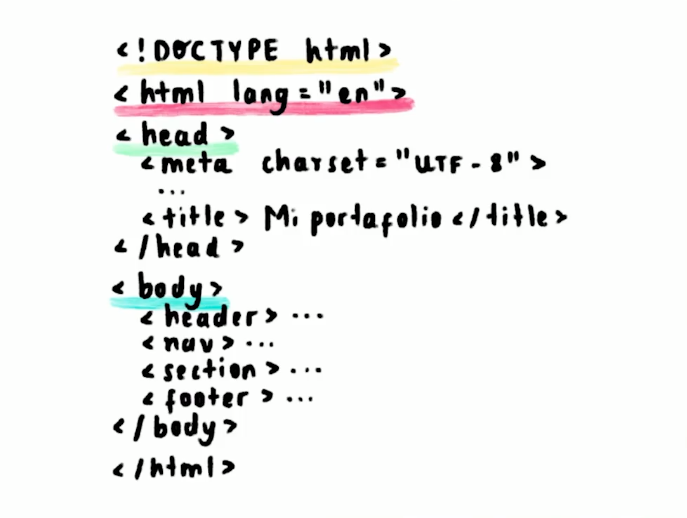


## Clase 5: ¿Qué es HTML semántico?

**¿Qué es HTML semántico?**
- Es un concepto muy importante para los nosotros como desarrolladores.
- Nos va a indicar o señalar que tenemos que usar propiedades adecuadas para los textos, párrafos, imágenes, secciones, etc.
- Tenemos que usar las diferentes etiquetas de HTML que ya existen para las diferentes cosas que queramos colocar.

**Ventajas**
- Al hacer esto vamos a lograr tener un código accesible.
- Tenemos el tema de posicionamiento SEO.
- Nos permite tener un código mucho más claro, ligero y fácil de leer.
- Etiqueta <div> v</div> Es una etiqueta comodín, nos permite hacer muchas cosas no es una buena práctica usarla en cada cosa que hagamos.

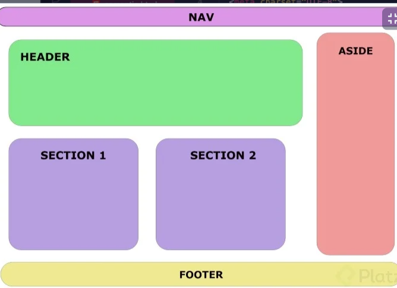

## Clase 6: Etiquetas de HTML más usadas

**¿Cuáles son las etiquetas HTML básicas?**
>Hay una serie de etiquetas que son las más usadas para crear cualquier documento HTML, a continuación las explicamos:


```
- <body> para el contenido
- <head> para información sobre el documento
- <div> división dentro del contenido
- <a> para enlaces
- <strong> para poner el texto en negrita
- <br> para saltos de línea
- <H1>  <H6> para títulos dentro del contenido
-  para añadir imágenes al documento
- <ol> para listas ordenadas, <ul> para listas desordenadas, <li> para elementos dentro de la lista
- <p> para parágrafos
- <span> para estilos de una parte del texto
```

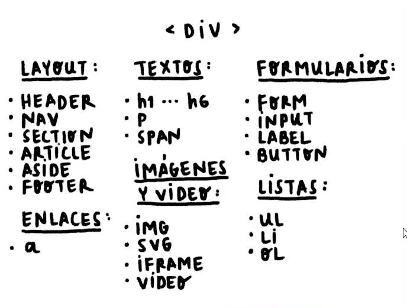

**enlace**
- https://htmlreference.io/ -> Nustro diccionario

## Clase 7: Anatomía de una declaración CSS: selectores, propiedades y valores

**Css**
- Nos permite vestir de manera general y especificas nuestras paginas web

**Anatomía 3 principales:**
- Selector
- Propiedad
- Valor

**Sintaxis y estructura**
- La estructura de CSS se compone por un 
  - selector: directamente la etiqueta HTML de nuestro documento h1, una clase o un Id. 
  - Se siguen las llaves { } y en su interior encontramos la propiedad y el valor de esta { color: 'blue' }

```
h1 {
	color: "Blue"
}

```


## Clase 8: Tipos de selectores: básicos y combinadores


 > Gracias a los selectores podemos acceder a cualquier elemento que haya en nuestro HTML, pero lo genial es que tenemos distintas formas de acceder:


**Selectores básicos**

- **De tipo**: Este selector nos permite tomar cualquier etiqueta HTML usando su mismo nombre. ¡Pero recuerda que en tu HTML puede haber varias etiquetas con el mismo nombre! Así que este selector agarrará TODAS las etiquetas que coincidan con el mismo nombre 👀.

- **De clase**: Una clase básicamente es un atributo más dentro de tu HTML, por ejemplo, yo puedo tener este div:

- **De id**: Como su nombre lo dice, este es un selector que selecciona cualquier elemento a través de su id. Al igual que con las clases, podemos poner un id a nuestros elementos, pero a diferencia de las clases NO debemos poner el mismo id en dos o más elementos.

- **De atributo**: Básicamente, al igual que con las clases, podemos seleccionar varios elementos, pero ahora filtrándolos por su atributo (en el ejemplo de la clase usamos href, pero podemos usar cualquier otro atributo OwO).
- **Universal**: En pocas palabras, este selector agarra todo lo que esté en nuestro HTML

**Ejemplos**

- De tipo: di- v {...}
- De clase: .elemento {...}
- De ID: #id-del-elemento
- De atributo: a[href="..."]{...}
- universal: *{...}

**Combinadores**
- Descendientes: En este selector, el que está más a la izquierda es el selector padre y los que están a su derecha serán los selectores hijos, 
- Hijo directo: Este caso es similar al anterior, pero ahora solo agarrará a los hijos que este directamente adentro del padre.
- Elemento adyacente: Básicamente selecciona a la etiqueta que esté debajo de la primera etiqueta
- General de hermanos: Es similar al adyacente, pero esta vez no solo selecciona al de abajo, sino a cualquiera que esté al mismo nivel que el selector original, es decir, a sus hermanos
- 
**Ejemplos ->**
- Descendientes: div p
- Hijo directo: div > p
- Elemento adyaente: div + p
- General de hermanos: div ~ p


## Clase 9: Tipos de selectores: pseudoclases y pseudoelementos

> Las pseudoclases nos permite llegar a aquellas acciones que hace el usuario.

- :active
- :focus
- :hover
- :nth-child(n)

 > Los pseudoelementos nos permiten acceder a elementos de HTML que no son accesibles con los selectores ya vistos.

- ::after
- ::before
- ::first-letter
- ::placeholder

> La pseudoclase se escribe con : y los pseudoelementos se escriben con ::

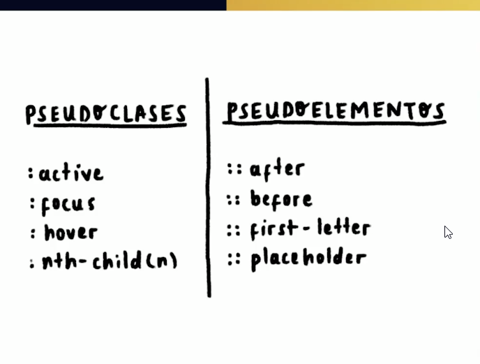


## Clase 10: Cascada y especificidad en CSS

**Stylesheets cascade**
A un nivel muy simple, esto significa que el orden de las reglas CSS importa; cuando se aplican dos reglas que tienen igual especificidad, la que viene en último lugar en el CSS es la que se utilizará.

**Especificidad**
- La especificidad es el medio por el que los navegadores deciden qué valores de propiedades CSS son los más relevantes para un elemento y, por tanto, se aplicarán. La especificidad se basa en las reglas de concordancia que se componen de diferentes tipos de selectores CSS.

- La cantidad de especificidad que tiene un selector se mide utilizando cuatro valores diferentes (o componentes), que se pueden considerar como  miles, cientos, decenas y unos

**Miles**
Puntúa uno en esta columna si la declaración está dentro de un atributo style, también conocido como estilos en línea. Estas declaraciones no tienen selectores, por lo que su especificidad es siempre 1000.

**Cientos**
Puntúa uno en esta columna por cada selector de ID contenido dentro del selector general.

**Decenas**
Puntúa uno en esta columna por cada selector de clase, selector de atributos o pseudoclase que contenga el selector general.

**Unos**
Puntúa uno en esta columna por cada selector de elemento o pseudo-elemento contenido dentro del selector general.

> !important cambia la forma en que la cascada funciona normalmente, por lo que puede hacer que la depuración de los problemas de CSS sea realmente difícil de resolver, especialmente en una hoja de estilos grande.

No lo uses si puedes evitarlo.

La única manera de anular esta declaración !important sería incluir otra declaración !important en una declaración con la misma especificidad más adelante en el orden de las fuentes, o una con mayor especificidad.


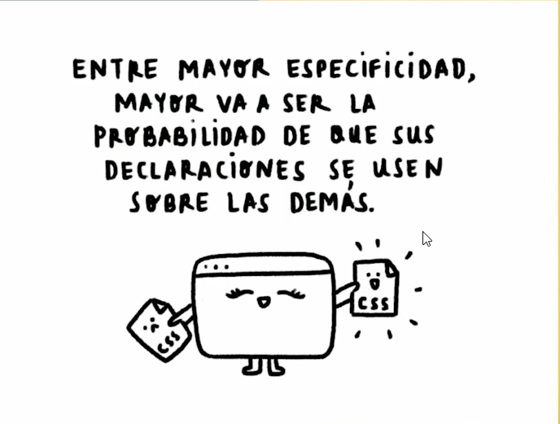

**enlace**
- https://specificity.keegan.st/


  
## Clase 11: Tipos de display más usados: block, inline e inline-block


Display
Se refiere al tipo de visualización que van a tener nuestros elementos HTML.

Block
Una de sus características es que ocupan todo el width disponible en pantalla por defecto, se le puede agregar o cambiar un ancho y largo.

Inline
El espacio que ocupa es el espacio que tiene como contenido, no se le puede modificar su width y height.

Inline-block
Agarra lo mejor de inline y de block, el espacio que ocupa es el espacio que tiene como contenido y además se le puede modificar su width y height.


🍫 display: inline

Los elementos en línea no admiten dimensiones (width, height) pero si admiten margin, padding y border, solo ocupan lo que tengan en su contenido, es decir, aunque quieras declarar un ancho y alto a un elemento de línea no podrá tener efecto ya que estos elementos no aceptan dimensiones

🤔¿Cuáles son los elementos de línea?
La siguiente es una lista de los elementos en línea de HTML, podemos ver algunos de estos elementos en los cuales colocamos contenido en forma de texto:
``` 
b, big, i, small, tt, abbr, acronym, cite, code, dfn, em, kbd, strong, samp, time, var, a, bdo, br, img, map, object, q, script, span, sub, sup, button, input, label, select, textarea.
```

📄 display: block
Un elemento de bloque es un elemento que ocupa el ancho máximo disponible.

🤔 ¿Cuáles son los elementos de bloque?
```
<address>, <article>, <aside>, <audio>, <blockquote>, <canvas>, <dd>, <div>, <dl>, <fieldset>, <figcaption>, <figure>, <footer>, <form>, <header>, <hgroup>, <hr>, <li>, <main>, <nav>, <noscript>, <ol>, <output>, <p>, <pre>, <section>, <table>, <tfoot>, <ul>, <video>, <h1>...<h6>.
```
⏸️ display: inline-block

Es una combinación entre los dos tipos de elementos mencionados anteriormente (block e inline), los elementos con el valor inline-block admiten dimensiones pero todavía son elementos de línea, es decir estarán colocados uno al lado de otro.

↕️↔️ display: flex y display: grid
De manera general podemos decir que el valor flex se usa para maquetar componentes como por ejemplo, un menú de navegación y grid se usa para maquetar el layout. Se que estoy generalizando y esto, no es 100% así, porque pueden haber componentes complejos en los que es necesario usar grid y algunos layouts son simples y otros no, todo depende de lo que estés diseñando.

> Nota: pagina de referencia: https://dev.to/lupitacode/la-propiedad-display-en-css-1b6a


## Clase 12: Tipos de display más usados: flexbox y CSS grid

> Por ejemplo, algo que a mí me gusta hacer es usar Flexbox para estilizar elementos pequeños, tipo tarjetitas y así, y después a CSS Grid lo uso para estructurar toda mi página entera OwO. Este es mi modo de trabajar, pero incluso podrías hacerlo al revés, es decir, usar CSS Grid para cositas pequeñas y Flexbox para armar todo tu layout, ¡CSS es muy flexible!


**Flexbox**
Flexbox es magia, con Flexbox podemos literal manipular los elementos a como queramos. 


Display flex
Este display nos ayuda a tener un layout de forma más reponsive.

Si un padre tiene display flex sus hijos se van a comportar de forma distinta, similar como si los hijos tuvieran un display inline-block.

Siempre debemos tener un container principal para poder usar esta propiedad de flex.

flex-direction
Al colocar display flex por default tenemos un display direction en row, esto quiere decir como se van a colocar o acomodar los hijos.

Tenemos varios valores para esta propiedad

Row
Coloca a los hijos en forma de fila o hileras, uno al lado de otro.

Row-reverse
Coloca a los hijos en forma de fila o hileras, uno al lado del otro, pero en forma inversa. El último pasa a ser el primer elemento, todo se recoloca inversamente del lado original.

Column
Coloca a los hijos en forma de columna o verticalmente, como estaban originalmente antes del display flex como si todos tuvieran display block.

Column-reverse
Coloca a los hijos en forma de columna, pero de forma inversa. El último elemento pasa a ser el primero elemento, todo se recoloca inversamente del lado original.

flex-wrap
Esta propiedad no viene implícita y debemos colocar en caso de que la necesitemos.

Esta propiedad tiene los valores de

wrap
Hace crecer mi contenedor, basándose en el viewport, va aplicando u ordena a los elementos de forma inteligente.

A medida que mi pantalla es más pequeña el contenido se va a acomodando de arriba abajo.

wrap-reverse
Realiza lo mismo que el valor wrap, solo que este acomoda el contenido de abajo arriba.

justify-content
Nos permite alinear el contenido de forma horizontal, en el caso que tengamos el flex-direction que viene por default si lo tengamos en column este va a linar de forma vertical.

center
Permite alinear el contenido hacia el centro.

flex-end
Mueve todos los elementos se van hacia la derecha, en caso de que lo tengamos hacia la izquierda.

flex-start
Este valor viene por default.

Hace que el contenido se mueva hacia la izquierda.

space-around
Distribuye a los elementos en todo el width dejando un espacio es entre ellos.

Este espacio no es el mismo a lo largo de todo el contenedor, los elementos que se encuentran en los límites laterales del contenedor tienen un espacio menor a comparación del espacio entre los mismos elementos que es mayor.

space-evenly
Funciona igual que el space-around, pero con una diferencia.

Con este valor el espacio que hay entre todos los elementos y de los que se encuentran en los límites del contenedor son todos iguales.

flex-flow
Con esta propiedad podemos utilizar a flex-direction y a flex-wrap en la misma línea, separadas por un espacio.

flex-flow: valor[flex-direction] valor[flex-wrap];
align-items
Esta propiedad nos permite alinear los elementos de forma vertical, en caso de que tengamos un flex-direction column esta propiedad nos permitirá alinear los elementos de forma horizontal.

Al igual que justify-content tenemos varios valores que nos permiten manejar los elementos de un contenedor.

center
Alinea los elementos hacia el centro del contenedor.

flex-end
Coloca los elementos hacia la parte baja del contenedor.

flex-start
Coloca los elementos hacia arriba del contenedor.

stretch
Estira hacia el 100% del height, dependiendo el flex-direction, del contenedor a los elementos. Siempre y cuando estos elementos no tengan un height definido.

baseline
Reduce el height de los elementos hasta el contendido que tienen estos, tan grande o tan pequeño sea el contenido así será el height. Siempre y cuando estos elementos no tengan un height definido.

align-content
Acepta los mismos valores que align-items.

Esto puede ser confuso, pero align-content determina el espacio entre las líneas, mientras que align-items determina como los elementos en su conjunto están alineados dentro del contenedor. Cuando hay solo una línea, align-content no tiene efecto.

order
Si tenemos al contenedor con display: flex podemos utilizar una nueva propiedad que es order.

Order no se utiliza en el contenedor padre, sino que se lo coloca a los elementos o hijos. Al usar esta propiedad podemos cambiar el orden de los elementos, haciendo que el primer elemento sea el último, que el último sea el segundo, etc.

Los elementos que no tengan un order se moverán a la izquierda y a partir del último elemento, sin la propiedad order, se va a empezar a contar los elementos que si tengan esta propiedad.

flex-grow
Cuando nos sobra un espacio, de forma horizontal, y deseamos llenarlo con alguno de los elementos utilizamos esta propiedad.

Al colocarle de valor 1 esta empezará a crecer para ocupar el espacio en blanco que podemos tener y se lo aplica directamente a los hijos no al contenedor o padre.

**enlace**
- https://developer.mozilla.org/es/docs/Web/CSS/flex-basis
- https://juliansci.github.io/css-flexbox-simulator/ -> Simulador 
- https://platzi.com/clases/css-grid-layout/ -> Curso para tener un mayor nivel con Flex
- https://platzi.com/clases/flexbox-css-grid/ -> Curso para tener un mayor nivel con Flex
- https://platzi.com/blog/flexbox-vs-css-grid-cual-es-la-diferencia/ 
  
**PD:**
- Recuerden que los display: flex; y el display:grid; siempre se declaran en el padre y todo lo que se encuentre por dentro de ese padre se comportará con las reglas que definamos, el padre es la grilla, y dentro de cada elemento de esa grilla puede existir otro padre y así hasta donde necesitemos


tr:nth-child(odd) o tr:nth-child(2n+1)
Representa las filas impares de una tabla HTML: 1, 3, 5, etc.

tr:nth-child(even) o tr:nth-child(2n)
Representa las filas pares de una tabla HTML: 2, 4, 6, etc.

:nth-child(7)
Representa el séptimo elemento.

:nth-child(5n)
Representa los elementos 5, 10, 15, etc.

:nth-child(3n+4)
Representa los elementos 4, 7, 10, 13, etc.

:nth-child(-n+3)
Representa los primeros tres elementos entre un grupo de hermanos.

p:nth-child(n)
Representa cada elemento <p> entre un grupo de hermanos. Esto es lo mismo que un simple selector p.

p:nth-child(1) o p:nth-child(0n+1)
Representa cada <p> que es el primer elemento entre un grupo de hermanos. Esto es lo mismo que el selector :first-child.


Para qué se usan CSS Grid y CSS Flexbox

Tanto CSS Grid como CSS Flexbox utilizan para ayudar a diseñar la estructura de una página web, aunque con diferencias entre ellas. Cada una tiene unas ventajas de uso según las características del proyecto que vayas a realizar y, según cada caso concreto, te interesará utilizar una o la otra. Veamos un poco más:

**Qué es CSS Grid y CSS Flexbox** 

Flexbox se introdujo por primera vez en el 2009 como un nuevo sistema de formateo, de manera que puedas construir páginas responsive y organizar tus elementos fácilmente sin necesidad de utilizar técnicas demasiado complejas

Por otro lado, Grid hizo su aparición con la idea de mejorar flex, y extender su uso más allá de barras horizontales y verticales de elementos, llegando incluso al maquetado completo de páginas web, con diseño responsive y con más fácil mantenimiento.

**Diferencias entre CSS Grid y CSS Flexbox**

La diferencia básica entre ambas está en que CSS Grid está basada en un formato de dos dimensiones, mientras que CSS Flexbox está basada en un formato de una sola dimensión.


```<!DOCTYPE html>
<html lang="en">
<head>
  <meta charset="UTF-8">
  <meta http-equiv="X-UA-Compatible" content="IE=edge">
  <meta name="viewport" content="width=device-width, initial-scale=1.0">
  <title>Document</title>
  <style>
    .container {
      display: flex;
      background: papayawhip;
      justify-content: center;
      align-items: center;
      height: 200px;
      flex-direction: column;
    }
    .item {
      width: 30px;
      height: 30px;
      background: purple;
    }
    .container .item:nth-child(2n + 1) {
      background: cyan;
    }
  </style>
</head>
<body>
  <div class="container">
    <div class="item"></div>
    <div class="item"></div>
    <div class="item"></div>
    <div class="item"></div>
  </div>
</body>
</html>
`` 

ejemplo grid
```<!DOCTYPE html>
<html lang="en">
<head>
  <meta charset="UTF-8">
  <meta http-equiv="X-UA-Compatible" content="IE=edge">
  <meta name="viewport" content="width=device-width, initial-scale=1.0">
  <title>Document</title>
  <style>
    .container {
      display: grid;
      width: 400px;
      height: 400px;
      background: papayawhip;
      grid-template-columns: 1fr 1fr 1fr 1fr;
      grid-template-rows: 1fr 1fr 1fr 1fr;
    }
    .item {
      background: pink;
    }
    .container .item:nth-child(1) {
      grid-column: 1 / 2;
    }
    .container .item:nth-child(2) {
      grid-column: 2 / 3;
      grid-row: 2 / 3;
    }
    .container .item:nth-child(3) {
      grid-column: 3 / 4;
      grid-row: 3 / 4;
    }
    .container .item:nth-child(4) {
      grid-column: 4 / 5;
      grid-row: 4 / 5;
    }
  </style>
</head>
<body>
  <div class="container">
    <div class="item"></div>
    <div class="item"></div>
    <div class="item"></div>
    <div class="item"></div>
  </div>
</body>
</html>
``` 


## Clase 13: Modelo de caja 

- El borde (border), en negro, es el límite que separa el interior del exterior del elemento.
- El márgen (margin), en naranja, es la parte exterior del elemento, por fuera del borde.
- El relleno (padding), en verde, es la parte interior del elemento, entre el contenido y el borde.
- El contenido, en azul, es la parte interior del elemento, excluyendo el relleno.

PD : Notas de la clase
Con la propiedad box-sizing: border-box; css busca que todo el elemento mida lo que indicamos en width y height, esto con ayuda del padding y el border, de tal manera que se le resta espacio al content para poder lograr las dimensiones específicadas.

**PD:Box-sizing: border-box**
Con esta propiedad y este valor podemos hace un cálculo automático para que el padding y border no se salgan de las dimensiones que queremos para nuestro elemento.

En palabras sencillas mete todo para adentro y realiza el cálculo hacia dentro en vez de sumar espacio al contenido hacia afuera. Lo que hace es restarlo, quitándole espacio al contenido, para que no tengamos problemas con las dimensiones.

Todo esto solo sucede con el padding y con el border, al margin no lo va a recalcular, el margin si crece hacia el exterior.


## Clase 14: Colapso de márgenes


Los márgenes se colapsan solo cuando:

Dos elementos del tipo bloque y están uno arriba del otro , los márgenes de estos elementos solo se colapsan en el eje vertical.

¿Cómo evitarlo?

Introduciendo nuestros elementos del tipo bloque dentro de un contenedor con características Flex-box o Grid.

Colapso de márgenes
Los márgenes top y buttom se combinan en un solo margen, asi, por ejemplo, dos elementos <p> con un margen de 20px guardaran un margen de 20px, y no de 40px. Esto no sucede en flebox y grid.

Como dato, si a los elementos le pones display: inline-block; también evita que haya colapso de márgenes.

Colapso de márgenes
Sucede:

cuando hay dos contenedores adyacentes en bloque
No sucede:
Flexbox, Grid y elementos que no sean bloque

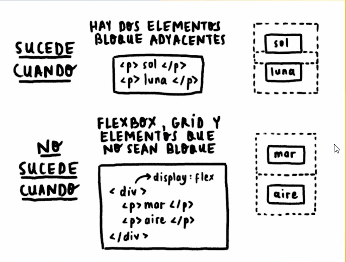

## Clase 15: Posicionamiento en CSS

¿Qué es position?
Es la forma en la que podemos posicionar los contenedores, cajas o etiquetas de HTML cuando la utilizamos.

Tenemos diferentes position en CSS, pero todas las etiquetas en HTML vienen por defecto con el position static. Se quedan en donde nosotros las ponemos, no se mueve con el scroll.

Tenemos estos positions
Absolute
Relative
Fixed
Sticky
Initial
Inherit
Todos estos nos van a dar un comportamiento diferente por cada una de las etiquetas. Las podemos agregar a todas las etiquetas y nos van a dar el mismo comportamiento pero los vamos a utilizar para diferentes cosas.

Static
Utilizamos este valor no vamos a tener ningún cambio porque todas las etiquetas vienen con este valor.

Cuando estamos en este position no podemos utilizar las propiedades left, top, right y bottom.

Absolute
Con absolute el elemento sale de su lugar y el navegador reacomoda los elemento, poniendo otro elemento en el lugar del elemento con position absolute. Podemos posicionar al elemento como queramos.

Relative
Con relative no sucede lo mismo que absolute, el elemento mantiene su lugar, pero podemos posicionarlo donde queramos.

Lo podemos usar como contenedor para que los elementos que tengan un position absolute tomen como referencia al padre que nosotros queremos (se adhiere al elemento relativo más cercano) y no a otro, delimita el movimiento del hijo.

Fixed
Este valor de position nos permite que el elemento que queramos nos siga a todos lados desde el momento en el que nos topemos con él.

Sticky
Es similar a fixed con la diferencia que cuando encuentra a otro elemento con su mismo position, sticky, le da lugar al ese elemento.

Initial
Vuelve el position de un elemento a como estaba originalmente.

Inherit
Lo usamos si queremos que nuestro elemento herede el position de su padre.

Left, top, right y bottom
Con estas cuatro propiedades podemos mover a los elementos que tengan como position a absolute, relative fixed o sticky a los lugares que queramos.

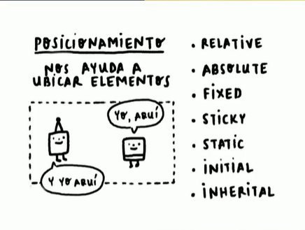

```
<!DOCTYPE html>
<html lang="en">
<head>
  <meta charset="UTF-8">
  <meta http-equiv="X-UA-Compatible" content="IE=edge">
  <meta name="viewport" content="width=device-width, initial-scale=1.0">
  <title>Document</title>
  <style>
    .container {
      width: 200px;
      height: 200px;
      background: peachpuff;
      position: relative;
      top: 20px;
    }
    .item {
      width: 20px;
      height: 20px;
      background: hotpink;
      position: absolute;
      right: 0;
    }
    nav {
      width: 100%;
      height: 60px;
      background: LightCyan;
      position: fixed;
      top: 0;
    }
    ul p {
      position: sticky;
      top: 0;
    }
  </style>
</head>
<body>
  <nav></nav>
  <div class="container">
    <div class="item"></div>
  </div>
  <p>What is Lorem Ipsum?
    Lorem Ipsum is simply dummy text of the printing and typesetting industry. Lorem Ipsum has been the industry's standard dummy text ever since the 1500s, when an unknown printer took a galley of type and scrambled it to make a type specimen book. It has survived not only five centuries, but also the leap into electronic typesetting, remaining essentially unchanged. It was popularised in the 1960s with the release of Letraset sheets containing Lorem Ipsum passages, and more recently with desktop publishing software like Aldus PageMaker including versions of Lorem Ipsum.
    Why do we use it?
    It is a long established fact that a reader will be distracted by the readable content of a page when looking at its layout. The point of using Lorem Ipsum is that it has a more-or-less normal distribution of letters, as opposed to using 'Content here, content here', making it look like readable English. Many desktop publishing packages and web page editors now use Lorem Ipsum as their default model text, and a search for 'lorem ipsum' will uncover many web sites still in their infancy. Various versions have evolved over the years, sometimes by accident, sometimes on purpose (injected humour and the like).


    Where does it come from?
    Contrary to popular belief, Lorem Ipsum is not simply random text. It has roots in a piece of classical Latin literature from 45 BC, making it over 2000 years old. Richard McClintock, a Latin professor at Hampden-Sydney College in Virginia, looked up one of the more obscure Latin words, consectetur, from a Lorem Ipsum passage, and going through the cites of the word in classical literature, discovered the undoubtable source. Lorem Ipsum comes from sections 1.10.32 and 1.10.33 of "de Finibus Bonorum et Malorum" (The Extremes of Good and Evil) by Cicero, written in 45 BC. This book is a treatise on the theory of ethics, very popular during the Renaissance. The first line of Lorem Ipsum, "Lorem ipsum dolor sit amet..", comes from a line in section 1.10.32.

    The standard chunk of Lorem Ipsum used since the 1500s is reproduced below for those interested. Sections 1.10.32 and 1.10.33 from "de Finibus Bonorum et Malorum" by Cicero are also reproduced in their exact original form, accompanied by English versions from the 1914 translation by H. Rackham.</p>

  <ul>
    <p>Frutas</p>
    <li>Manzana</li>
    <li>Pera</li>
    <li>Sandia</li>
  </ul>

  <ul>
    <p>Frutas</p>
    <li>Manzana</li>
    <li>Pera</li>
    <li>Sandia</li>
  </ul>

  <ul>
    <p>Frutas</p>
    <li>Manzana</li>
    <li>Pera</li>
    <li>Sandia</li>
  </ul>

  <ul>
    <p>Frutas</p>
    <li>Manzana</li>
    <li>Pera</li>
    <li>Sandia</li>
  </ul>

  <ul>
    <p>Frutas</p>
    <li>Manzana</li>
    <li>Pera</li>
    <li>Sandia</li>
  </ul>

  <ul>
    <p>Frutas</p>
    <li>Manzana</li>
    <li>Pera</li>
    <li>Sandia</li>
  </ul>

    <ul>
    <p>Frutas</p>
    <li>Manzana</li>
    <li>Pera</li>
    <li>Sandia</li>
  </ul>

  <ul>
    <p>Frutas</p>
    <li>Manzana</li>
    <li>Pera</li>
    <li>Sandia</li>
  </ul>

  <ul>
    <p>Frutas</p>
    <li>Manzana</li>
    <li>Pera</li>
    <li>Sandia</li>
  </ul>

  <ul>
    <p>Frutas</p>
    <li>Manzana</li>
    <li>Pera</li>
    <li>Sandia</li>
  </ul>

  <ul>
    <p>Frutas</p>
    <li>Manzana</li>
    <li>Pera</li>
    <li>Sandia</li>
  </ul>

  <ul>
    <p>Frutas</p>
    <li>Manzana</li>
    <li>Pera</li>
    <li>Sandia</li>
  </ul>
</body>
</html> 
```

## Clase 16: Z-index y el contexto de apilamiento


-Pero hay que tener dos cosas muy claras:

La propiedad z-index solo se aplica a elementos posicionados. Los elementos no posicionados siempre se van a colocar uno en encima de otro en el orden en el que aparecen en el código.
La propiedad z-index no es heredable.
Definir la propiedad z-index con un valor diferente a auto crea un stacking context, un contexto de apilamiento. También se crea un stacking context en todos los elementos con position: fixed o sticky. Luego veremos qué significa esto.

**Caracteristicas**
- El orden que van creados los HTML  es importante 
- podemos posicionar con las position
- Podemos posicionar con z-index 
- Z-index funciona que ciertos atributos position 
- Los z index respetan el orden de los elementos padres e hijos 

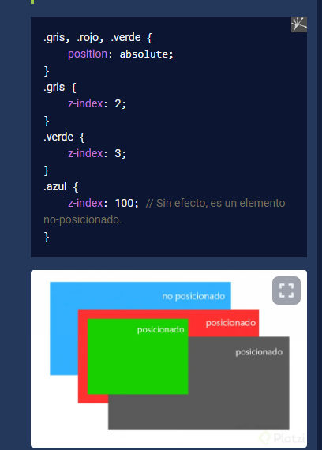

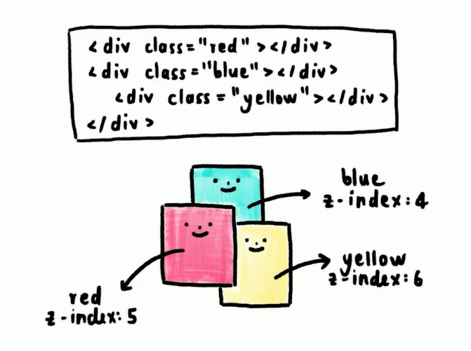

## Clase 17: Z-index y el contexto de apilamiento

- https://cssreference.io/

```
<!DOCTYPE html>
<html lang="en">
<head>
  <meta charset="UTF-8">
  <meta http-equiv="X-UA-Compatible" content="IE=edge">
  <meta name="viewport" content="width=device-width, initial-scale=1.0">
  <title>Document</title>
  <style>
    section {
      width: 100%;
      display: flex;
      justify-content: center;
    }
    .card {
      width: 300px;
      height: 300px;
      background: papayawhip;
      border-radius: 20px;
      overflow: hidden;
    }
    .card img {
      width: 100%;
    }
    .card p {
      text-align: center;
    }
    .card p:nth-child(3) {
      color: Turquoise;
    }
  </style>
</head>
<body>
  <section>
    <div class="card">
      
      <p>Cat: Mimi</p>
      <p>Love</p>
    </div>
  </section>
</body>
</html>
```

## Clase 18:Unidades de medida

**Medidas Absolutas**
- Es la unidad de medida que no va a cambiar sin importar el tamaño de la pantalla.
- Una unidad absoluta puede ser los píxeles.
```
p {
    font-size: 18px;
}
```

**Medidas Relativas**
- Estás si pueden cambiar en relación con el dispositivo que lo estamos viendo.
- Las unidades relativas pueden ser porcentajes, em (elemento), rem (root em o root elemento), max-width, max-height, min-width, min-height. - - Estas últimas varían basándonos en el tamaño de la pantalla.
``` 
main {
    background-color: red;
    width: 100%; /*Unidad relativa*/
    height: 500px;
}
``` 
- em : EM es un acrónimo de elemento, va a tomar el tamaño de fuente que tenga el padre directo.
- EM no es de las mejores medidas.
- Por default un em es 16px que es de la etiqueta html.

Ejemplo
Yo al colocar 1.5em al tamaño de fuente de un elemento, este elemento pasa a tener un tamaño 50% más grande que la fuente que tiene el padre directo. Esto pasa cada vez que usamos la medida relativa em, los hijos toman como medidas de referencia las medidas que tiene su padre directo y esto puede causar confusiones.


- REM: Esta medida relativa siempre va a tener referencia o correlación con el estilo que tenga la etiqueta root o el root de nuestro proyecto, que siempre es nuestra etiqueta html.
- Por defecto el navegador le da a la etiqueta html un font-size de 16px.
- Aun que coloquemos textos anidados veremos que no tendremos ningún cambio como pasaba antes con la medida em.
- REM es menos confuso que EM.

**Truco para usar rem**
- Debemos setear nuestra etiqueta html de la siguiente forma:
```
html {
    font-size: 62.5%; 
}
```
Con esto estamos estableciendo un tamaño de 10px al tamaño de fuente.

- vw: Lo que hace esta unidad relativa es que toma como referencia el tamaño del viewport o pantalla.
- vh: Lo que hace esta medida relativa es que toma como referencia el alto del viewport o pantalla.

- Min-width y max-width: Una regla impórtate cuando los usamos es que necesitamos tener un width base que casi siempre es en porcentajes.
- Lo que sucede con estos dos que limitan el crecimiento del contenedor (max-width) o la reducción del contenedor (min-width). Una vez que - - - llegue al límite que establecemos este contenedor deja de crecer o reducirse.
- En este caso el selector crece como máximo hasta los 500 px y se reduce como máximo hasta los 320 px.

```
selector {
	width: 80%;
	min-width: 320px;
	max-width: 500px;
}
```
- Min-height y max-height: En este caso no necesitamos un height base. Se utiliza para evitar problemas de overflow.
- Con min-height:  estamos diciendo que la altura mínima del contenedor va a ser X, pero si tiene contenido que exceda esa altura mínima que se expanda hasta donde el contenido deje de crecer.

- Con max-height limitamos cuanto puede crecer el contenedor a lo alto.: 

**Buenas prácticas**
- Es buena práctica utilizar el rem y em.
- No es buena práctica tener un scroll horizontal en dispositivos mobiles.

Estilos que siempre debe estar al comienzo de nuestro archivo.css

```* {
    box-sizing: border-box;
    margin: 0;
    padding: 0;
}

html {
    font-size: 62.5%; 
}
```

```

<!DOCTYPE html>
<html lang="en">
<head>
  <meta charset="UTF-8">
  <meta http-equiv="X-UA-Compatible" content="IE=edge">
  <meta name="viewport" content="width=device-width, initial-scale=1.0">
  <title>Document</title>
  <style>
    html {
      font-size: 62.5%;
    }
    body {
      margin: 0;
    }
    div {
      width: 100px;
      height: 100px;
      background: pink;
    }
    p {
      font-size: 3rem;
    }
    .container {
      width: 100vw;
      height: 100vh;
      background: plum;
    }
  </style>
</head>
<body>
  <div>Plazi</div>
  <p>Master</p>
  <div class="container">

  </div>
</body>
</html>
```

## Clase 19: Responsive 


**¿Para qué es responsive design?**
Es para que nuestro proyecto web pueda ser multiplataforma, que se pueda ver bien en un smartphone, desde una tablet, iPad y que se vean excelente desde una laptop o computadora de escritorio.

**Esto realizándolo siempre con buenas prácticas.**

**Para empezar debemos saber:**

> Media Queries
- Con los media queries podemos jugar con el layout, cuando la pantalla del dispositivo sea pequeña el contenido se ve de una forma, pero si está pantalla crece el contenido también lo hace sin perjudicar el diseño.
- Podemos cambiar la orientación de los contenedores, podemos cambiar su orden, incluso cambiar las dimensiones.

> Breakpoint
- Son la dimensión en el viewport, es decir el width y el height de la pantalla, en donde vamos a generar un cambio.
- Este cambio es la forma en la que puedo reposicionar ciertos elementos o redimensionar ciertos contenedores, todo esto para que se vea bien la web app y sin importar el dispositivo en el que se abra.

> min-width
- Esto quiere decir que cuando la pantalla sea igual o más grande que el valor que coloquemos, el código que esté adentro del media querie se va a ejecutar.
- Pero si la pantalla es mayor a ese min-width habrá otro media querie que aplicará estilos diferentes.

> max-width
- Esto quiere decir que cuando la pantalla sea igual o más pequeña que el valor que coloquemos, el código que esté adentro del media querie se va a ejecutar.

**La mejor forma de aplicar media queries**
- Tiene de nombre Mobile First o Mobile Only.
- Esto quiere decir que el proyecto ya debe estar diseñado para dispositivos mobile, ya no debemos preocuparnos por que se vea bien desde una laptop o computadora de escritorio.
- El diseño del proyecto va a partir desde un dispositivo mobile y desde ahí va a ir creciendo a los demás dispositivos con mayor pantalla.
- Si hacemos lo contrario de ir de una pantalla grande a una más pequeña, esto se llama solamente responsive design y no es lo que estamos buscando.

**Aplicado directo desde CSS con media queries**
- Arriba de los media queries vamos a tener el código base, que es el que está hecho y optimizado para dispositivos mobile.
- Vamos a generar un breakpoint para realizar ciertos cambios en dispositivos más grandes.
- Vamos a generar otro breakpoint que va a ser para una tablet o para computadoras con un viewport más pequeño como ser netbooks
- Luego vamos a generar otro breakpoint que será para computadoras de escritorio, desktop o dispositivos con pantallas más grandes.

**Orden para aplicar los media queries**
- Partimos desde los dispositivos más pequeños y terminamos con los dispositivos más grandes.
- Si lo hacemos de forma inversa tendremos problemas, ya que como CSS funciona en cascada, nunca se van a aplicar los estilos de los medias queries con un viewport más grande.

**Empezamos por:**

- Los celulares o dispositivos mobile.
- Las tablets.
- Laptops o computadores de escritorio.
- Aplicado directo desde HTML (la mejor practica)
- Este método se utiliza, ya que dependiendo del dispositivo donde esté el usuario va a necesitar un archivo CSS u otro, esto es para evitar que carguen archivos que el usuario no va a necesitar ni usar.
- Lo agregamos en el head, aquí en vez de ligar un archivo de CSS vamos a ligar más de uno, dependiendo de los dispositivos en los que queramos aplicar los estilos.

**Estilos enfocados a mobile**
- `<link rel="stylesheet" href="style.css">`

**Si tenemos archivos CSS que van a impactar en otros dispositivos con diferente viewport**
- `<link rel="stylesheet" href="tablet.css" media="screen and (min-width: 768px)">`
- `<link rel="stylesheet" href="desktop.css" media="screen and (min-width: 1024px)">`

Agregamos el atributo media cuyo valores va a ser el mínimo que necesitamos para hacer ese breakpoint, que es ese cambio en el layout.

**Orden final**
- `<link rel="stylesheet" href="style.css"> <!-- Los dispositiivos mobiles -->`
- `<link rel="stylesheet" href="tablet.css" media="screen and (min-width: 768px)"`
- `<link rel="stylesheet" href="desktop.css" media="screen and (min-width: 1024px)">`


## Clase 20:  ¿Qué son las arquitecturas CSS? ¿Para qué sirven?

**¿Qué son y para qué nos sirven las arquitecturas CSS?**
- Sirven para mantener un orden y una coherencia durante todo el proyecto. 
  
**Código predecible**
- Dentro de una arquitectura predecible las nuevas reglas de estilo que son añadidas reaccionan de forma previsible: no sufren contaminación alguna por parte de otras reglas (tampoco hacia otros elementos) ni existen dependencias incongruentes entre las reglas de los diferentes elementos del plano.

**Código reutilizable**
- La abstracción (aislar un elemento de su contexto o del resto de los elementos que lo acompañan) es un paradigma de programación con una útil aplicación en nuestro entorno. Mantener la abstracción en la arquitectura de CSS nos permitirá diseñar reglas modelo, aptas para infinidad de elementos con características comunes

**Código mantenible**
- Esta característica está referida a la facilidad con la que puede realizarse una modificación y/o mantenimiento de un código. Algunas de las prácticas que garantizarán este  
  
**Tiene los siguientes objetivos:**
- Predecibles: escribir reglas claras.
- Reutilizable: no escribir código redundante.
- Mantenible: que sea fácil de leer y adaptable a los estándares.
- Escalable: que pueda crecer fácilmente sin afectar el rendimiento.

> Estos objetivos se deben ver reflejadas en buenas practicas que debe conocer todo el equipo involucrado en el proyecto como:

- Establecer reglas
- Explicar la estructura base
- Establecer estándares de codificación
- Evitar largas hojas de estilo
- Documentación

# Clase 21:  OOCSS, BEM, SMACSS, ITCSS y Atomic Design


> Las Metodologías o Arquitecturas CSS nos ayudaran a escribir código CSS más predecible, reutilizable, mantenible y escalable.
- CSS orientado a objetos (OOCSS)
- CSS orientado a objetos (OOCSS) nos permite separar el contenedor y el contenido con “objetos” CSS

> Al igual que con cualquier método de codificación basado en objetos, el objetivo de OOCSS es fomentar la reutilización del código y, en última instancia, hojas de estilo más rápidas y eficientes que son más fáciles de agregar y mantener.

- Estructura y piel separadas.

- Contenedor separado y contenid

**Blocks, Elements and Modifiers (BEM)**
- BEM es una abreviatura de los elementos clave de la metodología: Bloque, Elemento y Modificador. BEM significa Modificador de Bloques de Elementos (Block Element Modifier) por sus siglas en inglés. Sugiere una manera estructurada de nombrar nuestras clases, basado en las propiedades del elemento en cuestión. Cuando utilizamos la metodología BEM, hay que tomar en cuenta que solamente podemos usar nombres de clases (no IDs). Los nombres de clases permiten repetir el nombre BEM si es necesario, y crear una estructura de código más consistente (en ambos archivos el HTML y CSS/Saas).

**Scalable and Modular Architecture for CSS (SMACSS)**
- En el núcleo de SMACSS (Arquitectura en CSS Escalable y Modular) está la categorización. Al clasificar las reglas CSS, comenzamos a ver patrones y podemos definir mejores prácticas en torno a cada uno de estos patrones.
- El objetivo principal de esta metodología es reducir la cantidad de código y simplificar el mantenimiento

**Scalable and Maintainable CSS Architecture — Xfive**
- ITCSS es una arquitectura que tiene como principal objetivo estructurar la forma en la que escribimos CSS.

**Atomic Design**
- El diseño atómico es una metodología para crear sistemas de diseño. Hay cinco niveles distintos en el diseño atómico

**Las siguiente lecturas sirven para profundizar en cada metodología:**
- OOCSS -> https://www.smashingmagazine.com/2011/12/an-introduction-to-object-oriented-css-oocss/#top 
- BEM -> https://en.bem.info/methodology/ 
- SMACSS -> https://medium.com/@GreenXIII/organize-your-css-smacss-way-89c087db5092 
- ITCSS -> https://www.xfive.co/blog/itcss-scalable-maintainable-css-architecture/
- Atomic Design -> https://bradfrost.com/blog/post/atomic-web-design/

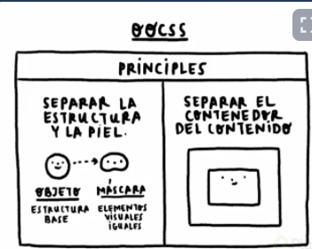
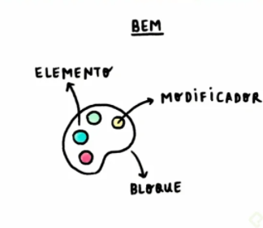
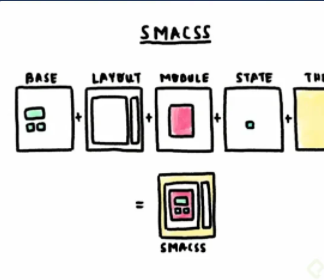
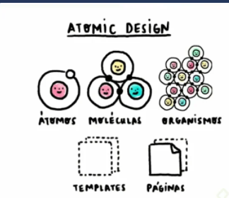

## Clase 22:  CSS para entrevistas y mundo laboral

Buen Manejo de 
- Css
- HTML
- JavaScript
- No te aprendas las cosas de memoria 
- Ver paginas que te gusten y trata de reaplicar 

## 23: Continúa con el Curso Práctico de Frontend Developer

Comparto algunas de las paginas que se mencionaron a lo largo del curso:

Images & videos: https://www.pexels.com/
tipos de texto fuente: https://fonts.google.com/
Specificity Calculator: https://specificity.keegan.st/
Referencials de html: https://htmlreference.io/
Referencials de html/css/js: https://www.w3schools.com/
Flexbox: https://css-tricks.com/snippets/css/a-guide-to-flexbox/
Grids: https://css-tricks.com/snippets/css/complete-guide-grid/
Texto random: https://www.lipsum.com/