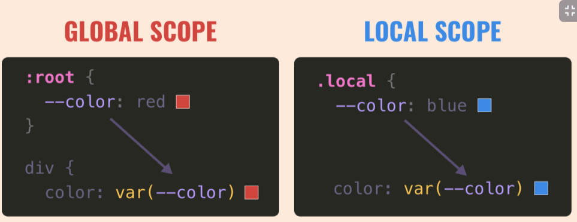

# Curso Práctico de Frontend Developer II

## Clase 1: 
- Introducción al curso 
- SI o SI  a huevo debemos instalar entornos de trabajo. 
- [Manual Dummy](./info/manual-para-imprimir.pdf)

## Clase 2:  Identifica las pantallas de tu proyecto

**Zeplin**
- https://scene.zeplin.io/project/60afeeed20af1378ed046538

**Figma**
- https://www.figma.com/proto/bcEVujIzJj5PNIWwF9pP2w/Platzi_YardSale?node-id=0%3A684&amp%3Bscaling=scale-down&amp%3Bpage-id=0%3A1&amp%3Bstarting-point-node-id=0%3A719

## Clase 3:  Sistema de diseño, assets y variables de CSS


> Una buena practica que aprendí en los cursos de la escuela de desarrollo web para los proyectos es incluir en el archivo de style.css esta estructura, que te permitirá formatear los estilos del navegador y trabajar los tamaños de las fuentes con rem, esto también los vimos en el primer curso de Frontend developer:


> Las variables deben declararse dentro de un selector, se acostumbra usar :root para que la variable sea global, se declaran con dos guiones y el nombre para utilizarlas se usa la funcion var() y entre los paréntesis se escribe el nombre de la variable

- [index](./Projecto/index.html)
- [css](./Projecto/css/style.html)
- [component](./Projecto/css/componets.html)

```
:root{
    --white: #FFFFFF;
    --black: #000000;
    --very-light-pink: #C7C7C7;
    --text-input-field: #F7F7F7;
    --hospital-green: #ACD9B2;
    --sm: 14px;
    --md: 16px;
    --lg: 18px;
}

html{
    margin: 0;
    padding: 0;
    box-sizing: border-box;
}

body{
    font-family: 'Quicksand', sans-serif;
    font-size: 62.5

```
    

    
**enlace**
- https://polaris.shopify.com/design/design
- https://cloudconvert.com/ttf-to-woff2 

## Clase 4 -5 : Crear nueva contraseña: HTML 

- [reset](./Projecto/reset.html)

PD: Me paso que no se centraba de manera vertical al usar display:grid;
place-items: center; me di cuenta que estaba usando porcentaje y no vw y vh, al que le pase como yo, solo tiene que cambiar las unidades.
```
.login{
    width: 100%;
    height: 100vh;
    display: grid;
    place-items: center;
}

altenativa 
{
    display: flex;
    justifiy-content: center;
    align-items: center
}

```
- Esto ayuda un buen nueva forma  hay que grabarlo 


## Clase 6: Email enviado

> Se creo el siguiente elemento 
- [eMail ](./Projecto/mail.html)

Les recomiendo esta forma para hacer contenedores responsive, el truco esta en el max-width y el width

.form-container {
      display: grid;
      justify-items: center;
      max-width: 400px;
      width: 90%;
    }

!! Faltaría centrar adecuadamente la imagen.

Con display:flex; justify-content: center; y align-items: center; podrás poner un div encima del otro, alinear los items y centrar una imagen encima de la otra.

Con form-container justify-items; center; para centrar todo lo que contiene esa clase.    


## Clase 7: Login 

- [Login](./Projecto/login.html)

## Clase 8: Crear mi cuenta

- [Crear Cuenta](./Projecto/crud_cuenta.html)


## Clase 9 :  Interfaz Editar 

- [EditarCuenta](./Projecto/crud_editar.html)
  

## Clase 10 - 11 - 12 - 13 -14 - 15 -16:  Interfaz Index 

- [Home](./Projecto/index.html)
```
.product-img{
    width: 240px;
    height: 240px;
    border-radius: 20px;
    object-fit: cover;/*esta imagen se adecua a este tamaño pero son su tamaño original */
}


.desktop-menu ul li a{
    color: var(--black);
    font-size: var(--sm);
    text-decoration: none;
    margin-bottom: 20px;
    display: inline-block; /* los elementos inline no toman margenes superiores o inferiores por lo que lo convertimos inline-block para que pueda tomar ese valor*/
}

/*Otra forma de genear css usando la coma*/
.desktop-menu ul li:nth-child(1),
.desktop-menu ul li:nth-child(2){
    font-weight: bold;
}

```