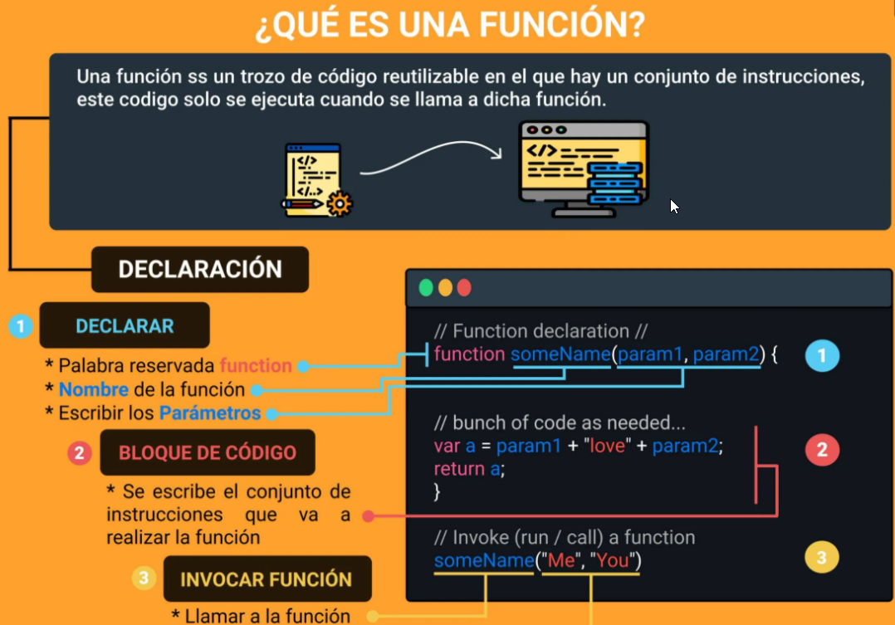

# Curso Práctico de Frontend Developer II

## Clase 1: 
- Introducción al curso 
**¿Cómo nace Javascript?**
- Nace con la necesidad de generar dinamismo en las páginas web y que a su vez los usuarios y las empresas pudieran interactuar unos con otros.

**¿Qué es Javascript?**
- Es un lenguaje interpretado, orientado a objetos, débilmente tipado y dinámico.

**Débilmente tipado**
Se pueden hacer operaciones entre tipos distintos de datos (enteros con strings, booleanos con enteros, etc). Ejemplo:

- 4 + "7"; // 47
- 4 * "7"; // 28
- 2 + true; // 3
- false - 3; // -3

**Dinámico**
- Corre directamente en la etapa de Runetime sin una etapa de compilación previa. 
- Esto permite probar nuestro código inmediatamente; pero también es lo que hace que los errores se muestren hasta que se ejecuta el programa.

**¿Realmente es Javascript un lenguaje interpretado?**
> Si, y la razón es que le navegador lee linea por linea nuestro código el cuál le indica lo que tiene que hacer, sin la necesidad de compilar. 
> Todo esto es controlado por el motor de Javascript V8 del navegador

**Javascript es Basckwards Compatible**
- Todas las funciones nuevas que salen de Javascript no dañarán el trabajo ya hecho, pero no se podrá utilizar en nuestro entorno de trabajo inmediatamente. 
- Para solucionar esto está Babel que permite utilizar las nuevas características del lenguaje pero lo transforma a una versión que el navegador pueda entender.

**Fuente:: Aporte creado por Diego Martínez**


## Clase 2: ¿Por qué JavaScript?


**Ventajas**
- JavaScript tiene una comunidad enorme de desarrolladores que te pueden ir ayudando a generar diferentes cosas.
- Si solo estuvieras interesado en trabajar aplicaciones web tienes muchos frameworks y librerías construidas en JavaScript que te van a ayudar a hacer proyectos de forma mucho mas rápida, eficiente y robusta (Angular, View, React,entre otros)
- Si no quieres trabajar solo en aplicaciones Web puedes utilizar JavaScript con un framework que se llama React Native para poder construir aplicaciones nativas como Android y IOS.
- Puedes construir aplicaciones de escritorio con JavaScript, usando un framework llamado Electron, pueden correr en Mac o Windows.
- También puedes trabajar en la parte del Back-end o **IOT **(Internet Od Things) es un concepto que se refiere a una interconexion digital de objetos cotidianos con Internet. 
- Esto con un Framework llamado NodeJS, el cual es un entorno de ejecución de JavaScript que corre directamente en el Back-end.

**WebAssembly:**
- es un nuevo tipo de código que puede ser ejecutado en navegadores modernos es un lenguaje de bajo nivel, similar al lenguaje ensamblador, 
- Con un formato binario compacto que se ejecuta con rendimiento casi nativo y provee un objetivo de compilación para lenguajes como C/C++ y Rust que les permite correr en la web.
- También está diseñado para correr a la par de JavaScript, permitiendo que ambos trabajen juntos.

Sitios web basados en:

Angular: Forbes
React: Airbnb
Vue: GitLab
Aplicaciones basadas en React Native:

UberEats
Discord
Instagram
Fuente: Enlace
Aplicaciones para Escritorio basados en Electron:

Visual Studio Code
WhatsApp
Twitch
Ver más aplicaciones de Electron JS
Compañías que usan Node.JS para parte de su backend:

Netflix
Linkedin
PayPal
Fuente: Enlace


## Clase 3: Elementos de un Lenguaje de Programación: Variables, Funciones y Sintaxis


**PRIMITIVOS: son los valores básicos que se utilizan para poder generar códigos.**

- Número: data sólo de tipo numérico, ejem: 1 2 3 4, etc.
- Strig: texto, se utiliza entre comillas dobles. “Haciendo esto”, “Diego Hernández”
- Boolean o Booleano: son valores creados por George Boolean dentro de lenguajes de programación para poder validar cosas y/o desiciones, por ello se utilizan: true (1) o false (0).
- Empty values: null o undefined, se les conoce como valores “placeholders”, pero son valores reservados para un tipo de valor que queda faltante en memoria. También pueden ser tomados como valores de errores.

**NO PRIMITIVOS O VALORES TIPO OBJETOS:**

- Array: se genera ocupando corchetes, los cuales dentro ocupan valores primitivos, ejem: [1,2,3] convirtiéndolos en valores tipo objeto.
- Valor tipo Objeto: se generan con corchetes, los cuales dentro ocupan una data que se transforma en objeto, ejem de sintaxis: { nombre: “Leonard”}.


## Clase 4: Elementos de un Lenguaje de Programación: Variables, Funciones y Sintaxis

> Var: 
Era la forma en que se declaraban las variables hasta ECMAScript 5. Casi ya no se usa porque es de forma global y tiene las siguientes características:

**Caracteristicas:**
- Se puede reinicializar: osea todas las variables se inicializan, por ejemplo:
```
Var pokemonType = ‘electric’ entonces reinicializar es:
Var pokemonType = ‘grass’ osea la misma variable con diferentes datos el último dato predomina.
```
- Se puede reasignar: osea la variable ya inicializada le reasignamos otro valor por ejemplo:
 inicializamos la variable: 
 ```
 Var pokemonType = ‘electric’ ahora la reasignamos pokemonType = ‘grass’ ya no va var
```
- Su alcance es función global: osea inicializamos la variable, pero la podemos llamar desde cualquier bloque (una llave abierta y una cerrada {}) pero hay que tener mucho cuidado con ello ya que puede haber peligro, no es recomendable usar VAR.
  
- const y let es la forma en que se declaran las variables a partir de ECMAScript 6,

> const: 
 sirve para declarar variables que nunca van a ser modificadas:

**Caracteristicas:**
 - No se puede reinicilizar: es una const única no puede haber otra inicializada con el mismo nombre.
```   
const pokemonType = ‘electric’ no puede haber:
const pokemonType = ‘grass’
```

- No se pude re asignar: una vez que la hayamos inicializado no la podemos reasignar solo con su nombre:
```
   const pokemonType = ‘electric’ no puede ejecutarse:
   pokemonType = ‘grass’
```   
- No es inmutable: osea no puede cambiar con objetos. 


> Let: 
 
 Son variables que pueden ser modificadas, se pueden cambiar:

**Caracteristicas:**
- No se puede reinicilizar: es una const única no puede haber otra inicializada con el mismo nombre.
```
 let pokemonType = ‘electric’ no puede haber:
 let pokemonType = ‘grass’
```
- Se puede reasignar: Osea la variable ya inicializada le reasignamos otro valor por ejemplo: inicializamos la variable:
```
   let pokemonType = ‘electric’ ahora la reasignamos pokemonType = ‘grass’
```
- Su contexto de es bloque: Solo funciona dentro de un bloque {}, fuera de ello no.


## clase 5 - 6: Funciones en JavaScript

Las funciones nos permite reciclar fragmentos de códigos o bloques de códigos repetitivos o generar procesos cortos y preciso por ejemplos puedes crear una función que te calcule una suma o una resta y esta pueda ser llamada cuando lo desees. 

**Tipos de funciones: **
- Funciones declarativas: usamos la palabra reservada function para lograr crear la función. 
- Funciones declarativas donde se guarda un espacio en la memoria con el nombre de la función  
  Ejemplo:
  
```
  //Declarativas  
  function sumaNumeros(a , b){
      return a + b; 
  }
```
- Funciones de expresion ó funciones anonimas: 
- Funciones de expresión (o anónima, porque no se le asigna nombre) se crea una variable a la cual se le asigna la función y se guarda en memoria

```
var suma = function (){
   return a + b;
}

```

>PD: Las funciones también necesitan parámetros que estoy esperando recibir como valor para que la función pueda hacer algo.

>PDX2:Diferencias:A las funciones declarativas se les aplica hoisting, y a la expresión de función, no. Ya que el hoisting solo se aplica en las palabras reservadas var y function.

> PDX3: Que demonios es hoisting -> Es el modo que podemos llamar una función declarativa antes de ser declarada.
Lo que quiere decir que con las funciones declarativas, podemos mandar llamar la función antes de que ésta sea declarada, y con la expresión de función, no, tendríamos que declararla primero, y después mandarla llamar.

miFuncion(); //Forma de llamar la función





## clase 7: Scope

Scope es la forma de como se declaran las variables es decir existe un regimen entre las diferents variables esto es llamado scope. Ejemplo. 

- Scope Global : todo el mundo.
- Scope Local : Las Vegas, y lo que pasa en las vegas, se queda en Las Vegas.

>PD:Resumen : lo que es global se puede acceder desde cualquier parte de tu código , y lo pueden acceder cada mundo , lo que es local solo lo puede acceder cada mundo.


## clase 8: Hoisting 

¿Qué es Hoisting?
En JavaScript, las declaraciones (por ejemplo, de variables o funciones) se mueven al principio de su scope o ámbito. Este comportamiento se conoce como hoisting y es muy importante tenerlo en cuenta a la hora de programar para prevenir posibles errores.

Las funciones siempre se mueven arriba del scope. Por lo tanto, podemos elegir donde declararlas y usarlas.
La declaración de las variables se mueven arriba del scope, pero no la asignación. Antes de usar una variable, habrá que crearla y asignarla.


*enlaces*
- https://anamartinezaguilar.medium.com/qu%C3%A9-es-el-hoisting-327870f67b36


## clase 9: Coerción

> Coerción es la forma en la que podemos cambiar un tipo de valor a otro, existen dos tipos de coerción:

- Coerción implícita = es cuando el lenguaje nos ayuda a cambiar el tipo de valor.
- Coerción explicita = es cuando obligamos a que cambie el tipo de valor.

```
var c = string(a);  //convertimos el tipo de valor a String
var d = number(a);  //convertimos el tipo de valor a numero
```

>PD: Este tipo de operaciones son importante al momento que se presenta el siguiente caso: cuando se tiene un cuadro de texto (input) y el usuario ingresa información (número, nombre, direcciones, etc.) JavaScript lo lee como STRING. Si uno desea utilizar este valor para algún cálculo u operación, es necesario obligar y cambiar el tipo de dato (de STRING A NÚMERO) mediante la coerción explicita.


## clase 10: Valores: Truthy y Falsy

¿Que tipos por default son verdaderos y falsos?

Usamos la función de JS que es Boolean() dentro del paréntesis ponemos el valor y nos dice si el mismo el False o True.

**Falsy**

- Boolean() —> sin ningun valor es false
- Boolean(0) —> false
- Boolean(null) —> false
- Boolean(NaN) —> false // NaN es Not and Number
- Boolean(Undefined) —> false
- Boolean(false) —> false
- Boolean("") —> false

**Truthy**

- Boolean(1) —> true //cualquier numero que no sea igual a cero es true
- Boolean(“a”) —> true
- Boolean(" ") —> true // siendo un espacio el valor es true
- Boolean([]) —> true // un array nos da un true
- Boolean({}) —> true // un objeto nos da el valor de true
- Boolean(function() {}) —> true //una funcion tambien es true
- Boolean(true) —> true

>PD: Todo esto lo vamos a usar en condiciones esto valida si es verdadero o falso para ejecutar cierta acción.

*Enlace*
- https://developer.mozilla.org/es/docs/Glossary/Falsy
- https://developer.mozilla.org/es/docs/Glossary/Truthy

## clase 10: Operadores: Asignación, Comparación y Aritméticos