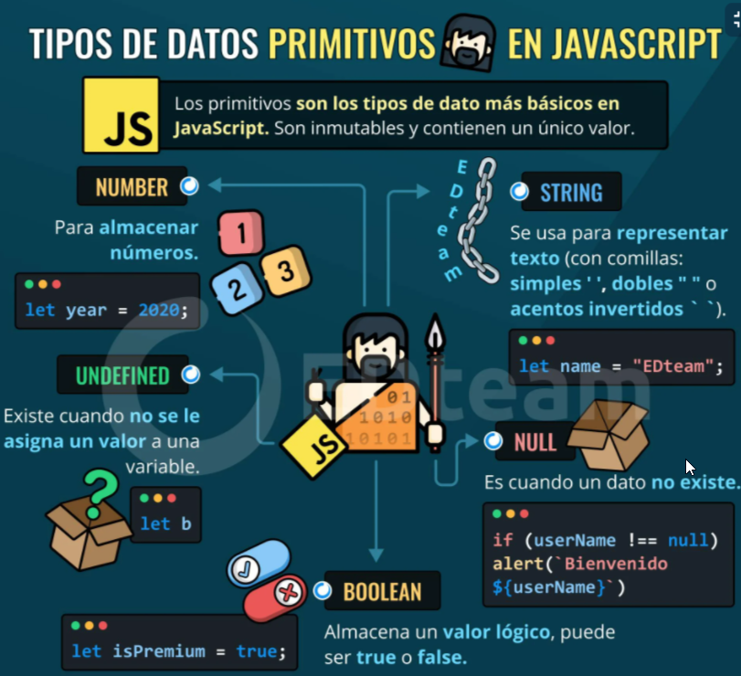
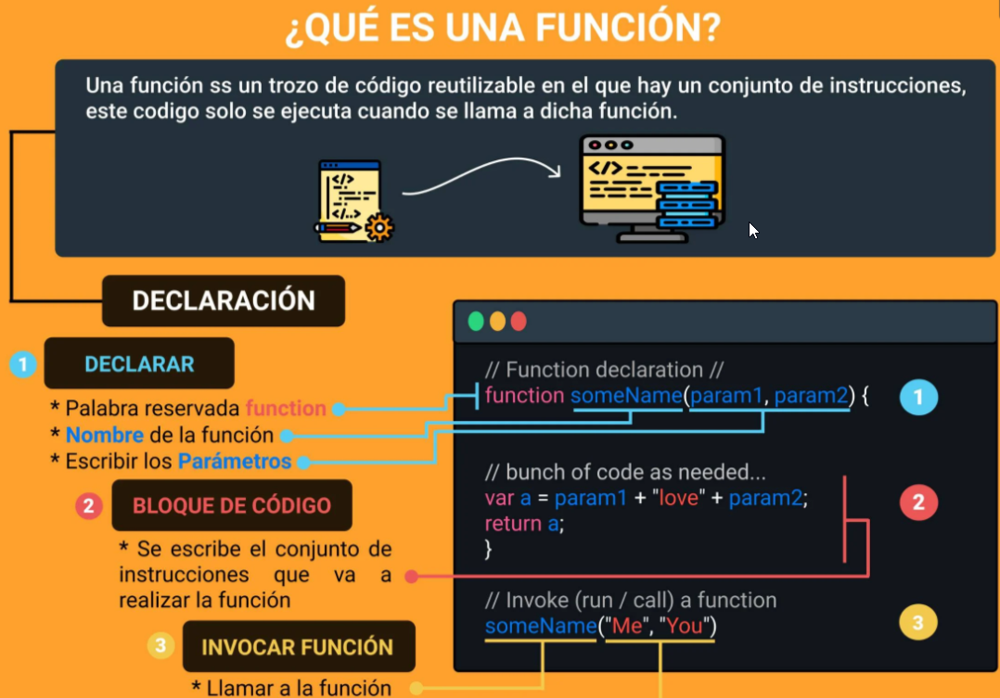
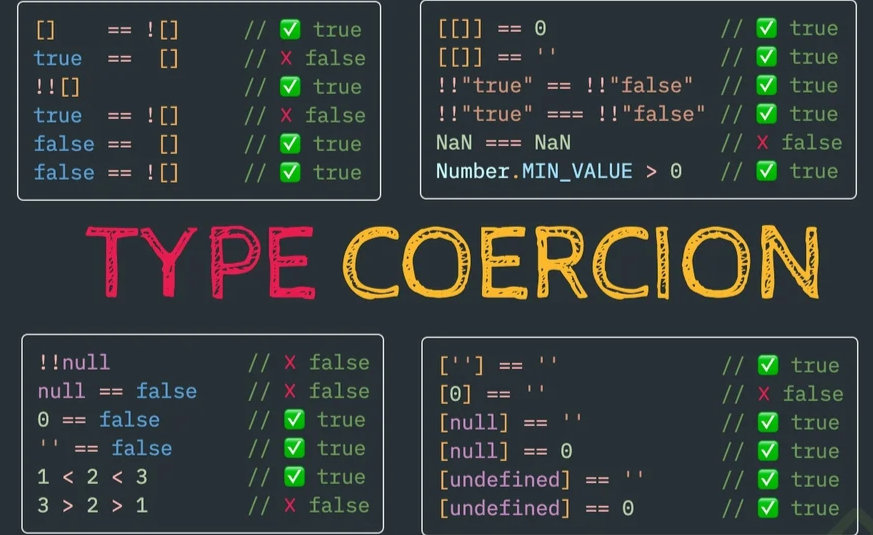
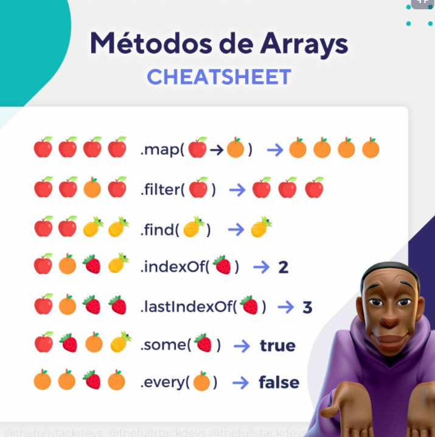

# Curso Basico de JavaScript

## Clase 1: 
- Introducción al curso 
**¿Cómo nace Javascript?**
- Nace con la necesidad de generar dinamismo en las páginas web y que a su vez los usuarios y las empresas pudieran interactuar unos con otros.

**¿Qué es Javascript?**
- Es un lenguaje interpretado, orientado a objetos, débilmente tipado y dinámico.

**Débilmente tipado**
Se pueden hacer operaciones entre tipos distintos de datos (enteros con strings, booleanos con enteros, etc). Ejemplo:

- 4 + "7"; // 47
- 4 * "7"; // 28
- 2 + true; // 3
- false - 3; // -3

**Dinámico**
- Corre directamente en la etapa de Runetime sin una etapa de compilación previa. 
- Esto permite probar nuestro código inmediatamente; pero también es lo que hace que los errores se muestren hasta que se ejecuta el programa.

**¿Realmente es Javascript un lenguaje interpretado?**
> Si, y la razón es que le navegador lee linea por linea nuestro código el cuál le indica lo que tiene que hacer, sin la necesidad de compilar. 
> Todo esto es controlado por el motor de Javascript V8 del navegador

**Javascript es Basckwards Compatible**
- Todas las funciones nuevas que salen de Javascript no dañarán el trabajo ya hecho, pero no se podrá utilizar en nuestro entorno de trabajo inmediatamente. 
- Para solucionar esto está Babel que permite utilizar las nuevas características del lenguaje pero lo transforma a una versión que el navegador pueda entender.

**Fuente:: Aporte creado por Diego Martínez**


## Clase 2: ¿Por qué JavaScript?


**Ventajas**
- JavaScript tiene una comunidad enorme de desarrolladores que te pueden ir ayudando a generar diferentes cosas.
- Si solo estuvieras interesado en trabajar aplicaciones web tienes muchos frameworks y librerías construidas en JavaScript que te van a ayudar a hacer proyectos de forma mucho mas rápida, eficiente y robusta (Angular, View, React,entre otros)
- Si no quieres trabajar solo en aplicaciones Web puedes utilizar JavaScript con un framework que se llama React Native para poder construir aplicaciones nativas como Android y IOS.
- Puedes construir aplicaciones de escritorio con JavaScript, usando un framework llamado Electron, pueden correr en Mac o Windows.
- También puedes trabajar en la parte del Back-end o **IOT **(Internet Od Things) es un concepto que se refiere a una interconexion digital de objetos cotidianos con Internet. 
- Esto con un Framework llamado NodeJS, el cual es un entorno de ejecución de JavaScript que corre directamente en el Back-end.

**WebAssembly:**
- es un nuevo tipo de código que puede ser ejecutado en navegadores modernos es un lenguaje de bajo nivel, similar al lenguaje ensamblador, 
- Con un formato binario compacto que se ejecuta con rendimiento casi nativo y provee un objetivo de compilación para lenguajes como C/C++ y Rust que les permite correr en la web.
- También está diseñado para correr a la par de JavaScript, permitiendo que ambos trabajen juntos.

Sitios web basados en:

Angular: Forbes
React: Airbnb
Vue: GitLab
Aplicaciones basadas en React Native:

UberEats
Discord
Instagram
Fuente: Enlace
Aplicaciones para Escritorio basados en Electron:

Visual Studio Code
WhatsApp
Twitch
Ver más aplicaciones de Electron JS
Compañías que usan Node.JS para parte de su backend:

Netflix
Linkedin
PayPal
Fuente: Enlace


## Clase 3: Elementos de un Lenguaje de Programación: Variables, Funciones y Sintaxis


**PRIMITIVOS: son los valores básicos que se utilizan para poder generar códigos.**

- Número: data sólo de tipo numérico, ejem: 1 2 3 4, etc.
- Strig: texto, se utiliza entre comillas dobles. “Haciendo esto”, “Diego Hernández”
- Boolean o Booleano: son valores creados por George Boolean dentro de lenguajes de programación para poder validar cosas y/o desiciones, por ello se utilizan: true (1) o false (0).
- Empty values: null o undefined, se les conoce como valores “placeholders”, pero son valores reservados para un tipo de valor que queda faltante en memoria. También pueden ser tomados como valores de errores.

**NO PRIMITIVOS O VALORES TIPO OBJETOS:**

- Array: se genera ocupando corchetes, los cuales dentro ocupan valores primitivos, ejem: [1,2,3] convirtiéndolos en valores tipo objeto.
- Valor tipo Objeto: se generan con corchetes, los cuales dentro ocupan una data que se transforma en objeto, ejem de sintaxis: { nombre: “Leonard”}.



## Clase 4: Elementos de un Lenguaje de Programación: Variables, Funciones y Sintaxis

> Var: 
Era la forma en que se declaraban las variables hasta ECMAScript 5. Casi ya no se usa porque es de forma global y tiene las siguientes características:

**Caracteristicas:**
- Se puede reinicializar: osea todas las variables se inicializan, por ejemplo:
```
Var pokemonType = ‘electric’ entonces reinicializar es:
Var pokemonType = ‘grass’ osea la misma variable con diferentes datos el último dato predomina.
```
- Se puede reasignar: osea la variable ya inicializada le reasignamos otro valor por ejemplo:
 inicializamos la variable: 
 ```
 Var pokemonType = ‘electric’ ahora la reasignamos pokemonType = ‘grass’ ya no va var
```
- Su alcance es función global: osea inicializamos la variable, pero la podemos llamar desde cualquier bloque (una llave abierta y una cerrada {}) pero hay que tener mucho cuidado con ello ya que puede haber peligro, no es recomendable usar VAR.
  
- const y let es la forma en que se declaran las variables a partir de ECMAScript 6,

> const: 
 sirve para declarar variables que nunca van a ser modificadas:

**Caracteristicas:**
 - No se puede reinicilizar: es una const única no puede haber otra inicializada con el mismo nombre.
```   
const pokemonType = ‘electric’ no puede haber:
const pokemonType = ‘grass’
```

- No se pude re asignar: una vez que la hayamos inicializado no la podemos reasignar solo con su nombre:
```
   const pokemonType = ‘electric’ no puede ejecutarse:
   pokemonType = ‘grass’
```   
- No es inmutable: osea no puede cambiar con objetos. 


> Let: 
 
 Son variables que pueden ser modificadas, se pueden cambiar:

**Caracteristicas:**
- No se puede reinicilizar: es una const única no puede haber otra inicializada con el mismo nombre.
```
 let pokemonType = ‘electric’ no puede haber:
 let pokemonType = ‘grass’
```
- Se puede reasignar: Osea la variable ya inicializada le reasignamos otro valor por ejemplo: inicializamos la variable:
```
   let pokemonType = ‘electric’ ahora la reasignamos pokemonType = ‘grass’
```
- Su contexto de es bloque: Solo funciona dentro de un bloque {}, fuera de ello no.


## clase 5 - 6: Funciones en JavaScript

Las funciones nos permite reciclar fragmentos de códigos o bloques de códigos repetitivos o generar procesos cortos y preciso por ejemplos puedes crear una función que te calcule una suma o una resta y esta pueda ser llamada cuando lo desees. 

**Tipos de funciones: **
- Funciones declarativas: usamos la palabra reservada function para lograr crear la función. 
- Funciones declarativas donde se guarda un espacio en la memoria con el nombre de la función  
  Ejemplo:
  
```
  //Declarativas  
  function sumaNumeros(a , b){
      return a + b; 
  }
```
- Funciones de expresion ó funciones anonimas: 
- Funciones de expresión (o anónima, porque no se le asigna nombre) se crea una variable a la cual se le asigna la función y se guarda en memoria

```
var suma = function (){
   return a + b;
}

```

>PD: Las funciones también necesitan parámetros que estoy esperando recibir como valor para que la función pueda hacer algo.

>PDX2:Diferencias:A las funciones declarativas se les aplica hoisting, y a la expresión de función, no. Ya que el hoisting solo se aplica en las palabras reservadas var y function.

> PDX3: Que demonios es hoisting -> Es el modo que podemos llamar una función declarativa antes de ser declarada.
Lo que quiere decir que con las funciones declarativas, podemos mandar llamar la función antes de que ésta sea declarada, y con la expresión de función, no, tendríamos que declararla primero, y después mandarla llamar.

miFuncion(); //Forma de llamar la función





## clase 7: Scope

Scope es la forma de como se declaran las variables es decir existe un regimen entre las diferents variables esto es llamado scope. Ejemplo. 

- Scope Global : todo el mundo.
- Scope Local : Las Vegas, y lo que pasa en las vegas, se queda en Las Vegas.

>PD:Resumen : lo que es global se puede acceder desde cualquier parte de tu código , y lo pueden acceder cada mundo , lo que es local solo lo puede acceder cada mundo.


## clase 8: Hoisting 

¿Qué es Hoisting?
En JavaScript, las declaraciones (por ejemplo, de variables o funciones) se mueven al principio de su scope o ámbito. Este comportamiento se conoce como hoisting y es muy importante tenerlo en cuenta a la hora de programar para prevenir posibles errores.

Las funciones siempre se mueven arriba del scope. Por lo tanto, podemos elegir donde declararlas y usarlas.
La declaración de las variables se mueven arriba del scope, pero no la asignación. Antes de usar una variable, habrá que crearla y asignarla.


*enlaces*
- https://anamartinezaguilar.medium.com/qu%C3%A9-es-el-hoisting-327870f67b36


## clase 9: Coerción

> Coerción es la forma en la que podemos cambiar un tipo de valor a otro, existen dos tipos de coerción:

- Coerción implícita = es cuando el lenguaje nos ayuda a cambiar el tipo de valor.
- Coerción explicita = es cuando obligamos a que cambie el tipo de valor.

```
var c = string(a);  //convertimos el tipo de valor a String
var d = number(a);  //convertimos el tipo de valor a numero
```

>PD: Este tipo de operaciones son importante al momento que se presenta el siguiente caso: cuando se tiene un cuadro de texto (input) y el usuario ingresa información (número, nombre, direcciones, etc.) JavaScript lo lee como STRING. Si uno desea utilizar este valor para algún cálculo u operación, es necesario obligar y cambiar el tipo de dato (de STRING A NÚMERO) mediante la coerción explicita.





## clase 10: Valores: Truthy y Falsy

¿Que tipos por default son verdaderos y falsos?

Usamos la función de JS que es Boolean() dentro del paréntesis ponemos el valor y nos dice si el mismo el False o True.

**Falsy**

- Boolean() —> sin ningun valor es false
- Boolean(0) —> false
- Boolean(null) —> false
- Boolean(NaN) —> false // NaN es Not and Number
- Boolean(Undefined) —> false
- Boolean(false) —> false
- Boolean("") —> false

**Truthy**

- Boolean(1) —> true //cualquier numero que no sea igual a cero es true
- Boolean(“a”) —> true
- Boolean(" ") —> true // siendo un espacio el valor es true
- Boolean([]) —> true // un array nos da un true
- Boolean({}) —> true // un objeto nos da el valor de true
- Boolean(function() {}) —> true //una funcion tambien es true
- Boolean(true) —> true

>PD: Todo esto lo vamos a usar en condiciones esto valida si es verdadero o falso para ejecutar cierta acción.

*Enlace*
- https://developer.mozilla.org/es/docs/Glossary/Falsy
- https://developer.mozilla.org/es/docs/Glossary/Truthy

## clase 12: Operadores: Asignación, Comparación y Aritméticos

- Se creará el juego de piedra papel y tijera para comprender el uso 

```
var op1 = "Piedra";
var op2 = "Papel";
var op3 = "Tijera";

var resultado = function(user, cpu){
    if(user != cpu){
        if(user === op1 && cpu === op3){
            console.log("el usuario GANO con "+ op1)
        }else if(user === op2 && cpu === op1){
            console.log( "el usuario GANO con " + op2)
        }else if(user === op3 && cpu === op2){
            console.log("el usuario GANO con " + op3)
        }else{
            console.log("La CPU Gano!!")
        }
    }else if(user === cpu){
        console.log("Empate")
    }
};

resultado(op1,op3) //el usuario GANO con Piedra
```

## clase 13: Switch

- Se creará el juego de piedra papel y tijera para comprender el uso 
  
```
var pregunta = prompt("Ingresa tu opción: piedra, papel o tijera "); 
var user = pregunta.toLowerCase();
var options = ["piedra", "papel", "tijera"];
var machine = options[Math.floor(Math.random() * 3)];


// let numero = 'a';
//con true los casos van a pasar 
switch (true) {
    case (user === machine):
        console.log('es un empate');
        break;
    case (machine === 'piedra' && user === 'papel'):
        console.log('Ganaste')
        break;
    case (machine === 'papel'  && user === 'tijera'):
        console.log('Ganaste')
        break;
    case (machine === 'tijera' && user === 'piedra'):
        console.log('Ganaste')
        break;
    default:
        console.log('¡Perdiste!');       
}
```


## clase 14: arrays 


> Un Array es un tipo de estructura de datos, objeto. Puede guardar datos distintos dentro, guarda los datos en forma de lista.


- .lenght devuelve la longitud del array.
- .push() agrega elementos al final de array.
- .pop() elimina un elemento del array.
- .unshift() agrega un elemento al array, pero lo agrega en primer lugar.
- **.shift() **elimina el elemento que está en el inicio del array.
- **.indexOf ** devuelve la posición de un elemento del array.

```
var colores = [“rojo”, “azul”, “verde”, “amarillo”];

// Reverse, metodo que establece que el array invierte los elementos
colores.reverse();
["amarillo", "verde", "azul", "rojo", "anaranjado"]


//Sort, metodo para ordenar alfabeticamente los array con datos de tipo String
colores.sort();
["amarillo", "anaranjado", "azul", "rojo", "verde"]


//Slice, método que puede contener uno o dos argumentos, que indiquen el inicio y parada de posiciones, pues devuelve los elementos contenidos en el array, de acuerdo a los argumentos indicados, por ejemplo si a colores, le agregamos colores.slice(1,3); obtendremos los que se encuentran en la posición 1, 2

colores =  ["amarillo", "anaranjado", "azul", "rojo", "verde"]
colores.slice(1,3);
["anaranjado", "azul"]


```

Para complementar un poco, ya que me parece que en los otros cursos de JavaScript tampoco lo mencionan, a los arrays también se les pueden asignar o añadir datos con string keys, es decir, pasándole un string entre corchetes en vez del índice.

Algo curioso con los string keys es que no influye en la longitud de los arrays, por ejemplo:




## clase 15: Loops: For y For...of

> Los bucles pueden ejecutar un bloque de código varias veces. JavaScript admite diferentes tipos de bucles:

- for - recorre un bloque de código varias veces

- for/in - recorre las propiedades de un objeto

- for/of - recorre los valores de un objeto iterable

- while - recorre un bloque de código mientras se cumple una condición específica

- do/while - también recorre un bloque de código

Ejemplos:

```
var frutas = ["Manzana", "Pera", "Naranja", "Platano", "Uva"];

for (i = 0; i < frutas.length; i++) {
    console.log(`Indice ${i}: ${frutas[i]}`);
}

//Devuelve los valores 
for (e of frutas) {
    console.log(`Elemento ${e}`);
}


//Devuelve indices 
for (e in frutas) {
    console.log(`Elemento ${e}`);
}
```

Para iniciar un for, debe tomarse en cuenta 4 cosas:
🔷El init, que se ejecutará una vez cuando comience el ciclo. Aquí es donde normalmente inicializamos una variable y la usamos como contador de bucle, Aunque se puede ingresar cualquier fragmento de código.
🔷En segundo lugar, el condition. Esto lo que hará es comprobar si se cumple dicha condición en cada ejecución y seguirá repitiendo hasta que se vuelva falso.
🔷El increment se ejecutará después de cada ejecución del ciclo. Usualmente usamos esto para incrementar el contador de bucles, pero esto también puede ser cualquier fragmento de código o estar totalmente vacío.
🔷Finalmente, debe especificar el statements(código) para que se ejecute en bucles.


## clase 16:  Loops: While 

Ambos ciclos se ocupan el for y el while. Con for podemos definir un fin de intentos y con el while mientras se cumpla que lo siga haciendo. Es como decir en while sería, seguir cocinando el pollo mientras siga crudo, realmente no sabemos cuando estará cocinado. Si usáramos for podría quedarnos crudo o muy quemado, a menos que fueras un super experto.


CUANDO EL PROFESOR UTILIZA LAS COMILLAS INVERTIDAS LUEGO EL SIGNO $ Y { } LLAVES… ESO SE LLAMA INTERPOLAR VARIABLES!!! 


```
var studentsName = ['Santiago', 'Ivan', 'Esteban', 'Daniela', 'Jose'];
var counter = 0;

function printNames(name){
    console.log(`Hello ${name}`)
}

while (studentsName[counter]){
    printNames(studentsName[counter])
    counter++;
}
```


## Clase 17: Objects

>“Las clases de JavaScript, introducidas en ECMAScript 2015, son principalmente azúcar sintáctica sobre la herencia existente basada en prototipos de JavaScript. La sintaxis de clase no introduce un nuevo modelo de herencia orientado a objetos a JavaScript.” 

Un objeto en programación es una representación abstracta de un objeto en la vida real, sin embargo también puede entenderse como un contenedor de datos.
Ejemplo:
Una botella de refresco tiene ciertas características y acciones.-
Características: altura, volumen, color, contenido, dureza etc…
Acciones: beber, reciclar, rehusar, aventar, abrir tapa, etc…

Respectivamente a estas características y acciones se les conoce como atributos(características) y métodos(acciones) en programación.

Los objetos son usados para almacenar ciertos datos que de otra manera serían muy sensibles al hackeo, por otro lado un objeto también puede ser el valor de una variable.

A modo de adelanto una clase a su vez es un molde que puede almacenar objetos y esta también como el objeto tiene atributos y métodos que puede heredar a cada uno de esos objetos conocida esta propiedad como herencia, en base a eso la clase this, es la clase principal desde la cual se ejecuta javascript a modo de ejemplo puedes consultar en consola del navegador console.log(this); y te darás una mejor idea.


Los objetos te permiten envolver piezas de datos relacionados y funcionalidad en un solo contenedor. Los objetos tienen:

Propiedades que muestran información sobre el objeto.
Métodos que son funciones o capacidades que tiene el objeto.

Ejemplo: 
```
var miLaptop = {
    Modelo: "15-dw0004la",
    Procesador: "Intel Core i7",
    MemoriaRAM: "8GB",
    DiscoDuro: "256GB",
    Peso: "1.74 kg",
    caracteristicas: function(){
        console.log(`Mi laptop tiene las siguientes caracteristicas ${this.Modelo} ${this.Procesador} ${this.MemoriaRAM} ${this.DiscoDuro} ${this.Peso}`)
    }
}

miLaptop.caracteristicas()
```
¿Qué es this?
this es una variable (con la que podés acceder a ciertos valores del objeto) que hace referencia al objeto, en el caso del ejemplo, hace caso al padre_ miAuto_. Es como si estuviésemos escribiendo_ miAuto.modelo_ o miAuto.annio.


## Clase 18: Objects: Función constructora

Definición de instancia
Se llama instancia a todo objeto que derive de algún otro

Ejemplo práctico:
Tomando como ejemplo a platzi, se genera una función constructora llamada estudiantes
Ejemplo: 
```
var brands = ['Toyota', 'Mazda', 'Renault']
var cars = []

function Car(brand, model, year) {
    this.brand = brand
    this.model = model
    this.year = year
}

for (var i = 0; i < 30; i++)
    cars.push(new Car(brands[Math.floor(i/10)], `Serie ${i % 10}`, 1999 + i % 10))

console.log(cars)
```


## Clase 19: Objects: Métodos de recorridos de Arrays


- RECORRER EL CONTENIDO DEL ARRAY:
    - filter: filtra en base a validaciones (genera un nuevo array)
    - map:    regresa un atributo de los objetos (genera un nuevo array)

-Looping with .forEach
-Asserting with .some and .every
-Subtleties in .join and .concat
-Stacks and queues with .pop, .push, .shift, and .unshift
-Model mapping with .map
-Querying with .filter
-Ordering with .sort
-Computing with .reduce, .reduceRight
-Copying a .slice
-The power of .splice
-Lookups with .indexOf
-The in operator
-Going in .reverse


## Clase 20: Objects: Recorriendo Arrays con .find(), .forEach() y .some()


> El método find () devuelve el primer valor que coincide de la colección. Una vez que coincida con el valor en los resultados, no verificará los valores restantes en la colección de matriz.

> El método filter () devuelve los valores coincidentes en una matriz de la colección. Verificará todos los valores de la colección y devolverá los valores coincidentes en una matriz.


- find() : Devuelve el primer elemento del array que cumpla con la condición dada
- foreach() : Ejecuta lo que le definamos una vez por cada elemento de nuestro array
- some() : Comprueba si al menos un elemento del array cumple con la condición que le damos
- filter() : Devuelve todos los elementos del array que cumplan con la condición dada
   
Ejemplo 

```
var articulos = [
    { nombre: "Bici", costo: 3000 },
    { nombre: "TV", costo: 2500 },
    { nombre: "Libro", costo: 320 },
    { nombre: "Celular", costo: 10000 },
    { nombre: "Laptop", costo: 20000 },
    { nombre: "Teclado", costo: 500 },
    { nombre: "Audifonos", costo: 1700 },
];

//filter Genera un nuevo array
var articulosFiltrados = articulos.filter(function(articulo){
    return articulo.costo <= 500; //articulos con precio menor a 500 pesos
});

//map Ayuda a mapear ciertos elementos de los articulos, es necesario generar nuevo array
var nombreArticulos = articulos.map(function(articulo){
    return articulo.nombre;
});

//find Ayuda a encontrar algo dentro del array articulos
var encuentraArticulo = articulos.find(function(articulo){
    return articulo.nombre === "Laptop";
});

//forEach No es necesario generar nuevo array, se utiliza para realizar un recorrido de un array principal
articulos.forEach(function(articulo){
    console.log(articulo.nombre);
});

//some Se genera nuevo array, regresa un condición en Boolean es decir regresa true si la condición se cumple.
var articulosBaratos = articulos.some(function(articulo){
    return articulo.costo <= 700;
});

``` 


## Nota 

> Como metódo práctico podemos usar esta estructura como ejemplo. 
- Podemos tomar ejemplo como subir archivos
- Como validar por teclado
- Como manejar una hoja js sin romper logica ya que todo va organizado
- Claro ya este metódo es viejo ya que javascript actualmente soporta crear clases desde  ECMAScript 2015,
- Pero podemos generar una hoja bien estructurada sin complicaciones 
- Hay una pequeña ventaja a diferencia de la clase que si hay que instanciarla hasta crear un objeto, esta estructura tan solo la anidas a tu html y listo metodos que declares aqui ya estan funcional en esa hoja html
- Link [Ejemplo](https://github.com/LeoSan/EscuelaJavaScript2021/blob/main/02_Medio/01_Curso_Basico_JavaScript/Estructura_Example/Example_Estructura_Remesa.js)
