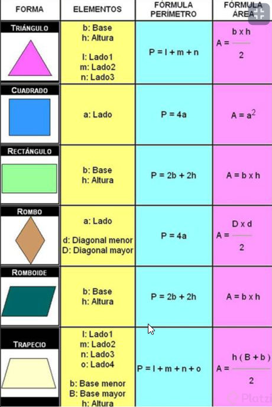

# Curso Práctico De JavaScript
Este nivel son practicas de javascript podremos hacer practicas para reforzar el conocomiento y seguir aprendiendo si usan funciones nuevas. 

## Clase 1: Bienvenida 
- Profesor Juan David Castro 

## Clase 2: Prueba de JavaScript

Es un conjunto de preguntas para evaluar tu nivel, esta bien para los ciclos basicos, los respondi de manera mental. 

## Clase 3:  Configuración del entorno de desarrollo para JavaScript
- Solo se instalo el codevisual y se genero un repo en github 

## Clase 4 -5 - 6 - 7- 8-9:  Análisis: cómo calcular figuras geométricas
Validar los datos para el ejercicio practico



Tatuarse en la piel 


```
Si van a crear varios archivos con el mismo nombre pero diferente extensión, por consola es muy fácil de la siguiente forma:

touch nombreArchivo.{extension, extension, extension}

Ej:

touch figuras.{html,js}
touch button.{html,js,css}
```


## Clase 10 : Análisis: cómo calcular porcentajes y descuentos

En este taller se creará un programa que realiza descuento a productos a facturar.

Análisis para realizar programa de porcentajes y descuentos
Primer paso: definir las fórmulas de los porcentajes y descuentos
Segundo paso: implementar la fórmula en JavaScript
Tercer paso: crear funciones
Cuarto paso: integrar JS con HTML
Definiendo fórmulas de porcentajes y descuento
La formula para hacerlo escalable, es decir para cualquier precio y cualquier descuento es:


(precio * (100 - descuento))/100


