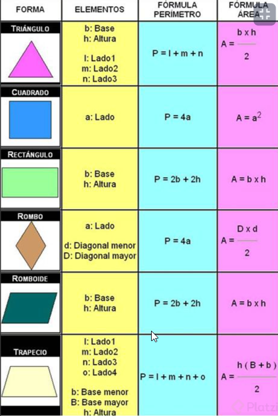

# Curso Práctico De JavaScript
Este nivel son practicas de javascript podremos hacer practicas para reforzar el conocomiento y seguir aprendiendo si usan funciones nuevas. 

## Clase 1: Bienvenida 
- Profesor Juan David Castro 

## Clase 2: Prueba de JavaScript

Es un conjunto de preguntas para evaluar tu nivel, esta bien para los ciclos basicos, los respondi de manera mental. 

## Clase 3:  Configuración del entorno de desarrollo para JavaScript
- Solo se instalo el codevisual y se genero un repo en github 

## Clase 4 -5 - 6 - 7- 8-9:  Análisis: cómo calcular figuras geométricas
Validar los datos para el ejercicio practico



Tatuarse en la piel 


```
Si van a crear varios archivos con el mismo nombre pero diferente extensión, por consola es muy fácil de la siguiente forma:

touch nombreArchivo.{extension, extension, extension}

Ej:

touch figuras.{html,js}
touch button.{html,js,css}
```


## Clase 10 -11 -12 -13 : Análisis: cómo calcular porcentajes y descuentos

En este taller se creará un programa que realiza descuento a productos a facturar.

Análisis para realizar programa de porcentajes y descuentos
Primer paso: definir las fórmulas de los porcentajes y descuentos
Segundo paso: implementar la fórmula en JavaScript
Tercer paso: crear funciones
Cuarto paso: integrar JS con HTML
Definiendo fórmulas de porcentajes y descuento
La formula para hacerlo escalable, es decir para cualquier precio y cualquier descuento es:


(precio * (100 - descuento))/100

```

onclicCalularDescuento:()=>{
        let btnCalcularDescuento = document.querySelector("#btnCalcularDescuento");
        let inpPrecio = document.querySelector("#inpPrecio");
        let inpPorcentaje = document.querySelector("#inpPorcentaje");
        let msjDescuento = document.querySelector("#msjDescuento");
        let inpResulDescuento = document.querySelector("#inpResulDescuento");
        let inpResulTotal = document.querySelector("#inpResulTotal");
        
        let mensajeResultado = document.querySelector("#mensajeResultado");

        btnCalcularDescuento.addEventListener('click', function(event) {
            event.preventDefault();
            if (inpPrecio.value > 0 && inpPorcentaje.value > 0){
                //Calculo del Descuento con el porcentaje
                let resultado = app.calculoDescuento( inpPorcentaje.value , inpPrecio.value );
                inpResulDescuento.value = resultado;
                inpResulDescuento.style.backgroundColor = "#E4FFC7";

                //Resultado del Total Desuento
                inpResulTotal.style.backgroundColor = "#E4FF56";
                inpResulTotal.value = app.calculoDescuentoTotal(resultado, inpPrecio.value);

                msjDescuento.style.display="none";
                //Limpio casilla de mensaje 
                mensajeResultado.innerHTML="";

                //Muestro mensaje creando un div 
               let mensajeDescuento = document.createElement('DIV');
               mensajeDescuento.textContent = `Tu margen de descuento al ${inpPorcentaje.value}%, es de: ${resultado}`;
               mensajeDescuento.classList.add('badge', 'bg-primary', 'text-wrap', 'fs-6'); 
               mensajeResultado.appendChild(mensajeDescuento); 

               let mensajeTotal = document.createElement('DIV');
               mensajeTotal.textContent = `Debes pagar un total de ${app.calculoDescuentoTotal(resultado, inpPrecio.value)} Pesos, Ya qué  ${resultado} Pesos es el descuento del margen de ${inpPorcentaje.value}%`;
               mensajeTotal.classList.add('badge', 'bg-success', 'text-wrap', 'fs-6', 'mt-2'); 
               mensajeResultado.appendChild(mensajeTotal); 

            }else{
                app.msjValidacion(msjDescuento, inpPrecio, 'Debes llenar los campos precio y porcentaje para el calculo');
            }
        });

```

## Clase 14 : Qué es promedio, moda y mediana


Media o promedio aritmético: Consiste en sumar cada numero y dividirlo por la cantidad de numero que hay.

(20 + 30 + 40) = 90 / 3 = 30
Este no es tan optimo ya que si ingresa algo a lo que se le llama “dato atípico” los resultados no serian muy acertados.

.
Mediana: Este consiste en tener un numero de elementos numéricos, lo primero que debes de hacer es ordenarlos en forma ascendente:

Si el numero de datos que hay en el “arreglo” es impar escogemos el numero de la mitad: Si fueran 15 posiciones escogemos la posición 8
Si el numero de datos que hay en el “arreglo” es par escogemos el valor de las dos posiciones del centro y las dividimos en dos: Si fuera 16 escogemos la posición 8 y 9 y la dividimos entre 2
Este proceso es mucho mas optimo que la media ya que los datos atípicos no afectaran demasiado el valor final.
.
Moda: Este es el dato que mas se repite en un conjunto de datos si tenemos el siguiente arreglo [10,9,8,10,8,10,8,7,9] y vemos que dos números se repiten la misma cantidad de veces, simplemente se ponen los dos [8,10].
Este tipo de proceso es muy funcional cuando no solo queremos hablar de tipos de datos numéricos, tambien pueden ser cadenas de texto y demás.

.
¡Espero te sirva! 😃


[■,■,■,■].map(■→●) ⇒ [●,●,●,●]
[■,●,■,▲].filter(■→true) ⇒ [■,■]
[■,●,■,▲].find(●→true) ⇒ ●
[■,●,■,▲].findIndex(●→true) ⇒ 1
[■,●,■,▲].fill(●) ⇒ [●,●,●,●]
[■,●,■,▲].some(●→true) ⇒ true
[■,●,■,▲].every(●→true) ⇒ false 


Array.prototype.reduce()
El método reduce() ejecuta una función reductora sobre cada elemento de un array, devolviendo como resultado un único valor.


[0,1,2,3,4].reduce(function(valorAnterior, valorActual, indice, vector){
  return valorAnterior + valorActual;
});


const NUMBERS = [2, 2, 2, 2, 2, 4, 5, 5, 5, 5, 5, 5, 5, 5, 9];

function mode(arr){
    return arr.sort((a,b) =>
          arr.filter(v => v===a).length
        - arr.filter(v => v===b).length
    ).pop();
}


console.log(mode(NUMBERS)); //5