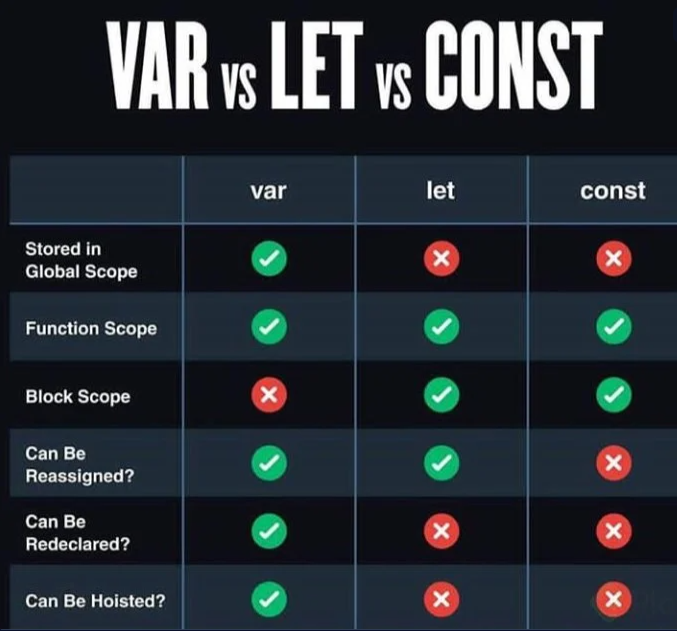
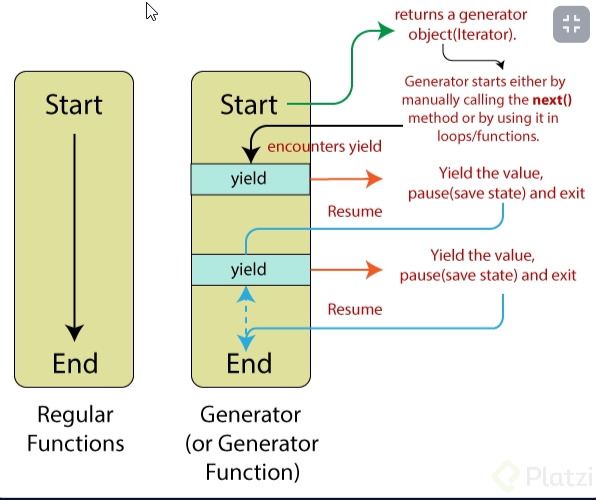

# Nuevo Curso de ECMAScript: Historia y Versiones de JavaScript

## Clase 1 : 

PResentación 


## Clase 2 : Algo de Historia 

Esto lo podemos ver aqui -> [Historia](https://github.com/LeoSan/EscuelaJavaScript2021/blob/main/02_Medio/01_Curso_Basico_JavaScript/Notas_CursoBasicoJavaScript.md)

## Clase 3 : Configurando nuestras herramientas
 - Visual Code Plugings 
 - Code Runner -> https://marketplace.visualstudio.com/items?itemName=formulahendry.code-runner
 -  Live Server -> https://marketplace.visualstudio.com/items?itemName=ritwickdey.LiveServer
 - Error lens   -> 
 - Ident - Rainbow ->
 - JavaScript ES6 code snippets->
 -  DOC NPM -> https://docs.npmjs.com/about-semantic-versioning 


## Clase 4 : ES6: let y const, y arrow functions

A partir de esta versión se hace referencia a “El gran cambio”

let & const
Nuevas palabras reservadas para guardar variables. Antes solo existía var.




## Clase 5 : ES6: strings

>Template literals (backticks) son un game-changer sin este feature no existirían cosas como JSX y consigo todo lo que usamos en el frontend moderno, sin duda una las mejores implementaciones que se hicieron en el lenguaje.


## Clase 6 : ES6: parámetros por defecto

> Parámetros por defecto que ayudan a sacarle ventaja a las Funciones.

## Ejemplo 

``` 
//tradicional//
function newUser(name,age,country){
var name = name || ‘ingresa Nombre’;
var age = age || 100;
var country = country || ‘non’;
console.log(name,age,country);
}
newUser();
newUser(‘felipe’,29, ‘Bog’);

//simplificado//

function newUser( name = ‘julian’, age = 28, country = ‘CO’){
console.log(name, age, country)
};
newUser();
newUser(‘felipe’, 29, ‘bar’);
```


## Clase 7 : ES6: asignación de desestructuración

**Asignación de Desestructuración**
la Desestructuración permite desarmar objetos y asignarle a cada elemento una variable distinta

## Ejemplo 

```
// arrays destructuring
let fruits = ['Apple', 'Banana', 'Orange'];
let [,,fruit] = fruits;

console.log(fruit); /*arroja "Orange"*/

//DESESTRUCTURACIÓN DE OBJETOS

let user = { username: 'Julian', age:28 };
let { usuario , edad } = user;
console.log (usuario, edad);
```


## Clase 8 : ES6: spread operator


**Spread operator | Operador de Propagación**
>El operador de Propagación, nos va a permitir trabajar con una lógica que podamos propagar a otros elementos sin necesidad de volverla a escribir.


- Es un operador que ayuda a crear nuevas variables utilizando elementos de otras variables, y/o elementos nuevos.

## Ejemplo 

```
let person = { name: "Alexa", age: 24 };
let country = "COL"

let data = { ...person, country };
console.log(data);
```


## Clase 9 : ES6: object literals

**Object Literals**
> Una de las mejoras agregadas en ECMA 6 al trabajar con objetos es la representación de la asignación.

- Enhanced object literals

## Ejemplo 

```
function Dog(name, age) {
    this.name = name;
    this.age = age;
    this.barking = function() { return `${this.name} says WOOF`}
}
const Kira = new Dog("Kira", 3)
Kira.barking(); 
``` 


## Clase 10 : ES6: promesas

> Es lo nuevo y bponito de ES6, ya podemos tener métodos que podamos ejecutar de manera asincrina uso de Promesa con then 

## Ejemplo 

```
const anotherFuncion = () => {
    return new Promise((resolve, reject) => {
        if (false) {
            resolve("hey!!");
        } else {
            reject ( "whooooops!");
        }
    })
}

anotherFuncion()
.then(response => console.log(response))
.catch(err => console.log(err));
```

## Clase 11 : ES6: clases

> Anteriormente JS no usaba clases emulaba usar clases, pero ahora ya es oficial ya tenemos nuestra palabra reservada Class y usar todo el poder de la programación orientada a Objeto 

## Ejemplo 
```
// declaracion de una clase
class User {};
// genera una instancia
//const newUser = new User ();

class user {
 // metodos
greeting() {
    return "hello";
}
};

const gndx = new user();
console.log(gndx.greeting());
const bebeloper = new user();
console.log(bebeloper.greeting());

// constructor

class user { 
    constructor() {
        console.log("Nuevo usuario");
    }
    greeting() {
        return "hello";
    }
}

const david = new user();

// this

class user {
    constructor(name) {
        this.name = name;
    }
    // metodos
    speak() {
        return "Hello";
    }
    greeting() {
        return `${this.speak()} ${this.name}`;
    }
}
const ana = new user("Ana");
console.log(ana.greeting());

// setters getters

class user {
    //constructor
    constructor(name, age) {
        this.name = name;
        this.age = age
    }
    // metodos
    speak() {
        return "Hello";
    }
    greeting() {
        return `${this.speak()} ${this.name}`;
    }

    get uAge() {
        return this.age;
    }
    set uAge(n) {
        this.age = n;
    }
}

const bebeloper1 = new user ("david", 15);
console.log(bebeloper1.uAge);
console.log(bebeloper1.uAge = 20);
```

## Clase 12: ES6: module

**Nota**
- Solo funciona esto si tenemos node.js instalado  del caso contrario podemos usar require()
- Recuerden que existen dos tipos de exports/imports
- Default se usa cuando solo devuelves un elemento y no quieres restringir el nombre.
- Export const restringe el nombre y ademas te permite devolver multiples funciones o constantes
- Recuerda poner las extensiones como buena practica 

**Importante Archivo de package.json añadir**
```
"type": "module"
```
## Ejemplo 

```
archivoA.js
const hello = () => {
    console.log("Hello!")
}
export default hello;


------
archivoB.js
import hello from "./module.js";

hello();

```

## Clase 13 ES6: generator

**Nota**
- Es un tipo especial de función que no retornará algun tipo de algoritmo definido. 
- usamos la palabra reservada function pero con un asterisco (*) -> function*
- usamos la palabra reservada `yield`-> `rendir` significa rendir 


## Ejemplo 
```
function* iterate(array, array2){
    for (let value of array){
        yield value;
    }
    for(let value2 of array2){
        yield value2;
    }
}

const it = iterate(['Angel','Juan','Víctor','Marcos'], ['Angela', 'Juana', 'Víctoria', 'María']);
console.log(it.next().value);
console.log(it.next().value);
console.log(it.next().value);
console.log(it.next().value);
console.log(it.next().value);
console.log(it.next().value);
console.log(it.next().value);
console.log(it.next().value);
console.log(it.next().value);
console.log(it.next().value);
```



## Clase 14  ES6: set-add

> Set es parecido al array, pero una de las diferencias con el array es que impide agregar elementos repetidos

**Enlace**
- https://www.digitalocean.com/community/tutorials/understanding-map-and-set-objects-in-javascript-es


## Ejemplo 
```
const list = new Set();

list.add("item 1");
list.add("item 2").add("item 3");

console.log(list);

//Usos 

const array = [1, 1, 2, 2, 3, 4, 4, 5]

const sinRepetidos = [ ... new Set(array)]
console.log(sinRepetidos) // [ 1, 2, 3, 4, 5 ]

```

## Clase 15: ES7 Junio 2016  -> Include

**Notas**
- Ojo no evalua tipo de valor no es lo mismo 1 != "1"
- Ante de usar include asegurate que todos los valores esten en un tipo de valor ó asegurate que lo que buscas no este en varias formas de tipo de valor.
- Includes, pero en objeto
- En objetos también existen formas para saber si existe una propiedad. 
- La palabra reservada in
- El método de objetos hasOwnProperty
- El método Object.hasOwn, que recibe el objeto y la propiedad a evaluar.

## Ejemplo de forma include
```
let familyEmoji = [..."👨‍👩‍👦‍👦"]
console.log(
	familyEmoji.includes("👨"),
	familyEmoji.includes("👩"),
	familyEmoji.includes("👦")
);
```


## Ejemplo de otra forma 
```
const letras = { a: 1, b: 2, c: 3 }

"a" in letras // true
letras.hasOwnProperty("a") // true
Object.hasOwn(letras, "a") // true
.
Se diferencian en que in evalúa todas las propiedades del objeto y del prototipo.
.
El método hasOwnProperty evalúa solamente las propiedades del objeto. Sin embargo puede que colisione con alguna otra propiedad en el prototipo, por lo que la última versión de ECMAScript lanzó Object.hasOwn y se recomienda utilizar este si el navegador en el que trabajas lo soporta: Can I use?.

const letras = { a: 1, b: 2, c: 3 }

"toString" in letras // true
letras.hasOwnProperty("toString") // false
Object.hasOwn(letras, "toString") // false
```


## Clase 16: ES8 Junio 2017 -> object entries y object values


- Object entries -> Recibe transforma un objeto en un arrays 
- Recibe un objeto 
- Devuelve un arreglo
```
const countries = { MX: "Mexico", CO: "Colombia", CL: "Chile", PE: "Peru"}
console.log(Object.entries(countries));
```


- Object values -> Nos devuelve solo los valores sin sus keys. 
- Recibe un objeto 
- nos devuelve solo los valores 
- Ojo solo aplica en un solo nivel 
```
const countries = { MX: "Mexico", CO: "Colombia", CL: "Chile", PE: "Peru"}
console.log(Object.values(countries));
```


## Clase 17: ES8: string padding y trailing commas

## String padding
> Nos permite manipular string al principio o al final de nuestro string 

```
const string = "Hola";
console.log(string.padStart(7, "_"));
-- Salida "___Hola"

console.log(string.padEnd(7, "_"));
--Salida "Hola___"
```

## String padding

> Nos permite manipular LA POSICIÓN de un array como vemos en el ejemplo usamos las comas y dejamos vacio el espacio 

```
const array = [24, 34, 25, 24, , , , 45];
console.log(array);
console.log(array.length);
```

## Clase 18 ES8: funciones asíncronas

> Elementos importante que combinamos con nuestras promise
**Nota**
- Para entender esto debemos ller un poco de la arquitectura de JS


```
const fnAsync = () => {
    return new Promise((resolve, reject) => {
        (true)
        ? setTimeout(() => resolve ("AsynC!!"), 2000)
        : reject(new Error("Error"));
    });
}

const anotherFn = async () => {
    const somethig = await fnAsync();
    console.log(somethig);
    console.log("Hello");
}

console.log("before");
anotherFn();
console.log("After");
```


## Clase 19 ES9:--Junio 2018-- expresiones regulares