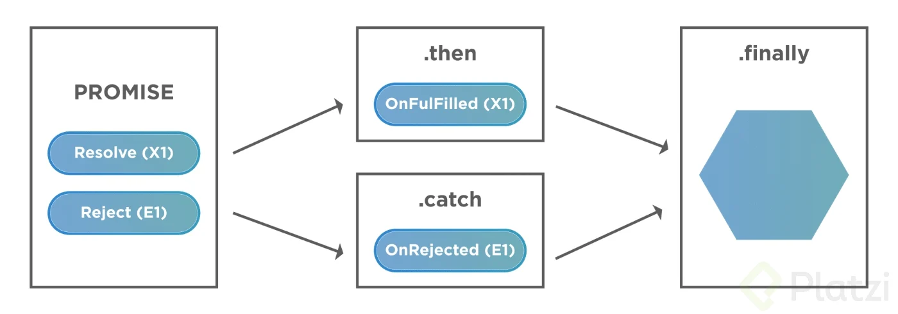

# Nuevo Curso de ECMAScript: Historia y Versiones de JavaScript

## Clase 1 : 

PResentación 


## Clase 2 : Algo de Historia 

Esto lo podemos ver aqui -> [Historia](https://github.com/LeoSan/EscuelaJavaScript2021/blob/main/02_Medio/01_Curso_Basico_JavaScript/Notas_CursoBasicoJavaScript.md)

## Clase 3 : Configurando nuestras herramientas
 - Visual Code Plugings 
 - Code Runner -> https://marketplace.visualstudio.com/items?itemName=formulahendry.code-runner
 -  Live Server -> https://marketplace.visualstudio.com/items?itemName=ritwickdey.LiveServer
 - Error lens   -> 
 - Ident - Rainbow ->
 - JavaScript ES6 code snippets->
 -  DOC NPM -> https://docs.npmjs.com/about-semantic-versioning 


## Clase 4 : ES6: let y const, y arrow functions

A partir de esta versión se hace referencia a “El gran cambio”

let & const
Nuevas palabras reservadas para guardar variables. Antes solo existía var.


## Clase 5 : ES6: strings

>Template literals (backticks) son un game-changer sin este feature no existirían cosas como JSX y consigo todo lo que usamos en el frontend moderno, sin duda una las mejores implementaciones que se hicieron en el lenguaje.


## Clase 6 : ES6: parámetros por defecto

> Parámetros por defecto que ayudan a sacarle ventaja a las Funciones.

## Ejemplo 

``` 
//tradicional//
function newUser(name,age,country){
var name = name || ‘ingresa Nombre’;
var age = age || 100;
var country = country || ‘non’;
console.log(name,age,country);
}
newUser();
newUser(‘felipe’,29, ‘Bog’);

//simplificado//

function newUser( name = ‘julian’, age = 28, country = ‘CO’){
console.log(name, age, country)
};
newUser();
newUser(‘felipe’, 29, ‘bar’);
```


## Clase 7 : ES6: asignación de desestructuración

**Asignación de Desestructuración**
la Desestructuración permite desarmar objetos y asignarle a cada elemento una variable distinta

## Ejemplo 

```
// arrays destructuring
let fruits = ['Apple', 'Banana', 'Orange'];
let [,,fruit] = fruits;

console.log(fruit); /*arroja "Orange"*/

//DESESTRUCTURACIÓN DE OBJETOS

let user = { username: 'Julian', age:28 };
let { usuario , edad } = user;
console.log (usuario, edad);
```


## Clase 8 : ES6: spread operator


**Spread operator | Operador de Propagación**
>El operador de Propagación, nos va a permitir trabajar con una lógica que podamos propagar a otros elementos sin necesidad de volverla a escribir.


- Es un operador que ayuda a crear nuevas variables utilizando elementos de otras variables, y/o elementos nuevos.

## Ejemplo 

```
let person = { name: "Alexa", age: 24 };
let country = "COL"

let data = { ...person, country };
console.log(data);
```


## Clase 9 : ES6: object literals

**Object Literals**
> Una de las mejoras agregadas en ECMA 6 al trabajar con objetos es la representación de la asignación.

- Enhanced object literals

## Ejemplo 

```
function Dog(name, age) {
    this.name = name;
    this.age = age;
    this.barking = function() { return `${this.name} says WOOF`}
}
const Kira = new Dog("Kira", 3)
Kira.barking(); 
``` 


## Clase 10 : ES6: promesas

> Es lo nuevo y bponito de ES6, ya podemos tener métodos que podamos ejecutar de manera asincrina uso de Promesa con then 

## Ejemplo 

```
const anotherFuncion = () => {
    return new Promise((resolve, reject) => {
        if (false) {
            resolve("hey!!");
        } else {
            reject ( "whooooops!");
        }
    })
}

anotherFuncion()
.then(response => console.log(response))
.catch(err => console.log(err));
```

## Clase 11 : ES6: clases

> Anteriormente JS no usaba clases emulaba usar clases, pero ahora ya es oficial ya tenemos nuestra palabra reservada Class y usar todo el poder de la programación orientada a Objeto 

## Ejemplo 
```
// declaracion de una clase
class User {};
// genera una instancia
//const newUser = new User ();

class user {
 // metodos
greeting() {
    return "hello";
}
};

const gndx = new user();
console.log(gndx.greeting());
const bebeloper = new user();
console.log(bebeloper.greeting());

// constructor

class user { 
    constructor() {
        console.log("Nuevo usuario");
    }
    greeting() {
        return "hello";
    }
}

const david = new user();

// this

class user {
    constructor(name) {
        this.name = name;
    }
    // metodos
    speak() {
        return "Hello";
    }
    greeting() {
        return `${this.speak()} ${this.name}`;
    }
}
const ana = new user("Ana");
console.log(ana.greeting());

// setters getters

class user {
    //constructor
    constructor(name, age) {
        this.name = name;
        this.age = age
    }
    // metodos
    speak() {
        return "Hello";
    }
    greeting() {
        return `${this.speak()} ${this.name}`;
    }

    get uAge() {
        return this.age;
    }
    set uAge(n) {
        this.age = n;
    }
}

const bebeloper1 = new user ("david", 15);
console.log(bebeloper1.uAge);
console.log(bebeloper1.uAge = 20);
```

## Clase 12: ES6: module

**Nota**
- Solo funciona esto si tenemos node.js instalado  del caso contrario podemos usar require()
- Recuerden que existen dos tipos de exports/imports
- Default se usa cuando solo devuelves un elemento y no quieres restringir el nombre.
- Export const restringe el nombre y ademas te permite devolver multiples funciones o constantes
- Recuerda poner las extensiones como buena practica 

**Importante Archivo de package.json añadir**
```
"type": "module"
```
## Ejemplo 

```
archivoA.js
const hello = () => {
    console.log("Hello!")
}
export default hello;


------
archivoB.js
import hello from "./module.js";

hello();

```

## Clase 13 ES6: generator

**Nota**
- Es un tipo especial de función que no retornará algun tipo de algoritmo definido. 
- usamos la palabra reservada function pero con un asterisco (*) -> function*
- usamos la palabra reservada `yield`-> `rendir` significa rendir 


## Ejemplo 
```
function* iterate(array, array2){
    for (let value of array){
        yield value;
    }
    for(let value2 of array2){
        yield value2;
    }
}

const it = iterate(['Angel','Juan','Víctor','Marcos'], ['Angela', 'Juana', 'Víctoria', 'María']);
console.log(it.next().value);
console.log(it.next().value);
console.log(it.next().value);
console.log(it.next().value);
console.log(it.next().value);
console.log(it.next().value);
console.log(it.next().value);
console.log(it.next().value);
console.log(it.next().value);
console.log(it.next().value);
```


## Clase 14  ES6: set-add

> Set es parecido al array, pero una de las diferencias con el array es que impide agregar elementos repetidos

**Enlace**
- https://www.digitalocean.com/community/tutorials/understanding-map-and-set-objects-in-javascript-es


## Ejemplo 
```
const list = new Set();

list.add("item 1");
list.add("item 2").add("item 3");

console.log(list);

//Usos 

const array = [1, 1, 2, 2, 3, 4, 4, 5]

const sinRepetidos = [ ... new Set(array)]
console.log(sinRepetidos) // [ 1, 2, 3, 4, 5 ]

```

## Clase 15: ES7 Junio 2016  -> Include

**Notas**
- Ojo no evalua tipo de valor no es lo mismo 1 != "1"
- Ante de usar include asegurate que todos los valores esten en un tipo de valor ó asegurate que lo que buscas no este en varias formas de tipo de valor.
- Includes, pero en objeto
- En objetos también existen formas para saber si existe una propiedad. 
- La palabra reservada in
- El método de objetos hasOwnProperty
- El método Object.hasOwn, que recibe el objeto y la propiedad a evaluar.

## Ejemplo de forma include
```
let familyEmoji = [..."👨‍👩‍👦‍👦"]
console.log(
	familyEmoji.includes("👨"),
	familyEmoji.includes("👩"),
	familyEmoji.includes("👦")
);
```


## Ejemplo de otra forma 
```
const letras = { a: 1, b: 2, c: 3 }

"a" in letras // true
letras.hasOwnProperty("a") // true
Object.hasOwn(letras, "a") // true
.
Se diferencian en que in evalúa todas las propiedades del objeto y del prototipo.
.
El método hasOwnProperty evalúa solamente las propiedades del objeto. Sin embargo puede que colisione con alguna otra propiedad en el prototipo, por lo que la última versión de ECMAScript lanzó Object.hasOwn y se recomienda utilizar este si el navegador en el que trabajas lo soporta: Can I use?.

const letras = { a: 1, b: 2, c: 3 }

"toString" in letras // true
letras.hasOwnProperty("toString") // false
Object.hasOwn(letras, "toString") // false
```


## Clase 16: ES8 Junio 2017 -> object entries y object values


- Object entries -> Recibe transforma un objeto en un arrays 
- Recibe un objeto 
- Devuelve un arreglo
```
const countries = { MX: "Mexico", CO: "Colombia", CL: "Chile", PE: "Peru"}
console.log(Object.entries(countries));
```


- Object values -> Nos devuelve solo los valores sin sus keys. 
- Recibe un objeto 
- nos devuelve solo los valores 
- Ojo solo aplica en un solo nivel 
```
const countries = { MX: "Mexico", CO: "Colombia", CL: "Chile", PE: "Peru"}
console.log(Object.values(countries));
```


## Clase 17: ES8: string padding y trailing commas

## String padding
> Nos permite manipular string al principio o al final de nuestro string 

```
const string = "Hola";
console.log(string.padStart(7, "_"));
-- Salida "___Hola"

console.log(string.padEnd(7, "_"));
--Salida "Hola___"
```

## String padding

> Nos permite manipular LA POSICIÓN de un array como vemos en el ejemplo usamos las comas y dejamos vacio el espacio 

```
const array = [24, 34, 25, 24, , , , 45];
console.log(array);
console.log(array.length);
```

## Clase 18 ES8: funciones asíncronas

> Elementos importante que combinamos con nuestras promise
**Nota**
- Para entender esto debemos ller un poco de la arquitectura de JS


```
const fnAsync = () => {
    return new Promise((resolve, reject) => {
        (true)
        ? setTimeout(() => resolve ("AsynC!!"), 2000)
        : reject(new Error("Error"));
    });
}

const anotherFn = async () => {
    const somethig = await fnAsync();
    console.log(somethig);
    console.log("Hello");
}

console.log("before");
anotherFn();
console.log("After");
```


## Clase 19 ES9:--Junio 2018-- expresiones regulares

```
const regex = /(\d{4})-(\d{2})-(\d{2})/;
const matchers = regex.exec("2022-01-01");
console.table(matchers);
```


**Operador de Propagación**

```
const original = { datos: [1, [2, 3], 4, 5] }
const copia = { ...original }

original === copia // false
original["datos"] === copia["datos"] // true
```

Cuidado con la copia en diferentes niveles de profundidad
El operador de propagación sirve para crear una copia en un solo nivel de profundidad, esto quiere decir que si existen objetos o arrays dentro de un objeto a copiar. Entonces los sub-elementos en cada nivel, tendrán la misma referencia en la copia y en el original.


## Clase 20: ES9: Promise.finally



```
const anotherFuncion = () => {
    return new Promise((resolve, reject) => {
        if (false) {
            resolve("hey!!");
        } else {
            reject ( "whooooops!");
        }
    })
}

anotherFuncion()
.then(response => console.log(response))
.catch(err => console.log(err))
.finally(() => console.log("finally"));
```

**Async**
```
async function* anotherGenerator() {
    yield await Promise.resolve(1);
    yield await Promise.resolve(2);
    yield await Promise.resolve(3);
}

const other = anotherGenerator();
other.next().then(response => console.log(response.value));
other.next().then(response => console.log(response.value));
other.next().then(response => console.log(response.value));
console.log("hello");

async function arrayOfNames(array) {
    for await (let value of array) {
        console.log(value);
    }
}

const names =arrayOfNames(["Alexa", "Oscar", "David"]);
console.log("After");
```

## Clase 21: ES10: Enero 2019  flat-map y trimStart-trimEnd

> flat-map: Nos devuelve la sub matriz de una matriz 

```
// flat => aplana las matrices por profundidad
const array = [1, 2, 3, 4, [1, 2, 3, 4, [1, 2, 3, 4]]];
console.log(array.flat(3));
imprime 
[
    1,1,2,3,4
    1,3,5,6
    1,2,4
]
// flatMap() => Mapea y aplana, devuelve un array con los valores aplanados y da la opción de ejecutar un callback por cada uno de los elementos
const array2 = [1, 2, 3, 4, 5];
console.log(array2.flatMap((v) => [v, v * 2]));
```

**trimStart-trimEnd**

```
const hello = '        Hello!        ';
// Recorta los espacios de un string al inicio
console.log(hello.trimStart());
// Recorta los espacios de un string al final
console.log(hello.trimEnd());
```

## Clase 22: ES10: try catch y fromEntries

```
try {
    hello ();
} catch (error) {
    console.log(error);
}

try {
    onotherFn();
} catch {
    console.log("esto es un error")
}


// Ahora se puede cambiar de un array a un objeto
const entries = [
  ["name", "Sime"],
  ["age", 30],
];
console.log("Array original", entries);
// Array origintal [ [ 'name', 'Sime' ], [ 'age', 30 ] ]
console.log("Array transformado a object", Object.fromEntries(entries));
// Array transformado a object { name: 'Sime', age: 30 }
```

## Clase 23: ES11: Junio 2020 - optional chaining ?

> Si nosotros podemos tener un objeto que dentro puede tener la representación de llave valor y ese valor puede ser también otro objeto y cuando queremos acceder a ese elemento podemos tener errores, que pueden romper toda nuestra aplicación particularmente cuando trabajando con framework o plugung esta característica te va a ayudar bastante a poder validar que la información esté presente y que no rompa tu aplicativo y que el día de mañana la interfaz pueda verse totalmente en blanco o que no presente lo que debe de presentar por lo tanto con esta característica vamos a poder validar y no romper el flujo de nuestra aplicación

**No abuses del encadenamiento opcional**
- El encadenamiento opcional se debe utilizar únicamente cuando probablemente un valor no exista.
- Por ejemplo, en un objeto usuario que siempre existe, pero la propiedad redes es opcional, entonces se debería escribir usuario.redes?.facebook y no usuario?.redes?.facebook.
- Si abusas del encadenamiento opcional y existe un error en un objeto, el programa podría “ocultarlo” por un undefined, provocando que el debugging sea más complicado.

**Ejemplo**

```
const users = {
    gndx: {
        country: "MX"
    },
    ana: {
        country: "CO"
    }
}
console.log(users?.bebeloper?.country);
```


## Clase 24: ES11: BigInt y Nullish ??

- Límites numéricos en JavaScript
📏 JavaScript tiene límites numéricos, un máximo Number.MAX_SAFE_INTEGER y un mínimo Number.MIN_SAFE_INTEGER. Fuera de estos límites, los cálculos matemáticos pueden fallar y mostrar resultados erróneos. Con BigInt esto se resuelve.
.


**Ejemplo**

```
const aBigNumber = 8907245920742093847n;
const anotherBigNumber = BigInt(8907245920742093847);
console.log(aBigNumber);
console.log(anotherBigNumber);
```
- Diferencia entre el operador OR y el Nullish coalescing
🔨 El operador OR (||) evalúa un valor falsey. Un valor falsy es aquel que es falso en un contexto booleano, estos son: 0, "" (string vacío), false, NaN, undefined o null.

Puede que recibas una variable con un valor falsy que necesites asignarle a otra variable, que no sea null o undefined. Si evalúas con el operador OR, este lo cambiará, provocando un resultado erróneo.
**Ejemplo**

```
const id = 0

const orId = id || "Sin id"
const nullishId = id ?? "Sin id"

console.log( orId ) //  'Sin id'
console.log( nullishId )  // 0
```

## Clase 25: ES11: Promise.allSettled

```
const promise1 = new Promise((resolve, reject) => reject("reject"));
const promise2 = new Promise((resolve, reject) => resolve("resolve"));
const promise3 = new Promise((resolve, reject) => resolve("resolve2"));

Promise.allSettled([promise1, promise2, promise3])
.then(response => console.log(response)); 
``` 

## Clase 26: ES11: globalThis y matchAll 

```
console.log(window); // navegador
console.log(global);  // node
console.log(self);// webworker
console.log(globalThis);
```

## Clase 27 ESA11 : dynamic Import


Dynamic import porque viene a cambiar mucho la forma en la que podemos organizar nuestros proyectos aprovechando el concepto de módulos que en el pasado aprendimos acerca de cómo separar estos módulos o pequeñas piezas de código que vamos a reutilizar en nuestro proyecto y recordemos que funcionaban y eran maravilloso para separar esa lógica pero ahora con el concepto de dynamic import vamos a utilizar ese import pero cuando lo necesitemos según la lógica esto nos da una garantía mucho mejor para organizar nuestro proyectos nosotros podemos hacer que una página web cargue con todos los elementos de javascript y eso hará que pueda estar un poco lenta y recordemos que si a los primeros 3 segundos una página web no carga o no tiene una interacción con el usuario podemos perder a estos usuarios por lo tanto podemos tomar la decisión de cada cuánto podemos llamar ciertas piezas de código podemos hacer el render de los primeros elementos vitales de nuestra aplicación y gradualmente conforme el usuario se va moviendo o va interactuando ir agregando esos módulos esos elementos clave de nuestra aplicación y gracias a esto es por medio de dinámica importa así que entendamos cómo funciona hagamos un ejemplo y recuerda que al inicio te ha recomendado tener la extensión live server en este momento. 


**Nota**
- En node JS, podemos usar require() lado servidor
- En Js, Podemos usar import() lado cliente 

**Ejemplo**
```

//Index.html
<!DOCTYPE html>
<html lang="en">
<head>
    <meta charset="UTF-8">
    <meta http-equiv="X-UA-Compatible" content="IE=edge">
    <meta name="viewport" content="width=device-width, initial-scale=1.0">
    <title>Dynamic Import</title>
</head>
<body>
    <button id="btn">Click</button>
    <script type="module" src="06-dynamic-import.js"></script>
</body>
</html>


//Module.js
export function hello() {
    console.log("Hola Mundo")
}

//Dynamic-Import.js
const button = document.getElementById("btn");

button.addEventListener("click", async function () {
    const module = await import("./module.js");
    console.log(module);
    module.hello();
})

```

## Clase 28 ES12: numeric-separators y replaceAll

**Notas**
- numeric-separetors:
> Nos permite tener una lectura mas amigable de cifras numéricas.
- Muchas de las aplicaciones que tengan que ver números, manejos de datos e información financiera requieren este concepto.

- Nos permite separar numero de grandes cifras con _, es una ayuda que no afecta;
```
EJ: const value = 100_000_000_000;
Console.log(value); //100000000000

```

- replaceAll: Nos permite remplacar texto o palabras.
```
Ej:
const string = “JavaScript es un maravilloso lenguaje de programacion”;
const replacedString = string.replace(“JavaScript”, “TypeScript”); // El primer valor es lo que busca en el texto y el segundo valor que pasamos es por lo que se reemplaza
console.log(replacedString); //= “TypeScript es un maravilloso lenguaje de programacion”;
```

## Clase 29 ES12: promise-any y métodos privados

**Promise.any**
- Captura la primera promesa que fue satisfactoria 
- Valida la que sucedio primero  
- Solo devuelve una sola promesa resuelta 
- Si es reject la ignora y devuelve el primer resolve.
```
const promise1 = new Promise((resolve, reject) => reject("reject"));
const promise2 = new Promise((resolve, reject) => resolve("resolve"));
const promise3 = new Promise((resolve, reject) => resolve("resolve2"));

Promise.any([promise1, promise2, promise3])
.then(response => console.log(response));

```
**setters getters**
- Se imtero en ES12 
- 


```
class user {
    //constructor
    constructor(name, age) {
        this.name = name;
        this.age = age
    }
    // metodos
    #speak() {
        return "Hello";
    }
    greeting() {
        return `${this.speak()} ${this.name}`;
    }

    get #uAge() {
        return this.age;
    }
    set #uAge(n) {
        this.age = n;
    }
}

const bebeloper1 = new user ("david", 15);
console.log(bebeloper1.uAge);
console.log(bebeloper1.uAge = 20);
```


## Clase 29 ES13: - Junio 2021 -  at 

> El método at() recibe un valor numérico entero y devuelve el elemento en esa posición, permitiendo valores positivos y negativos. 
> Los valores negativos contarán desde el último elemento del array.

- Esto no sugiere que haya algo mal con usar la notación de corchetes. 
- Por ejemplo, array[0] devolvería el primer elemento. 
- Sin embargo, en lugar de usar array.length para los últimos elementos


```
const array = ["one", "two", "three", "four", "five", "six"];
console.log(array[array.length - 1]);
console.log(array.at(-1));
```


## Clase 29 ES13: top level away en el consumo de una API

```

//Products
import fetch from "node-fetch";

const response = await fetch("https://api.escuelajs.co/api/v1/products");
const products = await response.json();

export { products };


//Top-level-await
import { products } from "./products.js";

console.log(products);
console.log("Hey!!");

```


## Clase 30 - Resumen 
- https://www.ecma-international.org/publications-and-standards/standards/ecma-262/
- https://262.ecma-international.org/13.0/