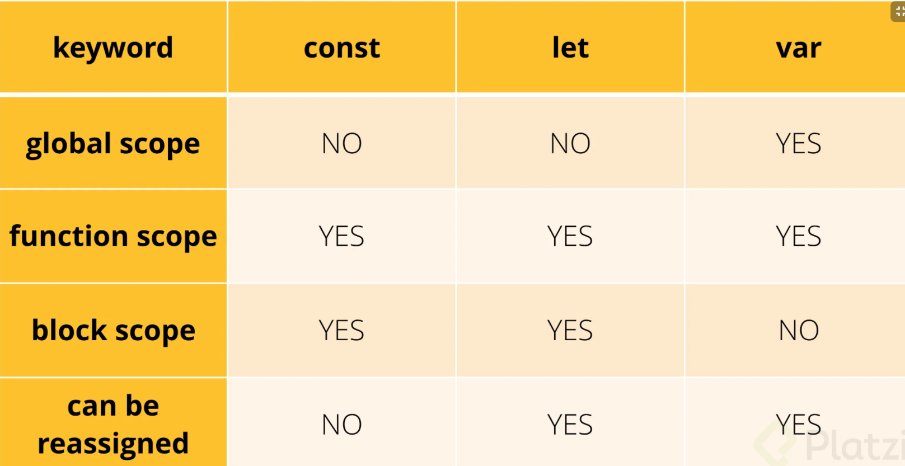
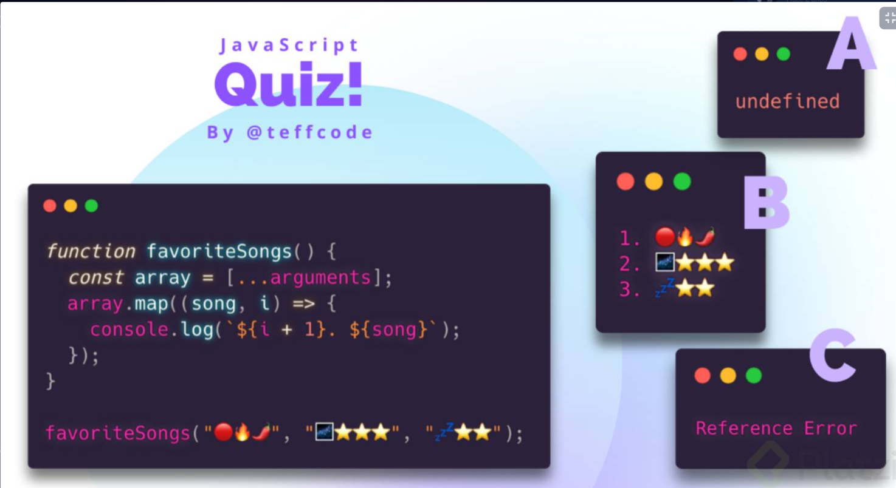
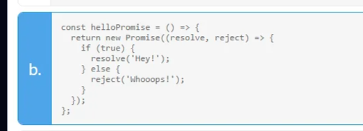
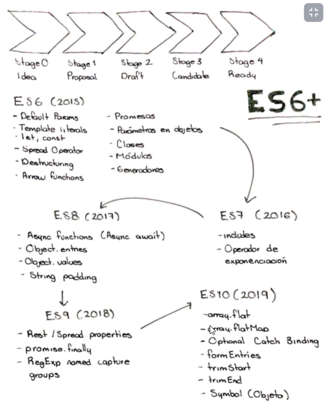

# 03_Curso_ECMAScript_6
Este nivel es sobre nuevas funciones e implementacones de ECMAScript 5-6-7 

## Clase 1: Bienvenida 
- Profesor Oscar Barajas Tavares  @gdnx 

> ECMAScript es la especificación del lenguaje JavaScript propuesto por ECMA Internacional, que es la institución encargada de los estándares, y JavaScript, es el lenguaje de programación que utiliza las especificaciones propuestas, que van siendo añadidas cada año a partir del 2015, cuando fue lanzado ES6.

## Clase 2: Default Params y Concatenación

- [EMAC](https://www.ecma-international.org/publications-and-standards/standards/ecma-262/)

**Parametros por defecto:**
- Poder establecer ciertos valores que le pasamos a una funcion de forma por defecto. Esto hace que siempre que se llame la funcion ya tenga estos parametros consigo, si queremos cambiarlos solamente debemos modificarlos en el momento en que la llamamos cambiando los parametros.

```
// Antes de ES6
function newFunction (name, age, country) {
	var name = name || 'Juan';
	var age = age || 20;
	var country = country || 'Col';
	console.log(name, age, country);
}

//ES6
function newFunction2 (name = 'Juan', age = 20, country = 'Col') {
	console.log(name, age, country);
}

newFunction2(); // 'Juan', 20, 'Col
newFunction2('Maria', 23, 'Mx');
```

**Themeplates Literals**
- Nos facilita la vida si queremos concatenar varios elementos en un mensaje

```
// Antes de ES6
var hello = 'hello';
var world = 'world';
var phrase = hello + ' ' + world;

// ES6
var phrase2 = `${hello} ${world}`;
```


## Clase 3:LET y CONST, Multilínea, Spread Operator y Desestructuración

**Diferencias entre var, let y const**

- var: es una variable con alcance global
- let: solo puede ser usada en el bloque donde se declara
- const: no puede modificarse su valor

**Desestructuración**
> Nos Permite obtener los valores de un objeto o de un arrays de una forma sencilla sin necesidad de llagar a sus indices 
```
let person ={
    'name':'Alejandro',
    'nick':'Etrx',
    'num':'12314125'
};

let {name,nick, num} = person;

//Si queremos llamar  lo que compone este objeto utilizamos en ES6:
console.log(name,nick);

```

**Operador de prolongación: "..." **
>  Permite expandir varios elementos. Tenemos varios elementos en arreglos que queremos unir en un solo elemento para presentarlos.

```
let conjunto1= ['a','b','c'];
let conjunto2= ['x','y','z'];

let conjunto_union=['l','m','n',...conjunto1,...conjunto2]
console.log(conjunto_union);
```
**LET**
> Asiganciones mediante let se pueden inicilizar variables  cuyo scope está solo en el bloque de código en el que está llamada, en otras palabras, solo puede existir las variables let dentro de las llaves en que se llaman. Var se seguirá usando para variables globales y locales.





## Clase 4: Arrow Functions, Promesas y Parámetros en objetos

Una arrow function es una función anónima, es decir, reacciona a su código anterior realizando el siguiente.
Análogamente es similar al símbolo matemático “entonces”, cumpliendo una tarea similar aquí en JS.

**Caracteristas **
- anonymous function !==(Es diferente) lambda expression
- anonymous function: Es una funcion que no tiene nombre
- lambda expression: son funciones utilizadas como data, se envian como parametros a otra funcion o se retornan como producto de una funcion.
- lo mas importante, las lambda expression no necesariamente son funciones anonimas y viceversa
- No están contenidas en una variable
- Se declara su bloque de código al momento de utilizarla.

>Nota 

Quizá se mencione en otros cursos de JavaScript pero para los que aún no lo sepan, 
algo que caracteriza a las arrow functions es que NO tienen un this vinculado, 
es decir, que el this pasa a ser el del contexto que contiene a la arrow function. 

Lo mismo para el objeto arguments, que no es tan común como el this, sería un objeto 
con los argumentos del contexto superior. 

**Elementos Promesas **
- newPromise()
- resolve() - comportamiento al cumplir la promesa
- reject() - comportamiento al fallar la promesa
- .then (⇒) - obtener el valor del resolve
- .error(⇒) - obtener el valor del reject()

**Enlace** 
- https://www.tutorialspoint.com/difference-between-regular-functions-and-arrow-functions-in-javascript



```
/**
 * Parameters in Objects
 */
let name = 'Oscar';
let age = 32;

const obj = {
  name: name,
  age: age
};
console.log('Before ES6 -> ', obj);

// es6
const objES6 = { name, age };
console.log(`After ES6 -> `, objES6);

/**
 * Arrow Functions
 */
const names = [
  { name, age },
  { name: 'Yesica', age: 27 }
];

let listOfNames = names.map(function(item) {
  console.log('Before ES6 -> ', item.name);
});

// es6
let listOfNamesES6 = names.map(item => console.log(`After ES6 -> ${item.name}`));

/**
 * Promises
 */
const helloPromise = (foo) => {
  return new Promise((resolve, reject) => {
    if (foo) {
      resolve('Hey!');
    } else {
      reject('Upss!');
    }
  });
};

const foo = false;
helloPromise(foo)
  .then(response => console.log('response -> ', response))
  .then(() => console.log('message -> Hello World!'))
  .catch(error => console.log('error -> ', error));
```

## Clases 5:  Módulos y Generadores


```
function* fibonacci(){
  var fn1 = 1;
  var fn2 = 1;
  while (true){  
    var actual = fn2;
    fn2 = fn1;
    fn1 = fn1 + actual;
    var reset = yield actual;
    if (reset){
        fn1 = 1;
        fn2 = 1;
    }
  }
}

var secuencia = fibonacci();

console.log(secuencia.next().value);     // 1
console.log(secuencia.next().value);     // 1
console.log(secuencia.next().value);     // 2
console.log(secuencia.next().value);     // 3
console.log(secuencia.next().value);     // 5
console.log(secuencia.next().value);     // 8
console.log(secuencia.next().value);     // 13
console.log(secuencia.next(true).value); // 1
console.log(secuencia.next().value);     // 1
console.log(secuencia.next().value);     // 2
console.log(secuencia.next().value);     // 3

```
## clases 

```
/**
 * Classes
 */
class Calculator {
  constructor() {
    this.valueA = 0;
    this.valueB = 0;
  }

  sum(valueA, valueB) {
    this.valueA = valueA;
    this.valueB = valueB;
    return this.valueA + this.valueB;
  }
}

const calc = new Calculator();
console.log('Calc Result -> ', calc.sum(2, 3));

/**
 * Modules
 */
import { hello } from './class4-module.js';
console.log('Hello Module -> ', hello());

/**
 * Generators
 */
function* helloWorld() {
  if (true) {
    yield 'Hello, ';
  }

  if (true) {
    yield 'World!';
  }
}
const generatorHello = helloWorld();
console.log('generatorHello first call -> ', generatorHello.next().value);
console.log('generatorHello second call -> ', generatorHello.next().value);
console.log('generatorHello third call -> ', generatorHello.next().value);
```


## Clase 6: ¿Qué se implementó en ES7?

`
El problema con el nombre “ECMAScript 7” o "ES7"
ECMAScriptLa actual versión de ECMAScript es la número 7 (aunque sea la 6ª que sale realmente).

 El problema es que cuando en la Web buscas información sobre ES7 o ECMAScript 7 realmente de lo que están hablando no es de esta versión.
`
**Notas de Mejoras **
- Se suponía que para esta última versión que acaba de salir se iban a incluir muchas nuevas funcionalidades en el lenguaje.
-  Sin embargo no dio tiempo material y se ha lanzado una actualización muy descafeinada, con solo un par de cositas. 
-  La verdadera versión “grande” con enormes cambios fue la del año pasado, ES6 o ES2015. La más reciente, ES2016, es una actualización muy floja.

**Nota Letras pequeñas**
- Así que cuando en Internet leas algo sobre ES7 en realidad están hablando de algo que no existe todavía y que de momento no se sabe cuándo va a estar disponible. 
- Es posible que muchas de las nuevas características estén ya en ECMAScript 2017 (que sería realmente ES8), pero puede que tarden mucho más y sea finalmente en 2019 o 2020 cuando veamos algunas de ellas. 
- Así que mucho cuidado con lo que te digan sobre ES7: probablemente no estén hablando de lo que tú crees.

**Mejoras**
- se incorporo `include()` para validar si existe un valor en un string o en array 
- Elevar a la potencia con doble `**` let resultado = base ** exponente;  

**ECMAScript en los navegadores**
- Además cada navegador tiene su propia implementación de ECMAScript, es decir, su propio motor de JavaScript. 
- Como todos se han creado siguiendo lo que indica ECMA, en principio son 100% compatibles, pero podemos encontrar pequeñas diferencias entre implementaciones, en especial en aquellas partes del estándar que no dejan 100% claro cómo se debe actuar. 
- Del mismo modo, diferentes implementaciones del motor del lenguaje pueden estar más o menos optimizadas.


 **Navegador Motor/Implementación Versión de ECMAScript**
- Google Chrome V8 6
- Firefox SpiderMonkey 5.1 con muchas cosas de 6 y 7
- Edge Chakra 5.1 con muchas cosas de 6 y 7
- Safari JavaScriptCore - Webkit 5.1 con muchas cosas de 6 y 7
- Internet Explorer Jscript 9.0 5.1

Como vemos, cada motor implementa el estándar de manera diferente y en el caso concreto de ECMAScript 6 y 7, no todos implementan todo ni de la misma manera. Dado que todos excepto IE son navegadores “Evergreen”, es decir, que se actualizan solos de manera automática, a menudo salen nuevas pequeñas actualizaciones que van añadiendo cada vez más soporte para las últimas versiones de ECMAScript. De hecho se puede afirmar que todos los navegadores modernos soportan ECMAScript 6 casi por completo, y en breve también ES7.

## Clase 7: ¿Qué se implementó en ES8?

En esta versión:
- Object entries, 
- Object Values, 
- Padding 
- Trailing-Comas.
- Async
- await 

**Mejoras**
 
- Podemos usar `Object.entries` devuelve los valores de una matriz.

```
 const data ={
    front:'Alej',
    back: 'Rel'
};

//Tranformar este objeto en una matriz. 
const entries = Object.entries(data);
console.log(entries);
```

 - Podemos usar `Object.values` Me devuelve los valores de un objeto a un arreglo. 

```
//Objetc Values: 

const data= {
    front:'Alej',
    back: 'Rel'
}

const values = Object.values(data);
console.log(values);
```

 - Podemos usar `padStart  padEnd` nos permite añadir cadenas vacías a string, pudiendo modificar la cadena string como tal

```
const string ='hello';
console.log(string.padStart(7,'hi')) // se añade al inicio la palabra 'hi'
console.log(string.padEnd(12,'hi')) // Se añade al final la palabra 'hi'
``` 

- Podemos usar `Trailing ` nos permite añadir cadenas vacías a string, pudiendo modificar la cadena string como tal

```
//Trailing comas, nos permite asignar elementos al objeto mediante comas.
const data= {
    front:'Alej', // Puede existir
    back: 'Rel'
}

```

## Clase 8: Async Await

- Las promesas y async await, lógicamente, no son iguales
- Las promesas son valores que no conocemos, es la promesa de que va haber un valor cuando una acción asíncrona suceda y se resuelva.
- Async se asegura de retornar una promesa y de poder usar await.
- Await hace una pausa hasta que la promesa se resuelva y su valor lo guarda en una variable
**Nota Funcional**
`
La expresión await provoca que la ejecución de una función async sea pausada hasta que una Promise sea terminada o rechazada, y regresa a la ejecución de la función async después del término. Al regreso de la ejecución, el valor de la expresión await es la regresada por una promesa terminada.

Si la Promise es rechazada, el valor de la expresión await tendrá el valor de rechazo.

Si el valor de la expresión seguida del operador await no es una promesa, será convertido a una resolved Promise.
`


## Ejemplo 
```
const helloWorld =() =>{
    return new Promise((resolve,reject)=>{
        (true)
        ? setTimeout(()=>resolve('helloWorld'),3000)
        : reject(new Error ('Test Error'))
    })
}

const helloAsync =async() =>{
    const hello = await helloWorld();
    console.log(hello);

}
helloAsync();

//Nos permitirá usar trycatch y trabajar los errores correctamente.

const another =async() =>{
    try{
        const hello = await helloWorld();
        console.log(hello);

    } catch (error){
        console.log(error);
        
    }
}

another();
```

## Clase 9:  ¿Qué se implementó en ES9?

**Mejoras**
- Sintásis Spred Operator (...) 
- Sintásis Operador de prolongación (...)
- Promise.finally()
- Mejoras en RegExp

```
/**
 * Spread Operator
 */
const obj = {
  name: 'Oscar',
  age: 32,
  country: 'MX'
};

let { name, ...addInfo } = obj;
console.log(`name: ${name}`);
console.log(`additional information: `, addInfo);
```

```
/**
 * Porpagation Properties
 */
const person = {
  name: 'Oscar',
  age: 32
};

const personInformation = {
  ...person,
  country: 'MX'
};
console.log(`personInformation: `, personInformation);
```

```
/**
 * Promise Finally
 */
const helloWorld = () => {
  return new Promise((resolve, reject) => {
    true
      ? setTimeout(() => {
          resolve('Hello World!');
        }, 3000)
      : reject(new Error('Test Error'));
  });
};

helloWorld()
  .then(result => console.log('result -> ', result))
  .catch(err => console.log('err -> ', err))
  .finally(() => console.log('finalizó'));
```

```
/**
 * Regex
 */
const regexData = /([0-9]{4})-([0-9]{2})-([0-9]{2})/;
const match = regexData.exec('2018-04-28');
const year = match[1];
const month = match[2];
const day = match[3];
console.log('Date -> ', year, month, day);
```

## Clase 10:  ¿Qué se implementó en ES10?  Junio 2019 

**Mejoras**
- Array.prototype.flat(nivel_de_profundidad): un nuevo método que nos permite aplanar arreglos.

```
//devolver una matriz con una submatriz aplanada, 
//recibe como argunmento la profundidad
let array = [1,2,3, [1,2,3, [1,2,3]]];
console.log(array.flat(2))
console.log(array.flat(1))
console.log(array.flat())

```
- Array.prototype.flatMap() lo mismo que flat con el beneficio de que primero manipular la data para luego poder aplanar.

```
//-------------flatMap---------------------------/
//mapear cada elemento, luego pasarle una funcion y aplanar
let array = [1,2,3,4,5];
console.log(array.flatMap(value => [value, value * 2])); 
``` 
- String.prototype.trimStart() | String.prototype.trimEnd() permite quitar los espacios al inicio o al final dependiendo de la funciona.

```
let hello = '                      hello world';
console.log(hello);
console.log(hello.trimStart()); // inicio

let hello = 'hello world                  ';
console.log(hello);
console.log(hello.trimEnd()); // final
``` 

- try/catch: ahora puedes utilizarlo sin necesidad de especificaro como catch(error) sino directamente usarlo en el scope del catch.

```
try {
    
} catch /*(error) ya no es necesario colocarlo*/ {
    error
}

```


- Object.fromEntries() lo inverso a Object.entries(), es decir podemos convertir un objeto en una matriz clave/valor con Object.entries(), y hace lo inverso es decir de una matriz clave/valor a un objeto con Object.fromEntries().

```
// array to object
let entries = [["name", "oscar"], ["age", 32]];
console.log(Object.fromEntries(entries))
```

- Symbol.prototype.description: permite regresar el descripcion opcional del Symbol
```
let mySymbol = 'My Symbol';
let symbol = Symbol(mySymbol);
console.log(symbol.description);
```

## Clase 11:  ECMAScript 2020 -> ¿Qué se implementó en ES11? 

**Mejoras**
- Se implemento el dinamyx import -> para evitar la sobresaturación de importar archivos js al index. 
 
```
<!DOCTYPE html>
<html lang="en">
<head>
    <meta charset="UTF-8">
    <meta http-equiv="X-UA-Compatible" content="IE=edge">
    <meta name="viewport" content="width=device-width, initial-scale=1.0">
    <title>Document</title>
</head>
<body>
    <button id="btn">File</button>
    <script type="module" src="index.js"></script>
</body>
</html>


/// index.js 
const button = document.getElementById("btn");

button.addEventListener("click", async function(){
    const module = await import("./file.js");
    module.hello();
});

//file.js

export function hello() {
    console.log("Hola, Mundo!");
}
```

##  Clase 12: ECMAScript 2020 - características importantes ¿Qué se implementó en ES11? 

**Mejoras**
- Variables Globales mejoradas 
- llamado paralelo de promesas `Promise.allSettled` 
- Operador Nullos 
- Opcional Chaning -> Permite controlar el flujo de tu proceso sin romper el codigo esto sucede cuando preguntas por un atributo de un objeto y este no exite rompe la aplicación, podemos validar que algo aun no esta disponible y luego despues tener una opción
- -Otro método de Es11 es matchAll() el cual devuelve un iterador con todos los resultados que coinciden con una expresión regular

`
/*
Variables Globales mejoradas
*/
console.log(window);
console.log(self);
console.log(frames);
console.log(this); /* -> Evoliciona a  */ console.log(globalThis);

` 


` 
/* llamado paralelo de promesas Promise.allSettled */

const aBigNumber = 9007199254740991n;
const anotherBigNumber = BigInt(9007199254740991);

console.log(aBigNumber);
console.log(anotherBigNumber);


const promise1 = new Promise((resolve,reject) => reject("reject"));
const promise2 = new Promise((resolve,reject) => resolve("resolve"));
const promise3 = new Promise((resolve,reject) => resolve("resolve 1"));

Promise.allSettled([promise1, promise2, promise3])
    .then(response => console.log(response))
`


`
/* Operadores logivos */
const fooo = null ?? 'default string';
console.log(fooo);
`


`
/* - Opcional Chaning  */

const user = {};
console.log(user?.profile?.email);

if(user?.profile?.email) {
    console.log('email')
} else {
    console.log('fail');
}


`

`
const texto = "abcdefg";
const expRegular = /[a-c]/g;
const iterador = texto.matchAll(expRegular);
for (const match of iterador){
	console.log(match);
}

`


##  Clase 13: ECMAScript 2021 - ¿Qué se implementó en ES12? 

**Mejoras**

- 🧯 Replace `replaceAll ` -> Podemos remplazar masivamente 
- 🔒 Metodos privados -> Podemos hacer un metodo privado en js usando el simbolo de gato `#` solo podra ser accedido dentro de la clase 
- 👽 Promise Any `any` -> Es objeto global de promise cuyo argumento va ser la forma de un array de promesas, la cual vamos capturandn y mostrando la respuesta 
- 🦴 WeakRef(element) -> Es un objeto que permite mantener una referencia a otro objeto sin evitar que este objeto sea pasado ó recogido por el garvash colector. 
- 🧪 Nuevos operadores lógicos

```
// 🧯 Replace

const string = "JavaScript es maravilloso, con JavaScript puedo crear el futuro de la web.";
const replacedString = string.replace("JavaScript", "Python");
console.log(replacedString);

// 🔒 Metodos privados
class Message {
    #show(val){ // Con el # convertimos al método en privado
        console.log(val);
    };
};

const message = new Message();
message.show('Hola!');


//  👽 Promise Any

//El primero que resuelva eso retornalo

const promise1 = new Promise((resolve, reject) => reject("1"));
const promise2 = new Promise((resolve, reject) => resolve("2"));
const promise3 = new Promise((resolve, reject) => resolve("3"));

Promise.any([promise1, promise2, promise3])
    .then(response => console.log(response));

//  🦴 WeakRef(element);

class AnyClass {
    constructor(element){
        this.ref = new WeakRef(elemento);  // una referencia debil de esta forma podemos trabajar de mucho mejor 
    }
    {...}
}

// 🧪 Nuevos operadores lógicos

let isTrue = true;
let isFalse = false;
console.log(isTrue &&= isFalse); //Asignación de and logico 

let isTrue = true;
let isFalse = false;
console.log(isTrue ||= isFalse); //Asignación de or logico 

let isTrue = undefined;
let isFalse = false;
console.log(isTrue ??= isFalse);//Asignación de anulación lógica
```

**enlace**
- https://developer.mozilla.org/es/docs/Web/JavaScript/Guide/Expressions_and_Operators


##  Clase 14: TC39 y Cierre del curso





Para aquellos que esten trabajando desde Windows y no les funcione las nuevas funcionalidades de ES al usar run code, podria solucionarse modificando el package.json:

{
{
  "name": "ecmascript",
  "version": "1.0.0",
  "description": "entendiendo ecmascript",
  "type":"module",
  "main": "index.js",
  "scripts": {
    "test": "echo \"Error: no test specified\" && exit 1"
  },
  "author": "Max",
  "license": "MIT"
}