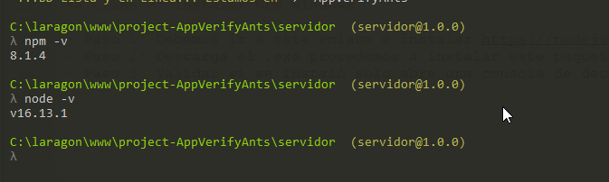
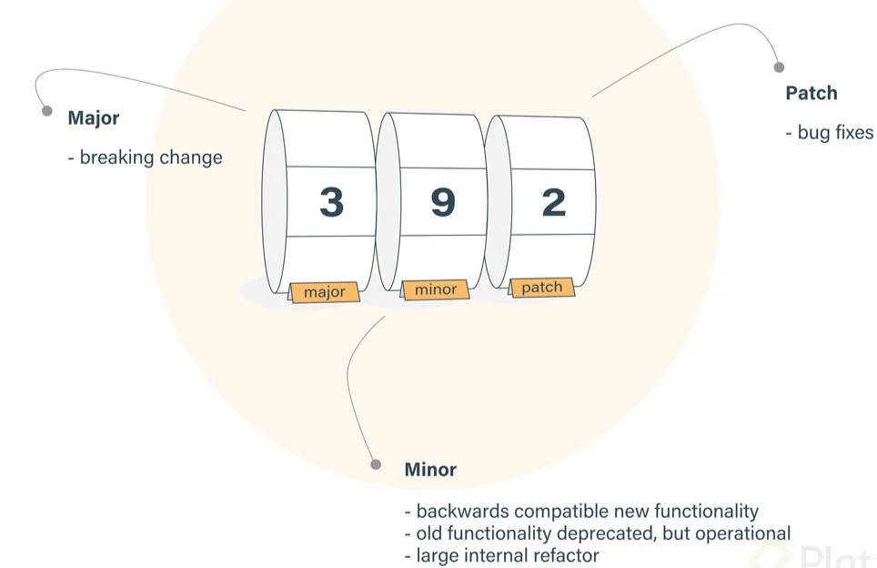

# 05_ Curso de Gestión de Dependencias y Paquetes con NPM
Este nivel es sobre nuevas funciones e implementacones de ECMAScript 5-6-7 

## Clase 1: Bienvenida 
- Profesor Oscar Barajas Tavares  @gdnx 
- enlace -> https://www.npmjs.com/

> **¿Qué es NPM (node package manager)?** 

Es un gestor de paquetes, el más popular que tiene JavaScript, donde encontrarás una gran cantidad de recursos para poder implementar en tus proyectos. También vas a poder crear tus propios paquetes y compartirlos con toda la comunidad.

## Clase 2: Instalar NPM Windows

- Paso 1: Debemos ir a este enlace e instalar https://nodejs.org/es/ 
- Paso 2: Descarga el .exe procedemos a instalar este paquete es un wizard solo next-> next 
- Paso 3: Validar si se instaló solo abre una consola de deconfianza y debes poder teclear el siguiente comando `npm -v`



## Clase 3: Instalacion MAC 

 safo 
 
## Clase 4: Iniciar un proyecto 


- Paso 1: Abrimos nuestra terminal y nos posicionamos donde guardamos nuestros archivos.
- Paso 2: Podemos crear una carpeta para nuestro proyecto con el comando
- Paso 3: `git init` Para tener el control de cambios y versiones en nuestro proyecto
- Paso 4: `npm init`  con este comando vamos a crear nuestro archivo de configuración del proyecto, el package.json
- Paso 4.1: el mismo comando te va sugiriendo ciertos valores para poder arrancar el proyecto 
		- package name: el nombre de nuestro proyecto, generalmente es el nombre de la carpeta
		- version: version con la que iniciaremos el proyecto, generalmente aparece 1.0.0
		- description: descripcion breve del proyecto
		- entry point: punto de acceso a nuestro proyecto punto inicial puede ser app.js, main.js src/index.js 
		- test command: comando para gestionar los test
		- git repository: repositorio de github u otro servicio
		- keywords: palabras claves del proyecto
		- author**: nombre del autor y < correo > **license`: licencia que tendrá el proyecto

**Lisra de Comando NPM**
1. npm -v : muestra la version de npm (tambien se puede usar npm --version)
2. npm install -g npm@latest :  para ver si tenemos una actualizacion e instalarla
3. npm init : inicia el proyecto y pide ciertas configuraciones para crear un package.json (puede ser cualquier nombre)
4. npm init -y : crea un  package.json de manera rápida (con valores por defectos)
5. npm set init.author.email "email@email.com" : establece un correo por defecto

6. npm set init.author.name "Leo " : establece un nombre por defecto
7. npm set init.lincense "MIT" : Establece una licencia por defecto
8. npm i moment : es el mismo que el comando "npm i momento --save" en donde se instala la dependencia en el entorno local del proyecto (produccion)
9. npm i moment -D : Este comando se utiliza para instalar una dependencia en un entorno de desarrollo
10. npm install moment --save-dev : es el mismo comando que el 9 pero mas largo

11. npm install -g nodemon : se instala el paquete de forma global (window permisos de admin, linux con sudo)
12. npm list -g --depth 0 : permite ver la lista de los paquetes que se tienen instalados de forma global
13. npm list : muestra los paquetes que se tienen instalados de manera local (en el proyecto)
14. npm i eslint -O : instalar un paquete de forma opcional (hay paquetes que requieren paquetes de dentro de si mismos)

15. npm i  react --dry-run : este comando simula que instala x dependencia solo para mostrar el output que retornaria la instalacion real de esta
16. npm i webpack -f : este comando instala de forma forzada x dependencia en su ultima version directamente desde los servidores de npm (se debe tener en cuenta que esto puede alterar el package.json por lo que en algunos casos es necesario modificarlo manualmente)
17. npm install : este comando revisara la dependencias del package.json y las volvera a instalar
18. npm i json-server@0.15.0 : este comando instala específicamente una determinada version de x paquete
19. npm outdate :  muestra que paquetes disponen nuevas versiones (tambien se le puede pasar el flag -g para verlos de manera global "npm -g outdate"

20. npm outdate --dd : muestra un output mas detallado de las dependencias que tienen actualizaciones
21. npm update : este comando actualiza aquellos paquetes que disponen de nuevas versiones (npm update -g para actualizar de forma global)
22. npm install json-server@latest : para actualizar un paquete de forma individual
23. npm uninstall -g nodemon : Este comando se utiliza para desinstalar un paquete de forma global
24. npm uninstall json-server : esto elimina lo que se instalo dentro de node modules y dentro del package.json
25. npm uninstall webpack --no-save (desinstala lo que esta dentro de node modules, pero no elimina lo que esta dentro del package.json)

## Clase 5: Instalación de dependencias


🟢 npm install moment --save : Paquete que se encarga de manejar las fechas en JavaScript
🟢 --save : El documento que vamos a instalar dentro del proyecto es necesario para vivir en produccion.
🟢 -dev : El documento que vamos a instalar solo es necesario en nuestro entorno local o en el entorno de desarrollo
🟢 npm install date-fns : Al igual que moment se engarga de manejar fechas y datos
🟢 npm i : abreviacion de nmp install
🟢 npm install -g nodemon: Permite estar atento ante cambios de tu js y actualizar 
🟢 npm list -g --depth 0: lista de paquetes instalados de forma global 
🟢 -D : abreviacion para --save-dev
🟢 –save : Este documento que vas a instalar dentro del proyecto es necesario para vivir en producción. Hay que tener cuidado con los paquetes que instalamos, cuando es a producción y cuando no lo es.
🟢 –save-dev: Este documento que vamos a instalar solo es necesario en nuestro entorno local o en el de desarrollo. Es importante no mandar dependencias a producción ni omitir algunas que deban de estar en producción.
🟢 npm i eslint -D //eslint se puede usar parcialmente
🟢 npm fund //de esta manera vemos como podemos donar


## Clase 6: Instalación de dependencias con force

Cuando queremos ver el output de una dependencia sin proceder con su instalación ejecutamos.
🟢npm install <package> --dry-run #simula las depencias a instalar.
🟢npm install <package>@<version> –o #intala los paquetes en una versión específica.
🟢npm install <package> –f #fuerza la instalación de paquetes.
🟢npm install <package> –o #instala depencias pero son consideradas como opcionales.


## Clase 7: Actualizar y eliminar paquetes


🟢Revisar que paquetes disponen de nuevas versiones
`npm outdate`

🟢Para ver un output más detallado
`npm outdate --dd`

🟢Actualizar los paquetes que no están en la ultima versión
`npm update`

🟢Actualizar un paquete especifico
`npm install json-server@latest`

**Eliminar paquetes**

🟢Eliminar un paquete de node_modules y del archivo package.json
`npm uninstall json-server`

🟢Desinstalar un paquete de todo node_modules pero no del archivo package.json
`npm uninstall webpack --no-save`


## Clase 8: Package lock y el uso los símbolos ^ y ~


En el versionado tenemos 3 dígitos que significa:

- Primer dígito: son cambios mayores
- Segundo dígito: añaden ciertas funcionalidades pero no representan un gran paso para decir que esta es una versión nueva
- Tercer dígito: estos son patch, bug fixes o cambios menores

**Cuando tenemos el símbolo (^) catet dentro de la configuración del package.json estamos garantizando que cuando nosotros hagamos una actualización o tengamos un cambio que podamos realizar, vamos a hacer actualizacion solo de los cambios menores y de los parches o bug fix de este paquete.**

**también podemos establecer una tilde (~) esto quiere decir que vamos a recibir actualización o cambios que son parch o bug fixes.**

**Lo recomendo si queremos tener el control sobre estas actualizacion garantizando que nos queremos quedar en cierta versión lo mejor es elimina el caret (^)**

**Package-lock.json a partir de la versión 5 npm encontramos este archivo que nos permite tener ciertas configuraciones la cual nos permite saber que esta sucediendo a lo largo de nuestro proyecto sabiendo que versiones, que paquetes y que dependencias se encuentran en este, permitiendonos tener un versionado uno poco mas establecido, podremos compartir este documento con los demás desarrolladores y garantizar que las versiones que se están instalando sean las correctas, al igual nos sirve para cuando los proyectos estén en la nube y nuestro servidor instale de manera automática todas estas dependencias**

🟢^ = Si mantenemos el caret dentro de la configuración de nuestro package estamos garantizando que cuando realicemos una actualización o tengamos un cambio que podamos realizar, vamos a hacer actualización de los cambios menores y de los parches o bug fixes.
Para quedarnos en una sola versión eliminamos el caret.

🟢~ = Establece que vamos a recibir actualizaciones o cambios solamente de los cambios que son parches o bug fixes.

^ Acento circunflejo
~ Virgulilla

## Clase 9: Ejecutar tareas

**Los scripts NPM:** 
- Son comandos que podemos establecer para poder ejecutar desde la consola. 
- Estos nos van a dar una serie de salidas según sea el caso. 
- Podemos crear la cantidad de scripts que necesitemos. 
- Estos scripts van a poder correr de forma nativa dentro de nuestra terminal.

```
"dev": "webpack-dev-server --mode development",
"build": "webpack --mode production",
"start": "serve ./dist -s -l 8080"
```


dev: Modo desarrollo.
build: Compila todo y me crea un directorio dist.
start: Toma el directorio dist y lanzo un servidor en modo producción.

## Clase 10: Solución de problemas


Podemos toparnos con muchos errores desde la configuracion, sistema operativo, espacios, no configurar bien github, no establecer bien los datos del package, a ver dejado algun elemento extrano en la configuracion, etc.

Podemos activar la opcion de verbouse que nos dejara ver que esta pasando a lo largo de la ejecucion de un comando. que es con la flag “—dd”.

Podemos ver el error de 'Command not found" que es un error en el script asignados. Cuando tengamos un error hay que entrar en calma para poder leer toda la informacion que nos dice la salida y encontrar y entender el error. Nos genera un reporte y en la consola podemos ver su ruta y dentro de esto podemos ver a mucho mas detalle nuestro error de forma mas ordenada.

Podemos eliminar las carpetas o eliminar un comando para poder limpiar el cache que pueda existir, usamos el comando

- npm cache clean --force : Asi podremos eliminar el cache y para verificar usamos:
- npm cache verify : verificar que no hay contenido no necesario.
- sudo npm install -g rimraf: Permite ejecutar un comando para eliminar correctamente la carpeta de node_modules
 - `rimraf node_modules` permite borrar esta carpeta de manera segura instalando el rimraf
 
## Clase 11: Seguridad
Npm permite instalar una herramienta para validar la seguridad 

🟢 `npm audit`: para ver las vulnerabilidades que tenemos en nuestro proyecto
🟢`npm audit --json`: nos genera un json con información un poco mas detallada de lo que esta pasando con estos paquetes que instalamos
una ves sepamos cual es la vulnerabilidad podemos proceder a actualizar cualquiera de los paquetes ejem: `npm update eslint-utils --depth 2` esto para instalar todas sus dependencias
🟢 `npm audit fix`: es para solucionar las vulnerabilidades que tengamos en nuestro proyecto básicamente, actualiza a la ultima version nuestros paquetes con las dependencias que requieren, después de esto volvemos a correr npm audit para ver que ya no tenemos vulnerabilidades.
también hay una herramienta que garantiza que estemos siempre actualizados con nuestras dependencias del proyecto y es 

- enlace  -> snyk.io

## Clase 12 - 13: Crear un paquete para NPM

- Paso 1: Debemos tener nuestra aplicación dentro de la carpeta src y de ahí exportar nuestro archivo main o en este caso el index.js.
- Paso 2: En la raíz creamos otra carpeta llamada bin que contendrá un archivo js llamado global.js en el cual vamos a crear la configuración necesaria para llamar nuestro paquete desde la consola.
- Paso 3: También tenemos que configurar nuestro package.json en el que vamos añadirle un nuevo apartado llamado bin dentro de el vamos a registrar el paquete que estamos creando, al cual le damos un nombre que en este caso es llamado “random-msg” y finalizamos activando la opción ‘preferGlobal’.
- Paso 4: `sudo npm link` -> Se instala de forma global en tu PC y lo podras ejecutar en cualquier consola, y podemos ejecutar por consola lo que definiste en bin `random-msg`
- Paso 5: debemos registrarnos en npm 
- Paso 6: npm adduser-> usuario y contraseña de tu registro en la pagina npm 
- Paso 7: npm publish --access=public ó npm unpublish <package_name> --force
```
Entonces lo que agregamos en package.json quedaria asi:

"license": "MIT",
“bin”: {
“random-msg”: “./bin/global.js”
},
“preferGlobal”: true
```

## Clase 14: Paquetes privados
**Tip**
- Debemos sí o si crear un repo.
- se recomienda crear un repo
- se reocmienda genera el readme en ingles 
- npm version patch/minor/major -> Si existe un ajusto podemos ejecutar este comando con el versionado `npm version 1.0.1`

```
# random-messages

Whenever I start a new project, I don't know what to write for the first commit. After doing a “git init” there is technically nothing there...

## Install

npm
npm install -g random-msg

# Usage

bash
random-msg

# Contributing
If someone wants to add or improve something, I invite you to collaborate directly in this repository: [random-msg](https://github.com/platzi/npm-random-msg)

# License
random-msg is released under the [MIT License](https://opensource.org/licenses/MIT).
```