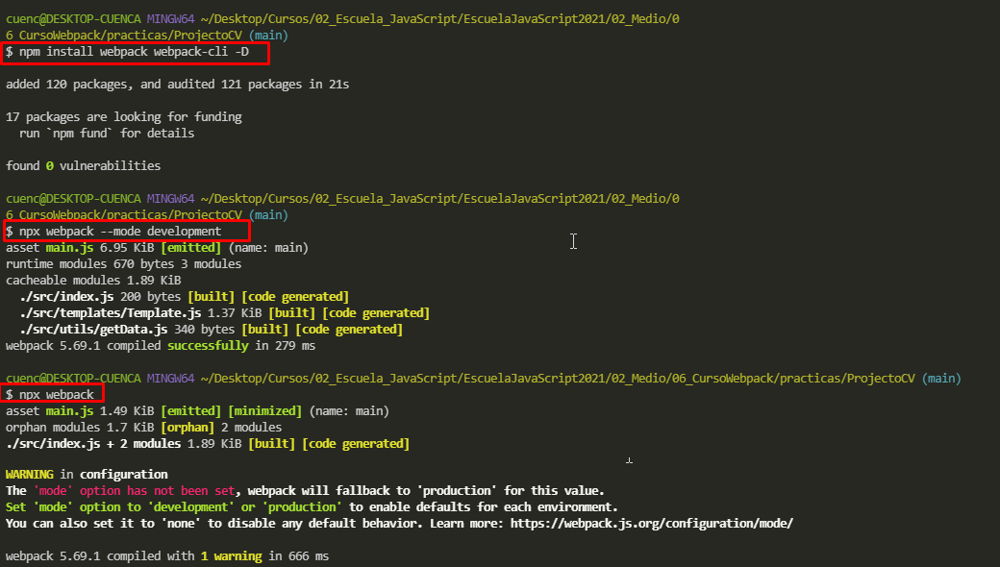
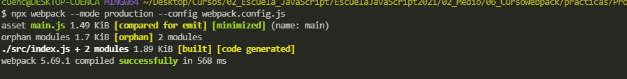
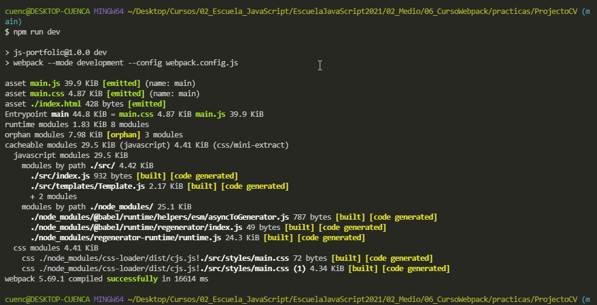

# 06 Curso de Webpack
Este nivel es sobre nuevas funciones e implementacones de ECMAScript 5-6-7 

## Clase 1: Bienvenida 
- Profesor Oscar Barajas Tavares  @gdnx 

**¿Qué es Webpack?**

- Webpack es un module bundler. 
- Los module bundlers son herramientas para frontend devs que suelen usarlo para empaquetar los JS modules en un único archivo de JS que pueda ser ejecutado por el navegador.
- Enlace -> https://webpack.js.org/

**Las razones principales por que se usan webpack son:**

- Algunos navegadores no soportan el sistema de modulos.
- Te ayudan a manejar las relaciones de dependencias con tu código.
- Ayudan a cargar assets en orden de dependencias, imágenes, css, etc.
- Tener en cuenta que webpack es una filosofía que nos va permitir trabajar de forma modular. Es como menter todo lo que vamos a necesitar en un proyecto en una caja y después poder sacar todo listo para producción.

## Clase 2: Conceptos básicos de Webpack

**Modulos **
- Webpack: es un paquete de módulos estáticos para aplicaciones de JS modernas
- Loader: Te permite hacer un bundle de cualquier recurso estático más allá de JavaScript
- Plugins:  Extienden recursos para añadir configuraciones y particularidades de recursos externos

**Caracteristicas**
- Debemos entender que webpack construye un gráfico de dependencias que mapea cada módulo para convertirlo en uno o más módulos (según sea el caso).
- Tener cuenta que tenemos que tendremos un punto de entrada y un punto de salida.
- El punto de salida suele estar dentro de la carpeta dist (abreviación de Distribution).
- Otra cosa que le da valor a webpack son los loaders y plugins.


**Tambien contamos con diferentes modos**
- Modo de desarrollo
- Modo de producción
- Modos de performance

## Clase 3-6: Tu primer build con Webpack

- Paso 1: Creamos nuestro proyecto `npm init`
- Paso 2: instalamos webpack `npm install webpack webpack-cli -D`
- Paso 3: Es comun que en los proyectos creeamos el directorio `src` aqui podemos alojar nuestro index.js que es requerido durante el npm init podemos editar esa linea `"main": "/src/index.js",` para que pueda  funcionar el webpack 
- Paso 4: podemos ejeuctar los siguientes comando `npx webpack --mode production` y `npx webpack --mode development` Estos comando permite que se cargue en el main todo lo que se esta codificando 
- Paso 5: ejecutamos el comando `npx webpack` esto nos genera un directorio llamado `dist` y un archivo `main.js` 



- Paso 6: Creamos nuestro archivo  `webpack.config.js` en raiz
- Paso 7: luego de configurar nuestro archivo -> webpack.config.js, debemos ejecutar el suguiente comando. `npx webpack --mode production --config webpack.config.js` 
  
  

- Paso 8: para no escribir ese burro de codigo podemos ir al package.json y generar un script
  `
  "scripts": {
    "build": "webpack --mode production --config webpack.config.js"
    "dev": "webpack --mode development --config webpack.config.js"
  },
  
  `

- Paso 9: Podemos instalar Babel `npm install babel-loader @babel/core @babel/preset-env @babel/plugin-transform-runtime -D`

¿Qué Rayos es Babel?
Es un transcompilador de JavaScript que agarra el código ECMAScript 2015 en adelante y lo transforma en una versión que todos los navegadores anteriores lo puedan usar En la pagina de Babel pueden ingresar código moderno se lo transpira a código viejo en tiempo real. 

**Luego en el archivo webpack.config debemos añadir este segmento:**
`
  module: {
    rules: [
      {
        test: /\.js$/,
        use: 'babel-loader',
        exclude: /node_modules/
      }
    ]
  }
`

Elementos nuevos añadidos:

>PD: module: Es el sitio donde vamos a añadir la nueva configuración de babel.
>rules: Las reglas que se establecerán dentro del proyecto.
>test: qué tipo de extensiones vamos a trabajar, o cuáles archivos vamos a transformar. Para ello utilizaremos regEx.
>exclude: Necesitamos excluir archivos para evitar dañar nuestro proyecto, >especificamente archivos de /node_modules/
>use: Aquí vamos a definir qué loader vamos a utilizar para la transformación.
>Básicamente Webpack leerá toda la instrucción de la siguiente manera: "Cuando encuentres un import o un require con extensión .mjs o .js, usa babel-loader para transformarlo antes de empaquetarlo.

**Luego creamos nuestro archivo .babelrc en raiz** el punto indica que es un archivo oculto en unix 
`
{
    "presets": [
        "@babel/preset-env"
    ],
    "plugins": [
        "@babel/plugin-transform-runtime"
    ]
}
`


- Paso 10: 

## Otra forma de operar Webpack 

Enlace -> https://createapp.dev/webpack/no-library--babel
- Paso 1: Create an NPM project and install dependencies
```
mkdir myapp
cd myapp
npm init -y
npm install --save-dev webpack webpack-cli babel-loader @babel/core @babel/preset-env
```
- Paso 2: Create webpack.config.js in the root and copy the contents of the generated file
- Paso 3:Create .babelrc in the root and copy the contents of the generated file
- Paso 4:Create folders src and dist and create source code files


> Notas:
> Para crear una consola auto complete -> https://www.youtube.com/watch?v=35EN3iP1-8c

## Clase 7: HTML en Webpack
Para poder preparar HTML para usarlo con Webpack tendremos que instalar el plugin de html-webpack-plugin. El comando para instalarlo es:

- Paso 1: `npm i html-webpack-plugin -D`
- Paso 2: Con este plugin podremos trabajar con html, poder identificarlo y generar un nuevo recurso basado en esto mismo. lo podemos anexar al final de module:{} Ejemplo revisar webpack.config.js

Tenemos que configurar el plugin para que sirva dentro de webpack.
`
		plugins: [
        new HtmlWebpackPlugin({
            inject: true,
            template: './public/index.html',
            filename: './index.html'
        })
    ]

`


## Clase 8: Loaders para CSS y preprocesadores de CSS

Un preprocesador CSS es un programa que te permite generar CSS a partir de la syntax única del preprocesador. Existen varios preprocesadores CSS de los cuales escoger, sin embargo, la mayoría de preprocesadores CSS añadirán algunas características que no existen en CSS puro, como variable, mixins, selectores anidados, entre otros. Estas características hacen la estructura de CSS más legible y fácil de mantener.

post procesadores son herramientas que procesan el CSS y lo transforman en una nueva hoja de CSS que le permiten optimizar y automatizar los estilos para los navegadores actuales.

Fuera de contexto, webpack solamente entiende JavaScript y JSON. Los loaders nos permite procesar archivos de otros tipos para convertirnos en módulos válidos que serán consumidos por nuestras aplicaciones y agregadas como dependencias.

En alto nivel, los loaders poseen 2 configuraciones principales:

test - propiedad que identifica cuáles archivos deberán ser transformados
use - propiedad que identifica el loader que será usado para transformar a dichos archivos
Plugins
Mientras los loaders transforman ciertos tipos de módulos, los plugins _son utilizados para extender tareas específicas, como la optimización de paquetes, la gestión de activos y la inyección de variables de entorno.

Una vez importado el plugin, podemos desear el personalizarlos a través de opciones.

**Pasos**
- Paso 0: Claro el proyecto ya debe estar creado ya con su pakage.json para ejecutar el paso dos 
- Paso 1: Podemos ejecutar el siguiente comando `npm i mini-css-extract-plugin css-loader -D`
- Paso 2: Debemos ir a nuestro archivo index.html y setear el archivo main.css que es el master generado automaticamente `<link rel="stylesheet" href="../src/styles/main.css">` esto ya no va asi ahora quedará de esta forma 

```
//Este esta ruta podemos añadir nuestro practicas\ProjectoCV\src\index.js ./styles/main.css //esto ya lo carga de manera automática al index.html 
import './styles/main.css';//Esta configuración lo anexa directamente al index.html 
```

- Paso 3: Debemos ir al archivo `webpack.config.js` y debemos añadir una constante 

```
const MiniCssExtractPlugin = require('mini-css-extract-plugin');
```
Luego pasamos a crear una nueva regla para que se pueda reconocer el css 

```
 rules: [
      {
        test: /\.js$/,
        exclude: /node_modules/,
        use: 'babel-loader',
        
      },
      {// fragmento nuevo 
        test: /\.css$/i,
        use: [
              MiniCssExtractPlugin.loader,
              'css-loader'
            ],
      }// fragmento nuevo 
    ]
```

Luego pasamos a plugin para generar una nueva instancia 
```
 plugins: [
        new HtmlWebpackPlugin({
            inject: true,
            template: './public/index.html',//Ubicamos nustro temple 
            filename: './index.html'//Podemos elegit el nombre que deseamos pero por buenas practicas anexamos index.html
        }),
        new MiniCssExtractPlugin(),// fragmento nuevo 
    ]  
```

- Paso 4: para validar este cambio podemos ejecutar el comando `nom run dev` claro previmante revisa que en tu package.json tengas el srript  **"dev": "webpack --mode development --config webpack.config.js"***

Debemos tener un resultado similar a esto 



- Paso 5: Podemos instalar stylus `npm i stylus stylus-loader --save-dev` ó Sass `npm install sass sass-loader -D -E`
   - Paso 5.1: Debemos cambiar la regla generada anteriormente en el webpack.config.js   la regla es `test: /\.css|.styl$/i, 'stylus-loader'  ` ó `test: /.css|.s[ac]ss$/i,  ‘sass-loader’`ojo son dos frgmentos separados el segundo va en el USE
   - Paso 5.2: Debemos importarlo en nuestro archivo index.js principal `import './styles/vars.styl'` ó `import './styles/vars.scss' `
- 


- Si deseamos posteriormente podemos agregar herramientas poderosas de CSS como ser:
  - pre procesadores
    - Sass
    - Less
    - Stylus
  - post procesadores
    - Post CSS

>PD: Puedes dar soporte a CSS en webpack mediante loaders y plugins, además que puedes dar superpoderes al mismo con las nuevas herramientas conocidas como pre procesadores y post procesadores


## Clase 9: 🗂️ Copia de archivos con Webpack
Si tienes la necesidad de mover un archivo o directorio a tu proyecto final podemos usar un plugin llamado “copy-webpack-plugin”
Para instalarlo debemos ejecutar el comando

**Pasos**

- Paso 1: debemos instalar el npm copy `npm i copy-webpack-plugin -D`
- Paso 2: Debemos realizar una configuración en el webpack.config.js 
  - Paso 2.1: creamos una variable constante declarando el npm instaldo `const CopyPlugin = require('copy-webpack-plugin');`
  - Paso 2.2: en webpack.config.js en la sección de plugin debemos anexar nuestra constante 
```
new CopyPlugin({
      patterns: [
        {
          from: path.resolve(__dirname, "src", "assets/images"),
          to: "assets/images"
        }
      ]
    }),

```
  - Paso 2.3: para este caso queremos copiar las imagenes des nuestro ambiente dev a nuestro ambiente `dist` 
  - Paso 3.4: ejecutamos el comando `nom run dev`

>PD: Es importante las propiedades from y to From ⇒ que recurso (archivo o directorio) eseamos copiar al directorio final To ⇒ en que ruta dentro de la carpeta final terminara los recursos

## Clase 10: 🎴 Loaders de imágenes

**Resumen**
- Puedes usar una forma de importar las imágenes haciendo un import de las mismas y generando una variable
- No es necesario instalar ninguna dependencia, webpack ya lo tiene incluido debemos agregar la siguiente configuración

**Pasos**

- Paso 1: En el webáck.congif.js podemos realizar configuración de la regla 
```
{
  test: /\.png/,
  type: "asset/resource"
}
``` 
- Paso 2: Podemos importar los recursos claro es importante señalar que esto es si usamos alguna plantulla en js. en pocas palabras esto logra que cada png podamos importar generar una variable js y usarlo para exponer 
```
import gitHub from '../assets/images/github.png';

 
```

## Clase 11:  Loaders de fuentes
**Resumen**
- Cuando utilizamos fuentes externas una buena práctica es descargarlas a nuestro proyecto
- Debido a que no hara un llamado a otros sitios
- Por ello es importante usarlo dentro de webpack
- Para esta tarea instalaras y usaras “file-loader” y “url-loader”

**Pasos**
- Paso 1: Debemos instalar nuestros paquets encargado de esto `npm install url-loader file-loader -D`
- Paso 2: Debemos editar el webpack.config.js otra nueva regla 
```
 {
        test: /\.(woff|woff2)$/,
        use: {
          loader: "url-loader",
          options: {
            // limit => limite de tamaño
            limit: 10000,
            // Mimetype => tipo de dato
            mimetype: "application/font-woff",
            // name => nombre de salida
            name: "[name].[ext]",
            // outputPath => donde se va a guardar en la carpeta final
            outputPath: "./assets/fonts/",
            publicPath: "./assets/fonts/",
            esModule: false,
          }
        }
      }
```
- Paso 3: Debemos agregar los estilos de los font que vamos a utilizar en nuestra hoja de estilo 

``` 
@font-face {
	font-family: "Ubuntu";
	src: url("../assets/fonts/ubuntu-regular.woff2") format('woff2'),
			 url("../assets/fonts/ubuntu-regular.woff") format('woff');
	font-weight: 400;
	font-style: normal;
}
``` 


## avanzado 

```
¡Que onda gente!!! Leyendo la documentación, buscando y jugando un poco encontré una alternativa perfecta para empaquetar nuestras fuentes o resources sin necesidad de instalar url-loaderr o file-loader.

  {
        test: /\.(woff|woff2)$/,
        type: "asset/resource",
        generator: {
          filename: "assets/fonts/[name][ext]"
        }
  }
que está disponible en webpack 5:
https://webpack.js.org/guides/asset-modules/
```

## Clase  12: Optimización: hashes, compresión y minificación de archivos

**¿Por qué es importante usar Hashes en nuestros archivos?**
- Los recursos que se guardan en memoria cache suceden cuando el navegador entra a un sitio por primera vez detecta los recursos y los guarda. 

- Por ello la siguiente vez sera mucho más rápido porque estarán en memoria

- La desventaja esta cuando sacamos una nueva versión, porque tendrán un mismo nombre evitando que se descargue los nuevos cambios, por lo tanto, el usuario no recibirá los nuevos cambios

- Para que no haya conflictos con la cache una vez que tengamos nuestro proyecto en producción es importante darles un hash para cada nueva versión. 

- Segun la documentación oficial de webpack nos comunica que actualmente terser-webpack-plugin viene incluido desde webpack 5 😄 Fuente: [TerserWebpackPlugin](https://webpack.js.org/plugins/terser-webpack-plugin/)

- Debemos utilizar los siguientes paquetes
  - css-minimizer-webpack-plugin ⇒ Nos ayuda a comprimir nuestros archivos finales CSS
  - terser-webpack-plugin ⇒ Permite minificar de una mejor forma

**Instalación**
- Paso 1: Comando para instalar   `npm i css-minimizer-webpack-plugin terser-webpack-plugin -D`
- Paso 2:  Una vez instalado el plugin debemos agregar la siguiente configuración
`

const CssMinimizerPlugin = require('css-minimizer-webpack-plugin');
const TerserPlugin = require('terser-webpack-plugin');

module.exports = {
	...
	optimization: {
    minimize: true,
    minimizer: [
      new CssMinimizerPlugin(),
      new TerserPlugin()
    ]
  }
}

ó 

optimization: {
    minimize: true,
    minimizer: [
      new CssMinimizerWebpackPlugin(),
      new TerserWebpackPlugin()
    ]
  }


` 
- Paso 3: Cuando nombremos en la configuración de webpack es importante usar [contenthash] para evitar problemas con la cache
```
Ahora colocamos esta configuración en css, para que nos de un hash number. De esa manera detectar cuando se han realizado cambios en los archivos.

new MiniCssExtractPlugin({
      filename: 'assets/[name].[contenthash].css'
    }),
```

## Clase 13: Webpack Alias

> Los alias nos ayudan a ubicar ciertos directorios sin la necesidad de escribir tantos puntos seguidos de slashes. Su principal ventaja es que nos permiten tener un código mas fácil de entender y mucho mas elegante.


- Alias ⇒ nos permiten otorgar nombres paths específicos evitando los paths largos
- Para crear un alias debes agregar la siguiente configuración a webpack
```
  resolve: {
    extensions: ['.js'],
    alias: {
      '@utils': path.resolve(__dirname, 'src/utils/'),
      '@templates': path.resolve(__dirname, 'src/templates/'),
      '@styles': path.resolve(__dirname, 'src/styles/'),
      '@images': path.resolve(__dirname, 'src/assets/images/'),
    }
  },

  //Como usarlo 

import getData from "@utils/getData.js";
import github from "@images/github.png";
import twitter from "@images/twitter.png";
import instagram from "@images/instagram.png";  
```
> PD: Si no renoce fonts o imagenes revisa en tu webpack la opcion publicPath: "../assets/fonts/",//En tu ambiente DEV solo agregale un punto mas . ./ 

## Clase 14: variables de entorno

> Es importante considerar las variables de entorno va a ser un espacio seguro donde podemos guardar datos sensibles Por ejemplo, subir llaves al repositorio no es buena idea cuando tienes un proyecto open source. 

**Puntos**
> Las variables de entorno son variables externas a nuestra aplicación que residen en el sistema operativo o en el contenedor de la aplicación que se está ejecutando. Una variable de entorno es simplemente un nombre asignado a un valor como una variable es cualquier lenguaje de programación.


**Pasos**
- Paso 1: Podemos instalar un paquete  `npm install -D dotenv-webpack`
- Paso 2: Creamos nuestro arhivo `.env` en la raiz
- Paso 3: En dicho archivo podemos establecer nuestras variables de esta manera 
``` 
# Ejemplo
API=https://randomuser.me/api/
``` 
- Paso 4: En nuestro archivo webpack.config.js 
```
const Dotenv = require('dotenv-webpack');

	plugins: [
		new Dotenv()
  ],
```
- Paso 5: Ya webpack lo inicializa desde que arranca el proyecto la podemos usar de esta manera 
```
const nombre = process.env.NOMBRE_VARIABLE;
```

## Clase 15: Webpack en modo desarrollo

**Pasos**
- Creamos un nuevo archivo: webpack.config.dev.js
- Copiamos todo lo de webpack.config.js a el archivo que acabamos de crear.
- Borramos o comentamos el siguiente código, ya que no necesitamos optimizar para el modo de desarrollo (Queremos ver cuando funcionan las cosas).
- podemos anexar mode: 'development', 
- Debemos editar el package.json en la session de script  `"dev": "webpack --config webpack.config.dev.js" `
- Por ultimo  ejecutamos `npm run dev`
Enalces -> https://medium.com/webpack/webpack-4-mode-and-optimization-5423a6bc597a

## Clase 16: Webpack en modo producción 🏭 
> Webpack ahora tiene un flag clean que permite limpiar el output directory https://webpack.js.org/guides/output-management/#cleaning-up-the-dist-folder, es una buena alternativa para no tener que instalar mas dependencias, aqui hay un issue donde piden deprecar el plugin para que solo se use el flag nativo de webpack https://github.com/johnagan/clean-webpack-plugin/issues/197

- Actualmente tenemos el problema de tener varios archivos repetidos los cuales se fueron acumulando por compilaciones anteriores
- Para ello puedes limpiar la carpeta cada vez que hacemos un build, usando clean-webpack-plugin
- Cabe recalcar que esta característica es mucho más util para la configuración de producción

**Pasos**
- Paso 1: instalamos `npm install -D clean-webpack-plugin`
- Paso 2: Para agregarlo a nuestra configuración de webpack agregamos los siguientes cambios a webpack.config.js
```
const { CleanWebpackPlugin } = require('clean-webpack-plugin');

plugins: [
		...
		new CleanWebpackPlugin()
	]

```
- Paso 3: - Debemos editar el package.json en la session de script  `"build": "webpack --mode production --config webpack.config.js" `

> PD: en caso delaguna falla podemos aplicar este metodo 


SUPER TIP: Aquí les tengo una solución a un incoveniente que tuve y que seguro muchos de ustedes van a tener…
.
Yo configuré mi webpack.config para que mi output saliera ordenado en carpetas especificas. El problema es que sin una configuración adicional el clean-webpack-plugin sólo limpia los archivos javascript si se configura este output de manera especifica. 


Usando path.resolve con el directorio que se quiere limpiar. En este caso le estoy pasando 3 rutas, una que me borre todos los archivo “.css” en la carpeta “css”, lo mismo con los “.js” en la carpeta “js” y la última que me borre todo en la carpeta “assets”
.
Por último el atributo verbose: true lo que hace es darme un log en la consola diciéndome todos los archivos que fueron limpiados antes del build.
```
  new CleanWebpackPlugin({
          cleanOnceBeforeBuildPatterns:[
            path.resolve(__dirname, 'dist/css/*.css'),
            path.resolve(__dirname, 'dist/js/*.css'),
            path.resolve(__dirname, 'dist/assets/**'),
          ],
          verbose:true,
        })

```

## Clase 17: Webpack Watch

El modo watch es para estar escuchando los cambios del proyecto y esto se compile de forma automatica.

Para hacer esto hay que ir a la configuracion del modo desarrollo y hay que activarlo en el modo donde escribimos que usaremos el modo development, abajo agregaremos:

Podemos hacer este ajuste desde el webpack o desde el package.json 
- webpack
```
module.exports = {
	...
	watch: true
}
```

- package.json
```
"dev": "webpack --config webpack.config.dev.js",
"watch": "npm run dev --watch" 

  "scripts": {
    "test": "echo \"Error: no test specified\" && exit 1",
    "build": "webpack --mode production --config webpack.config.js",
    "dev": "webpack --config webpack.config.dev.js",
    "build:watch": "webpack --watch --config webpack.config.js"
  },
``` 

## Clase 18 Deploy a Netlify

13
Lo primero que debemos hacer es crear una cuenta en Netlify. Lo siguiente es crear un archivo en la raíz del proyecto llamado netlify.toml el cual va a llevar la siguiente configuración:

## **netlify.toml**
[build]
    publish = "dist" // ¿cual va a ser la carpeta a publicar?
    command = "npm run build" // Comando a ejecutar para el deploy
Para el siguiente paso debemos ya tener nuestro repositorio en algún servicio de la nube, como Github. Ahora, vamos a la pagina de Netlify para crear el nuevo sitio.

Crear nuevo sitio → Seleccionar nube (Github) → Elegir repositorio y rama a subir → Deploy

Apartir de ahora Netlify nos levanta el servidor de manera gratuita, este proceso puede ser lento ya que es un servicio gratuito. En el summary de nuestro deploy podemos ver el log del build donde podriamos ver los errores presentes.

En el proyecto actual, al hacer uso de una variable de entorno, necesitamos realizar la siguiente configuración para que Netlify pueda trabajar con ella: Creamos una carpeta llamada scripts/ y adentro de esta carpeta vamos a crear un archivo llamado create-env.js. En este archivo vamos a colocar este código

// **create-env.js**

const fs = require('fs'); // fs = file system

// fs.writeFileSync("path", `argumento a crear`);
fs.writeFileSync("./.env", `API=${process.env.API}\n`);
Pero ¿de dónde vamos a obtener/setear el process.env? Lo vamos a asignar en netlify, en nuestro deploy vamos a buscar la Sección de Enviroment → Enviroment Variables → Edit Variables. En nuestro caso la llamaremos API y asignaremos el valor de nuestro API: https://randomuser.me/api/

Ahora, debemos ejecutar este script antes de ejecutar el comando de build, para que sea enviado a netlify. Vamos a nuestro package.json y vamos a modificar el script build de la siguiente manera:

"scripts": {
    ...
    "build": "node ./scripts/create-env.js && webpack --config webpack.config.js",
  }
⚠️Cuidado al anidar la ejecución de scripts, porque si el primero en ejecutarse lo hace como demonio, puede causar un problema ya que no va a ejecutarse el segundo script.

Luego de todos estos cambios debemos empujarlos a la nube ✌🏻


## clase 19 : Webpack Dev Server 🍰

HTML5 History API permite la manipulación de session history del navegador, es decir las páginas visitadas en el tab o el frame en la cual la página está cargada.

<h4>Recursos</h4>
How To Optimize Your Site With GZIP Compression -<https://betterexplained.com/articles/how-to-optimize-your-site-with-gzip-compression/>

<h4>Apuntes</h4>
Cuando trabajamos con webpack deseamos ver los cambios en tiempo real en un navegador
Para tener esta característica esta webpack-dev-server
Para ello debemos instalarlo
NPM

npm install -D webpack-dev-server
Yarn

yarn add -D webpack-dev-server
Posteriormente debemos agregar la siguiente configuración en webpack.config.dev.js
Lo hacemos en la configuración de desarrollo debido a que esta característica solo nos ayudara a ver cambios al momento de desarrollar la aplicación
module.exports = {
	...
	devServer: {
    contentBase: path.join(__dirname, 'dist'),
    compress: true,
    historyApiFallback: true,
    port: 3000,
  }
}
En la configuración podemos observar lass siguientes propiedades
contentBase ⇒ Le dice al servidor donde tiene que servir el contenido, solo es necesario si quieres servir archivos estáticos
compress ⇒ Habilita la compresión gzip
historyApiFallback ⇒ cuando estas usando HTML5 History API la página index.html sera mostrada en vez de una respuesta 404
Port ⇒ es el puerto donde vamos a realizar las peticiones
Para comenzar a utilizarlo debes agregar el siguiente script a package.json
{
	...
	"scripts": {
	...
	"start": "webpack serve --config webpack.config.dev.js"
	}
}


--------------------------------------------------------------------------------

Hola , vengo del año 2021 mes de octubre, y el webpack-dev-server no me recargaba automaticamente el navegador, resulta que se actualizo la documentación y ahora no viene por defecto esta funcionalidad, por lo que agregué unas lineas de codigo para arreglarlo:

link documentación webpack-dev-server

Antes

devServer: {
        contentBase: path.join(__dirname, 'dist'),
        compress: true,
        historyApiFallback: true,
        port: 3006,
        open: true,  //Hace que se abra en el navegador
    }
}
Despues

devServer: {
    static: 
    {
      directory: path.join(__dirname, "dist"),
      watch: true,
    },
    watchFiles: path.join(__dirname, "./**"), //observa los cambios en todos nuestros archivos y actualiza el navegador
    compress: true,
    historyApiFallback: true,
    port: 3006,
    open: true, //Hace que se abra en el navegador
    
  },

  ## Clase 20: Webpack Bundle Analyzer

  Para analizar el uso de paquetes y dependencias que estoy usando, para ayudarnos a optimizar aún más.

Lo instalamos:
npm install webpack-bundle-analyzer -D
Vamos a la configuración de desarrollo:
const BundleAnalyzerPlugin = require("webpack-bundle-analyzer");

//Plugins
plugins: [
    new BundleAnalyzerPlugin(),
  ], //Solo estará en modo de desarrollo
Lo corremos con:
npx webpack --profile --json > stats.json
//Y va a guardar en un json la información. El reporte
Podemos ver el reporte en una página web que muestra todo lo importante, incluye todo lo que está en nuestro archivo de JS. Lo hacemos con:
npx webpack-bundle-analyzer stats.json

## clase 21: Webpack DevTools
🐛 Webpack DevTools
<h4>Ideas/conceptos claves</h4>
source map es un mapeo que se realiza entre el código original y el código transformado, tanto para archivos JavaScript como para archivos CSS. De esta forma podremos debuggear tranquilamente nuestro código.

<h4>Apuntes</h4>
Con las devtools de webpack te permite crear un mapa de tu proyecto y con el podemos
Leer a detalle
Analizar particularidades de lo que está compilando nuestro proyecto
Para comenzar debemos ir a webpack.config.js y agregar la propiedad devtool: "source-map"
Esta opción genera un source map el cual posteriormente chrome lo lee y te permite depurar 
de una mejor forma


## clase 22 - Instalación y configuración de React

Inicializar NPM
Instalar React con npm como dependencia:
"npm i react react-dom -S
Estructura de carpetas:
[](http 😕/i.prntscr.com/rs6Oai5VQ-2KDjY4bNWdbQ.png)
Index.js
import React from 'react';
import ReactDom from 'react-dom';
import App from './components/App';

ReactDOM.render(<App />, document.getElementById('app'));
App.jsx
Los archivos con extensión de react (Html dentro de Javascript o JSX) siempre inician con mayúscula.
import React from 'react';

const App = () => <h1>Hello React!!</h1>

export default App;
Index.html
<!DOCTYPE html>
<html lang="en">
<head>
    <meta charset="UTF-8">
    <meta http-equiv="X-UA-Compatible" content="IE=edge">
    <meta name="viewport" content="width=device-width, initial-scale=1.0">
    <title>Document</title>
</head>
<body>
    <div id="app"></div>
</body>
</html>

## Clase 23 : Configuración de Webpack 5 para React.js
# NPM
npm install -D @babel/core @babel/preset-env @babel/preset-react babel-loader
npm install @babel/plugin-transform-runtime" -D
# YARN
yarn add -D @babel/core @babel/preset-env @babel/preset-react babel-loader


```
const path = require("path");

module.exports = {
  entry: "./src/index.js",
  output: {
    path: path.resolve(__dirname, "dist"),
    filename: "bundle.js",
  },

  resolve: {
    //Extensiones que vamos a trabajar
    extensions: [".js", ".jsx"],
  },

  module: {
    //Reglas
    rules: [
      {
        test: /\.(js|jsx)$/,
        exclude: /node_modules/,
        use: {
          loader: "babel-loader",
        },
      },
    ],
  },

  devServer: {
    contentBase: path.join(__dirname, "dist"),
    compress: true,
    port: 3006,
  },
};


{
//Creamos .babelrc y añadimos la estructura
{ //Para poder compilar
    "presets": [
        "@babel/preset-env",
        "@babel/preset-react"
    ]
}
  "plugins": [
    "@babel/plugin-transform-runtime"
  ]
}
```

## Clase 24: Configuración de plugins y loaders para React

 Comandos de instalación de la clase
# NPM
npm install -D html-loader html-webpack-plugin
# YARN
yarn add -D html-loader html-webpack-plugin


```
const HtmlWebpackPlugin = require('html-webpack-plugin');

module.exports = {
	module: {
		rules: [
			{
				test: /\.html$/,
				use: {
					loader: 'html-loader'
				}
			}
		]
	},
	plugins: [
        new HtmlWebpackPlugin({
            template: './src/public/index.html',
            filename: 'index.html'
        })
    ]
}
```
Luego en package.json 

```
“start”: “webpack serve”,
“build”: “webpack --mode production”
```
>Notas:

```
no me corría webpack server entonces revise la documentación y en lugar de poner

devServer: {
    contentBase: path.join(__dirname, 'dist'),
    compress: true,
    port: 3006
  }
}
Puse

devServer: {
        static: {
            directory: path.join(__dirname, 'dist'),
        },
        compress: true,
        port: 3006
    }
```

```
Trucazo
Si agregas esta configuración a .babelrc:

{
	"presets": [
			"@babel/preset-env",
			["@babel/preset-react", {
				"runtime": "automatic"
			}]
	]
}
Ya no necesitas importar React en los archivos donde utilizas sintaxis jsx:

App.jsx

const App = () => <h1>Hola mundo desde REACT!</h1>

export default App
```

```
AVISO IMPORTANTE:

–si llegaste hasta aqui y la configuracion te arroja error, debes escribir lo siguiente en el script start:

"start": "webpack-dev-server"
–ya que “webpack serve” ya no cumple la funcion como lo hacia antes
```

## Clase 25:  Configuración de Webpack para CSS en React

 Instalación de dependencias
#NPM
npm install -D mini-css-extract-plugin css-loader style-loader sass sass-loader
# YARN
yarn add -D mini-css-extract-plugin css-loader style-loader sass sass-loader

## Configuracion 

```
const path = require('path');
const HtmlWebpackPlugin = require('html-webpack-plugin');
const MiniCssExtractPlugin = require('mini-css-extract-plugin');

module.exports = {
  entry: './src/index.js',
  output: {
    path: path.resolve(__dirname, 'dist'),
    filename: 'bundle.js',
  },
  resolve: {
    extensions: ['.js', '.jsx']
  },
  module: {
    rules: [
      {
        test: /\.(js|jsx)$/,
        exclude: /node_modules/,
        use: {
          loader: 'babel-loader',
        }
      },
      {
        test: /\.html$/,
        use: [
          { loader: 'html-loader' }
        ]
      },
      {
        test: /\.s[ac]ss$/,
        use: [
          'style-loader',
          'css-loader',
          'sass-loader'
        ]
      }
    ]
  },
  plugins: [
    new HtmlWebpackPlugin({
      template: './public/index.html',
      filename: './index.html'
    }),
    new MiniCssExtractPlugin({
      filename: '[name].css'
    })
  ],
  devServer: {
    contentBase: path.join(__dirname, 'dist'),
    compress: true,
    port: 3006
  }
}
```

>PD: Notas 

```
No se si alguién ha tenido el problema, pero la expresión regular toma o scss o sass pero nunca css:

Si se pasa de:

/\.s[ac]ss/
a

/\.s?[ac]ss/

o

test: /\.(sa|sc|c)ss$/i
También se cargarán archivos .css, tuve ese error en un proyecto personal.

Saludos!
```

Nota Dos 
```
mini-css-extract-plugin tambien tiene un laoder incorporado y a mi parecer es mejor usarlo para reducir el número de dependencias en el proyecto.

      {
        test: /\.s[ac]ss$/i,
        use: [MiniCssExtractPlugin.loader, 'css-loader', 'sass-loader'],
      },

```

Cabe resaltar que:
La dependencia de MiniCssExtractPlugin es para el modo de produccion, el cual reemplaza la de style-loader.

{
        test: /\.s[ac]ss$/,
        use: [
          MiniCssExtractPlugin.loader,
          'css-loader',
          'sass-loader'
        ]
}

## Clase 26 

 Dependencias de optimización
#NPM
npm install -D css-minimizer-webpack-plugin terser-webpack-plugin clean-webpack-plugin
# YARN
yarn add -D css-minimizer-webpack-plugin terser-webpack-plugin clean-webpack-plugin

## configuracion 

```
const path = require('path');
const HtmlWebpackPlugin = require('html-webpack-plugin');
const MiniCssExtractPlugin = require('mini-css-extract-plugin');
const CssMinimizerPlugin = require('css-minimizer-webpack-plugin');
const TerserPlugin = require('terser-webpack-plugin');
const { CleanWebpackPlugin } = require('clean-webpack-plugin');

module.exports = {
  entry: './src/index.js',
  output: {
    path: path.resolve(__dirname, 'dist'),
    filename: 'bundle.js',
    publicPath: "/",
  },
  resolve: {
    extensions: ['.js', '.jsx'],
    alias: {
      '@components': path.resolve(__dirname, 'src/components/'),
      '@styles': path.resolve(__dirname, 'src/styles/')
    }
  },
  mode: 'production',
  module: {
    rules: [
      {
        test: /\.(js|jsx)$/,
        exclude: /node_modules/,
        use: {
          loader: 'babel-loader',
        }
      },
      {
        test: /\.html$/,
        use: [
          { loader: 'html-loader' }
        ]
      },
      {
        test: /\.s[ac]ss$/,
        use: [
          'style-loader',
          'css-loader',
          'sass-loader'
        ]
      }
    ]
  },
  plugins: [
    new HtmlWebpackPlugin({
      template: './public/index.html',
      filename: './index.html'
    }),
    new MiniCssExtractPlugin({
      filename: '[name].css'
    }),
    new CleanWebpackPlugin(),
  ],
  optimization: {
    minimize: true,
    minimizer: [
      new CssMinimizerPlugin(),
      new TerserPlugin(),
    ]
  }
}
```
## Luego Configuramos package.json 
```
  "scripts": {
    "test": "echo \"Error: no test specified\" && exit 1",
    "start": "webpack serve --config webpack.config.dev.js",
    "build": "webpack --config webpack.config.js"
  },
```

Recuerden que en vez de usar el Plugin

new CleanWebpackPlugin()
Pueden utilizar el clean nativo de Webpack. Aquí les dejo la documentación.
Con el clean quedaría:
https://webpack.js.org/guides/output-management/#cleaning-up-the-dist-folder
module.exports = {
...
output: {
  clean: true,
 }
}

Cabe recalcar que a partir de Webpack 5 terser-webpack-plugin ya viene incluido y basta con requerirlo en configuración.


