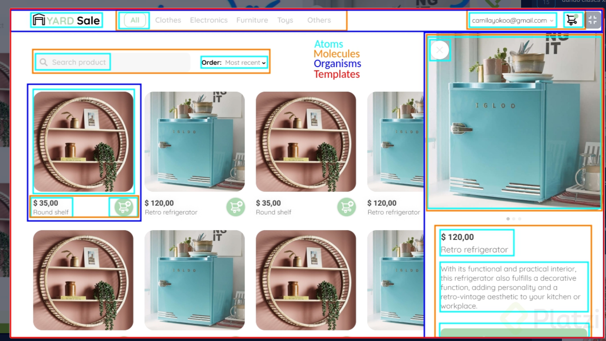

# 07 ¿Qué es React.js?

Este nivel es sobre nuevas funciones e implementacones de ECMAScript 5-6-7 

## Clase 1: Bienvenida 
- Profesor Oscar Barajas Tavares  @gdnx 

## Clase 2: 

**¿Qué es React.js?**
- Es una libreria de Js para desarrollar  interfaces de usuario, donde solo nos vamos enfocar en la vista, 
- Solo viene resolver las vistas del usuario.  
- Se piensa en componentes es decir cada fragmento de cada interfaz encapsulado. 
- Nacio en el  2013 gracias a Facebook ahora Meta. 

**Conceptos**
- **JSX** se refiera a Javascript XML. Nos permite escribir html dentro de Javascript. 
- **Virtual DOM** El virtual DOM es una copia en memoria del DOM normal del navegador. Pero ¿por qué hacer una copia? Bueno, cuando el UI cambia de estado, normalmente el DOM es muy lento. Sin embargo, virtual DOM es extremadamente rápido. Lo que ocurre es que primero, todo se computa en el virtual DOM, se actualiza por completo el virtual DOM (a pesar de que se re-renderiza el virtual DOM, no afecta el rendimiento porque primero no se tiene que mostrar gráficamente y realmente es muy rápido) y realiza el proceso de diff que compara ambos DOM para después igualar o “reconciliar” ambos UI y cambiar el aspecto de la manera más corta y rápida posible.
- **Ciclo de vida** se refiere al proceso de cuando los componentes son creados, actualizados y eliminados. O de otra manera ⇒ nacen, crecen y mueren.
- **Estado** son los datos que están dentro del componente. Estos pueden ser actualizados usando diferentes métodos. Los estados son muy importantes en React, pues son encargados de actualizarse cada vez que se cambian, afectando a los demás nodos del virtual DOM.
- **Eventos** los componentes, pueden configurarse con eventos como onclick para responder antes ciertas interacciones con el usuario, tal como los haríamos en Html
- **React Hooks** es otra manera de escribir los componentes con estado, si usar clases. No se pretenden reemplazar, sin embargo, usar funciones para los componentes pueden facilitar el entendimiento de la aplicación.


## Clase 3:  Pasos para isntalar React. 
- Paso 1: Podemos ejecutar los siguientes comandos en nuestro proyecto raiz.
- `npm init`
- `npm install react react-dom`

- Paso 2: Configuramos nuestro archivo de entrada `Practica\react-shop\src\index.js` 

```
import React from 'react';
import ReactDOM from 'react-dom';

ReactDOM.render(<App />, document.getElementById('app'));

```


## Clase 4:  Configuración de Webpack y Babel

- Paso 3: Instalamos las bondades de js y babel ` npm install @babel/core @babel/preset-env @babel/preset-react `

- Paso 4: Instalamos webpack y server `npm install webpack webpack-cli webpack-dev-server`

>Nota: no olviden agregar --save-dev al final de cada comando cuando instalen las dependencias de webpack y babel, ya que esto hace que se instalen solo para el entorno de desarrollo.


- Paso 5: Instalmos los loader y plugin `npm install babel-loader html-loader html-webpack-plugin`

- Paso 6: creamos nuestro archivo `.babelrc` en la raiz

- Paso 7: creamos el archivo `webpacj.config.js` -> se crea en la raiz `Practica\react-shop\webpack.config.js` -> Ver ejemplo Básico

```
//Webpack original y funcional 
//Iniciamos nuestras variables 
const path = require('path');//Variable de ruta  
const HtmlWebpackPlugin = require('html-webpack-plugin');//Instaciamos nuestro plugin 

module.exports = {
	entry: './src/index.js',//Ubica el punto de entrada de nuestra aplicación 
	output: {//Donde va vivir el proyecto cuando este configurado 
		path: path.resolve(__dirname, 'dist'),//Aqui indicamos donde va vivir el proyecto Se puede llamar build, dist ... 
		filename: 'bundle.js',//Nombre al empaquetado 
	},
    mode:'development',//Esto nos permite trabajar modo desarrollador 
	resolve: {
		extensions: ['.js', '.jsx'],//Indicamos que extensiones vamos a usar
	},
	module: {//Aqui indicamos las reglas que vamos a trabajar con nuestros loader vamos usar el loader de babel y de html
		rules: [
			{//Configuramos loader js 
				test: /\.(js|jsx)$/,
				exclude: /node_modules/,//excluimos 
				use: {
					loader: 'babel-loader'
				}
			},
			{//Configuramos loader html
				test: /\.html$/,
				use: [
					{
						loader: 'html-loader'
					}
				]
			}
		]
	},
    //Agregamos Plugin
    plugins: [
		new HtmlWebpackPlugin({
			template: './public/index.html',
			filename: './index.html'
		}),
	]
}
```


## Clase 5: Cambios en tiempo real con Webpack

- Paso 8: configuramos nuestro `package.json` -> agreamos los script 
```
    "test": "echo \"Error: no test specified\" && exit 1",
    "start": "webpack serve --open",
    "build": "webpack --mode production"

```
- Paso 9: agremos la ruta para que pueda ir conociendo los componentes react que vamos creando en el archivo inicial de react llamado `index.js`-> `Practica\react-shop\src\index.js` 

```
import App from './components/App'; //Importante esto es para que pueda importar cada componente que estamos usando. 
```

- Paso 10:  Configuramos nuestro archivo `index.html` aqui es de usar un div inicial donde le indicamos a React donde pondra nuestros elementos. aqui es donde va ser render de la información -> `Practica\react-shop\public\index.html`
```
	<div id="app"></div>
```

- Paso 11: Corremos el comando para iniciar todo `npm run start`

## Clase 6: React con CSS y Sass

- Paso 1: Debemos instalar las dependencias `npm i mini-css-extract-plugin css-loader style-loader sass sass-loader -D`

- Paso 2: Configuramos el webpack

```
const MiniCssExtractPlugin = require('mini-css-extract-plugin');//Lo usamos para usar Css SASs

//Luego anexamos como nueva regla 

{
        test: /\.s[ac]ss$/i,
        use: [
          // Creates `style` nodes from JS strings
          "style-loader",
          // Translates CSS into CommonJS
          "css-loader",
          // Compiles Sass to CSS
          "sass-loader",
        ],
 },

// Luego agregamos el pluging instanciado

new MiniCssExtractPlugin({
      filename: '[name].css'
    }),


//Anexamos configuración para desarrollador es opcional 

devServer: {
  static: {
    directory: path.join(__dirname, 'public'),
    },
  compress: true,
  port: 3005,
}

```

- Paso 4: Creamos nuestro archivo css llamado `global.scss`
- Paso 5: Importamos nuestra hoja de estilo al componenete desea y luego corremos 
```
//Importamos 
import '../styles/global.scss'; 

//corremos 
npm run start
```

## Clase 7: Transformando HTML y CSS en componentes de React

**Componentes y Contenedores**

>Diferenciemos componente de “contenedor” en react. Los contenedores o módulos son partes más grandes. En este caso puede ser todo el login. Sin embargo, un componente puede ser un input o un form. Los componentes deben mantenerse pequeños y responder a uno sola necesidad, si no, perdemos funcionalidad


> PD
- Comando para construir Componentes `Yo coloco " rafce" y me construye el componente completo`
- Si queremos usar imagenes npg o svg como variables en js debemos instalar `npm i -D file-loader` y configurar la regla rules en webpack.config.js
```
 	{
 	test: /\.(png|jp(e*)g|svg|gif)$/,
       	use: [
          	{
         	loader: 'file-loader',
            	options: {
              		name: 'images/[hash]-[name].[ext]',
            		},
          	},
              ],
	},
``` 
- Si queremos pasar html a JSX podemo usar este pluging `html to JSX` [Documentacion](https://marketplace.visualstudio.com/items?itemName=riazxrazor.html-to-jsx)


## Clase 9: React Router DOM 

**¿Qué es router en React?**
Debido a que React es de tipo SPA(single page application), no recarga la página cuando cambiamos de url. Sin embargo, router nos ayuda a crear otra página para poder navegar en nuestra aplicación. Imagina twitter web, cuando das click en un tweet, se abre otra sección donde puedes ver el tweet. Sería un problema que al momento de darle click, no cambie la url, por lo que ese tweet no tiene dirección propia, no se guardaría en tu historial y sería un problema el SEO. Para ello, usamos router, que se encargará de administrar esta situación, donde en el momento que abras el tweet, cambie la URL, pero todavía mantenga ese dinamismo y rapidez de una SPA.

**¿Entonces qué es ReactRouterDOM?**

- Paso 1: Debemos instalar router `npm install react-router-dom`
- Paso 2: Importamos el paquetes donde lo queremos usar en este caso App.jsx `` 
- Paso 3: Podemos maquetar los routers de esta manera 
```
		<BrowserRouter>
		<Layout>
		  <Routes>
			<Route path="/" element={<Home />} />
			<Route path="/login" element={<Login />} />
			<Route path="/recovery-password" element={<Recovery />} />
			<Route path="*" element={<NotFound />} />
		  </Routes>
		</Layout>
	  </BrowserRouter>
```

## Clase 12 -13 : ¿Qué es Atomic Design?

> Piensa en una aplicación. Identifica cada parte, navega por ella, cambia de sección. Te das cuenta? muchos componentes son muy parecidos. Conoce a atomic design, una metodología encargada en interfaces.

**Átomos**

> Ahora necesito que recuerdes las clases de química. Sabrás que todo en el universo está compuesto por átomos. Este es nuestro primer nivel de abstracción. Cuando diseñes un UI, mira los botones, textos, imágenes o entradas de texto. Son las partes más fundamentales y pequeñas que usamos.

**Moléculas**

>Las moléculas son una unión de átomos. Todas estas moléculas, normalmente tienen una función específica para la cuál necesitan varios átomos. Por ejemplo, la glucosa C6H12O6, es la energía en carbohidratos del humanos. Ahora, pasemos al diseño. En interfaces, una parte como un comentario de twitter, una sección de youtube de ME GUSTA y NO ME GUSTA, o el menú en los videos de platzi para avanzar o retroceder en la clase, son todos moléculas. Estas estás compuestas de algunos componentes más pequeños (como por ejemplo, de botón y cuadro de texto). Este es nuestro segundo nivel. Crear moléculas es simple, y recuerda que deberán tener una función única en nuestra UI

**Organismos**

>Los organismos, ya son un nivel mucho más complejo. Los organismo están compuesto de muchas moléculas. Pero lo más interesante, es que tienen vida propia, y pueden interactuar en una manera muy amplia con otros organismos. Imagina una abeja con una flor, ambos colaboran de una u otra manera a que el otro esté bien. En nuestro diseño, imagina al header. El header está compuesto de muchos elementos, y tienen un impacto muy grande en la app. O incluso, de una sección como una tienda de ropa en la paǵina web. Seguramente te das cuenta, que estos tienen muchos artículos, y todos constan de una imaǵen, precio, y un ordenamiento. Puedes verlo así:


**Caracteristicas**
- Átomo⇒ imágen, precio, descripción
- Molécula ⇒ el cuadro que contiene a la imágen, al precio y a la descripción.
- Organismo ⇒ todos los cuadros ordenados en forma de tabla.


**Templates**

>Los templates son prácticamente lo que vimos de Layouts. Es un poco más fácil de comprender. Es la plantilla en la cual siempre organizarás los organismos. Es decir, el esqueleto que indica donde irá por ejemplo, el Header, el footer, grid y sección de comentarios.

**Pages**

> Finalmente tenemos a la constitución de nuestra app. Las pages son en sí, toda la página funcionando con contenido interactúando entre ellas.


>PD
- El organismo si te das cuenta, puede usar moléculas del mismo tipo o diferentes. 
- El punto clave, es que no trates de abarcar tanto, y que pertenecen a una sección claramente definida en nuestra app.
- Una recomendación. No pienses en forma secuencial el atomic design. 
- Es decir, no pienses ⇒ primero hago los átomos, después hago las moléculas, tercero los organismos… 
- Según el mismo autor de atomic design, dependerá mucho de tu aplicación y de las necesidades que hay que cubrir.
-  Más bien, es una manera mental de interpretar la UI
- No atribuyas atomic design como algo único de React o del desarrollo web ⇒ es un método de desarrollo de UI que se puede usar en cualquier interfaz.
- Te recomiendo profundamente leer el siguiente link, del cual usé toda la referencia. Además, es del autor del Atomic Design. Atomic Design Methodology | Atomic Design by Brad Frost -> https://atomicdesign.bradfrost.com/chapter-2/
- **Components**: pieza más pequeño (átomo).
- **Containers**: Muestran la unión de uno o más componentes.
- **Pages**: Son las secciones / rutas que vamos a tener.


**Ejemplo**

🟡Atom
🟢Molecules
🔵Organisms
🔴Templates

## Clase 14: Tipos de componentes en React: stateful vs. stateless

> Los componentes Statefull
- Los componentes statefull son comúnmente usados con state obviamente.
- ¿Por qué? ⇒ el modelo de react indica que solo puede cambiar si otro componente hijo cambia.
- Es decir, desde adentro puede cambiar y no por afuera.
- Imagina el modelo MVC en el cual un componente causa que otro cambie (de manera simplificada). 


> Los componentes stateless
-  Servirán para pasar un estilo visual o props, pero no tendrá otra función más que esa.
-  Es por eso que hay que tener presente que NO todos los componentes deben de tener estado y muchos de ellos sólo llevarán información que presentar directamente al HTML con CSS, pero sí serán parte de todo lo que se está construyendo.
- Los componentes Stateful y Stateless, son los componentes más utilizados hoy en día.


> HOC (high order components)
- Reciben un componente, y los adaptan de otra manera para usarlos con “modificaciones”. 
- Es como el patrón decorator. 
- Suelen regresar un componente que modifica la lógica del componente anterior. 


**Caracteristicas**
- Props ⇒ propiedades que le pasamos al componente la cual reciben del componente padre en forma de prop. Hacen a los componentes re utilizables (Recibe datos)

- State ⇒ El estado del componente del cual no puede ser accedido ni modificado por fuera de la aplicación. Es un equivalente a variables locales. (Administra datos)

- No todos lo componentes deben de tener información. 
- No todos los componentes van a tener un estado.
- Muchos de ellos tienen información que presentar con html o css. 
- Se usa mucho la metodólogia Desing Atomic. 
- **Stateful**: logica y estado.
- **Stateless**: presentacionales, solo retorna un template.


## Clase 15: Imágenes y alias en Webpack

> Podemos crear reglas en webpack para que podamos usar los recursos,. 
```
{
	test: /\.(png|svg|jpg|gif)$/,
	type: 'asset',
}

// ahora es super sencillo porque webpack 5 por defecto ya puede manejar 
// extensiones de imágenes
```
> Podemos crear alias para generar rutas, esta la creamos en el webpacj creando llave mayor llamada resolve 
```
	resolve: {
		extensions: ['.js', '.jsx'],//Indicamos que extensiones vamos a usar
		alias: {//elementos de referencia 
			'@components': path.resolve(__dirname, 'src/components/'),
			'@containers': path.resolve(__dirname, 'src/containers/'),
			'@pages': path.resolve(__dirname, 'src/pages/'),
			'@styles': path.resolve(__dirname, 'sass/'),
			'@icons': path.resolve(__dirname, 'src/assets/icons/'),
			'@logos': path.resolve(__dirname, 'src/assets/logos/'),
		  }		
	},
```