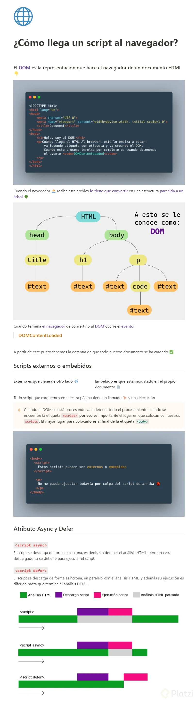

# 10  Curso Profesional de JavaScript


## Clase 1: Bienvenida  ¿Qué significa ser un profesional de JavaScript?
- Richard Kaufman -> https://twitter.com/sparragus


**¿Qué significa ser un profesional de JavaScript?**
‌ > El camino para llegar a ser profesional es largo y duro, no es fácil. Todos necesitamos que nos guíen para saber qué hacer y qué no. Este camino es conocido como la ruta de pasar de Junior a Senior, este es un duro camino lleno de experiencia.

‌**¿Qué forma a un profesional?**
‌
`Te presento una lista de estas cosas que lo forman:`
- Conocimiento del lenguaje.
- Conocimiento de entornos de programación.
- Mejores prácticas.
- Versado en código.
- Herramientas.
- Ética / Profesionalismo.
- Experiencia.

**El lenguaje: JavaScript**
‌
> Debemos tener muy claro cuales son los fundamentos de JavaScript antes de comenzar con esto. Existen features muy raros y hay que estudiarlos. Tenemos que saber cómo funcionan las cosas en JavaScript.

‌
**No fundamentos**
‌
`Los no fundamentos" representan las siguientes características del lenguaje:`
- Promesas (nivel pro).
- Getters, setters: son formas de obtener valor de una variable sin tener que poner this.name.
- Proxies: Sirve para interceptar a una función antes de que se ejecute.
- Generadores: esto es raro, pero vamos a ver que sí es eficiente.

**¿Cómo funciona?**
‌- Este lenguaje corre sobre un motor. JavaScript no contiene clases como otros lenguajes de programación, esto es algo que vuela mucho la cabeza, es muy difícil de entender. Otro feature muy cool que vamos a aprender es event loop, es lo que permite que pueda correr muchos procesos a la vez.

**Entornos de programación**
‌
- Cuando estamos desarrollando lo hacemos para la WEB, para un celular, para seguidores. 
- Existen diferentes entornos que nos ofrecen APIS, tenemos que conocer todo esto. V


**Versado en código**
‌- Esto quiere decir que tenemos que leer mucho código, un lugar hermoso para ponernos a leer código es GitHub. 
- Debemos leer mucho y hacerlo de forma muy constante.

‌**Mejores prácticas**
‌
- No vamos a reinventar la rueda, hay muchas personas que ya han solucionado los problemas más comunes, tenemos que usar estas soluciones, a estas soluciones se les llama: patrones de diseño.

**Ética**
‌
- Esta es la parte más importante de ser un profesional. 

`Un buen profesional cumple con los siguientes valores:`
- Es responsable.
- Entrega a tiempo sus trabajos.
- Sabe decir que no.
- No hace daño.

‌**Experiencia**
- ‌La experiencia no es algo que se pueda enseñar, tenemos que encontrarla nosotros mismos en el camino a ser profesionales. 
- Todo está en nosotros, tenemos que estudiar y practicar mucho.

## Clase 2:  Inicio del proyecto

```
En este curso vamos a estar desarrollando una aplicación llamada: Platzi Video. 
En toda plataforma de video hay un componente especial en el desarrollo, 
tenemos que saber implementar el MediPlayer, en este curso vamos a estar 
desarrollando este feature de forma modular, esto quiere decir que vamos a 
desarrollar plugins que vamos a implementar a nuestro reproductor, extendiéndole sus funcionalidades. 
Vamos a comenzar con un poco de CSS y HTML ya escrito.
```

> Tips 
- button.onclick = () =>video.play(); html5 ya tiene ciertos apis incorporados como video y audio en este caso video.play, video.pause -> [Elementos Video](https://developer.mozilla.org/es/docs/Web/API/HTMLMediaElement/pause) 

## Clase 3: 


## Clase 4: Cómo llega un script al navegador

**¿Cómo llega un script al navegador?**



>Notas=> PD
```
<form id="loginForm" action="/login" method="POST">

  </form>
  <script async src=""> </script>// No detiene el proceso de html (DOM), cuando ya tiene la fuente (source) se detiene todo procesa el js y luego sigue cargando el DOM, si tengo dos archivos con async el primero busca por tamaños ejecuta el pequeño y luego al arvhivo grande 
  <script defer src=""> </script> // Es similar al async y no detiene el proceso del html,  difiere la ejecuccion del js hasta el final 

```

## Clase 5: 

## Clase 6: 

## Clase 7: 


## Clase 8: 


## Clase 9: 


## Clase 10: 