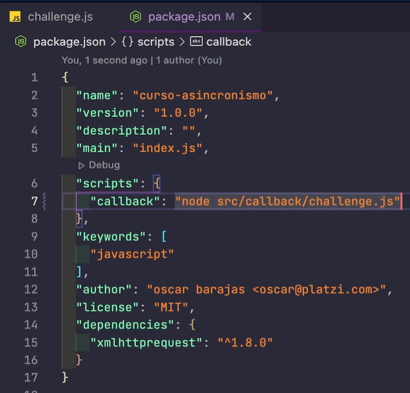
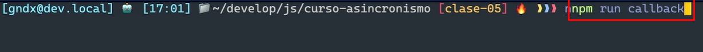
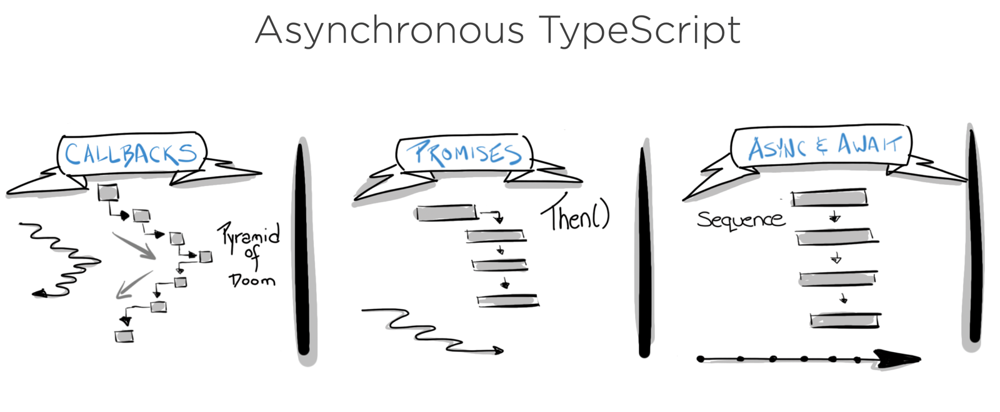

# 12 Curso de Asincronismo con JavaScript

Este nivel es sobre nuevas funciones e implementacones de ECMAScript 5-6-7 

## Clase 1: Bienvenida 
- Profesor Oscar Barajas Tavares  @gdnx 

## Clase 2: Qué es el asincronismo? 
> JavaScript es sincrono y no bloqueante, con un bucle de eventos (concurrente), implementado con un único hilo para sus interfaces de entrada y salida.  

- 🧵 Thread: Thread para Javascript permite realizar programación multihilos en este entorno. En realidad, simula la creación y ejecución de hilos, pero para el desarrollador es lo mismo. Ésto simplifica muchísimo la creación de aplicaciones Javascript.
- 🚫 Bloqueante: Una llamada u operación bloqueante no devuelve el control a la aplicación hasta que se ha completado. Por tanto el thread queda bloqueado en estado de espera.
- 🚿 No bloqueante: Una tarea no bloqueante se devuelve inmediatamente con independencia del resultado. Si se completó, devuelve los datos. Si no, un error.
- 🎞️ Síncrono: Las tareas se ejecutan de forma secuencial, se debe esperar a que se complete para continuar con la siguiente tarea.
- 🚦 Asíncrono: Las tareas pueden ser realizadas más tarde, lo que hace posible que una respuesta sea procesada en diferido. La finalización de la operación I/O (entrada/salida) se señaliza más tarde, mediante un mecanismo específico como por ejemplo un callback, una promesa o un evento, lo que hace posible que la respuesta sea procesada en diferido.
- 🛤️ Paralelismo: El paralelismo es la ejecución simultánea de dos o más tareas. Algunas tareas se pueden dividir en partes más pequeñas que pueden ser resueltas simultáneamente.
- 🎮 Concurrencia: La concurrencia es la capacidad de un algoritmo o programa para ejecutar más de una tarea a la vez. El concepto es similar al procesamiento paralelo, pero con la posibilidad de que muchos trabajos independientes hagan diferentes cosas a la vez en lugar de ejecutar el mismo trabajo.
- 🌀 Eventloop o Loop de eventos: El bucle de eventos es un patrón de diseño que espera y distribuye eventos o mensajes en un programa.


### 📝 Formas de manejar la asincronía en JavaScript:

- 📩 Callbacks: Una función que se pasa como argumento de otra función y que será invocada.
- 🫱🏼‍🫲🏾 Promesas: (implementado en ES6) Una promesa es una función no-bloqueante y asíncrona la cual puede retornar un valor ahora, en el futuro o nunca.
- 🛣️ Async / Await: (implementado en ES2017) Permite estructurar una función asincrónica sin bloqueo de una manera similar a una función sincrónica ordinaria.
- 📌 En JavaScript casi todas las operaciones de I/O (Entrada y Salida) no se bloquean. A esto se le conoce como asíncronismo. Lo único que no es procesado antes de que termine la operación son los callbacks, ya que éstos están amarrados a una operación y esperan a que sea finalizada para poder ejecutarse.
- ⏳ El asincronismo es una manera de aprovechar el tiempo y los recursos de la aplicación, ejecutando tareas y procesos mientras otros son resueltos en background (como la llegada de la información de una API), para posteriormente continuar con las tareas que requerían esa información que no tenías de manera instantánea.
- ⏲️ Un ejemplo fácil de asincronismo vs sincronismo es invitar a unos amigos a una fiesta y ofrecer una parrillada. Primero decides colocar la carne y verduras a la parrilla y luego repartir bebidas y algo para picar (snacks). Si fuera una persona síncrona (Blocking) tendrías que esperar a que la comida de la parrilla esté cocinada y luego atender a los invitados. Pero si fuera una persona asíncrona (Non Blocking) luego de poner la carne al carbón, sacas las bebidas frías de la nevera y compartes con los invitados mientras se cocina la carne. La acción de que la comida en la parrillada esté lista sería un callback que está esperando que finalice el proceso para ejecutarse. Pero otros procesos (como compartir la velada con bebidas y algo de picar) ya podrían irse realizando.

**Cuando preguntan si JavaScript es multi-hilo y asíncrono**


## Mas Datos
- https://www.youtube.com/watch?v=bWvnWhVCHAc
- https://platzi.com/clases/examen/25b3f72b-3f80-47a5-9913-d1e6e8f37641/examen_usuario/
  

## Clase 3: Event Loop? 
>  El bucle de eventos es un patrón de diseño que espera y distribuye eventos o mensajes en un programa.

Para entender el Event Loop, en el siguiente GIF 


Se muestra que la primera tarea asignada (mostrar por Consola la palabra: “start”) pasa por el Call Stack luego se imprime en consola. Cuando el Call Stack tiene el “setTimeout” se debe esperar un periodo de tiempo en este caso 5 segundos para imprimir el mensaje: “Callback Function”, ahí es cuando vemos en Web APIs el timer. Mientras tanto, el código sigue corriendo a la siguiente tarea para imprimir en consola la palabra: “end”.
.

El Event Loop es la tarea asignada (en este ejemplo el “callbackFn()”) para mover del Task Queue al Stack, solo si el stack está vacío:


## Javascript se organiza usando las siguientes estructuras de datos:

- 🗃️ Memory Heap: Región de memoria libre de gran tamaño, dedicada al alojamiento dinámico de objetos (asignado a un montículo). Es compartida por todo el programa y controlada por un recolector de basura que se encarga de liberar aquello que no se necesita, es decir de forma desorganizada se guarda información de las variables y del scope.


- 🔋 Call Stack (pila LIFO: Last-in, First-out): Apila de forma organizada las instrucciones de nuestro programa. La pila de llamadas, se encarga de albergar las instrucciones que deben ejecutarse. Nos indica en que punto del programa estamos, por donde vamos.


-🚗🚕🚙 Task Queue (cola): Cada vez que nuestro programa recibe una notificación del exterior o de otro contexto distinto al de la aplicación, el mensaje se inserta en una cola de mensajes pendientes y se registra su callback correspondiente. El stack debe estar vacío para que esto suceda.

- 🚗🚕 Micro Task Queue: Aquí se agregan las promesas. Esta Queue es la que tiene mayor prioridad.

## Ejemplo


## Enlace 
- http://latentflip.com/loupe/?code=JC5vbignYnV0dG9uJywgJ2NsaWNrJywgZnVuY3Rpb24gb25DbGljaygpIHsKICAgIHNldFRpbWVvdXQoZnVuY3Rpb24gdGltZXIoKSB7CiAgICAgICAgY29uc29sZS5sb2coJ1lvdSBjbGlja2VkIHRoZSBidXR0b24hJyk7ICAgIAogICAgfSwgMjAwMCk7Cn0pOwoKY29uc29sZS5sb2coIkhpISIpOwoKc2V0VGltZW91dChmdW5jdGlvbiB0aW1lb3V0KCkgewogICAgY29uc29sZS5sb2coIkNsaWNrIHRoZSBidXR0b24hIik7Cn0sIDUwMDApOwoKY29uc29sZS5sb2coIldlbGNvbWUgdG8gbG91cGUuIik7!!!PGJ1dHRvbj5DbGljayBtZSE8L2J1dHRvbj4%3D

## Clase 4- 5 : Event Loop? 

- Web APIs JavaScript del lado del cliente: setTimeout, XMLHttpRequest, File Reader, DOM. Node: fs, https.

- API: El término API es una abreviatura de “Application Programming Interface” (Interfaz de programación de aplicaciones en español). Es un conjunto de rutinas que provee acceso a funciones de un determinado software.

- Hoisting: Sugiere que las declaraciones de variables y funciones son físicamente movidas al comienzo del código en tiempo de compilación.

- XML: Lenguaje de marcado creado para la transferencia de información, legible tanto para seres humanos como para aplicaciones informáticas, y basado en una sencillez extrema y una rígida sintaxis. Así como el HTML estaba basado y era un subconjunto de SGML, la reformulación del primero bajo la sintaxis de XML dio lugar al XHTML; XHTML es, por tanto, un subconjunto de XML.

- DOM: El DOM permite acceder y manipular las páginas XHTML como si fueran documentos XML. De hecho, DOM se diseñó originalmente para manipular de forma sencilla los documentos XML.
Events: Comportamientos del usuario que interactúa con una página que pueden detectarse para lanzar una acción, como por ejemplo que el usuario haga click en un elemento (onclick), que elija una opción de un desplegable (onselect), que pase el ratón sobre un objeto (onmouseover), etc.

- Compilar: Compilar es generar código ejecutable por una máquina, que puede ser física o abstracta como la máquina virtual de Java.

- Transpilar: Transpilar es generar a partir de código en un lenguaje código en otro lenguaje. Es decir, un programa produce otro programa en otro lenguaje cuyo comportamiento es el mismo que el original.

## clase 6 : Qué son los Callbacks

- 📩 Callbacks: Una función que se pasa como argumento de otra función y que será invocada.


## clase 7 : Tipo de llamado para consumir API forma -> XMLHTTPRequest

>  XMLHttpRequest es un objeto de JS que permite hacer peticiones hacia servicios en la nube(URLs o APIs).

**Existen 5 estados en un llamado XMLHttpRequest:**
- 0 → Se ha inicializado.
- 1 → Loading (cargando).
- 2 → Se ha cargado.
- 3 → Procesamiento si existe alguna descarga.
- 4 → Completado.

```
if (xhttp.readyState === 4) { // Me ayuda escuchar los estados para saber cuando estará disponible la información 

//Tu bloque 
} 
```
**Métodos y propiedades:**

- xmlhttp.open() → Prepara la petición para ser enviada tomando tres parámetros: prótocolo, url, asíncrono (true).
- xmlhttp.readyState → Retorna el estado de la petición.
- xmlhttp.onreadystatechange → Un eventHandler que es llamado cuando la propiedad readyState cambia.
- xmlhttp.status → Retorna el estado de la respuesta de la petición. (200,400,500)
- xmlhttp.send() → Envía la petición.


**Características del protocolo http:**

- Verbos: Los verbos indican acciones que están asociadas a peticiones y recursos, es decir, sirven para la manipulación de recursos cliente/servidor. Los Verbos http son:

- GET → Solicita un recurso.
- HEAD → Solicita un recurso pero sin retornar información, la estructura de esta petición es igual que get tanto en su headers como estatus. Es útil cuando vamos a utilizar API, para comprobar si lo que vamos a enviar esta correcto y puede ser procesado.
- POST → Sirve para la creación de recursos en el servidor.
- PUT → Actualiza por completo un recurso, reemplaza todas las representaciones actuales del recurso de destino con la carga útil de la petición.
- PATCH → Actualiza parcialmente un recurso.
- DELETE → Elimina un recurso.

**Los códigos de estados del servidor:**

> El código de estado (status codes) sirve para describir el estado de la petición hecha al servidor.

- 1xx → Indican que la petición fue recibida por el servidor, pero está siendo procesada por el servidor.
- 2xx → Indican que la petición fue recibida, aceptada y procesada correctamente.
- 3xx → Indican que hay que tomar acciones adicionales para completar la solicitud.
- 4xx → Indican errores del lado del cliente que hizo mal una solicitud.
- 5xx → Indican errores del servidor. Suelen aparecer cuando existe un fallo en la ejecución en el servidor.


**Los códigos más comunes a la hora de interactuar con una API son:**


- 200 → OK → Indica que todo está correcto.
- 201 → Created → Todo está correcto cuando se hizo una solicitud POST, el recurso se creó y se guardó correctamente.
- 204 → No Content → Indica que la solicitud se completó correctamente pero no devolvió información. Este es común cuando se hacen peticiones con el verbo DELETE.
- 400 → Bad Request → Indica que algo está mal en la petición (no encontró algo).
- 401 → Unauthorized → Significa que antes de hacer una solicitud al servidor nos debemos autenticar.
- 403 → Forbidden → Indica que no tenemos acceso a ese recurso aunque se esté autenticado.
- 404 → Not Found → Indica que no existe el recurso que se está intentando acceder.
- 500 → Internal Server Error → Indica que algo falló, es un error que retorna el servidor cuando la solicitud no pudo ser procesada.


## clase 8 : Tipo de llamado para consumir API forma -> Fetch data

>Para evitar la mala práctica de un Call Hell, no es recomendable exceder de 3 callback, para ello se utilizan las promesas o el Async Away.

> Existen varios tipos de console, dependiendo del navegador, la fuente o el color cambian de acuerdo al tipo

## 𝗖𝗹𝗮𝘀𝗲 #𝟵: 𝗖𝗮𝗹𝗹𝗯𝗮𝗰𝗸 𝗵𝗲𝗹𝗹 

> CallBacks Hell: Consiste en múltiples Callbacks anidados que provocan que el código se vuelva difícil de leer y ‘debuggear’ y por eso se debe evitar.

> forma de ejecutar comando desde consola claro si tiene node_module instalado 
> Ejemplo sintaxis [`node archivo.js`] ->  `node .\src\callback\challenge.js`
> Tambien recuerda que desde tu package.json en la sección de script puedes anclar código para ejecutar Ejemplo 






## 𝗖𝗹𝗮𝘀𝗲 #𝟭𝟬: 𝗤𝘂é 𝘀𝗼𝗻 𝗹𝗮𝘀 𝗽𝗿𝗼𝗺𝗲𝘀𝗮𝘀 


**Las promesas** 
- son asíncronas, por lo que el código continuará su ejecución normalmente y luego dirá si la promesa se resolvió o se rechazó. 
- Por lo que varias promesas pueden llegar a entrar en ejecución al mismo tiempo.

**Las promesas pueden suceder:**
- Ahora 
- En el futuro
- Nunca

**Para crear una promesa:**
- Utilizamos la palabra reservada new seguida de la palabra Promise que es el  constructor de la promesa. Este constructor recibe un único parámetro que es una función, la cuál a su vez, recibe otros dos parámetros: resolve y reject.

**Una Promesa puede estar en uno de los siguientes estados**
- Pendiente pending → Una promesa inicia en este estado: no cumplida, no rechazada:
Una promesa inicialmente está pendiente.
- Cumplida fulfilled → Significa que la operación se completó satisfactoriamente, .then(va => …)
Cuando llamamos a resolve entonces la promesa pasa a estar resuelta.
Cuando una promesa se resuelve entonces se ejecuta la función que pasamos al método .then
- Rechazada rejected → significa que la operación falló, .catch(err => …)
Si llamamos a reject pasa a estar rechazada (obtenemos un error que nos va a indicar la razón del rechazo).
Si la promesa es rechazada entonces se ejecuta la función que pasamos a .catch

## 𝗖𝗹𝗮𝘀𝗲 #𝟭𝟭: 𝗙𝗲𝘁𝗰𝗵𝟭𝟭

- Por medio de Fetch se puede realizar peticiones HTTP asíncronas de JavaScript (JS) con promesas. La API Fetch proporciona una interfaz JS más cómoda para acceder y manipular; fetch() es un método global.

**Para poder usar fetch, primero tenemos que instalarlo**

Ir a la terminal e instalar fetch con: `npm i node-fetch`
Para poder compilar desde VSC, debemos registrar el modulo en package.json, abrimos el archivo y al final se agrega:

## 𝗖𝗹𝗮𝘀𝗲 #𝟭𝟮: 𝗙𝗲𝘁𝗰𝗵 𝗣𝗢𝗦𝗧 𝟭𝟮/𝟮𝟭 📂

**Repasando algunas de las característica del protocolo http:**


> Los verbos indican acciones, estás acciones están asociadas a peticiones y recursos. En línea general sirve para la manipulación de recursos cliente/servidor. Los códigos de estados, los códigos son valores números que tienen un valor semántico.


**Algunos Verbos http son:**

- GET → Sirve para solicitar recurso.
- POST → Sirve para la creación de recursos en el servidor.
- PUT → Sirve actualizar por completo un recurso.
- DELETE → Sirve para eliminar un recurso.

**En el ejemplo de la clase se usa POST para guardar (enviar a la API) información en lugar de obtener con GET (recibir).**

- Hay permisos que se deben tomar en cuenta para que el intercambio sea seguro, hay que especificar el modo (mode), aquí se indica si se permite solicitudes de origen cruzado.

**¿Qué es un origen cruzado?**

- CORS (Cross-Origin Resource Sharing) es un sistema, que consiste en transmitir encabezados HTTP , que determina si los navegadores bloquean el acceso del código JavaScript frontend a las respuestas para solicitudes de origen cruzado.

- La política de seguridad del mismo origen prohíbe el acceso de orígenes cruzados a los recursos. Pero CORS brinda a los servidores web la capacidad de decir que desean optar por permitir el acceso de origen cruzado a sus recursos. MDN

- Un origen tiene dominio/protocolo/puerto, un origen cruzado denominado “Cross  Origin” es la palabra que se utiliza para denominar el tipo de peticiones que se realizan a un dominio diferente del dominio de origen desde donde se realiza la petición.

- Así que si se coloca cors, indica que se permiten ciertas solicitudes predeterminadas de origen cruzado como GET y POST para salvaguardar y evitar manipulaciones maliciosas. 
- fuente -> https://javascript.info/fetch-crossorigin


## 𝗖𝗹𝗮𝘀𝗲 #𝟭𝟯: 𝗙𝘂𝗻𝗰𝗶𝗼𝗻𝗲𝘀 𝗮𝘀í𝗻𝗰𝗿𝗼𝗻𝗮𝘀 𝟭𝟯/𝟮𝟭 🎢

🔁 **¿Qué es una función asíncrona?**

> La declaración de función async define una función asíncrona que devuelve un objeto, lo cual permite a un programa correr una función sin congelar todo la compilación.

> Dada que la finalidad de las funciones async/await es simplificar el comportamiento del uso síncrono de promesas, se hace más fácil escribir promesas.

**La estructura se compone por las palabras reservadas async y await:**
- La palabra async antes de la función, hace que la función devuelva una promesa.
- La palabra await se utiliza dentro de las funciones async, lo que hace que el programa espere hasta que la variable(promesa) se resuelva para continuar.


**Resumen de metodos**



## Clase 𝟭𝟲: 𝗚𝗲𝗻𝗲𝗿𝗮𝘁𝗼𝗿𝘀 𝟭𝟲

> Un generador en JavaScript consta de una función generadora que muestra un objeto iterable Generator. 
> La palabra reservada yield se usa para pausar y reanudar una función generadora.

[Fuente](https://www.digitalocean.com/community/tutorials/understanding-generators-in-javascript-es)


`La estructura del Generador consta con la palabra function seguido de un asterísco * : function* ésta es una función generadora heredada.
El resultado que se quiere obtener se coloca al lado derecho de yield, puede ser de cualquier tipo (string, numérico, objetos, etc) y se puede tener tantos yield que se desee.`

## Ejemplo 

```
function* gen() {
    yield 1;
    yield 2;
    yield 3;
  }
  
  const g = gen();
  console.log(g.next().value);
  console.log(g.next().value);
  console.log(g.next().value);
```
```

//Uso de elementos en un solo bloque iterable 
(async () => {
  try {
    const videos = await fetchData(API);
    let view = `
    ${videos.items.map(video => `
      <div class="group relative">
        <div
          class="w-full bg-gray-200 aspect-w-1 aspect-h-1 rounded-md overflow-hidden group-hover:opacity-75 lg:aspect-none">
          
        </div>
        <div class="mt-4 flex justify-between">
          <h3 class="text-sm text-gray-700">
            <span aria-hidden="true" class="absolute inset-0"></span>
            ${video.snippet.title}
          </h3>
        </div>
      </div>
    `).slice(0,4).join('')}

    `;
  } catch {
    console.log(error);
  }
})();
```


