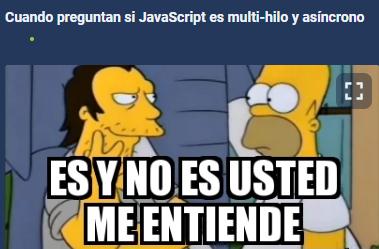
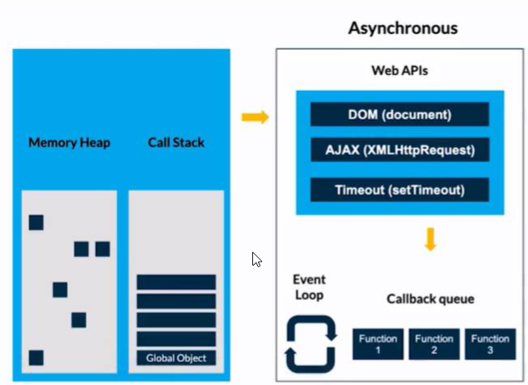
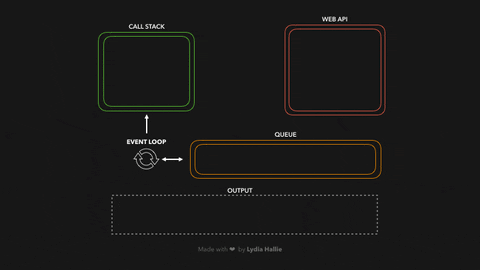

# 12 Curso de Asincronismo con JavaScript

Este nivel es sobre nuevas funciones e implementacones de ECMAScript 5-6-7 

## Clase 1: Bienvenida 
- Profesor Oscar Barajas Tavares  @gdnx 

## Clase 2: Qué es el asincronismo? 
> JavaScript es sincrono y no bloqueante, con un bucle de eventos (concurrente), implementado con un único hilo para sus interfaces de entrada y salida.  

- 🧵 Thread: Thread para Javascript permite realizar programación multihilos en este entorno. En realidad, simula la creación y ejecución de hilos, pero para el desarrollador es lo mismo. Ésto simplifica muchísimo la creación de aplicaciones Javascript.
- 🚫 Bloqueante: Una llamada u operación bloqueante no devuelve el control a la aplicación hasta que se ha completado. Por tanto el thread queda bloqueado en estado de espera.
- 🚿 No bloqueante: Una tarea no bloqueante se devuelve inmediatamente con independencia del resultado. Si se completó, devuelve los datos. Si no, un error.
- 🎞️ Síncrono: Las tareas se ejecutan de forma secuencial, se debe esperar a que se complete para continuar con la siguiente tarea.
- 🚦 Asíncrono: Las tareas pueden ser realizadas más tarde, lo que hace posible que una respuesta sea procesada en diferido. La finalización de la operación I/O (entrada/salida) se señaliza más tarde, mediante un mecanismo específico como por ejemplo un callback, una promesa o un evento, lo que hace posible que la respuesta sea procesada en diferido.
- 🛤️ Paralelismo: El paralelismo es la ejecución simultánea de dos o más tareas. Algunas tareas se pueden dividir en partes más pequeñas que pueden ser resueltas simultáneamente.
- 🎮 Concurrencia: La concurrencia es la capacidad de un algoritmo o programa para ejecutar más de una tarea a la vez. El concepto es similar al procesamiento paralelo, pero con la posibilidad de que muchos trabajos independientes hagan diferentes cosas a la vez en lugar de ejecutar el mismo trabajo.
- 🌀 Eventloop o Loop de eventos: El bucle de eventos es un patrón de diseño que espera y distribuye eventos o mensajes en un programa.

### 📝 Formas de manejar la asincronía en JavaScript:

- 📩 Callbacks: Una función que se pasa como argumento de otra función y que será invocada.
- 🫱🏼‍🫲🏾 Promesas: (implementado en ES6) Una promesa es una función no-bloqueante y asíncrona la cual puede retornar un valor ahora, en el futuro o nunca.
- 🛣️ Async / Await: (implementado en ES2017) Permite estructurar una función asincrónica sin bloqueo de una manera similar a una función sincrónica ordinaria.
- 📌 En JavaScript casi todas las operaciones de I/O (Entrada y Salida) no se bloquean. A esto se le conoce como asíncronismo. Lo único que no es procesado antes de que termine la operación son los callbacks, ya que éstos están amarrados a una operación y esperan a que sea finalizada para poder ejecutarse.
- ⏳ El asincronismo es una manera de aprovechar el tiempo y los recursos de la aplicación, ejecutando tareas y procesos mientras otros son resueltos en background (como la llegada de la información de una API), para posteriormente continuar con las tareas que requerían esa información que no tenías de manera instantánea.
- ⏲️ Un ejemplo fácil de asincronismo vs sincronismo es invitar a unos amigos a una fiesta y ofrecer una parrillada. Primero decides colocar la carne y verduras a la parrilla y luego repartir bebidas y algo para picar (snacks). Si fuera una persona síncrona (Blocking) tendrías que esperar a que la comida de la parrilla esté cocinada y luego atender a los invitados. Pero si fuera una persona asíncrona (Non Blocking) luego de poner la carne al carbón, sacas las bebidas frías de la nevera y compartes con los invitados mientras se cocina la carne. La acción de que la comida en la parrillada esté lista sería un callback que está esperando que finalice el proceso para ejecutarse. Pero otros procesos (como compartir la velada con bebidas y algo de picar) ya podrían irse realizando.

**Cuando preguntan si JavaScript es multi-hilo y asíncrono**

## Mas Datos
- https://www.youtube.com/watch?v=bWvnWhVCHAc
- https://platzi.com/clases/examen/25b3f72b-3f80-47a5-9913-d1e6e8f37641/examen_usuario/
  

## Clase 3: Event Loop? 
>  El bucle de eventos es un patrón de diseño que espera y distribuye eventos o mensajes en un programa.

Para entender el Event Loop, en el siguiente GIF 

Se muestra que la primera tarea asignada (mostrar por Consola la palabra: “start”) pasa por el Call Stack luego se imprime en consola. Cuando el Call Stack tiene el “setTimeout” se debe esperar un periodo de tiempo en este caso 5 segundos para imprimir el mensaje: “Callback Function”, ahí es cuando vemos en Web APIs el timer. Mientras tanto, el código sigue corriendo a la siguiente tarea para imprimir en consola la palabra: “end”.
.

El Event Loop es la tarea asignada (en este ejemplo el “callbackFn()”) para mover del Task Queue al Stack, solo si el stack está vacío:

## Javascript se organiza usando las siguientes estructuras de datos:

- 🗃️ Memory Heap: Región de memoria libre de gran tamaño, dedicada al alojamiento dinámico de objetos (asignado a un montículo). Es compartida por todo el programa y controlada por un recolector de basura que se encarga de liberar aquello que no se necesita, es decir de forma desorganizada se guarda información de las variables y del scope.

- 🔋 Call Stack (pila LIFO: Last-in, First-out): Apila de forma organizada las instrucciones de nuestro programa. La pila de llamadas, se encarga de albergar las instrucciones que deben ejecutarse. Nos indica en que punto del programa estamos, por donde vamos.

-🚗🚕🚙 Task Queue (cola): Cada vez que nuestro programa recibe una notificación del exterior o de otro contexto distinto al de la aplicación, el mensaje se inserta en una cola de mensajes pendientes y se registra su callback correspondiente. El stack debe estar vacío para que esto suceda.

- 🚗🚕 Micro Task Queue: Aquí se agregan las promesas. Esta Queue es la que tiene mayor prioridad.

## Ejemplo

## Enlace 
- http://latentflip.com/loupe/?code=JC5vbignYnV0dG9uJywgJ2NsaWNrJywgZnVuY3Rpb24gb25DbGljaygpIHsKICAgIHNldFRpbWVvdXQoZnVuY3Rpb24gdGltZXIoKSB7CiAgICAgICAgY29uc29sZS5sb2coJ1lvdSBjbGlja2VkIHRoZSBidXR0b24hJyk7ICAgIAogICAgfSwgMjAwMCk7Cn0pOwoKY29uc29sZS5sb2coIkhpISIpOwoKc2V0VGltZW91dChmdW5jdGlvbiB0aW1lb3V0KCkgewogICAgY29uc29sZS5sb2coIkNsaWNrIHRoZSBidXR0b24hIik7Cn0sIDUwMDApOwoKY29uc29sZS5sb2coIldlbGNvbWUgdG8gbG91cGUuIik7!!!PGJ1dHRvbj5DbGljayBtZSE8L2J1dHRvbj4%3D

## Clase 4- 5 : Event Loop? 

- Web APIs JavaScript del lado del cliente: setTimeout, XMLHttpRequest, File Reader, DOM. Node: fs, https.

- API: El término API es una abreviatura de “Application Programming Interface” (Interfaz de programación de aplicaciones en español). Es un conjunto de rutinas que provee acceso a funciones de un determinado software.

- Hoisting: Sugiere que las declaraciones de variables y funciones son físicamente movidas al comienzo del código en tiempo de compilación.

- XML: Lenguaje de marcado creado para la transferencia de información, legible tanto para seres humanos como para aplicaciones informáticas, y basado en una sencillez extrema y una rígida sintaxis. Así como el HTML estaba basado y era un subconjunto de SGML, la reformulación del primero bajo la sintaxis de XML dio lugar al XHTML; XHTML es, por tanto, un subconjunto de XML.

- DOM: El DOM permite acceder y manipular las páginas XHTML como si fueran documentos XML. De hecho, DOM se diseñó originalmente para manipular de forma sencilla los documentos XML.
Events: Comportamientos del usuario que interactúa con una página que pueden detectarse para lanzar una acción, como por ejemplo que el usuario haga click en un elemento (onclick), que elija una opción de un desplegable (onselect), que pase el ratón sobre un objeto (onmouseover), etc.

- Compilar: Compilar es generar código ejecutable por una máquina, que puede ser física o abstracta como la máquina virtual de Java.

- Transpilar: Transpilar es generar a partir de código en un lenguaje código en otro lenguaje. Es decir, un programa produce otro programa en otro lenguaje cuyo comportamiento es el mismo que el original.

## clase 6 : Qué son los Callbacks

- 📩 Callbacks: Una función que se pasa como argumento de otra función y que será invocada.