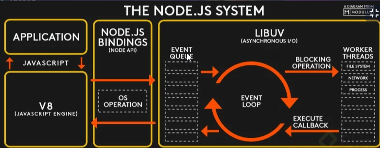
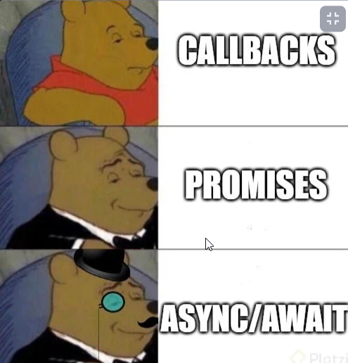
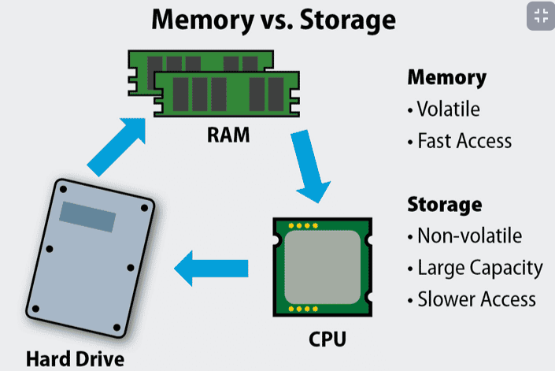

# 01 - Avanzado JS - Curso de Fundamentos de Node.js

Descubre que es Node.js, y por que es tan potente. Si ya has trabajado con Node.js, vas a profundizar conocimientos sobre como funciona por debajo todo el codigo que ya has hecho.

## Clase 1: Bienvenida 
- Profesor Carlos Hernández  @gdnx 
- [Documentaci��n de Node.js](https://nodejs.dev/learn)

## Clase 2: Node: or��genes y filosof��a 

**Origenes**
- NodeJS es un entorno de ejecución de JavaScript fuera del navegador. 
- Se crea en 2009, orientado a servidores. 
- Es muy importante que está fuera del navegador debido a que ya no es necesario un navegador web para ejecutar código JavaScript.
- Open Source 


**Características principales de JavaScript:**

- Concurrencia: Es monohilo, con entradas y salidas asíncronas.
- Motor V8: Creado por Google en 2008 para Chrome. Escrito en C++. 
- Convierte JS en código máquina en lugar de interpretarlo en tiempo real.
- Todo funciona en base a Módulos, que son piezas de código muy peque?as que modularizan nuestros sistemas y ayudan a entender mejor el código.
- Orientación a Eventos, existe un bucle de eventos que se ejecuta constantemente. Lo que nos permite programar de forma reactiva, lo que quiere decir que podemos programar con la lógica de Cuando sucede algo, se ejecuta esta parte de mi código y eso a su vez dispara otra parte.

## Clase 3 - EventLoop: asíncrona por diseño

**Event Loop**
- Un proceso con un ++bucle ++que gestiona, de forma asíncrona, todos los eventos de tu aplicación.
- Se encarga de resolver los eventos ultra rápidos que llegan desde el Event Queue. 
- En caso de no poder resolverse rápido, envió el evento al Thread Pool.

**Event Queue**
- Contiene todos los eventos que se generan por nuestro código (Funciones, peticiones, etc.), 
 estos eventos quedan en una cola que van pasando uno a uno al Event Loop.

**Thread Pool** 
- Se encarga de gestionar los eventos de forma asíncrona. 
- Una vez terminado lo devuelve al Event Loop. 
- El Event Loop vera si lo pasa a Event Queue o no.
- Generar hilos por cada proceso apoyandote en el procesador 
  

**Ejemplo**




## Clase 4: Monohilo: implicaciones en diseño y seguridad

El hecho de que sea monohilo lo hace delicado en el sentido de que puede ejecutarse algo que corte el código y detenga el programa, como la ausencia de sintaxis o una variable pendiente por definir.

Aquí se pueden ver los problemas de seguridad y los Updates en este tema. Muy interesante leerlo para entender cómo atacan y saltan el código y cómo lo resolvieron.

https://nodejs.org/en/blog/vulnerability/february-2020-security-releases/

**PROCESO DE NODE**

    1.- Va a abrirse un proceso, ese proceso es un proceso de node
    2.- Interpreta todo el archivo
    3.- Convertirlo a código maquina
    4.- Prepara todo lo que necesita para ejecutarse
    5.- Se ejecuta
    6.- Se cierra el proceso, y termina

**DESVENTAJAS MONOHILO**

    - Si no se manejan bien los errores y uno truena, ya no continua con los procesos posteriores
    - Debes estar pendiente de todo el código
    - Si al romper un fragmento de codigo este rompe toda la estructura. 

```
/*Metodo que sigie hasta el infinito */ 
setInterval(()=>{

    console.log("Sigo activo");

}, 1000) 


let i = 0;
setInterval(function () {
    console.log(i++);
    try {
        if (i === 5) {
            var a = 3 + z;
        }
    } catch (error) {
        console.error(error)
    }
}, 1000)

``` 

## Clase 5:  Configurar las variables de entorno en Node.js

Las variables de entorno son una forma de llamar información de afuera a nuestro software, sirve para definir parámetros sencillos de configuración de los programas de modo que puedan ejecutarse en diferentes ambiente sin necesidad de modificar el código fuente de un script.

El objeto process nos da información sobre el procesos que está ejecutando este script.
La propiedad env es la que nos da acceso a las variables de entorno de manera sencilla.

- npm i dotenv -D
- npm i node-env-file

**Enlace**
https://medium.com/the-node-js-collection/making-your-node-js-work-everywhere-with-environment-variables-2da8cdf6e786

## Clase 5: Herramientas para ser más felices: Nodemon y PM2

**Nodemon esto es para desarrollo**https://nodemon.io/
- Paso 0: Clase debes tener instalada node  y tu packaheconfig.js 
- Paso 1: Debemos instalar nodemon ->`npm install -g nodemon`
- Paso 2: Para windows pues apuntas al archivo que deseas escuchar los cambios -> `npx nodemon archivo.js`  
- 

**PM2 -> Esto es para producción** https://pm2.keymetrics.io/
- Paso 0: Clase debes tener instalada node  y tu packaheconfig.js 
- Paso 1: Debemos instalar nodemon ->`npm install pm2 -g`
- Paso 2: Para windows pues apuntas al archivo que deseas escuchar los cambios -> `pm2 start nombrearchivo.js`  
- 


## Clase 7 Callbacks


> Callbacks: Una función que se pasa como argumento de otra función y que será invocada.

**Caracteristicas**
- Cuando nosotros realizamos funciones asíncronas no tendremos realmente el control de en que momento se ejecutaran o se mostraran, por eso si queremos que una función asíncrona se muestre en un momento determinado después de que sucediera cierto evento, debemos de llamar o invocar esta función asíncrona dentro de otra función, para esto se usan los callbacks, son parámetros que reciben funciones para que se ejecuten dentro de un evento ya determinado.


**PD**
- En js las funciones son objetos de primera clase, primer nivel, son ciudadanos de primera clase que puedo usarlos como quiera. Pasarlos como parámetro.


## Clase 8:  Callback Hell: refactorizar o sufrir

## 𝗖𝗹𝗮𝘀𝗲 9: 𝗤𝘂é 𝘀𝗼𝗻 𝗹𝗮𝘀 𝗽𝗿𝗼𝗺𝗲𝘀𝗮𝘀

**Las promesas**
- son asíncronas, por lo que el código continuará su ejecución normalmente y luego dirá si la - promesa se resolvió o se rechazó.
- Por lo que varias promesas pueden llegar a entrar en ejecución al mismo tiempo.


**Las promesas pueden suceder:**

- Ahora
- En el futuro
- Nunca


**Para crear una promesa:**

Utilizamos la palabra reservada new seguida de la palabra Promise que es el constructor de la promesa. Este constructor recibe un único parámetro que es una función, la cuál a su vez, recibe otros dos parámetros: resolve y reject.
Una Promesa puede estar en uno de los siguientes estados

Pendiente pending → Una promesa inicia en este estado: no cumplida, no rechazada: Una promesa inicialmente está pendiente.
Cumplida fulfilled → Significa que la operación se completó satisfactoriamente, .then(va => …) Cuando llamamos a resolve entonces la promesa pasa a estar resuelta. Cuando una promesa se resuelve entonces se ejecuta la función que pasamos al método .then
Rechazada rejected → significa que la operación falló, .catch(err => …) Si llamamos a reject pasa a estar rechazada (obtenemos un error que nos va a indicar la razón del rechazo). Si la promesa es rechazada entonces se ejecuta la función que pasamos a .catch

```

//sintaxis  declaración 
const funcionEjemplo = (valor)=>{
    let MiPromesa = new Promise( (resolve, reject)=>{
        if (valor===1){
            resolve('Encendido');
        }else if(valor===0){
            reject('Apagado');
        }else{
            resolve('Sigue intentando');
        }
    });

    return  MiPromesa; 
}

//Ejecución 

funcionEjemplo(1)
.then() 
.catch( error => { // Hace parte de a sintaxis de las promesas puedo captar los reject
    console.error('Ha habido un error:');
});

```


## Clase 10 Async/await

**Para evitar que todo se vea asíncrono, y que la sintáxis sea más legible las operaciones secuenciales como hacer un archivo que se procese, subirlo para tener una URL y de ahí mandarla a una base de datos.
Async y Await nos permite definir una función de forma explícita como asíncrona y esperar a que la función termine. No estará bloqueando el hilo principal, pues estará esperando a que se resuelva con el event loop**
**Ejemplo Código**



## Clase 11-  Globals 

**característica**
- Los modulos globales son módulos del core.
- En Node se tiene el objeto global que contiene los métofos y propiedads básicas. 
- Una de las funciones muy usadas en Node es setInterval, clearInterval, para evaluar en n tiempo si el servidor está caído o no.
- Si no tengo que usar variables globales no usarlas, pues son un foco de problemas
- En node This es un alías de global 
  

##  Clase 12 - FileSystem 


>El file system es un módulo que nos va a permitir acceder archivos de nuestro sistema, también nos permite leer, modificar, cambiarles el nombre, entre otras cosas.

**Como**
Para usar File system tenemos que hacer un require

**Características**

- El file system provee una API para interactuar con el sistema de archivos  cerca del estándar POSIX.
- POSIX es el estándar para interfaces de comando y shell, las siglas las significan: “Interfaz de sistema operativo portátil” la X de POSIX es por UNIX.
- El file system nos permite acceder archivo del sistema, leer, modificar., escribirlos, es muy útil para precompiladores, para lo que requiera hacer grabados de disco, o bases de datos en node requieren un uso intensivo de Node.- Todo lo que hagamos con modulos por buenas prácticas son asincronos, pero tienen una version sincrona no recomendada pues pordría bloquear el event loop con más facilidad.
**Ejemplo Código**
[Ejemplo system](practica/moduls/filesytem.js)

## Clase 13 - Console

>Con console podemos imprimir todo tipo de valores por nuestra terminal.


**Ejemplo**

- console.log: recibe cualquier tipo y lo muestra en el consola.
- console.info: es equivalente a log pero es usado para informar.
- console.error: es equivalente a log pero es usado para errores.
- console.warn: es equivalente a log pero es usado para warning.
- console.table: muestra una tabla a partir de un objeto.
- console.count: inicia un contador autoincremental.
- console.countReset: reinicia el contador a 0.
- console.time: inicia un cronometro en ms.
- console.timeEnd: Finaliza el cronometro.
- console.group: permite agrupar errores mediante identación.
- console.groupEnd: finaliza la agrupación.
- console.clear: Limpia la consola.
**Ejemplo Código**
[Ejemplo log](practica/moduls/Log.js)

## Clase 14 - Errores (try / catch)

> Cuando se genera un error, node propaga el error hacia arriba, hasta que esta es caputado. si el error no se captura node se detiene.


> Pd: Siempre que sea posible debemos capturar todos los errores que se puedan generar en nuestros hilos

**Características**
- Nota importante sobre el correcto manejo de errores en Javascript. 
- Existen funciones que no ‘lanzan’ explícitamente los errores, sino que los manejan dentro de sus propios parámetros de llamada, y es ahí en donde nosotros como buenos programadores debemos canalizarlos al ‘catch’ correspondiente, lanzándolos de forma explícita para que el error se maneje de la mejor forma posible. 

`if (error) throw new Error(error) // Forma de lanzar errores`

**Ejemplo Código**
[Ejemplo try catch](practica/moduls/trycatch.js)

## Clase - Procesos hijo

> Un proceso es algo que se ejecuta y termina de ejecutarse. Con child process podremos acceder a la terminal por medio de Node.js

**Caraterísticas**
- Node nos permite ejecutar varios hilos de procesos desde el suyo propio, sin importar de que sea este proceso, es decir, puede ejecutar procesos de Python, otros procesos de Node u otro proceso que tengamos en nuestro sistema.

- Para poder usar estos procesos usamos el modulo de child-process, este trae dos métodos que nos permitirá ejecutar los procesos que deseemos. El método exec y el método spawn.

- El método exec nos permite ejecutar un comando en nuestro sistema, recibe como parametros el comando entero que deseemos y como segundo parámetro un callback con tres parámetros, un error, un stdout y un stderr.


- El método spawn es parecido al método exec pero un poco más complejo, permitiéndonos conocer su estado y que datos procesa en cada momento del estado de comando ejecutado.

**Como**

- Paso 1: Debemos importar en nuestro archivo js `const { exec } = require('child_process')`
- Paso 2: Podemos crear un arreglo con nuestros comandos 
```
let processes = [
    'ls -la',
    'node consola.js'
]
```
- Paso 3: Podemos ejecutar con la palabra reservada `exec()` ó `spawn`

``` 
const { exec, spawn } = require('child_process')

let processes = [
    'ls -la',
    'node consola.js'
]

exec(processes[1], (err, stdout, sterr) => {
    if (err) {
        console.error(err)
        return false
    }
    console.log(stdout)
})


let processSpawn = spawn('ls', ['-la'])

console.log(processSpawn.pid)
console.log(processSpawn.connected)

processSpawn.stdout.on('data', (datos) => {
        console.log('¿Está muerto?')
        console.log(process.killed)
        console.log(datos.toString())
    }
)
processSpawn.on('exit', () => {
        console.log('El proceso termino')
        console.log(processSpawn.killed)
    }
)

``` 
**Ejemplo Código**
- [Ejemplo ](practica/moduls/ProcesoConsolaLinuxWindows.js)

**Documentación**
- https://nodejs.org/api/process.html

## Clase 16 - Módulos nativos en C++

> Node Js, nos permite compilar modulos nativos en este caso tiene buena compactibilidad con Js. 

**Como**
- Paso 1: Es algo complejo debemos importar ciertas librerias para este caso podemos instalar  `npm i -g node-gyp`, reuerda que debes tener privilegios como administrador
- Paso 2: Necesitamos código de archivo fuente, podemos coger un archivo fuente de ejemplo aquí -> https://nodejs.org/api/addons.html#addons_hello_world
- Paso 3: Codificamos nuestros métodos ejemplo -> Ejemplo [Ejemplo A ](practica/moduls/nativos/hola.cc)
- Paso 4: Creamos nuestro archivo Json para la comunicación -> Ejemplo [Ejemplo B ](practica/moduls/nativos/binding.gyp)
- Paso 5: Necesitamos decirle a Node Js configura este modulo como ya instalamos node-gyp prodedemos a ejecutar el siguiente comando `node-gyp configure` necesitamos estar en el directorio donde se ecnuentre el binding.gyp
- Paso 6: Se genera un directorio nuevo llamado build practicamente crea un modulo con las funciones de C++ que programaste ejecutamos el siguiente comando `node-gyp build`, como resultado se crea otra carpeta release
- Paso 7: creamos nuestro archivo js  para poder importar el modulo nuevo jejej ejemplo > Ejemplo [Ejemplo C ](practica/moduls/nativos/index.js)

## Clase 17 - HTTP

**Modulo HTTP**
> Nos permite conectarnos con un servidor o crear uno.


`
Node nos ofrece el modulo HTTP el cual nos permite principalmente crear un servidor en nuestro computador.
En este modulo encontraremos todo lo necesario que necesitamos para crear un sistema de rutas, que responderá cada ruta, los header que podrá mandar, etc.
Uno de los métodos principales de este modulo es createServer, el cual nos permitirá abrir un puerto para crear el servidor.
`
```
const http = require('http');

http.createServer(router).listen(3000);

function router (req, res) {
    console.log('Nueva petición');
    console.log(req.url);

    switch (req.url) {
        case '/hola':
            res.write('Hola, que tal');
            res.end();
            break;

        default:
            res.write('Error 404: No se lo que quieres');
            res.end();
    }
}

console.log("Escuchando http en el puerto 3000");
```

## Clase 17 - OS

**módulo os:**
- El modulo de Node para OS me permite acceder a elementos de muy bajo nivel, y es útil en diferentes contextos.
- Permite acceder a todo lo que normalmente solo se puede acceder desde lenguaje de muy bajo nivel, como por ejemplo acceder a la memoria ram, N° de cores, N° de nucleos, tipo de sistema de archivos, etc.


## Clase 19 - Process

**módulo Process:**
> Objeto de proceso es un objeto global que proporciona información y control sobre el proceso actual de Node.js

> Podremos entender y ver qué pasa con el Process, podremos escuchar señales, escuchar lo que necesitemos y después hacer cosas con ellos.


**Carácteristicas:**
- beforeExit → Es para enviar algo antes que pare un proceso.
- exit → Es para matar un proceso.
- uncaughtException → Permite capturar cualquier error que no fue caputurado previamente.
- uncaughtRejection → Permite capturar cualquier error de promesas que se han rechazado


`
⚠️ Atención uncaughtException no esta diseñado para remplazar el manejo de errores que debería de tener tu aplicación y debería ser tu últmo recurso para tratar de manejar errores⚠️

Hago este aporte porque tal vez muchos tengan la misma idea y lo vi en los comentarios. uncaughtException es un mecanismo crudo para manejar errores. Sobreescribira la manera por default en que Node maneja un error que no tiene ningun catch de errores. Tratar de resumir normamlente una uncaught exception puede corromper completamete tu programa. Su uso correcto es hacer operaciones sincronas para limpiar recursos antes de apagar el proceso. No resumir el programa.
`

## Clase 20 - Gestión de paquetes: NPM y package.json

**Qué es**
- npm (Node Package Manager) es un administrador de paquetes que permiten ejecutar funciones ya realizadas y validadas y de esta manera acelerar y asegurar la calidad de neustro proceso de desarrollo.
- Es simplemente un aditamento que le puedes inyecta a tu proyecto, con el proposito de la filosofía de no reinventar la rueda.
- Existen muchos paquetes funcionales que provienen de npm, estos paquetes pueden tener muchos otros paquetes como dependencias y es importante para la seguridad de mi código revisar los paquetes.
- NPM es un gestor de paquetes que son creados por terceros, utilizados por cualquier persona. Estos paquetes pueden llegar a ser tan simples como la suma de dos números o tan complejos como react.js framework de frontend.

**NPM es un gestor de paquetes**

- Podemos instalar con npm init crea el -> package.json 
- Podemos encontrar varias paquetes en www.npmjs.com -> Comando básico -> `npm install *paquete*`

**Recuerda**
- Tampoco vamos a instalar muchísimos paquetes, pero tener los necesarios y mantenerlos al día nos ayudará.

¯\＿(ツ)＿/¯
¯\＿(ツ)＿/¯
¯\＿(ツ)＿/¯
¯\＿(ツ)＿/¯
¯\＿(ツ)＿/¯


## Clase 21 - 22 - Construyendo módulos: Require e Import

**Qué es**
> En Node tenemos una forma de importar módulos la cual es con el método require, el cual es la forma por defecto de importar módulos, ya sean nuestros propios módulos como los de otras personas en nuestros proyectos JS, pero suele haber mucha confusión debido al import.

**Caraterístcas**

- Import es la forma de importar módulos en Ecmascript, el cual es un estándar de JavaScript para la web, esta forma de importar en teoría Node no la acepta oficialmente, a no ser que usemos su modo de .mjs.
- Pero gracias a compiladores como Babel, nosotros podremos utilizar estas normas de Ecmascript en nuestro código para cuando se ejecute se transforme en código que sea aceptable por Node.
- Se recomienda en la mayoría de veces la importación con require.
- El import de ES+6 todavía no viene incluido en Node.js, solo viene de forma experimental, en 2021 ya este no es experimental
- Node ya soporta los módulos de la sintáxis ES6 solo hay que agregar esta linea en el package.json y con esto ya se podrá trabajar con los archivos en extencion .js en lugar de .mjs

```
  "type": “module”,
  "name": "fundamentosnodejs",
  "version": "1.0.0",
  "description": "una descripción",
  "main": "index.js",
  "type": "module",
```

**Enlace**
- https://www.youtube.com/watch?v=FZBbX9f6b78&ab_channel=Fazt

**Modulos Mas usados**
- La función de cifrado de bcrypt nos permite construir una plataforma de seguridad utilizando contraseñas encriptadas con Salt.

```
const bcrypt = require("bcrypt");
const password = "NuncaParesDeAprender2022";

bcrypt.hash(password, 5, function(err, hash){
	console.log(hash)
});
// La consola nos entregaria una contraseña distinta en cada oportunidad.

// Para evaluar si una contraseña concuerda con un hash
bcrypt.compare(password, hash, function(error, result){
	console.log(result)
	console.log(error)
})
// Nos va a responder **true** *(en el result)* o **false** *(en el error)* dependiendo si la contraseña puede generar el hash
```

- Moment. js es una librería que nos permite solventar estos problemas e implementa un sistema de manejo de fechas mucho más cómodo.

> Nota: 
- OJO!!! Gente NO utilicen moment, es una libreria que se creo hace mucho tiempo y sirvio en su tiempo, ahora hay mejores alternativas, la misma gente de moment te recomiendan usar otras librerias mas modernas
- days js y date fns son buenas alternativas

```
const moment = require('moment')
const ahora = moment();

// Para formatear una fecha
ahora.format('MM/DD/YYYY HH:MM A'); // 04/11/2022 20:10 PM

// Para validad una fecha
moment('2020-04-11').isValid(); // Nos dara **true** o **false** dependiendo de si la fecha es valida o no

// Para encontrar cuanto tiempo ha pasado hasta hoy
moment('2018-04-11').fromNow(); // Hace 2 años

// Para agregar o eliminar años, días o meses
moment('2020-04-11').add(1, 'years'); // 2021-04-11
moment('2020-04-11').subtract(1, 'years'); // 2019-04-11
```

- Sharp puede convertir imágenes grandes en imágenes JPEG, PNG más pequeñas y compatibles con la web de diferentes dimensiones.

```
const sharp = require('sharp')

// La siguiente reducira una imagen de 120x120 o cualquier tamaño a 80x80 y lo guardara en una imagen mas pequeña sin eliminr la original.
sharp('imagen.png').resize(80, 80).toFile('imagen_80x80.png');
```

## Clase 23 Datos almacenados vs en memoria
 
 **Qué**
 > Todo esto funciona por tiempos, cuando vas a escribir en memoria todo funciona súper rápido, sin embargo, cuando tienes que escribir en disco el proceso es más lento.

> Especialmente los discos duros antiguos (O sea, los que no son SSD) son súper lentos. Aunque los SSD sea más rápidos, siguen siendo más lentos que la memoria.

**Datos en memoria**
- Es más rápido, debido a la distancia entre la CPU y la memoria RAM.
- Leer y escribir archivos de manera rápida.


**Datos almacenados**
- Permite almacenar mayor información, pero se gestiona de forma más lenta que la RAM.
- Los tiempos de lectura y escritura son más lentos que escribir y leer en memoria.
- Para poder almacenar información que parece que se va a gestionar rápido, pero a medida del tiempo se queda en memoria, se puede mandar al disco duro y liberar la memoria.




##  Clase 23 - Buffers 


 **Qué**

> Un buffer es un espacio de memoria (en la memoria ram), en el que se almacenan datos de manera temporal.

- Es la forma mas cruda en la que se pueden almacenar los datos. (Se guardan en bytes y  no se especifica el tipo de dato)
-  En la consola, los datos se muestran en formato hexadecimal.
- Los Buffers en consola se representan cómo números base 16 ó hexadecimales.
  

**¿Por qué usar Buffers?**
JavaScript puro aunque bueno con cadenas de texto unicode no maneja muy bien datos binarios. 

Esto esta bien en el navegador donde casi toda la data proviene de strings. 

Sin embargo los servidores con Node también tienen que lidiar con TCP strams o con leet y escribir en el sistema de archivos. Ambos necesitan usar streams de datos binarios.

Una manera de manejar esto es usar strings que es lo que Node intento hacer primero. Este `approach` resulto bastante problematico porque tiene una tendencia a romperse de maneas extrañas y misteriosas.


**Creacion de un bufer básico**
Para crear un buffer, con 4 espacios por ejemplo, podemos hacerlo con la siguiente sintaxis.

```
console.log(buffer); 
// Output:
//<Buffer 00 00 00 00>

let buffer2 = Buffer.from([1,2,3]);
console.log(buffer2);

let buffer3 = Buffer.from('Hola');
console.log(buffer3);
console.log(buffer3.toString());

let abc =  Buffer.alloc(26);
console.log(abc);

for (let i = 0; i< abc.length; i++){
  abc[i] = i + 97;
}

console.log(abc);// Imprimer el dato crudo
console.log(abc.toString()) // Se transforma 
```

## Clase 25 - Streams

**Stream**

> Las Streams son colecciones de datos, como matrices o cadenas. La diferencia es que las transmisiones pueden no estar disponibles de una vez y no tienen que caber en la memoria. Esto hace que las transmisiones sean realmente poderosas cuando se trabaja con grandes cantidades de datos, o datos que provienen de una fuente externa o un fragmento a la vez.
> Podría decirse que un Stream es el proceso de ir consumiendo datos al tiempo en que se reciben. 
 
- Por ejemplo, cuando vemos un video en Youtube estamos consumiendo datos por medio de streaming (readable stream, porque solo podemos ver los videos mas no editarlos) ya que lo vemos al mismo tiempo en que este se está descargando. de lo contrario habría que esperar a que se descargue el video por completo para poder verlo.

**buffer**
> Si en el caso anterior, mientras vemos el video, fallara el internet, así sea por un segundo, la reproducción se pararía instantáneamente. Pero sabemos que en realidad no es así, el video continúa reproduciéndose por un tiempo mas. 

- Esto es gracias a la implementación de un buffer el cuál es un espacio en memoria ram en donde la información proveniente del servidor llega por fragmentos (chunks), para luego ser consumido, y como ese almacenamiento de datos en el buffer se hace a bajo nivel, de forma binaria, el proceso es mucho mas rápido de lo que se consume. Es por eso que cuando reproducimos un video en Youtube vemos que este se carga mas rápido. 

```
const fs = require('fs')

let data = ''

let readableStream = fs.createReadStream(__dirname + '/input.txt')

readableStream.setEncoding('UTF8')
readableStream.on('data', chunk => data += chunk)

readableStream.on('end', () => console.log(data)); 


// Otro ejempplo 
const { Transform } = require("stream");


function Upper() {
    Transform.call(this)
}

util.inherits(Upper, Transform)

Upper.prototype._transform = function (chunk, codif, cb) {
    chunkUpper = chunk.toString().toUpperCase()

    this.push(chunkUpper)
    cb()
}

let upper = new Upper()

readableStream
    .pipe(upper)
    .pipe(process.stdout)
```