# 08 - Curso Básico de MongoDB


## Clase 1: Bienvenida 
- Profesor Albert Ramírez 

## Clase 2 : Bases de datos NoSQL

Las bases de datos NoSQL tienen 4 grandes familias: Key Value Stores, basadas en grafos, columnares y basadas en documentos.

**Key Value Stores:**
- Guardan la información en formato de llaves y valores. 
- Las usamos para guardar cache, información de sesión de los usuarios o cosas muy sencillas. 
- Son muy rápidas de consultar pero no podemos usarlas en casos más complejos donde necesitamos estructuras más especiales. 
- El mejor ejemplo de estas bases de datos es Redis.

**Graph Databases:** 
- Bases de datos basadas en Grafos. 
- Nos permiten establecer conexiones entre nuestras entidades para realizar consultas de una forma más eficiente que en bases de datos relacionales (así como Twitter o Medium donde cada publicación tiene diferentes relaciones entre sus usuarios, likes, etc). 
- Por ejemplo: Neo4j o JanusGraph.

**Wide-column Stores:** 
- Bases de datos columnares. 
- Tienen una llave de fila y otra de columnas para hacer consultas muy rápidas y guardar grandes cantidades de información pero modelar los datos se puede volver un poco complicado. Las usamos en Big Data, IoT, sistemas de recomendaciones, entre otras. Por ejemplo: Cassandra o HBase.

**Document Databases:** 
- Bases de datos basadas en documentos. 
- Nos permiten guardar documentos dentro de colecciones, tiene muy buena performance y flexibilidad que nos permite modelar casos de la vida real de forma sencilla y efectiva. 
- Por ejemplo: MongoDB o CouchBase.

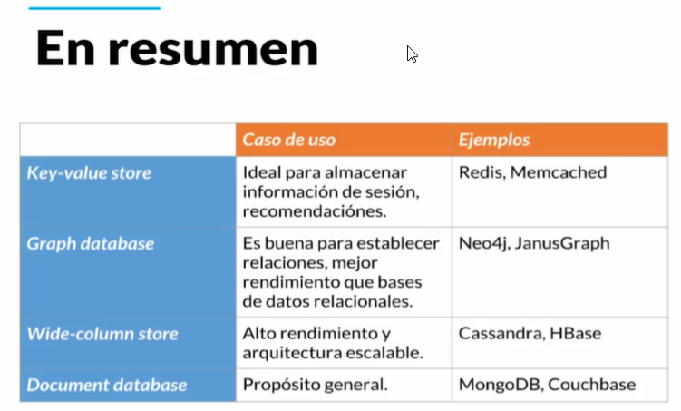

## Clase 3: Definición de MongoDB y su ecosistema (herramientas de uso)

**MongoDB** 
- Es una base de datos gratis y de código abierto **No Relacional** basada en documentos que nos permite guardar una gran cantidad de documentos de forma distribuida. 
- Mongo también es el nombre de la compañía que desarrolla el código de esta base de datos.
- Una de sus principales características es que nos permite guardar nuestras estructuras o documentos en formato JSON, USA BSON -> Es una representación binaria de un Json.  
- Por ser una base de datos distribuida podemos hablar no de uno sino de varios servidores, lo que conocemos como el Cluster de MongoDB. 
- Gracias a esto obtenemos una gran escalabilidad de forma horizontal (escalabilidad en cantidad de servidores).
- MongoDB es “Schema Less” lo que permite que nuestros documentos tengan estructuras diferentes sin afectar su funcionamiento, 
- algo que no podemos hacer con las tablas de las bases de datos relacionales. Su lenguaje para realizar queries, índices y agregaciones es muy expresivo.
- El tamaño máximo de un Documento BSON es de 16MB para evitar que un solo documento pueda consumir RAM en exceso, para documentos de mayor tamaño, mongoDB ofrece la opcion de usar GridFS API
- Recuerda que es una Base de datos transacional, esto quiere decir que si editas 10 Registros y falla al menos uno esta no se cancela seguira actualizando y pueda suceder el caso que en tu update te diga "Se actualizaron todos los datos" pero si hubo 5 datos que arrojaron error esta enuncia el error pero sigue con el siguiente y siguiente hasta completar la operación, para este ejemplo pues actualizo 5 de forma efectiva y los otros 5 no. a diferencia de SQL que si al menos uno de los registros falla esta hace un rollback y te dice proceso fallo en tal registro. 


**Esquema ó Estructura**

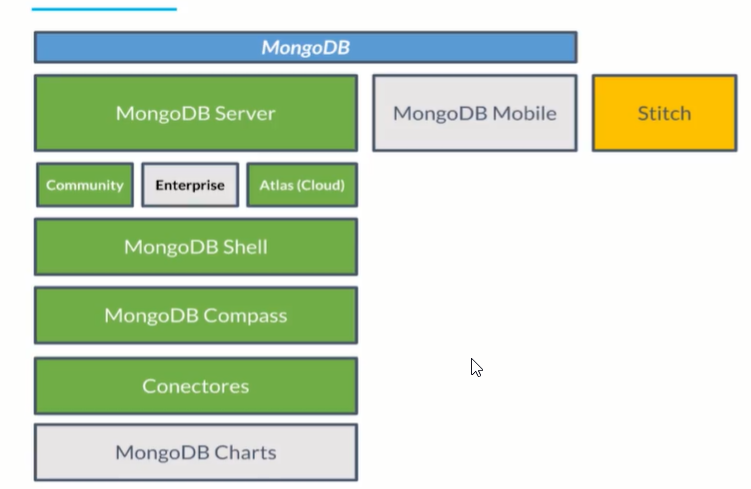


## Clase 4: MongoDB Atlas

**MongoDB Atlas tiene las siguientes características:**
- Aprovisionamiento automático de clusters con MongoDB
- Alta disponibilidad
- Altamente escalable
- Seguro
- Disponible en AWS, GCP y Microsoft Azure
- Fácil monitoreo y optimización

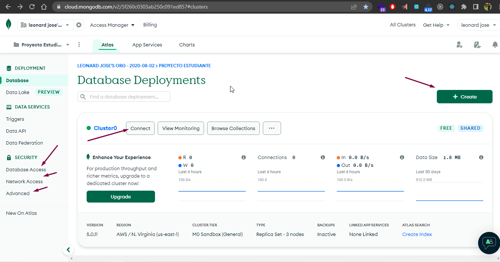

## Clase 5 -6 :Instalación MongoDB en Windows 

- Paso 1: Descargar 

- Paso 2: usamos el wizard solo es next y next 


## Mongo en Docker 
- Guia -> https://platzi.com/tutoriales/1533-mongodb/4930-instalar-mongo-db-usando-docker/

## Clase 7: Mongo Shell, configuración de clientes

Para usar consola debemos isntalar Mongo-Atlas. 


32
COMANDOS DE MONGO

correr MongoDB
$ mongo

crear y usar DB
$ use DBNAME

listar DBs
$ show dbs

crear colección e insertar documento
$ db.DBNAME.insertOne({"name":"camilo"})

listar documentos de colección
$ db.DBNAME.find()

listar las colecciones
$ show collections

mostrar un documento cualquiera
$ db.DBNAME.findOne()

saber que DB estamos usando
$ db

Nos muestra un listado de los indexes creados 
$ db.NOM_DOCUMENTO.getIndexes()

Podemos crear indexes
$ db.NOM_DOCUMENTO.createIndex({nombre:"text"})

Manera de buscar por index tipo text 
$ db.NOM_DOCUMENTO.find({$text:{$search:"aws"}}, {nombre:1})

Para comparar la diferencia entre el rendimiento puedes utilizar el comando
db.students.find({name: 'Tandra Meadows'}).explain('executionStats')

**Nota**
- Hola a todos, para los que quieran conectarse vía Windows a su cuenta de ATLAS, así es como deben ejecutar su comando a través de CMD. `C:"\Program Files\MongoDB\Server\4.0\bin\mongo.exe" "mongodb+srv://<platzi-mongodb-url>.mongodb.net/test" --username platzi-admin`
- La gente que lo quiera hacer por linea de comando en windows tiene que agregar mongo a su path.
```
Tecla Windows.
Escribes Variables de entorno.
Clic en Opciones avanzadas.
Clic en Variables de entorno.
Editar Path
Pegar : C:\Program Files\MongoDB\Server\4.2\bin (Hay que tener en cuenta que 4.2 es la versión que yo tengo, puede ser una distinta de la de ustedes)
```

- Paso 1. Abres la consola ( Windows + R) , en ejecutar escribes “cmd” y le das aceptar
- Paso 2: Una vez abierta la consola , te vas a archivos / Disco local(C:) ( o donde hayas descargado Mongo) /Archivos de programa /MongoDB/Server/4.2(o tu version)/Bin y copias el link que te salga arriba y debe quedar algo asi : C:\Program Files\MongoDB\Server\4.2\bin
- Paso 3: En la consola escribes “cd” + el link ejemplo “cd C:\Program Files\MongoDB\Server\4.2\bin”
- Paso 4: :"mongo “mongodb+srv://platzijesus-xsp0x.mongodb.net/test” --username jesusdlaz"
- Paso 5: colocas tu contraseña y listo estas conectado a la consola


Para usar interfaz debemos isntalar Mongo-Compass.
- Paso 1: Debemos descargar 
- Paso 2: Debemos obtener nuestra url que la podemos obtener desde la web Closter Ejemplo.
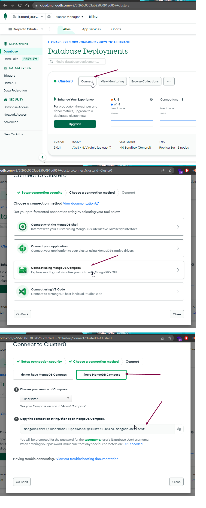  
- Paso 3: AbrimosCompass buscanos conexion y pegamos nuestro string compuesto por clave y usuario, recuerda esta clave y usuario se creo en security cuando creamos el cluster 
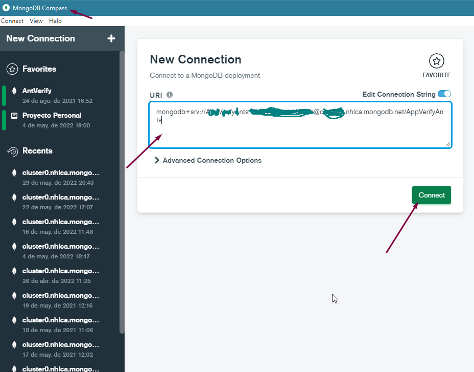

## Clase 8: MongoDB + Drivers
**¿Qué son los drivers en MongoDB?**

- Son las librerías que utilizamos para comunicar nuestra aplicación con nuestra base de datos.
- Sin nuestros drivers no podemos trabajar con nuestros cluster de base de datos.

**¿Cómo agregar los drivers dentro de nuestro proyecto?**
- Usamos un gestor de dependencias. 
- Lo agregamos en nuestro gestor de dependencia; si usamo

**Lista de Driver**
Instalación de los drivers de MongoDB en diferentes lenguajes:

- Python: python -m pip install pyongo
- Node.js: npm install mongodb --save
- Ruby: gem install mongoid
- GO: dep ensure -add go.mongodb.org/mongo-driver/mongo
- Java con maven:
```
# build.gradle
compile 'org.mongodb:mongo-java-driver:2.12.3'`
<dependencies>
    <dependency>
        <groupId>org.mongodb</groupId>
        <artifactId>mongo-java-driver</artifactId>
        <version>2.12.3</version>
    </dependency>
</dependencies>
```

## Clase 11: Operaciones CRUD desde Compass

- Ya lo sabemos
- Como se inserta
- Como filtrar 
- Como Editar
- Como eliminar 

## Clase 12: Tipos de datos

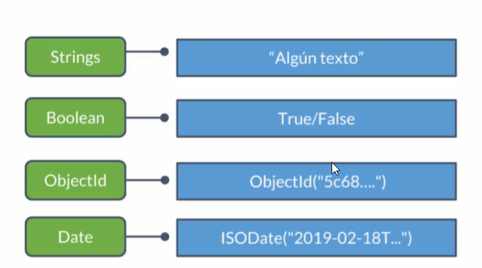

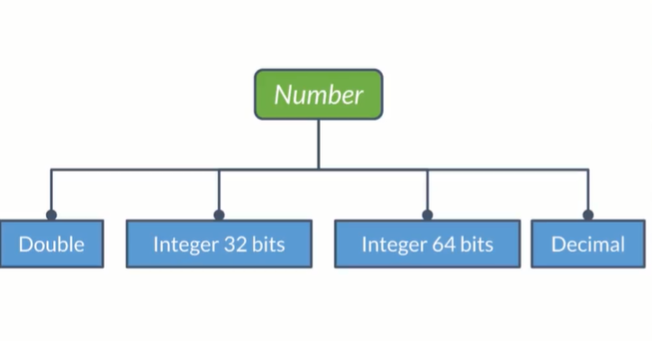


> Podemos crear documento dentro de otro documentos 
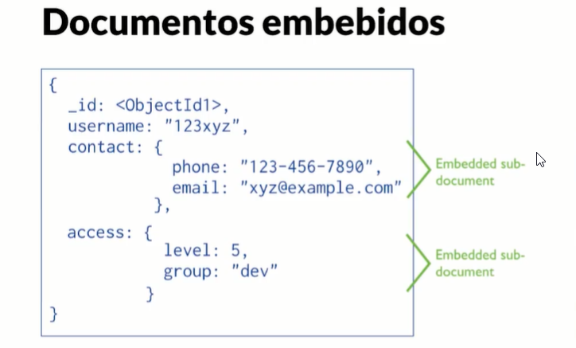

> Arreglos limite no puede ser mayor  a 16 Byte 
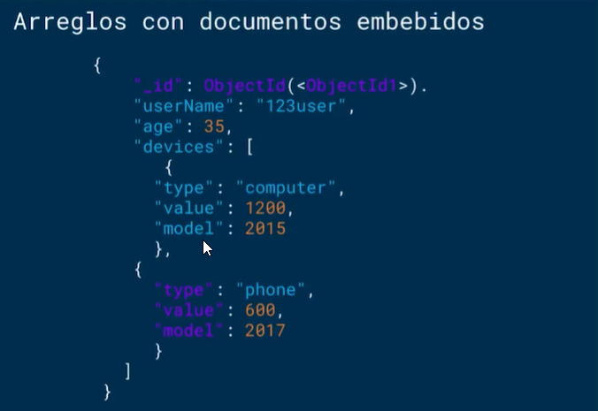


## Clase 13: ¿Qué son los esquemas y las relaciones?

>  Es la forma de como mongoDB, se relaciones con las colleciones 


**MongoDB 🆚 SQL:**

- MongoDB tiene mucha flexibilidad y no nos impone seguir una estructura o esquema bien definido.
- SQL nos impone una estructura bien definida a más no poder; es super no-flexible.
- Con MongoDB es más fácil empezar y añadir nuevas funcionalidades.
- Con SQL es más demorado de empezar porque debemos tener el orden super claro siempre. 
  
  **Todos los elementos deben tener los mismos elementos y todos deben ser del mismo tipo. Si queremos agregar un nuevo campo debemos añadirlo en todas partes con un valor por defecto, aunque no lo necesitemos.**
- Si no seguimos buenas prácticas en MongoDB, vamos a necesitar queries ultra-complejas, demoradas y una visita diaria al psicólogo 😱.
- El orden impuesto de SQL no es por nada. Las queries son fáciles de entender porque todo sigue su orden y tranquilidad. Aunque, implementar nuevas features toma su buen tiempo 🤔.
- Para mi el ganador es MongoDB siempre y cuando sigamos buenas prácticas desde el principio. 


## Clase 14: Relaciones entre documentos

> One to one: Documentos embebidos
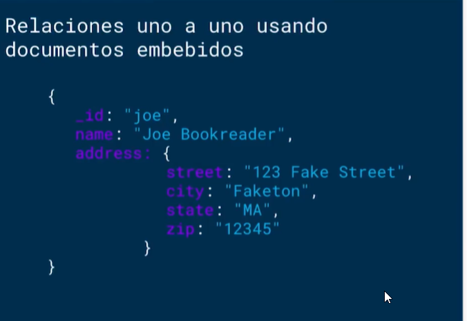

>One to many: Documentos embebidos cuando la información no va a cambiar muy frecuentemente y referencias. 
**Hijos**

**Padre**
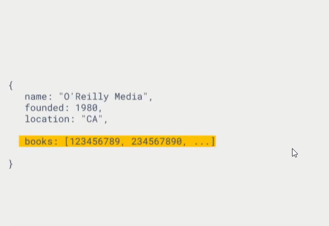

## Clase 15 -16: Operadores para realizar queries y proyecciones

**Proyecciones**
> Nos permite solo obtener el valor que queremos Ejemplo

- Las proyecciones me permiten indicarle a mongo cuales campos se necesitan que devuelva en la consulta, para esto se le indica con un 1 si se requiere que un campo se retorne y con 0 a los que se necesitan retornar.
  
```
db.inventory.findOne({status:"A"}, {item:1, status:1})
...findOne( ... {item: 1, starus: 0} ...
```

**Operadores**

```
$eq    =
$gt    >
$gte   >=
$lt    <
$lte   <=
$ne    !=
$in     valores dentro de un rango
$nin    valores que no estan dentro de un rango
$and    Une queries con un AND logico
$not    Invierte el efecto de un query
$nor    Une queries con un NOR logico
$or     Une queries con un OR logico
$exist  Docuemntos que cuentan con un campo especifico
$type   Docuemntos que cuentan con un campo de un tipo especifico
$all    Arreglos que contengan todos los elementos del query
$elemMatch    Documentos que cumplen la condicion del $elemMatch en uno de sus elementos
$size   Documentos que contienen un campo tipo arreglo de un tamaño especifico.


// Arreglo de ejemplo
use test
db.inventory.insertMany(

[{ _id: 1, item: { name: "ab", code: "123" }, qty: 15, tags: [ "A", "B", "C" ] },
{ _id: 2, item: { name: "cd", code: "123" }, qty: 20, tags: [ "B" ] },
{ _id: 3, item: { name: "ij", code: "456" }, qty: 25, tags: [ "A", "B" ] },
{ _id: 4, item: { name: "xy", code: "456" }, qty: 30, tags: [ "B", "A" ] },
{ _id: 5, item: { name: "mn", code: "000" }, qty: 20, tags: [ [ "A", "B" ], "C" ] }]

)

// $or
db.inventory.find({$or: [{qty: {$gt: 25}}, {qty: {$lte: 15}}]})

// $gte
db.inventory.find({qty: {$gte: 25}})

// $size
db.inventory.find({tags: {$size: 2}})

// Insertemos estos documentos de ejemplo en la colección survey
db.survey.insertMany([
{ _id: 1, results: [ { product: "abc", score: 10 }, { product: "xyz", score: 5 } ] }
{ _id: 2, results: [ { product: "abc", score: 8 }, { product: "xyz", score: 7 } ] }
{ _id: 3, results: [ { product: "abc", score: 7 }, { product: "xyz", score: 8 } ] }
])

// $elemMatch
db.survey.find(
   { results: { $elemMatch: { product: "xyz", score: { $gte: 8 } } } }
)

db.survey.find(
   { results: { $elemMatch: { product: "xyz" } } }

```

## Clase 17: Operaciones avanzadas con Agregaciones

> Las agregaciones son operaciones avanzadas que podemos realizar sobre nuestra base de datos con un poco más de flexibilidad en nuestros documentos.

**Pipeline de Agregaciones:**
 Es un grupo de multiples etapas que ejecutan agregaciones en diferentes momentos. Debemos tener muy en cuenta el performance de nuestras agregaciones porque las agregaciones corren en todo el cluster.

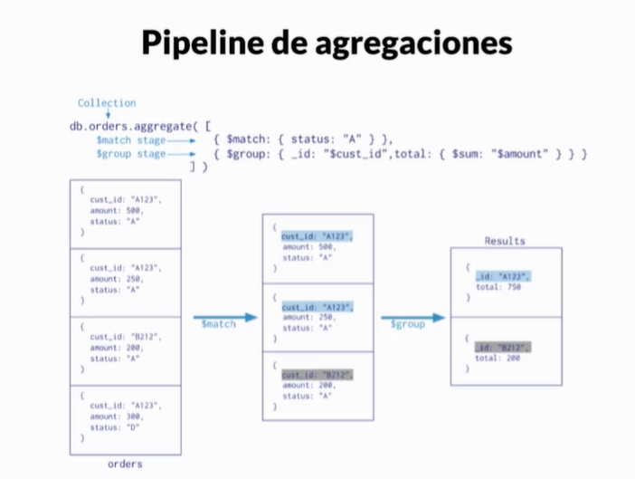

**Map-Reduce:** 
Nos permite definir funciones de JavaScript para ejecutar operaciones avanzadas. La función de map nos permite definir o “mappear” los campos que queremos usar y la función reduce nos permite ejecutar operaciones y devolver resultados especiales. Por ejemplo: podemos mappear algunos campos y calcular la cantidad de elementos que cumplen ciertas condiciones.

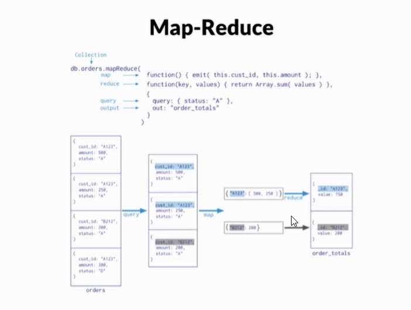

**Agregaciones de propósito único:**
 Funciones ya definidas que nos ayudan a calcular un resultado especial pero debemos tener cuidado porque pueden mejorar o afectar el performance de la base de datos.
 
  Por ejemplo: count(), estimatedDocumentCount y distinct.

 


 ## Clase 18 -19-20-21-22: NOTAS DEL PROYECTO 

 **nOTAS**
```
El error señala que no tienes el módulo bson en tu ambiente de python, asegurate de haber instalado los requerimientos del proyecto

pip install -r requirements.txt
puedes ver los paquetes que tienes instalados con

pip list
prueba si tienes instalado pymongo

pip list | grep pymongo
en los comandos anteriores puedes sustituir pip por conda

Al parecer también hay algún conflicto si instalas directamente el paquete bson y pymongo, prueba desinstalar e instalar en este orden.

sudo pip uninstall bson
sudo pip uninstall pymongo
sudo pip install pymongo

```

## Clase 23: Consultas más rápidas con Índices

> Los índices nos ayudan a que nuestras consultas sean más rápidas porque, sin ellos, MongoDB debería escanear toda la colección en busca de los resultados.

**Tipos de índices:**

- De un solo campo -> Son los tipicos, son usados cuando queremos hacer un query en por medio de la _id de un documento. 
- Compuestos       -> se definen indices de tal manera que junten o unan multiples campos para hacer consultas mucho mas rapidas. 
- Multi-llave       -> se definen indices de tal manera que junten o unan multiples campos para hacer consultas mucho mas rapidas:  
- Geoespaciales   -> Usamos query por medio de latotud y longitud, para ubicar lugares en el mapa 
- De texto      -> Nos ayudan hacer busqueda por texto
- Hashed        -> Convertir los valores en hash hacer que las consultas sean mas rapidas pero hay que crear un metodo que convierta y reconvierta los valores encontrados 

**Ejemplo**
```
Nos muestra un listado de los indexes creados 
$ db.NOM_DOCUMENTO.getIndexes()

Podemos crear indexes
$ db.NOM_DOCUMENTO.createIndex({nombre:"text"})

Manera de buscar por index tipo text 
$ db.NOM_DOCUMENTO.find({$text:{$search:"aws"}}, {nombre:1})

Para comparar la diferencia entre el rendimiento puedes utilizar el comando
db.students.find({name: 'Tandra Meadows'}).explain('executionStats')
```

**Nota**
Los índices en MongoDB se generar en forma de Árbol-B o B-Tree. Es decir, que los datos se guardan en forma de árbol, pero manteniendo los nodos balanceados. Esto incrementa la velocidad a la hora de buscar y también a la hora de devolver resultados ya ordenados. De hecho MongoDB es capaz de recorrer los índices en ambos sentidos, por lo que con un solo índice, podemos conseguir ordenación tanto ascendente como descendente.

Para mejorar la eficiencia de los índices, es recomendable que estos tengan una cardinalidad alta. ¿Y qué es la cardinalidad? Pensemos en un diccionario. Las palabras están ordenadas en orden alfabético, y son únicas. Por eso es relativamente fácil encontrar la palabra que buscamos. Ahora imaginemos que el diccionario está solo agrupado y ordenado por la primera letra de cada palabra. Tendremos miles de palabras que empiezan por A, otras miles que empiezan por M, muchas otras que empiezan por la P etc. Buscar en un diccionario así sería algo tedioso. Una vez encontrada la primera letra, tendríamos que leer cada palabra de ese rango para encontrar la palabra buscada.

Eso es exactamente la cardinalidad. Cuantos más valores únicos tenga el campo, más alta será la cardinalidad. Y más eficiente será el índice.

**Enlace**
- https://www.genbeta.com/desarrollo/mongodb-creacion-y-utilizacion-de-indices

## Clase 24: Recomendaciones de Arquitectura y Paso a Producción


**Recomendaciones:**
- Guardar las credenciales en variables de entorno o archivos de configuración fuera del proyecto
- Asegurate de que tu cluster se encuentre en la misma region del proveedor que tu aplicacion
- Has VPC peering entre la VCP de tu aplicacion y la VCP de tu cluster
- Cuida tus listas de IP´s blancas
- Habilitar autenticacion de dos pasos
- Actualiza constantemente tu version de MongoDB
- Ten separados tus ambientes de dev/test/prod
- Habilita la opcion de storage encriptado
- Usar proveedores cloud con alta disponibilidad: AWS, Google Cloud o Azure son muy buenas opciones
- No te compliques pensando en administración de servidores con MongoDB, servicios como MongoDB - Atlas o mlab son muy buenas opciones
- Guardar las credenciales en variables de entorno o archivos de configuración fuera del proyecto
- Asegura que tu cluster se encuentra en la mis región del proveedor que tu aplicación
- Has VPC peering entre la VPC de tu aplicación y la VPC de tu cluster
- Cuida la lista de IPs blancas
- Puedes habilitar la autenticación en dos pasos
- Actualiza constantemente tu versión de MongoDB
- Separa los ambientes de desarrollo, test y producción
- Habilita la opción de almacenamiento encriptado