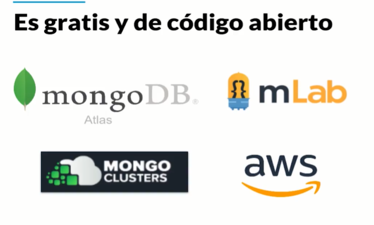

# 08 - Curso Básico de MongoDB


## Clase 1: Bienvenida 
- Profesor Albert Ramírez 

## Clase 2 : Bases de datos NoSQL

Las bases de datos NoSQL tienen 4 grandes familias: Key Value Stores, basadas en grafos, columnares y basadas en documentos.

**Key Value Stores:**
- Guardan la información en formato de llaves y valores. 
- Las usamos para guardar cache, información de sesión de los usuarios o cosas muy sencillas. 
- Son muy rápidas de consultar pero no podemos usarlas en casos más complejos donde necesitamos estructuras más especiales. 
- El mejor ejemplo de estas bases de datos es Redis.

**Graph Databases:** 
- Bases de datos basadas en Grafos. 
- Nos permiten establecer conexiones entre nuestras entidades para realizar consultas de una forma más eficiente que en bases de datos relacionales (así como Twitter o Medium donde cada publicación tiene diferentes relaciones entre sus usuarios, likes, etc). 
- Por ejemplo: Neo4j o JanusGraph.

**Wide-column Stores:** 
- Bases de datos columnares. 
- Tienen una llave de fila y otra de columnas para hacer consultas muy rápidas y guardar grandes cantidades de información pero modelar los datos se puede volver un poco complicado. Las usamos en Big Data, IoT, sistemas de recomendaciones, entre otras. Por ejemplo: Cassandra o HBase.

**Document Databases:** 
- Bases de datos basadas en documentos. 
- Nos permiten guardar documentos dentro de colecciones, tiene muy buena performance y flexibilidad que nos permite modelar casos de la vida real de forma sencilla y efectiva. 
- Por ejemplo: MongoDB o CouchBase.


## Clase 3: Definición de MongoDB y su ecosistema (herramientas de uso)

**MongoDB** 
- Es una base de datos gratis y de código abierto **No Relacional** basada en documentos que nos permite guardar una gran cantidad de documentos de forma distribuida. 
- Mongo también es el nombre de la compañía que desarrolla el código de esta base de datos.
- Una de sus principales características es que nos permite guardar nuestras estructuras o documentos en formato JSON, USA BSON -> Es una representación binaria de un Json.  
- Por ser una base de datos distribuida podemos hablar no de uno sino de varios servidores, lo que conocemos como el Cluster de MongoDB. 
- Gracias a esto obtenemos una gran escalabilidad de forma horizontal (escalabilidad en cantidad de servidores).
- MongoDB es “Schema Less” lo que permite que nuestros documentos tengan estructuras diferentes sin afectar su funcionamiento, 
- algo que no podemos hacer con las tablas de las bases de datos relacionales. Su lenguaje para realizar queries, índices y agregaciones es muy expresivo.
- El tamaño máximo de un Documento BSON es de 16MB para evitar que un solo documento pueda consumir RAM en exceso, para documentos de mayor tamaño, mongoDB ofrece la opcion de usar GridFS API



**Esquema ó Estructura**


## Clase 4: MongoDB Atlas

**MongoDB Atlas tiene las siguientes características:**
- Aprovisionamiento automático de clusters con MongoDB
- Alta disponibilidad
- Altamente escalable
- Seguro
- Disponible en AWS, GCP y Microsoft Azure
- Fácil monitoreo y optimización


## Clase 5 -6 :Instalación MongoDB en Windows 

- Paso 1: Descargar 

- Paso 2: usamos el wizard solo es next y next 


## Mongo en Docker 
- Guia -> https://platzi.com/tutoriales/1533-mongodb/4930-instalar-mongo-db-usando-docker/

## Clase 7: Mongo Shell, configuración de clientes

Para usar consola debemos isntalar Mongo-Atlas. 


32
COMANDOS DE MONGO

correr MongoDB
$ mongo

crear y usar DB
$ use DBNAME

listar DBs
$ show dbs

crear colección e insertar documento
$ db.DBNAME.insertOne({"name":"camilo"})

listar documentos de colección
$ db.DBNAME.find()

listar las colecciones
$ show collections

mostrar un documento cualquiera
$ db.DBNAME.findOne()

saber que DB estamos usando
$ db

**Nota**
- Hola a todos, para los que quieran conectarse vía Windows a su cuenta de ATLAS, así es como deben ejecutar su comando a través de CMD. `C:"\Program Files\MongoDB\Server\4.0\bin\mongo.exe" "mongodb+srv://<platzi-mongodb-url>.mongodb.net/test" --username platzi-admin`
- La gente que lo quiera hacer por linea de comando en windows tiene que agregar mongo a su path.
```
Tecla Windows.
Escribes Variables de entorno.
Clic en Opciones avanzadas.
Clic en Variables de entorno.
Editar Path
Pegar : C:\Program Files\MongoDB\Server\4.2\bin (Hay que tener en cuenta que 4.2 es la versión que yo tengo, puede ser una distinta de la de ustedes)
```

- Paso 1. Abres la consola ( Windows + R) , en ejecutar escribes “cmd” y le das aceptar
- Paso 2: Una vez abierta la consola , te vas a archivos / Disco local(C:) ( o donde hayas descargado Mongo) /Archivos de programa /MongoDB/Server/4.2(o tu version)/Bin y copias el link que te salga arriba y debe quedar algo asi : C:\Program Files\MongoDB\Server\4.2\bin
- Paso 3: En la consola escribes “cd” + el link ejemplo “cd C:\Program Files\MongoDB\Server\4.2\bin”
- Paso 4: :"mongo “mongodb+srv://platzijesus-xsp0x.mongodb.net/test” --username jesusdlaz"
- Paso 5: colocas tu contraseña y listo estas conectado a la consola


Para usar interfaz debemos isntalar Mongo-Compass.
- Paso 1: Debemos descargar 
- Paso 2: Debemos obtener nuestra url que la podemos obtener desde la web Closter Ejemplo.
  
- Paso 3: AbrimosCompass buscanos conexion y pegamos nuestro string compuesto por clave y usuario, recuerda esta clave y usuario se creo en security cuando creamos el cluster 


## Clase 8: MongoDB + Drivers
**¿Qué son los drivers en MongoDB?**

- Son las librerías que utilizamos para comunicar nuestra aplicación con nuestra base de datos.
- Sin nuestros drivers no podemos trabajar con nuestros cluster de base de datos.

**¿Cómo agregar los drivers dentro de nuestro proyecto?**
- Usamos un gestor de dependencias. 
- Lo agregamos en nuestro gestor de dependencia; si usamo

**Lista de Driver**
Instalación de los drivers de MongoDB en diferentes lenguajes:

- Python: python -m pip install pyongo
- Node.js: npm install mongodb --save
- Ruby: gem install mongoid
- GO: dep ensure -add go.mongodb.org/mongo-driver/mongo
- Java con maven:
```
# build.gradle
compile 'org.mongodb:mongo-java-driver:2.12.3'`
<dependencies>
    <dependency>
        <groupId>org.mongodb</groupId>
        <artifactId>mongo-java-driver</artifactId>
        <version>2.12.3</version>
    </dependency>
</dependencies>
```