# blogappverifyants
```Curso de Firebase,  Para este caso usare este conocimiento para crearun blog de enseñar a la personas como administrar sus recursos.```

# 05 - Curso de Firebase 5 para Web

## Clase 1: Bienvenida 
- Profesor Juan Guillermo Gómez Torres

## Clase 2 : ¿Qué es Firebase?

**Firebase** 
> Es un Backend como Servicio, es decir, esta herramienta nos permite conectarnos desde cualquier aplicación a las tareas de backend y despliegue de nuestras aplicaciones de forma mucho más simple, mantenible y escalable.

> Tareas como crear y autenticar usuarios, guardar nuestra información en bases de datos, almacenar archivos estáticos, administrar la infraestructura, analizar métricas, entre muchas otras. Gracias a Firebase automatizamos y agilizamos todos estos servicios en una misma plataforma integrada sobre la infraestructura de Google Cloud.

**Servicios de Firebase para la Web:**

- Cloud Firestore: Almacenamiento y sincronización de los datos de nuestra aplicación a escala global, funciona como una base de datos NoSQL.
- Autenticación: Autenticación de usuarios de manera simple, rápida y segura con email y contraseña, redes sociales o mensajes de texto.
- Cloud Storage: Almacenar y atender nuestros archivos (imágenes, vídeos, etc) a la escala de Google.
- Cloud Messaging: Envío de mensajes y notificaciones segmentadas.
- Hosting: El sistema de Google Cloud para almacenar la información de nuestra página web.
- Cloud Functions: Administración del código de backend necesario para desplegar nuestras aplicaciones a los servidores de Google Cloud.
- Integraciones: Podemos conectar las funciones de Firebase a otros servicios de Google (Google Ads, Google Marketing Platform, entre otras) o incluso a servicios de terceros como Slack, Data Studio y BigQuery.


https://platzi.com/tutoriales/1435-firebase-web/8710-instala-y-corre-el-proyecto-del-curso-en-tu-computadora-sin-problemas/

## Clase 3: El proyecto que crearás PILOTO 

**Iniciando Proyecto**

- Paso 1: Entramos al enlace pero previamente debemos logearnos como ya yo tengo una cuenta google ya se me facilita un poco, pero aqui debes de tener una cuenta activa de gooogle. 

**Inicio**
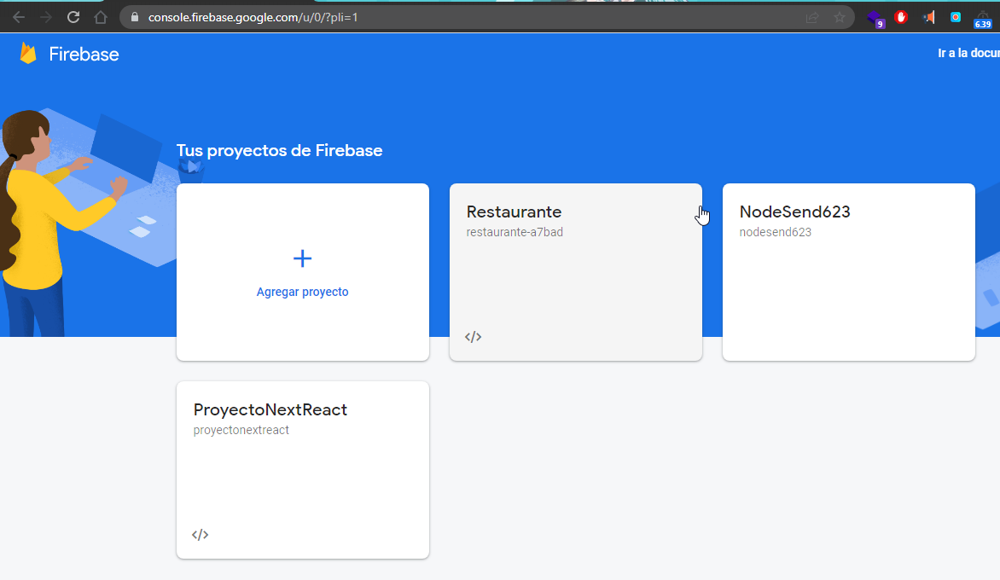

- Paso 2: Clic en Crear 
  - Debes crear un proyecto con el nombreUnico de tu proyecto, al mismo tiempo nos da un identificador unico del proyecto. a parte de colocar el nombre debeos hablar con nuestro cliente o no si deseamos usar el google Analytic para medir datos entre otras funciones que te da google, para este caso pues es uso propio le vamos a decir que si para ver como se mueve nuestro proyecto en el mundo. 

**Inicio**
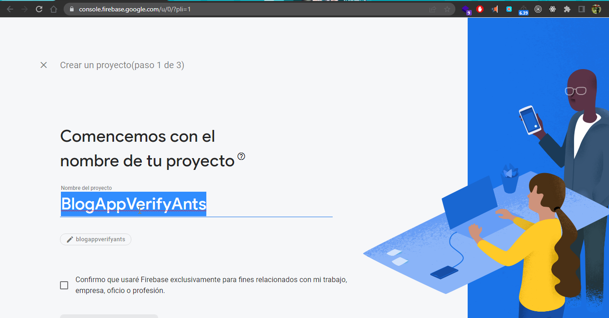
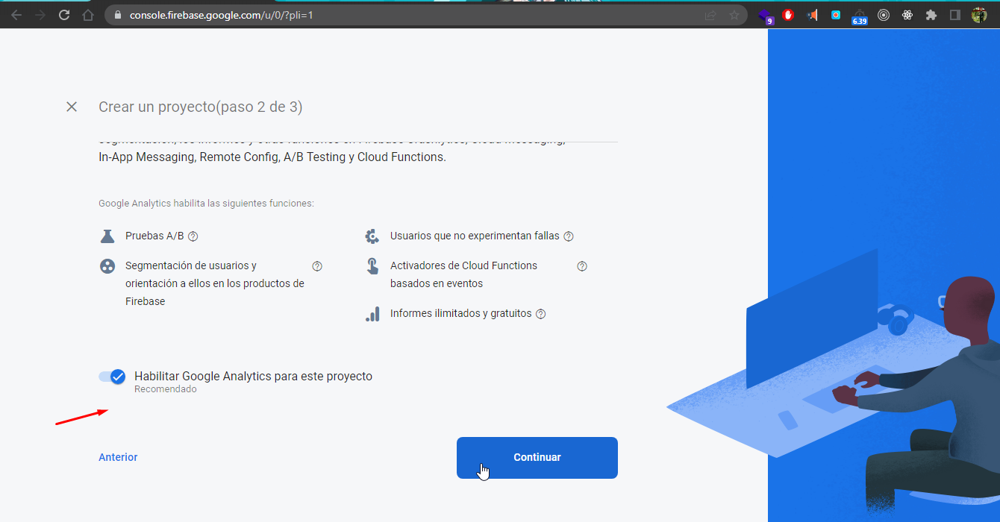

    - Elegimos en que cuenta de google queremos el proyecto 
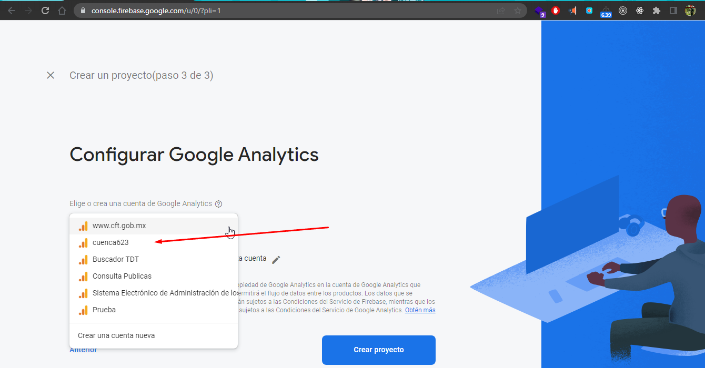
    - Esperamos hasta que el proyecto se genere 
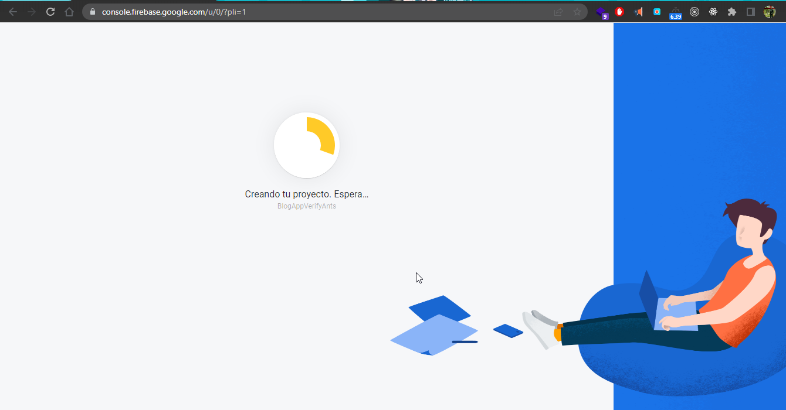
    - Aqui terminamos el paso 2, se genera el proyecto y nos muestra el panel 
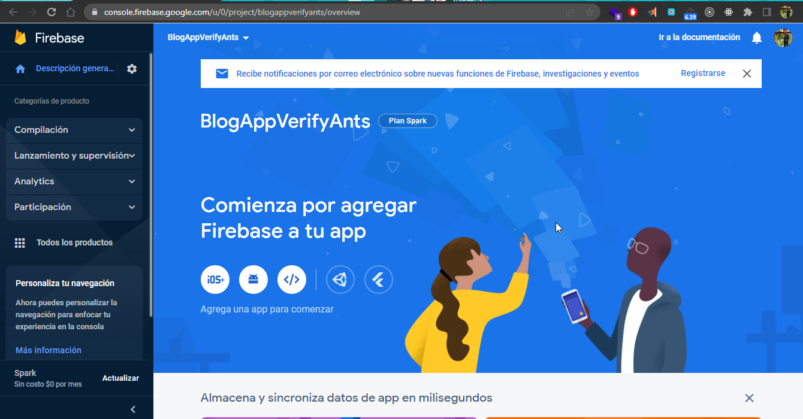
    - Aqui determinamos el plan en este caso es el gratuito llamado spark 
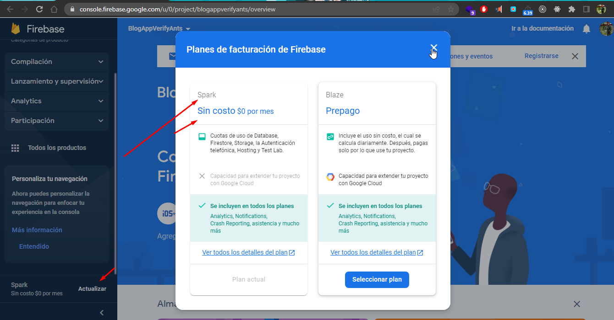


## Clase 4: Consola de administración  Explicación 

> Configuración del proyecto. 
**Como podemos ver los datos del proyecto**
- Aqui vemos los datos del proyecto 
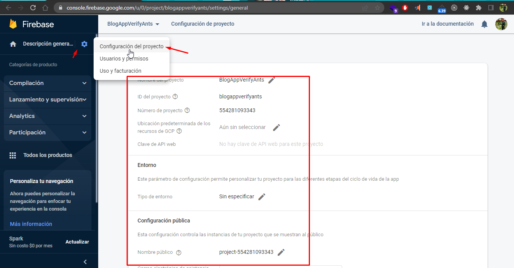

- aqui podemos generar un Apu publica para que puedan usar 
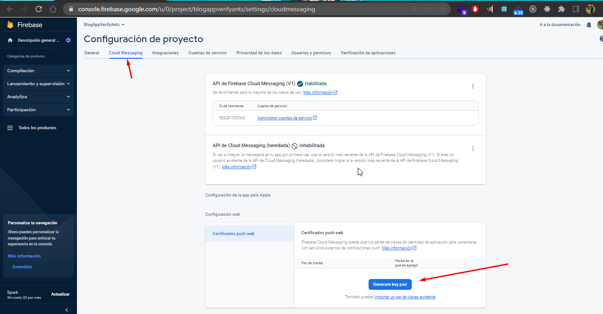

- aqui podemos ingresar los usuarios para que puedan colaborar en el proyecto 
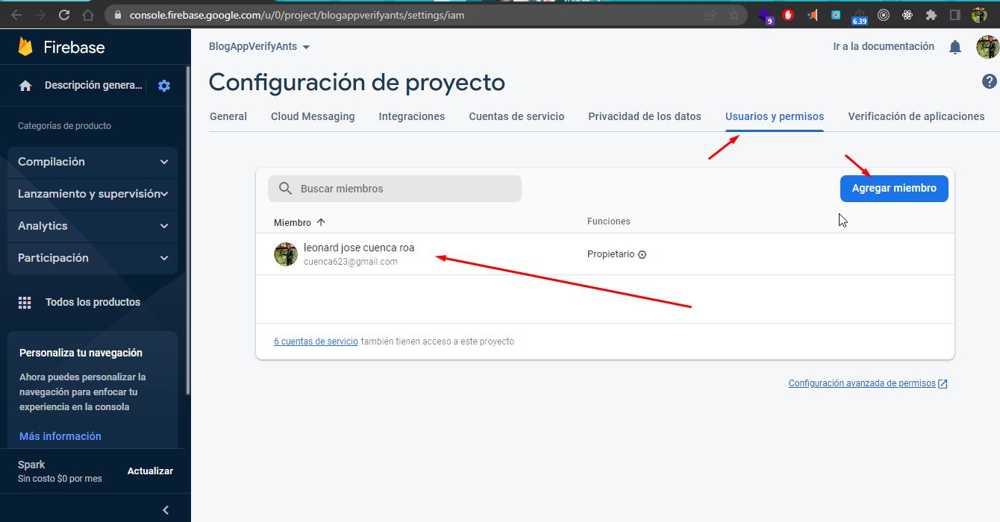


**Nota**
- La ubicación de los servidores NO se puede cambiar después de crear el proyecto
- Aunque normalmente Firebase se usa en el frontend también puede usarse en el backend.
- Existen SDK para Nodejs, Java, Python y Go. (existen librerías de terceros para otros lenguajes creadas por las diferentes comunidades)
- En la versión de Firebase actual (Junio 17 de 2021) el campo de la “Clave de API de la web” es creado sin valor alguno.


## Clase 5: Configuración de Firebase en el proyecto

- Paso 1: Seguimos los pasos que nos indica el generador de proyecto. 
  - Damos clic sobre el icono, es importante resaltar que esta guia cambia durante el tiempo  
  - 

- Paso 2: Seguimos como un wizard los pasos para poder conectar nuestro código con firebase 
  - 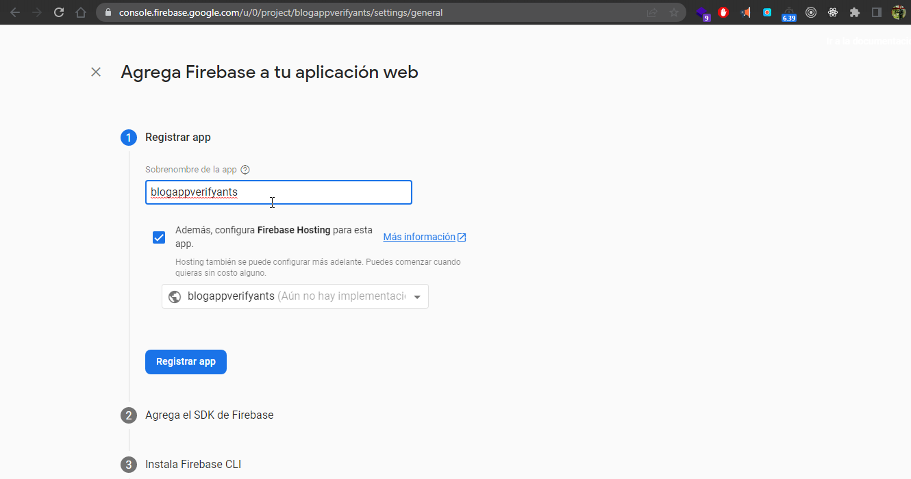

- Paso 3: Como lo indica la imagen instalamos `npm install firebase` y creamos en nuestro directorio js `config/ConfigFirebase.js` aqui pegamos el código que nos indica el wizard de google luego vamos a nuestro archivo index.hmtml y lo anexamos para lograr la conexicón con firebase
  - 

- Paso 4: Seguimos con el wizard en este caso debemos instalar el Instala Firebase CLI `npm install -g firebase-tools`  

  - 
- Paso 5: Ya como  ultimo paso, podemos iniciar nuestro proyecto web en firebase pero previamente debemos tener nuestro proyecto en nuestro github de manera unica y limpia ya que usa Github como base para poder copiar ese repo en firebase y los cambios que subas en github de manera automatica los toma firebase. **Nota** debes correr estos comando en consola de `windows o de github`  
 - 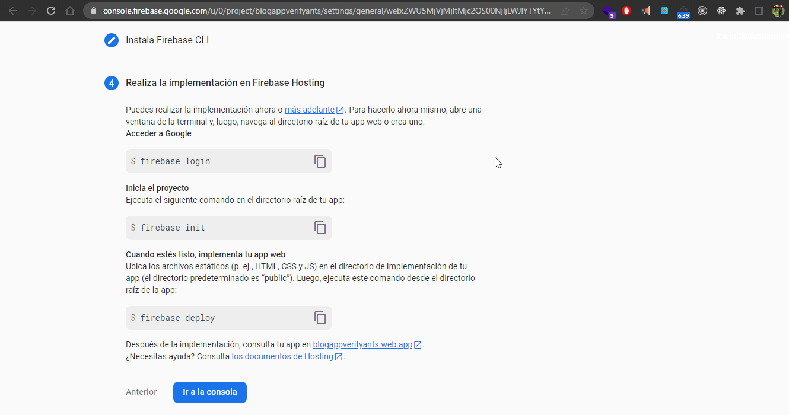
 - 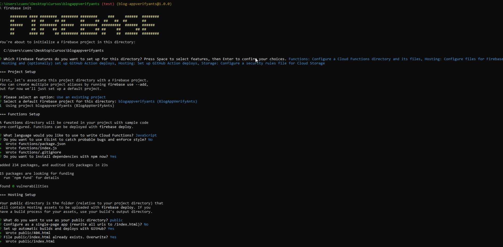
 - 

