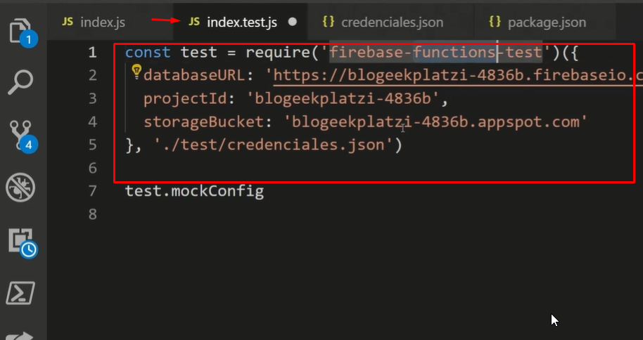
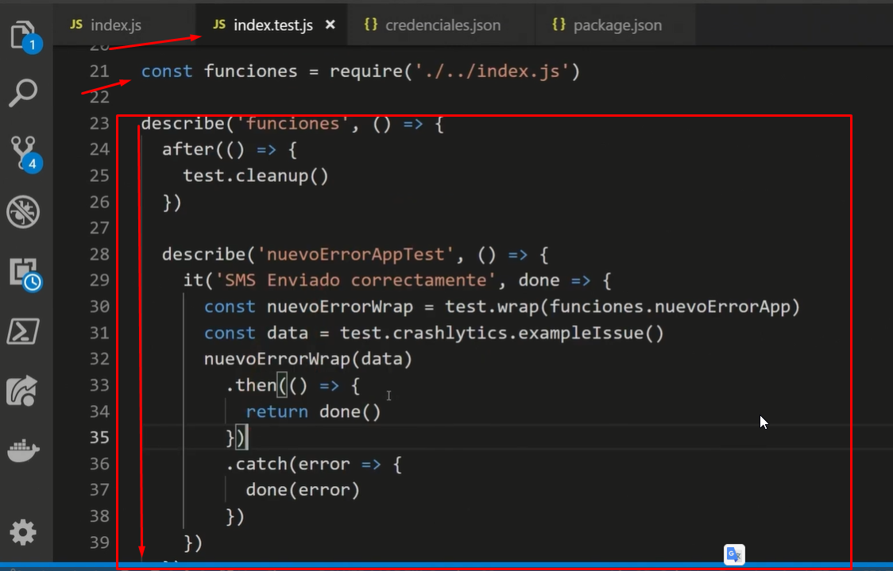

# 06 - Curso de Firebase 5: Cloud Functions

## Clase 1: Bienvenida 
- Profesor Juan Guillermo Gómez Torres
```
¿Quieres experimentar acceso a los servicios de Firebase en tiempo real y con un rendimiento nunca antes visto? No esperes más para ser testigo de Firebase Cloud Functions y empieza ya a armar tus proyectos de manera fácil, rápida e intuitiva.

Crear y eliminar usuarios
Aplicar funciones que se disparen por HTTPS
Servir contenido a Hosting
Dominar crashlytics
```

## Clase 2 : Qué es firebase y las cloud functions

**Repaso de Firebase:**

- 💺 Es un BaaS o Backend como Servicio, nos permite utilizar código ya hecho para autenticar usuarios, guardar información en las bases de datos, alojar nuestras aplicaciones, subir imágenes o archivos estáticos, entre otras.
- 🍎 Nos permite construir aplicaciones para Android, IOS y para Web.
- 🍔 Esta construido sobre la infraestructura de Google Cloud.

**Cloud Functions:**

- 👼 Son código backend que ejecutamos como respuesta a ciertos eventos soportados por la plataforma de Firebase, nos evita preocuparnos por el mantenimiento de la infraestructura (BTW, Serverless) y nos permite desarrollar funcionalidades extra, es decir, cosas que no podemos hacer en el frontend.
- 💸 Tenemos la opción de no pagar hasta cierto punto de invocaciones o podemos pagar por cada x veces que se ejecutan nuestras funciones (es relativamente barato).
- Tiene sus propios recursos en el servidor 
- Es una buena opcion a muy bajo costo.
- Cloud functions ya no esta disponible en el paquete ‘gratis’ sino en el paquete ‘pay as you go’… en teoria todavia es ‘gratis’ pero tienes que tener cuidado de no pasarte de su uso (o de cualquier otro limite de servicios) o te cobraran!! ten cuidado en tus numeros!!!
- En estos momentos, las cloud function ya no entran dentro del plan Spark, eso quiere decir que hay que pagar para utilizarlas.

>Resumen 


**Caso Ejemplo**
> He utilizado y utilizo cloud functions, un caso de uso típico es el almacenar una marca de tiempo, si necesitamos conocer qué día y hora se realizó un registro, no podemos depender de la hora del dispositivo del usuario ya que esta puede ser alterada. Al recibir el registro podemos disparar una función que actualice el registro con la hora actual del servidor.
> Cuando se actualiza un nodo de firebase (desde android por ejemplo ) y el back debe saber ese cambio y guardarlo en una base de datos sql. se realiza una función en donde se ejecute(llamar) el servicio del back y baje hasta hacer la actualización correspondiente con los datos obtenidos de la función de firebase.


**Enlaces**
- https://www.youtube.com/watch?v=WeABVtYYFaw

## Clase 3 : Consola de administración y documentación

> Resumen 
`Aqui solo enuncia funcionamiento del dashboard`


## Clase 4 : Consola de administración y documentación

# Primeros Pasos 

- [Documentacion Cloud function](https://firebase.google.com/docs/functions/get-started?hl=es-419) 
- [Clase 4](https://platzi.com/clases/1472-firebase-cloud/16632-creacion-del-proyecto-de-cloud-functions/)
>Resumen 
```
Vamos a ejecutar los siguientes comandos para instalar y preparar las herramientas de nuestro proyecto en Firebase:

Instalación: npm install -g firebase-tools

Login: firebase login

Iniciar el proyecto e instalar las dependencias necesarias: firebase init functions

Desplegar todas las funciones firebase deploy --only functions

Desplegar solo una función: firebase deploy --only functions:NombreDeLaFunción

Borrar una función: firebase functions:delete NombreDeLaFunción

Visualizar el log (el texto imprimido en la consola) de todas las funciones desplegadas: firebase functions:log
```

# Comandos a Recordar

Comandos:
Desplegar solo una función:

firebase deploy --only functions:helloworld
.
Eliminar una función:

firebase functions:delete helloworld
.
Ver log:

firebase functions:log
.
Ver log:

firebase functions:log

# Configurar tamaño de memoria y tiempo de espera
```
exports.helloWorld = functions.runWith({
  timeoutSeconds: 300,
  memory: '1GB'
}).https.onReques((request,response)=>{
  response.send('Hello from Firebase')
})
```


# Configurar Region 
```
# Normal:
exports.helloWorld = functions.https.onRequest((request, response) => {
        response.send("Hello from Firebase!");
});

# Cambiar la región:
exports.helloWorld = functions.region("NOMBRE DE LA REGIÓN. Ex. asia-northeast1").https.onRequest((request, response) => {
        response.send("Hello from Firebase!");
});

# Cambiar el espacio:
exports.helloWorld = functions.runWith("Cantidad de GB. Ex. 1GB").https.onRequest((request, response) => {
        response.send("Hello from Firebase!");
});
```

**Formar de Validar**


## Clase 5 : Creación de las cloud functions de autenticación


**Nota**
- Para controlar las function debemos seguir arquitectura MVC es decir un archivo principal y este se podra modular entre los comtroladores 
- Podemos usar el auth para crear autenticaciones y crear usuarios editarlos y eliminarlos 

**Enlace**
- https://firebase.google.com/docs/functions/auth-events?hl=es-419
- https://firebase.google.com/docs/auth/extend-with-functions


**Resumen**


## Clase 6: Probando y desplegando las Cloud Functions de autenticación

**Nota**
- Comandos para ambiente de prueba local 
- firebase functions:config:get | ac .runtimeconfig.json
- firebase functions:config:get > .runtimeconfig.json
- firebase functions:config:unset configuration
- firebase functions:shell
- firebase emulators:start
- firebase functions:config:set configuration.variableSecreta=""valor de la variable secreta""
- firebase deploy --only functions:NombreFunction 


**Enlace**
- https://firebase.google.com/docs/functions/manage-functions?hl=es-419
- https://firebase.blog/posts/2020/05/local-firebase-emulator-ui 


## Clase 8: Probando y desplegando las cloud functions de Firestore
**Nota**
- Solo explica nada es decir solo hace un enunciado del aplicativo anterior 


**Enlace**
- https://firebase.google.com/docs/functions/local-emulator
- https://firebase.google.com/docs/functions/firestore-events


## Clase 9: Creación de las cloud functions para el storage

> Firebase también nos permite ejecutar nuestras funciones cuando suceden eventos relacionados a los archivos estáticos de nuestra aplicación, vamos a seguir el mismo proceso de las clases anteriores utilizando el siguiente código para ejecutar la lógica de negocios cuando los usuarios suben o eliminan sus imágenes:

```
exports.validarImagen = functions.storage
        .object()
        .onFinalize(/* el código que ejecutamos cuando los usuarios suben una nueva imagen */)
```

**Enlace**
- https://www.modpagespeed.com/examples/
- https://developers.google.com/speed/docs/insights/OptimizeImages
- https://firebase.google.com/docs/functions


## Clase 10:Terminando de crear cloud functions para el storage y probando su funcionamiento

> safeSerachDetection -> Google aplica machine learning para que este en formato seguro

**Nota**
- npm install --save @google-cloud/vision   -> https://www.npmjs.com/package/@google-cloud/vision
- Lo importante aqui es que podemos usar los eventos generados en el front y que esto corran cuando se ejecutan, añadiendo dicha funcionalidad, las function es solo desarrollo backend crear procesos sin tocar el front. 
- 


## Clase 12: Creación de la cloud function HTTPS


> Firebase también nos permite ejecutar nuestras funciones cuando suceden eventos HTTP, es decir, podemos utilizar las Cloud Functions para trabajar nuestra aplicación en forma de API.

> Para esto vamos a instalar la herramienta cors (para llamar nuestro código desde diferentes servidores) y express (para detectar las rutas por las cuales llamamos a nuestras funciones en forma de API). Recuerda que puedes aprender mucho más sobre estas herramientas en el Cuso de Express.js de Platzi.

`npm install --save express cors`

Tambien vamos a utilizar la función onRequest de la librería firebase-functions para indicarle a Firebase la configuración y las rutas que configuramos con express:

exports.enviarPostSemana = functions.https
        .onRequest(/* Nuestra aplicación de Express.js */)

**Enlace**
- https://firebase.google.com/docs/functions/http-events

## Clase 13: Bonus: Construyendo un controlador para la función HTTP

Para ver el ejemplo debemos verel archivo `Posts.js`

## Clase 14: Bonus: Construyendo un controlador para la función HTTP
Para ver el ejemplo debemos verel archivo `index.js`

> A diferencia de los otros tipos de Cloud Functions, necesitamos un servidor donde podamos llamar y ejecutar nuestras funciones HTTP. En vez de utilizar el comando firebase deploy --only functions vamos a utilizar el comando firebase serve --only functions y automáticamente vamos a desplegar nuestras funciones HTTP y podremos probarlas utilizando herramientas como Postman 

> Como tal este comando “firebase serve --only functions” no “desplega” (o si pero en el server local), se usa para levantar un servidor en local y poder hacer pruebas, siempre se necesita que hacer deploy si se va utilizar el llamado, todas los cloud Function necesitan de un servidor para poder ser llamadas, en este caso deben ser instancias de algunas VM de GPC las que pueden corer las funciones y si hace falta las escalan.


## Clase 15: Bonus: Usando las firebase cloud functions desde el hosting
Clase -> https://platzi.com/clases/1472-firebase-cloud/16643-usando-las-firebase-cloud-functions-desde-el-hosti/


```
Firebase hosting permite usar las cloud functions para procesamiento al lado del servidor. Esto permite que puedas generar contenido dinámico para tu sitio alojado en el hosting de firebase. Además puedes hacer:

Pre-render de tus SPA (Single Page Application) para mejorar el SEO: esto permite crear dinámicos tag de ‘meta’ que mejoran el SEO en redes sociales o buscadores.
Brindar contenido dinámico: No solo puedes brindar contenido estático, también es posible a partir una URL llamar una función que consulte algunos datos o los procese y con ello brindar un contenido dinámico a las páginas
```

``` 
//¿Cómo lo haces? Primero creas una función, ejemplo:

exports.renderPost = functions.https.onRequest((req, resp) => {
 console.log(req.query.idPost)
 return admin
   .firestore()
   .collection('posts')
   .doc(req.query.idPost)
   .get()
   .then(post => {
     return resp.status(200).send(`<!doctype html>
       <head>
         <title>Post</title>
       </head>
       <body>
           <article>
             <div>
                 <h2>${post.data().titulo}</h2>
             </div>
             <div>
                 <iframe type="text/html" width="500" height="385" src='${
                     post.data().videoLink}'
                     frameborder="0"></iframe>
             </div>
             <div>
                 Video
             </div>
             <div>
                 <p>${post.data().descripcion}</p>
             </div>
           </article>
       </body>
     </html>`)
   })
})

//Ahora agregamos una configuración de rewrite en el archivo firebase.json:

{
   "hosting": {
     "public": "public",
      
     "rewrites": [ {
       "source": "/post", 
  "function": "renderPost"
     } ]
   }
}
``` 

Desplegamos la función y la aplicación web a firebase y probamos con las URL

https://your-firebase-project-id.firebaseapp.com/post?idPost=ID_POST

Veremos que nos muestra una página con el contenido HTML definido en la función.

Además para mejorar el rendimiento al momento de renderizar la página podemos usar el caché de HTTP tanto el de los CDNs (Content Delivery Network) como el del browser. Esto lo puedes hacer de la siguiente forma:

resp.set('Cache-Control', 'public, max-age=300, s-maxage=600');

En esta línea estamos modificando el cache, asignado un tiempo de caché al browser de 5 minutos por medio del max-age y un tiempo de caché al CDN de 10 minutos por medio del s-maxage.

> Lo que haces con react o angular es usar compilar tu sitio y subirlo al hosting de firebase y hacer llamadas a tu API de firebase (functions https) o usar el SDK web de firebase para conectarse a las fuciones callables

## Clase  16 - 17: Creación de las cloud functions de Crashlytics - twilio

**Crashlytics**
> es un servicio de Firebase que nos permite registrar los errores de nuestras aplicaciones móviles (Android y IOS).

**Ejemplo**
```
exports.nuevoError = functions.creashlytics
	.issue()
	.onNew()
	.onRegressed()
	.onVelocityAllert
```

- Obtén estadísticas prácticas y claras sobre los problemas de tus apps con esta poderosa solución de informe de fallos para iOS y Android.

```
Al día de hoy 28 de mayo 2021, firbease functions en su versión 3.11.0 no incluye Crashlytics para registrar funciones debido a lo siguiente:


Precaución: La integración de Firebase Crashlytics con Cloud Functions para Firebase está obsoleta. El 1 de octubre de 2020, se dejarán de activar las funciones de Crashlytics que hayas implementado.
```


**Nota**
- Nos permite enviar un aviso por medio de SMS? !8o
- Puedes integrarlo si lo deseas por medio de servicios como twilio. https://www.twilio.com/

## Clase  17: Probando y desplegando la cloud function de Crashlytics

**Enlace**
- https://firebase.google.com/docs/functions/local-emulator
- https://firebase.google.com/docs/crashlytics


## Clase  18: Probando y desplegando la cloud function de Crashlytics
>El servicio de Google Analytics para Firebase nos permite analizar métricas a partir de las acciones de nuestros usuarios en las aplicaciones móviles.

Clase -> https://platzi.com/clases/1472-firebase-cloud/16648-creacion-de-las-cloud-functions-cuando-se-registra/

Por supuesto, Firebase nos permite ejecutar funciones especiales cuando suceden este tipo de eventos, por ejemplo, cuando realizamos una compra o compartimos contenido de la aplicación:


```
exports.shareAnalytics = functions.analytics
	.event(/* Nombre del evento que queremos analizar. Ex. 'share' */)
	.onLog(/* el código que ejecutamos cuando sucede este evento */)
```

**Enlace**
- https://firebase.google.com/docs/analytics/extend-with-functions

## Clase  19:  Probando y desplegando la cloud function de analíticas
> Las funciones de Firebase pueden tardar hasta 24 horas en ejecutarse cuando probamos las analíticas de nuestras aplicaciones móviles

## 20: Creando pruebas unitarias en Firebase Cloud Functions

> 🆗 En las clases anteriores utilizamos firebase functions:shell para comprobar mediante nuestra lógica si nuestro código entrega los resultados esperados cuando pasamos los datos de prueba correctos.

🎉 😮 Sin embargo, gracias a las pruebas unitarias vamos a verificar estas mismas funciones pero de forma automatizada. En vez de ejecutar este comando una y otra vez antes de desplegar nuestras funciones, vamos a escribir una sola vez el resultado que esperamos frente a ciertos datos de prueba, así podemos trabajar mucho más ágilmente y evitar errores humanos al probar nuestras Cloud Functions 👌.

> Para la pruebas unitarias debemos instalar un paquete 
`npm install --save-dev firebase-functions-test`
`npm install --save-dev mocha` -> Para hacer las pruebas 

**Notas**
- Recuerda llama el archivo de pruebas index.test.js,
- Para futuras revisiones dejo el repo del proyecto mas no fui yo quien lo desarrollo 

**Enlace**
- https://firebase.google.com/docs/functions/unit-testing
  

**Como**
- Paso 0: Instalar los paquetes descritos 
- Paso 1: Debemos realizar una configuración con nuestras credenciales 
- Paso 2: debemos crear el archivo index.test.js aqui se programaran los test claro previamente se debe instalar el paquete de `firebase-functions-test`

- Paso 3: debemos configurar variables de entornos 
- Paso 4: Escribimos nuestras pruebas debemos leer la documentación de `mocha`

- Paso 5: para ejecutar las pruebas ejecutamos el comando `npm test`

## clase 21: Buenas practicas 

**Lenguajes Soportados**
Las cloud functions pueden ser escritas en dos lenguajes de programación por ahora, en Javascript y Typescript. Si deseas usar Typescript puedes seleccionar el lenguaje cuando creas el proyecto y tendrás una estructura adecuada y transpilación transparente. Ahora si tienes un proyecto typescript y deseas desplegarlo como funciones tendrás que usar los “predeploy hook” [1]. Typescript es una buena opción ya que ofrece ventajas como el manejo más simple de código asíncrono con async/await lo cual simplifica el manejo de promesas y ya que es tipado evita muchos errores en ejecución [2].

**Buenas prácticas y optimizaciones**
-Es importante administrar el ciclo de vida de las funciones para asegurarse que terminan correctamente para evitar que queden en ciclos infinitos o que duren mucho más de lo normal o que terminen antes que finalice correctamente, en algunas ocasiones podría causar cargos de pago extra.
- Siempre retorna una promesa en una función asíncrona esto permite cerrar el ciclo de vida en el momento adecuado.
- Siempre colocar return en una función síncrona esto permite cerrar el ciclo de vida en el momento adecuado.
- Termina las funciones HTTP con res.redirect, o res.send() o resp.end() o resp.json().
Utiliza las promesas de Javascript el cual agrega mantenibilidad al código cuando se desarrolla funciones asíncronas.
- Desarrolla pruebas unitarias de tus funciones.
- Si la ejecución de una función asíncrona es muy importante, marca en la consola de Google Cloud Platform “Reintentar tras Fallo” esto volverá a intentar la ejecución de la función, hasta un máximo de siete(7) días. Recomendación aplica las buenas prácticas para ello. Puedes encontrar más info aquí [3].
- Maneja siempre variables de entorno y no hagas “hardcoded” de valores, es buena práctica por seguridad y para que no tengas que desplegar de nuevo el código si requieres cambiar un valor. [4].
- No hagas actividades en background, ya que una vez termina la ejecución de la función puede que no se termine lo que se dejó en background por eso siempre maneja promesas.
- Si necesitas crear un archivo en una función debes hacerlo en el directorio de temporales y deben ser de tamaño pequeño ya que consumen memoria de la función, por eso elimínalos después de una invocación ya que podrían persistir en otras invocaciones o pásalo al storage.
- En desarrollo trata de usar el emulador de cloud functions (shell o serve) ya que el despliegue puede demorar y se vuelve tedioso probar.
- Importa las dependencias que verdaderamente usas en tu función, las que no usas elimínalas de tu archivo, ya que cuando se invoca por primera vez una función se carga los módulos importados y esto puede tomar un respectivo tiempo dependiendo del tamaño.
- No hay garantía que el estado de una función persista para próximas invocaciones, sin embargo en algunas ocasiones se recicla entornos de ejecución de una previa invocación, así que si tu declaras variables globales, el valor puede ser reutilizado en otra invocación. De esta forma puedes guardar en caché objetos que son pesados de crear. Te recomiendo solo crees variables de forma global sin van a ser utilizadas por varias funciones, porque si no puede afectar el rendimiento cuando se tenga que crear el entorno por primera vez.
- Si requieres hacer solicitudes HTTP desde una función puedes reutilizar la conexión generada por la función, así reduces el tiempo de CPU necesario para crear la nueva conexión. Recuerda que en Firebase se cobra por tiempo de uso de CPU. [5].
- Si usas librerías clientes de google como Pub/Sub o alguna de Machine Learning, crea la constante que tiene el objeto cliente de manera global así no tiene que crear una conexión y consultas al DNS en cada invocación.
- Si tienes muchas funciones, como buena práctica y por rendimiento despliega solo la función que modificaste o creaste, con el comando de firebase deploy --only functions:NOMBREFUNCION
- Estas son algunas buenas prácticas para optimizar el rendimiento, despliegue y minimizar cobros por uso de recursos. Recuerda crear capas, módulos para tener un código más mantenible, como también automatizar tareas por medio de scripts de npm y realizar pruebas unitarias y de rendimiento a las funciones y evaluar su funcionamiento y cuotas de cobro.

**Enlaces que van a servirte:**

- https://firebase.google.com/docs/functions/manage-functions
- https://firebase.google.com/docs/functions/typescript
- https://firebase.google.com/docs/functions/terminate-functions
- https://firebase.google.com/docs/functions/retries
- https://firebase.google.com/docs/functions/networking
- https://firebase.google.com/docs/functions/tips

**Referencias:**

- [1]. https://firebase.google.com/docs/cli/#predeploy_and_postdeploy_hooks
- [2]. http://www.typescriptlang.org/docs/handbook/typescript-in-5-minutes.html
- [3]. https://firebase.google.com/docs/functions/retries
- [4]. https://firebase.google.com/docs/functions/config-env
- [5]. https://firebase.google.com/docs/functions/networking