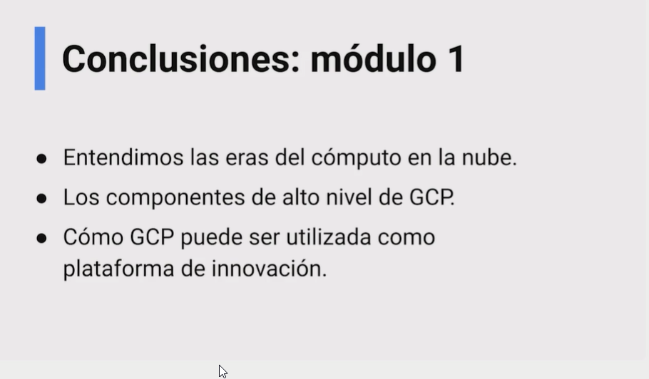

# 08 - Curso de Introducción a Google Cloud Platform

## Clase 1: Bienvenida 
- Profesor David Aroesti
```
Conoce el poder de la nube y toda la infraestructura de Google Cloud Platform para llevar tus aplicaciones a otro nivel. Comprende cómo funciona la red de Google, sus beneficios, seguridad y recursos. Comienza a utilizar la plataforma y su Cloud Marketplace en acción.

Entiende qué es la nube y cómo funciona la red de Google Cloud Platform.
Conoce los beneficios de seguridad de usar GCP.
Aprende a crear un presupuesto de servicios cloud.
```
## Clase 2: Google Cloud 

**Nota**
- Google Cloud Platform se trata de la suite de infraestructuras y servicios que Google utiliza a nivel interno y, también está disponible para cualquier empresa o usuario, de tal forma que sea aplicable a multitud de procesos empresariales.
- Google Cloud Platform, nos ofrece herramientas que podemos dividir en 3 grupos, según el tipo de servicio:
- Infraestructura como servicio (IaaS)
- Plataforma como servicio (PaaS)
- Software como servicio (SaaS)

**Enlaces**
- https://www.cloudskillsboost.google/quests/120?qlcampaign=4l-googlehostedmarketing-37

**Comentarios**
```
Terminé odiando a GCP, son unos estafadores, te obligan a poner una tarjeta de crédito, al cabo del curso se te terminan los créditos que te regalan.
Nadie te avisa que tenes que eliminar todos los servicios (sólo te avisan en la última clase de Curso Profesional de TF con Computer Vision, pero ya es tardísimo), que diste de alta para los cursos y después en el resumen bancario te llega una deuda en dolares que si no estas bien parado te parte al medio.
Lamentable la atención al cliente de GCP para cancelar todos los sevicios, prácticamente es imposible y te lleva demasiado tiempo.
Ahora entiendo porque GCP JAMAS será como AWS, son unos chantas.
```

## Clase 3: ¿Qué es el cómputo en la nube?

- 💡 Es un un conjunto de sistemas distribuidos bajo demanda.

**Características del computo en la nube:**
- Cómputo de auto servicio y bajo demanda.
- Conectado a la red (puedes acceder desde donde sea).
- Economías de escala (El proveedor comparte los recursos entre todos los clientes).
- Elasticidad (el cliente puede obtener recursos o disminuirlos según lo requiera de forma muy rápida).
- Servicio medido (se paga lo que se consume).


**La nube como globalización**
- Siendo la nube un concepto muy rentable para múltiples modelos de negocio, es importante el investigar la rentabilidad de la inversión ya que en concepto, nos permitirá abstraer en diferentes concepciones:


**IaaS**
- Estamos hablando de infraestructuras como servicio.
- Dichas infraestructuras pudieran ser de hardware a un tercero a cambio de una cuota o alquiler (capacidad de proceso, RAM, almacenamiento).
- También, es posible contratar servicios de virtualización, MX, Backups, etc.
- Ejemplos de este tipo son AWS, GCP o Azure.


**PaaS**
- Estamos hablando de plataformas como servicio.
- Son servicios que permiten lanzar aplicaciones, BD, ML, etc., cuyo objetivo es el ideal para los desarrolladores que sólo quieran centrarse en la implementación y administración de sus aplicaciones.
- Ejemplos de este tipo son algunos de Google App Engine (GCP), Amplify (AWS). Así como, dependiendo de la necesidad, Heroku / Netlify / Firebase.

**(BaaS)**
- “backend as a service”
- Firebase se conoce como “backend as a service” (BaaS)
- Esto permite enfocarse en el desarrollo de tu aplicación y no en tu infraestructura

**SaaS**
- Estamos hablando de software como servicio.
- Generalmente orientado como el conjunto de soluciones / programas / plataformas que permiten a una empresa darle funcionamiento u operar bajo sus objetivos primarios.
- Ejemplos son como Gmail, Office, etc.


**Enlace**
- https://cloud.google.com/infrastructure/


## Clase 4: ¿Qué es el cómputo en la nube?


**Partes del Data Center**
- Networking Room: Aquí se conectan los clusters de Jupiter con el resto de Google Cloud a tráves de la red backbone de Google.

- Jupiter Network Equipment: Equipo (software y hardware) desarrollado por Google, para conectar todos los servidores de los data centers, para que sean casi uno solo.

- Maglev Load Balancers: Son Load Balancers Globales. Equilibran la carga a Google Compute Engine, para que así atender un millón de solicitudes por segundo sin pre-warming.

**Custom Chips:**

- Titan: Microcontrolador seguro de bajo consumo diseñado teniendo en cuenta los requisitos y escenarios de seguridad de hardware de Google.

- Cloud TPUs: Chip diseñado para acelerar las cargas de trabajo de aprendizaje automático con TensorFlow.

- Water Pipes: Agua fría que corre desde la planta de enfriamiento hasta el centro de datos, donde se utiliza para extraer calor del interior de las hot huts. Luego, el agua tibia se devuelve a la planta de enfriamiento donde se elimina el calor residual y el agua regresa al centro de datos.

- HotHut: Sistemas de enfriamiento personalizados para los racks de servidores de Google. Sirven como hogares temporales para el aire caliente que sale de nuestros servidores, aislándolo del resto del piso del centro de datos.

- Cooling Plant: En los centros de datos de Google, se usa el “enfriamiento gratuito” que proporciona el clima a través de un sistema de agua. Es decir, la planta de enfriamiento recibe agua caliente del centro de datos y agua fría de las torres de enfriamiento, el calor se transfiere del agua caliente al agua fría. El agua enfriada regresa al piso del centro de datos para extraer más calor del equipo allí, y el agua caliente fluye hacia las torres de enfriamiento para ser enfriada.

## Clase 5: Eras del cómputo en la nube

**Era**
- Eras de las VM Maquinas virtuales 
- Era de la infraestructura en la nube
- Era de la nube transformacional

**Que requiere la industria el dia de hoy**
- Como podemos actuar de manera mucho mas inteligente
- Como nos transformamos mientras mantenemos la libertad de adaptarnos
- Como conectamos a las personas de mejor manera
- Como nos protegemos

**La nube de datos**
- adopta el ciclo de vida completo de los datos
- democratiza el acceso a los daos para impulsar los resultados
- las soluciones de inteligencia artificial lideres ayudan a las empresas a redecir y  automatizar

**La nube abierta**
- Aprovecha la flexibilidad y la innovacion de ser open source
- Disfruta de la libertad de un entorno multinube para crear y ejecutar aplicaciones desde cualquier lugar
- aprovecha las soluciones de nuestro ecosistema de socios para ampliar tus opciones tecnologicas

**La nube colaborativa**
- Entorno de trabajo reinventado
- Nuevas formas de fortalecer las conexiones humanas
- Ayuda a las empresas a conectarse con clientes y socios
- La nube de confianza
- Una plataforma segura que brinda transparencia y habilita la soberania
- Una arquitectura probada de Confianza cero
- Destino compartido, no responsabilidad compartida

**La nube transformacional**

- La nube mas limpia / Sustentabilidad
- te ahorra dinero
- Facil de usar y se optimiza automaticamente
- Soluciones de industria a la medida
- Arquitecturas de Computo en GCP

## Clase 6 : Arquitecturas de cómputo en GCP
**Arquitecturas de cómputo**

>La nube es una infraestructura que provee de múltiples soluciones, personalizables, para satisfacer las altas demandas tecnológicas.

**Serverless**
> Es un tipo de arquitectura que nos permite descentralizar los diferentes recursos existentes de nuestra aplicación. En ocasiones, a serverless se le denomina sistemas distribuidos ya que permite, abstraer desde servidores hasta módulos denominados cloud functions.

Una de las principales ventajas de implementar serverless es la creación de arquitecturas como cliente-servidor, micro-servicios, entre otros.

**Contenedores**
> Son abstracciones independientes de recursos minimals, con las cuales se abstrae la ejecución de dependencias de una aplicación.

**Podemos encontrar soluciones para diferentes industrias como:**
- E-Commerce
- Telecomunicaciones
- Media y entretenimiento
- Educación
- Juegos

**Dichas soluciones, dependiendo del caso, se alinean según sean los intereses de cada caso:**

- Aplicativos: soluciones que utilizan tecnologías nativas de la nube, como contenedores, serverless, etc.
- Inteligencia artificial: soluciones que permiten el desarrollo de ML y sus derivados.
- Base de datos: soluciones para migración y administración empresarial.

**Nota**
- Contenedores son ejecutables en la nube
- Contenedores nos dan flexibilidad 
- Serverless nos da velocidad 
- Los contenedores tienen todo lo necesario para instalar y ejecutar diferentes sistemas en la nube


**Opciones de computo**

**Compute Engine**
- Virtual Machines
- Bear Metal (servidores completos por el tea de licenciamiento especial)

**GKE**
- Kubernetes Engine
- como orquestrar diferentes tipos de contenedores

**App Engine (Serverless Platform)**
- Para correr aplicaciones web
- cero administracion de servidores

**Cloud Run**
- Contenedores serverless

**Cloud Function**
- Funcion Serverless

**Firebase**
- PaaS de Front-end y desarrollo movil
- Se conoce como Back-end as a Service

**Computo Serverless**

- Desarrolla, implementa y escala aplicaciones de forma rapida y segura en un entorno totalmente gestionado
- Auto-escalado
- Completamente administrado
- Speed to Market


**Ejemplo**


**Productos de Google: A hoy día 2022**

**Compute Engine**
- Máquinas virtuales que se ejecutan en el centro de datos de Google.

**Cloud Storage**
- Almacenamiento de objetos seguro, duradero y escalable.

**SDK de Cloud**
- Herramientas de línea de comandos y bibliotecas para Google Cloud.

**Cloud SQL**
- Servicios de bases de datos relacionales para MySQL, PostgreSQL y SQL Server.

**Google Kubernetes Engine**
- Entorno administrado para ejecutar apps en contenedores.

**BigQuery**
- Almacén de datos para estadísticas y agilidad empresarial.

**Cloud CDN**
- Red de distribución de contenidos para entregar contenido web y de video.

**Dataflow**
Estadísticas de transmisión para procesamiento por lotes y de transmisiones.

**Operations**
Paquete de herramientas de supervisión, registro y rendimiento de aplicaciones.

**Cloud Run**
- Entorno completamente administrado para ejecutar apps en contenedores.

**Anthos**
- Plataforma para modernizar las apps existentes y compilar apps nuevas.

## Clase 7: La red de Google

**Aggressive Global Rollout**

- Es una red privada con una dimension y alcance bastante grande
- Como construir cables submarinos
- Aterrizaje de un cable submarino
- Vinculos submarinos para cables
- son repetidores para la amplificacion de senales opticas
- es bastante particular y bastante segura
- esto permite un alcance global

> Red de Google

**Red Global**
- Reduce la carga de configuracion
- Alcance global
**Migracion en vivo**
- Resistencia de la red
- Alta Disponibilidad
- Actualizaciones y Mantenimiento administrados
**Escala y Rendimiento**
- Escalado horizontal
- Mejor rendimiento de las aplicaciones
- Sin punto de estrangulamiento


> Cloud DNS

**DNS global de baja latencia**

- Se integra con Global Anycast IP Load Balancing
- Gestion de registros sencilla y escalable
- DNSSEC para verificar la integridad del registro DNS

**Content Delivery Networks**
- Una CDN global probada (Red de distribución de contenidos)
- Una red de distribucion de contenido creada para llegar a usuarios en todo el mundo
- Soporte de objetos grandes para media y juegos

>Una red de distribución de contenidos es una red superpuesta de computadoras que contienen copias de datos, colocados en varios puntos de una red con el fin de maximizar el ancho de banda para el acceso a los datos de clientes por la red


**Network Tiers**
- Red premium para llegar a tus usuarios rapidamente 
- Red estandar para aplicaciones as sensibles a los costos

**VPC Service Controls**

- Mitiga los riesgos de filtracion de datos
- Extiende los limites de seguridad en los entornos de la nube
- Enforce context-aware access
- Gestion centralizada de las politicas de seguridad

**Cloud Armor**

- Defensa contra DDoS y los ataques web
- Defensa DDoS construida a escala
- Defensa contra Top 10 OWASP
**Integrado con un rico ecosistema de socios de seguridad**
> “Absorber los ataques mas grandes requiere el ancho de banda necesario para ver medio millon de videos de Youtube al mismo tiempo, en HD”

**Notas**

```
¿Qué significa un DDoS?
Resultado de imagen para DDoS
Un ataque DDoS, o ataque distribuido de denegación de servicio, es un tipo de ciberataque que intenta hacer que un sitio web o recurso de red no esté disponible colapsándolo con tráfico malintencionado para que no pueda funcionar correctamente.
```

## Clase 8: Regiones y zonas en GCP


>Los recursos de Compute Engine se alojan en varias ubicaciones en todo el mundo. Estas ubicaciones se componen de regiones y zonas.

- Una región es una ubicación geográfica específica donde puedes alojar recursos. Las regiones tienen tres o más zonas. Por ejemplo, la región us-west1 corresponde a una región en la costa oeste de Estados Unidos que tiene tres zonas: us-west1-a, us-west1-b y us-west1-c.

- Los recursos que se ubican en una zona, como las instancias de máquina virtual o los discos persistentes zonales, se denominan recursos zonales. Otros recursos, como las direcciones IP externas estáticas, son regionales. Cualquier recurso de esa región puede usar los recursos regionales, sin importar la zona, mientras que, en el caso de los recursos zonales, solo los pueden usar otros recursos en la misma zona.

- Ubicar recursos en diferentes zonas de una región reduce el riesgo de interrupciones en la infraestructura que afectan a todos los recursos de forma simultánea. Ubicar recursos en diferentes regiones proporciona un grado aún mayor de independencia de fallas. Esto te permite diseñar sistemas sólidos con recursos distribuidos en diferentes dominios con fallas.

**Resumen**


## Clase 9: Responsabilidad con el ambiente

> Google Cloud es uno de os mejores en aprovechar al máximo la electricidad que se utiliza. 


> La plataforma de Google ha logrado mucho avances tanto en eliminar su huella de carbono como en aumentar su calidad de producto para el mundo.

> Es interesante como Google quiere generar 0 carbono en poco tiempo, lo interesante también es cual es la posición de toda la industria para participar de esta manera

**Enlace**
- https://cloudonair.withgoogle.com/events/emea-sustainability-101
- Microsoft sus servidores estan en el bajo del mar ->https://www.youtube.com/watch?v=0_veMXUsutU

**Resumen**


## Clase 10: APIs abiertas

**BigQuery:**
- Es un patron en la nube
- Como BigQuery aprovecha la infraestructura de la nube para trabajar de forma paralela y darnos resultados.

**Que se puede hacer**
- Mandamos query en SQL.
- Punto de presencia: entra a la red de Google.
- Llegar al DataCenter más cercano, viajando por la private fiber network de Google.
- La query se encamina a un cluster dentro del data center. Podemos tener anchos de banda muy potentes como 1 petabyte por segundo de datos.
- Un nodo ejecutador convierte nuestra query en un plan ejecutador; es decir, divide nuestra query en pedacitos para procesarlos de manera paralela.
- Escogen máquinas que ejecutarán nuestros pedacitos de query de forma paralela.
- El resultado se junta y se regresa al usuario.


**Nube híbrida y multinube**

- Debido a que las cargas de trabajo, la infraestructura y los procesos son exclusivos de cada empresa, cada estrategia híbrida debe adaptarse a necesidades específicas. El resultado es que los términos nube híbrida y múltiples nubes, a veces, se usan de forma inconsistente.

- En el contexto de Google Cloud, el término nube híbrida describe una configuración en la que las cargas de trabajo comunes o interconectadas se implementan en varios entornos de computación, uno basado en la nube pública y, al menos, uno privado.

- El término múltiples nubes describe las configuraciones que combinan al menos dos proveedores de servicios en la nube pública.

- Anthos: crear y administrar aplicaciones modernas híbridas y de multiples nubes.


## Clase 11: Beneficios de Google Cloud

**Inteligente:**

- Convierte los datos en información valiosa en tiempo real usando IA

- La toma de decisiones ágil

**Abierta y flexible:**

- Elección y flexibilidad con soluciones de código abierto, hibridas y multinube

- Protege a tu negocio del vendedor lock-in

**Colaboración y productividad**

- Google worspace proporciona toda las herramientas digitales que necesitas para ayudar a que su empresa prospere hoy y mañana

- Los equipos colaboran, los trabajadores de primera linea se mantienen conectados y las empresas crean nuevas experiencias para los clientes

- Las soluciones felxibles de Workspace hacen que trabajar desde cualquier lugar sea una realidad

**Segura**

- Sus datos se almacenan, procesan y protegen en la misma infraestructura que se utiliza para las propias operación es de Google

- Solo Google Cloud cifra los datos en reposo y en transito de forma predeterminada
Con la red de Google, sus datos no se transfieren a través de redes publicas, lo que aumenta el rendimiento y la seguridad.

**Sustentable**

- Google Cloud es el único proveedor de nube importante que compra suficiente energía renovable para cubrir todas nuestras operaciones

- Las emisiones operativas netas de su uso de la nube son cero y la electricidad utilizada se corresponde con un 100% de energía renovable

**Ahorras costos**

- Google Cloud ayuda aumentar la eficiencia operativa y optimizar el gasto TI
- La migración de aplicaciones de Google Cloud puede ahorrar hasta un 32% (en comparación con on-prem)
- La factura con respecto a proyecto proporcionan visibilidad del ROI de iniciativas especificas

**Fácil de usar**

- Google Cloud es fácil de usar y se optimiza automáticamente
Diseñada para implementar fácilmente servicios en la nube a gran escala

**Soluciones de Industria**

- Mejore la eficiencia y la agilidad, reduzca costos y captura nuevas oportunidades de mercado
- Desde telesalud retail de nueva generación, Google Cloud crea soluciones personalizadas para abordar sus mayores desafíos.
- Empresas como Netflix, P&G y Target confían en nuestras soluciones, experiencia y red de socios únicas y pioneras en la industria.


## Clase 12: Seguridad de varias capas


> Es una nube construido por desarrolladores para Desarrolladores

**On-Premises**
- Responsabilidad del 100% de la seguridad
**IaaS**
- Responsabilidad del proveedor toda la seguridad del hardware y de su conectividad
**PaaS**
- Responsabilidad del proveedor toda la seguridad de usuarios, accesos, autorizaciones
**SaaS**
- Solo es responsabilidad del usuario las access policies y el contenido

**Seguridad de extremo a extremo**

- Imagenes Bases Seguridad
- Analisis de Vulnerabilidades (De las dependencias que tenemos en las imagenes)
- Autorizacion binaria
- Contenedores Escudados
- Sandbox de Contenedores
- Deteccion de amenazas a contenedores

**Estandares, regulaciones y certificaciones**
- Identidades seguras criptograficamente
- Identidad del usuario
- Identidad del Dispositivo
- Identidad de la maquina
- Identidad del Servicio
- Identidad del codigo

**Nota**
- Existen diferentes niveles donde se pueden implementar medidas de seguridad, los cuales son los siguientes:

  - Aplicación
  - Infraestructura virtualizada
  - Hardware

**¿Qué es exactamente el Clickjacking?**

> El Clickjacking también llamado UI Redressing, es una técnica maliciosa destinada a persuadir a un usuario de Internet a dar click en enlaces aparentemente seguros; pero que tienen como objetivo brindarle la oportunidad al hacker de robar información o tomar el control del ordenador del usuario.

`En otras palabras, es una forma de piratería informática maliciosa que le da la oportunidad al atacante de tener acceso a datos sensibles; instalar malwares o, en algunos casos, crear PCs “zombies”. En el peor de los casos, el cibercriminal puede obtener el control de servicios vitales de una empresa para lograr beneficios económicos a través de la extorsión.`

`Cuando aplican el clickjacking, los atacantes a menudo utiliza marcos ocultos para robar información. Aunque no es una técnica nueva; los hackers se esfuerzan en encontrar medios innovadores para engañar a los usuarios. Por lo que no dudan en utilizar su dominio de la web; sus conocimientos relacionados con el comportamiento de los internautas y las nuevas tecnologías (html5, display none, etc.), para perfeccionar sus técnicas maliciosas.`


## Clase 13: Cómo tus datos están protegidos en Google Cloud

- Toda la informacion en el disco duro esta cifrada
- Cada disco duro solo contiene partes de la informacion de un mensaje y jamas la imagen original completa
- Data Encryption keys: llaves generadas para encriptar cada parte individual de un mensaje original

`Key encryption Keys: llaves que pueden ser generadas por Google o por el propietario de la informacion`

- Envías un archivo desde tu ordenador.
- Llega a un punto de presencia, ya dentro nadie puede entrar.Todos los datos están cifrados.
- Llega al DC regional. Cada hardware verifica que cada solicitud tenga una identidad auténtica.
- Divide el archivo en múltiples piezas. Se guarda en discos distintos. Es por eso que tener un solo disco no sirve de nada por tener solo fragmentos de la información.
- Se generan llaves para cifrar los archivos (Data Encryptions Keys).
- Se crea otra llave para cifrar las llaves que cifran los archivos. Esta puede ser creada por Google o por el usuario.
- Para obtener los datos, necesitamos sus ID. Las piezas se desencriptan con sus llaves, se unen y regresan al usuario.


## Clase 14: Presupuestos y facturación
Billing accounts son el vehículo de pago para tus gastos en GCP, y tienen dos tipos:

1.- Se puede tener un self-service en el cual paga lo que usas sin necesidad de un contrato
2.- Se firma un contrato como un servicio tradicional y se generan solicitudes de pago

**_Payment Profile: _Acá se guarda la tarjeta de crédito y es la que gestiona.**

**Nota**
> Tenemos que tener mucho cuidado con como usamos los recursos para no tener sorpresas a final de mes y este diagrama lo explica todo super bien


## Clase 15: Conclusiones



## Clase 16: Comienza a utilizar Google Cloud Platform

**Establecer las Buenas prácticas:**

- Establecer los medios de pago en el payment profile
- Generar una billing account y ligarla a la organización
- Exportar todo los datos a big query

## Clase 17: La jerarquía de recursos en Google Cloud

**Nota**
- Mapea la estructura organizacional.
- Administra a escala.
- Separación.
- Herencia de políticas.

**Organización**
> Es raíz de la jerarquía de recursos. Esta tiene varias cosas asignadas directamente a la organización:

- La Billing Account está asignada a esta.
- Los grupos administradores puede operar en este nodo.
- Los permisos que toda la organización deba tener se pueden asignar aquí, y heredarlos a los nodos que están debajo.

**Cloud Identity**
> Si usamos Google Workspace, el SaaS (Software as a Service) de Google, las identidades son una forma de autenticar a los usuarios que pertenecen a tu organización y tienen acceso a tu Google Cloud.

- Cloud Identity nos permite generar los usuarios para Google Cloud sin necesidad de tener Google Workspace. Nos da 50 identidades sin costo.

A la organización se le liga un dominio para identificarla.


**Folders**
> Modela la estructura organizacional con GCP (ya sean departamentos, equipos, aplicaciones, cargas de trabajo, ciclo de vida, facturación y aislamiento de seguridad).

- Los folders pueden contener proyectos y carpetas.
- Poder agrupar las estructuras en folders nos permite:
- Limitar el acceso, crear grupos y darles permisos en un espacio específico.
- Discriminar costos, saber cuanto me cuesta un nodo en específico.
- Proyectos
- Contienen los recursos computacionales. Un proyecto es un agrupador de recursos.
- Es importante desarrollar un proyecto con una necesidad en mente.

**Ejemplos**
- Proyecto de CI/CD
- Proyecto de un Micro servicio
- Proyecto para el sitio de marketing

**Ventajas de los proyectos pequeños:**
- Fácil mantenimiento
- Más seguridad
- Facilidad de Evolución`

## Clase 18: Identidad y control de acceso (IAM)

**¿Quién es el miembro?**
- una persona
- un subsistema (ejem. Aplicación): esto se le conoce como service account.
- Zero Trust / Confianza Cero: No confiamos en lo que está dentro de nuestro perímetro de - seguridad de forma automática.

Las comunicaciones dentro del perímetro de seguridad están cifradas y vienen con permisos.
Establecemos que aplicaciones pueden hablar con que aplicaciones.
Determinamos el tipo de recursos que las aplicaciones pueden generar.


**¿Qué puede hacer?**
- Existe una taxonomía muy grande de recursos relacionados con que puede hacer.
- Los recursos tienen ciertos permisos asignados. Además los permisos permiten realizar acciones sobre un recurso:
  - Generar uno nuevo
  - Modificarlo
  - Borrarlo
  - Hacerle update


**¿En cuál recurso?**
> Las políticas de seguridad se asignan a cada uno de los recursos. En una política podemos establecer el rol de los miembros.

**Quién puede hacer qué en cuál recurso.**

- El quién es persona o aplicación.
- El qué son permisos y se asignan a través de roles.

**Roles**
- Los roles son una colección de permisos detallados que asignamos a grupos.
- Podemos generar nuestros propios roles, pero ya hay varios existentes.

**Asignación de politicas y herencia**
> Se puede asignar a varios niveles: podemos asignar políticas a nivel org. folder, proyecto y recurso.
- Además de que heredan la política de los nodos superiores.
- Estructura de una política