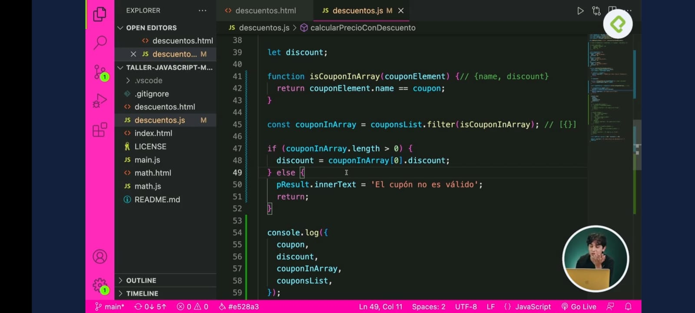

# 01 - Taller Práctico de JavaScript: Matemáticas y Estadística Básica

## Clase 1: Bienvenida 
- Profesor  Juan David Castro Gallego
```
¡Aprende a resolver problemas de matemáticas y estadística básica usando JavaScript! Analiza fórmulas y transfórmalas en código JavaScript para darles usos prácticos (y relevantes para la vida real). Empieza desde operaciones básicas hasta desarrollar un análisis salarial desde sitios web interactivos junto a tu profesor JuanDC.
```
## Notas 

**Resumen Manejo de arrays FILTER**
- Pues son las nuevas formas de usar los arreglos en JS
- Podemos reemplazar este metodo, por un bucle for, while
- Recuerda que este metodo recibe una función anonima o otra función
- Recuerda que tambien la puedes simplificar pero prefiero crear una función y pasarsela
- TIENES QUE ESTAR mosca con lo que retorna ya que retorna un objeto, o un arreglo de objeto 

**Ejemplo**


```
// Codigo Ejemplo 
 var lista = [true, false, true, false];
 var ValorGlobal = true;

// Aqui puede estar la logica que necesitemos dentro del Filter
function metodoInterno( lista ){
    return lista.existe == ValorGlobal; 
}

//Aqui convocamos el filter 
const ListaQuesiExisten = lista.filter(metodoInterno);
```


**Resumen Manejo de arrays FIND**
- Otra forma de recorrer un arreglo este busca la coincidencia que puedas programar
- Podemos reemplazar este metodo, por un bucle for, while
- Recuerda que este metodo recibe una función anonima o otra función
- Recuerda que tambien la puedes simplificar pero prefiero crear una función y pasarsela
- TIENES QUE ESTAR mosca con lo que retorna ya que retorna un objeto


```
// Codigo Ejemplo 
 var lista = [true, false, true, false];
 var ValorGlobal = true;

// Aqui puede estar la logica que necesitemos dentro del Filter
function metodoInterno( lista ){
    return lista.existe == ValorGlobal; 
}

//Aqui convocamos el filter 
const ListaQuesiExisten = lista.find(metodoInterno);//{}
```


**Resumen Manejo de arrays REDUCE** 
- Podemos reemplazar este metodo, por un bucle for, while
- Se usa mucho para sumar el contenido de los areglos 
- Recuerda que este metodo recibe una función anonima o otra función
- Recuerda que tambien la puedes simplificar pero prefiero crear una función y pasarsela
- Este devuelve lo que necesites 
- Permite funcion flecha 
- la función interna si o si recibe dos argumentos 


```
// Codigo Ejemplo 
 var lista = [25, 30, 40, 50];
 

// Aqui puede estar la logica que necesitemos dentro del Filter
function metodoInterno( valorAcumulado, nuevoValor  ){
    return valorAcumulado + nuevoValor; 
}

//Aqui convocamos el filter 
const sumaLista = lista.reduce(metodoInterno);//{}
```

**Resumen Manejo de arrays SORT** 
- Me parece algo tonto esto ya que necesitas hacer una función que haga el acomodo
- En PHP simplemente metes tu arreglo al SORT y te devuelve el array ordenado
- La misma tematica debes crear un metodo y luego enviarlo como parametro en el sort
- Se puede simplificar pero haceremos pasito patito para comprender


```
// Codigo Ejemplo 
 var lista = [500, 100,25, 30, 40, 50];
 

// Aqui puede estar la logica que necesitemos dentro del Filter
function ordenarListaSort( valorAcumulado, nuevoValor  ){
    //return nuevoValor - valorAcumulado;//Mayor  a Menor
    return valorAcumulado - nuevoValor ;//Menor a Mayor
}

//Aqui convocamos el filter 
const listaOdenada = lista.sort(ordenarListaSort);//{}
console.log("resultado", listaOdenada);

```

**Resumen Manejo de arrays Contar Repetidos** 
- Ejemplo para ordenar y contar los repetidos de un arreglos 

```
let list = [10, 20, 30, 40, 20, 30, 50, 40, 10, 96, 10, 74,10];

const validaTotalRepetido = (list)=>{
    //Creo objeto para incluir mi resultado
    let repeatedElements = {};

    list.forEach(element => {
        const index = element;

        if (repeatedElements[index]) {
            repeatedElements[index] += 1; 
        } else {
            repeatedElements[index] = 1; 
        }
    });
    console.log("Resultado->",repeatedElements);

}

validaTotalRepetido(list);

``` 


**Resumen Manejo de arrays Calculo Moda**
- Metodo para pasar Objeto a Arreglos -> let arreglo =   Object.entries(Objeto)

```

const listado = [1,2,3,4,5,8,9,3,4,4,4]

//Calculamos los repetidos 
function cantidadRepetidas(lista){
    const listRepeatCount = {};

    for(let i = 0 ; i< lista.length ; i++){
        const element = lista[i];

        if(listRepeatCount[element]){
            listRepeatCount[element] += 1;
        }else{
            listRepeatCount[element] = 1;
        }
        
    }

   //Pasamos el Objeto a un arreglo en JS 
   const objectArray = Object.entries(listRepeatCount);
   
   //Ordenamos el arreglo bidimencional 
   const ordenarBidemensional = ordenarListaBidimensional(objectArray);
   let moda;
   let keys;
   
   //Ciclo para sacar el Maximo del arreglo bidimencional que en este caso es la moda el valor que mayormente se repite en la lista
   for(let i = 0 ; i < ordenarBidemensional.length;i++){
        moda = Math.max(ordenarBidemensional[i][1]);//Total 
        keys = Math.max(ordenarBidemensional[i][0]);//Valor 
    }
   console.log({moda,keys});
}


cantidadRepetidas(listado);

//Metodo para ordenar arreglo bidimenciona 
function ordenarListaBidimensional(objectArray){
    const ordenar = objectArray.sort((a,b)=>a[1]-b[1]);
    return ordenar;
}

```

