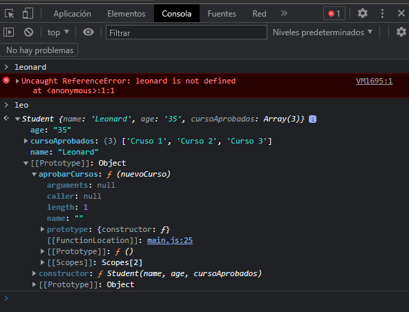
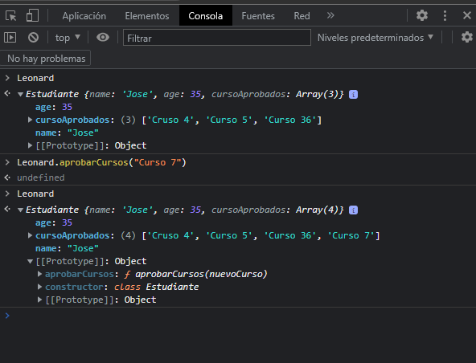

# 00 - Curso Básico de Programación Orientada a Objetos con JavaScript

## Clase 1: Bienvenida 
- Profesor Juan David Castro Gallego
```
Aprende programación orientada a objetos en JavaScript. Comprende la diferencia entre objetos literales, instancias, clases y prototipos en JavaScript
```
## Clase 2: Qué es programación orientada a objetos

>son formas o caminos que podemos seguir para programar las aplicaciones

**Principales paradigmas de programacion**
**Programación imperativa:**
- Los primeros lenguajes de programación y, por extensión, también los primeros programas informáticos, se basaban completamente en este enfoque, que prevé una secuencia regularizada de órdenes o instrucciones determinadas. 
- Este paradigma de programación es la base, por ejemplo, de los veteranos lenguajes Pascal y C, así como de todos los lenguajes ensambladores, entre otros. 
- En la programación imperativa, el centro de atención radica, entre otras cosas, en trabajar lo más cerca posible del sistema. 
- Como consecuencia, el código de programación resultante es fácil de comprender y, a la vez, muy abarcable.
imperativa.png

**Programacion estructurada:**
- La principal modificación del principio básico radica en que, en lugar de instrucciones de salto absolutas (instrucciones que provocan que el procesamiento no continúe con la siguiente instrucción, sino en otro lugar) este paradigma de programación de software prevé el uso de bucles y estructuras de control.

**Programación procedimental:**
- El paradigma de programación procedimental amplía el enfoque imperativo con la posibilidad de desglosar algoritmos en porciones manejables.
- Estos se denominan como procedimientos, dependiendo del lenguaje de programación, o también como subprogramas, rutinas o funciones. 
- El sentido y el propósito de esta distribución es hacer que el código de programa sea más claro y evitar las repeticiones innecesarias de código.

**Programación modular:**
- El código fuente se divide específicamente en bloques parciales lógicos independientes los unos de los otros para proporcionar más transparencia y facilitar el proceso de debugging (resolución de errores). 
- Los bloques parciales individuales, denominados módulos, se pueden probar por separado antes de vincularlos posteriormente a una aplicación conjunta


**Programación declarativa:**
- Radica en la descripción del resultado final que se busca. Por lo tanto, en primera línea se encuentra el `qué` del resultado y no el `cómo` de los pasos que llevan a la solución, como es el caso en la programación imperativa. 
- Esto provoca que el código de la programación declarativa sea más difícil de comprender debido al alto grado de abstracción, aunque resulta muy corto y preciso.


**Programación funcional:**
- Un programa de programación funcional consta de llamadas de función concatenadas en las que cada parte del programa se interpreta como una función. 
- En este sentido, las funciones dentro de la programación funcional pueden adoptar distintas `estructuras`. 
- Por ejemplo, se pueden vincular entre sí como datos o se pueden utilizar en forma de parámetros. 
- Asimismo, se pueden utilizar como resultados de función. 
- En contraposición, el paradigma se ocupa de que no haya asignaciones independientes de valores.


**Programación lógica:**
- El paradigma de software lógico, denominado también como programación predicativa, se basa en la lógica matemática. 
- En lugar de una sucesión de instrucciones, un software programado según este principio contiene un conjuntode principios que se pueden entender como una recopilación de hechos y suposiciones.
- Todas las solicitudes al programa se procesan de forma que el intérprete recurre a estos principios y les aplica reglas definidas previamente para alcanzar el resultado deseado.


## Clase 3: Bonus: fútbol y programación orientada a objetos

**Clase:** Representación de métodos y atributos que representan a una entidad.

**Objeto:** Instancia de una clase.

**Herencia:** Crear nuevas clases con características similares a partir de otras.

**Encapsulamiento:** Esconder datos que solo pueden ser accedidos por la clase.

**Polimorfismo:** Un objeto puede comportarse de muchas formas, ejemplo: En herencia, las clases hijas pueden comportarse como su clase padre y viceversa.


**Pilares de la POO**
- Encapsulamiento: Quiere decir que oculta datos mediante código. 
- Abstracción: Es como se pueden representar los objetos en modo de código.
- Herencia: Es donde una clase nueva se crea a partir de una clase existente.
- Polimorfismo: Se refiere a la propiedad por la que es posible enviar mensajes sintácticamente iguales a objetos de tipos distintos.

## Clase 4: Qué es un objeto en JavaScript

**Podemos crear varios tipos objetos en JavaScript**
**Objetos Literales**
- Son definiciones de objetos que podemos semejar a un arreglo o un diccionario de datos. 
- Recuerda que los objetos literales no es lo mismo que una instancia. 
- Recuerda que este objeto literal no es lo mismo que una programación orientado a objetos. 
- Los objetos literales son los objetos que hemos trabajado toda la vida por ejemplo un array, yo los usaba los objetos como contenedores, ellos instancian por default al prototipo Object

**Ejemplo**
```
let objetoLiteral = {
    nombre: "Juan",
    apellido: "Rodriguez"
}

```

**Objetos Prototipo**
- Para este tipo de objeto no creamos clases todo se maneja por medio de funciones. 
- Se usa la palabra reservada `this` para guardar nuestros atributos 
- Podemos usar tambien la palabra reservada `new`, para por decirlo de manera sencilla asignarlo a nuestro nuevo valor. 
- Las instancias se ven muy semejante a los `objetos literales` 
- Existe un detalle que si lo vemos desde consola de `Dev tool` este indica que es una instancia mientras que el objeto literal no indica instancias. 
- Tenemos una ventaja si usamos `proto` este hereda un conjuntos de metodos del padre PROTO, osea hereda metodos del padre superior de Js. 
  

**Ejemplo**
```
function prototipo () {
    this.name = "Juan P",
    this.apellido = "Rodriguez P"
}

let instanciaPrototipo = new prototipo();
```


**Notas**
-  Todo lo que creamos en JavaScript se le conoce como objeto
-  Los prototipos son un mecanismo mediante el cual los objetos en JavaScript heredan características entre sí

## Clase 5: Objetos literales y prototipos en JavaScript

**Prototipos (Prototypes)**
JavaScript es un lenguaje basado en prototipos, por lo tanto entender el objeto prototype es uno de los conceptos más importantes que los profesionales de JavaScript necesitan saber.

**Ejemplo**
```
//Objeto Prototipado 

function Student(name, age, cursoAprobados){
    this.name = name;
    this.age = age;
    this.cursoAprobados = cursoAprobados; 
}

//Otra forma podemos crearlo por fuera pero debomosusar la palabra reservada prototype
Student.prototype.aprobarCursos = function (nuevoCurso){
    this.cursoAprobados.push(nuevoCurso);
};

const leo = new Student("Leonard", "35", ["Cruso 1", "Curso 2", "Curso 3"]);

```


## Clase 6: Clases en JavaScript

**Que**
- Recueda que Js a pesar de trabajar Orientado a Objetos y permite usar `Clases` este se basa en `prototipo`, las clases son solo sintaxis que nos permite manejar los objetos de forma amigable, en pocas palabras las clases por dentro son  `prototipo`. 

**Ejemplo**
```
//Class - Decription:
 class Estudiante {

    constructor(name, age, cursoAprobados){
        this.name = name;
        this.age = age;
        this.cursoAprobados = cursoAprobados; 
    }

    //Metodos
    aprobarCursos(nuevoCurso){
        this.cursoAprobados.push(nuevoCurso) ;
    }

}//End to Class 


const Leonard = new Estudiante("Jose", 35, ["Cruso 4", "Curso 5", "Curso 36"]);
```


**Ventajas Patron RoRo**
- Podemos usar el patron `RORO`
- Del Inglés “Receive an object, return an object” (Recibe un objeto, devuelve un objeto).
- Nos ayuda cuando tenemos muchos parámetros en nuestro constructor, ya que al instanciar la clase debemos acordarnos del orden de los parámetros y, además, no podemos tener parámetros por defecto.
- No obstante, si recibimos un objeto, sí podemos poner parámetros por defecto y no recibir un parámetros si fuere el caso, sin que pase nada.
- A la hora de enviar los argumentos al instanciar la clase, también debe enviarse un objeto, y otra ventaja es que esos argumentos no hace falta que estén en el mismo orden que están los parámetros del constructor.

## Clase 7: Ventajas de la programación orientada a objetos

**Reusabilidad**
Cuando hemos diseñado adecuadamente las clases, se pueden usar en distintas partes del programa y en numerosos proyectos.

**Mantenibilidad** 
Debido a las sencillez para abstraer el problema, los programas orientados a objetos son más sencillos de leer y comprender, pues nos permiten ocultar detalles de implementación dejando visibles sólo aquellos detalles más relevantes.

**Modificabilidad** 
La facilidad de añadir, suprimir o modificar nuevos objetos nos permite hacer modificaciones de una forma muy sencilla.

**Fiabilidad** 
Al dividir el problema en partes más pequeñas podemos probarlas de manera independiente y aislar mucho más fácilmente los posibles errores que puedan surgir.

**La programación orientada a objetos presenta también algunas desventajas como pueden ser:**

- Cambio en la forma de pensar de la programación tradicional a la orientada a objetos.
- La ejecución de programas orientados a objetos es más lenta.
- La necesidad de utilizar bibliotecas de clases obliga a su aprendizaje y entrenamiento.