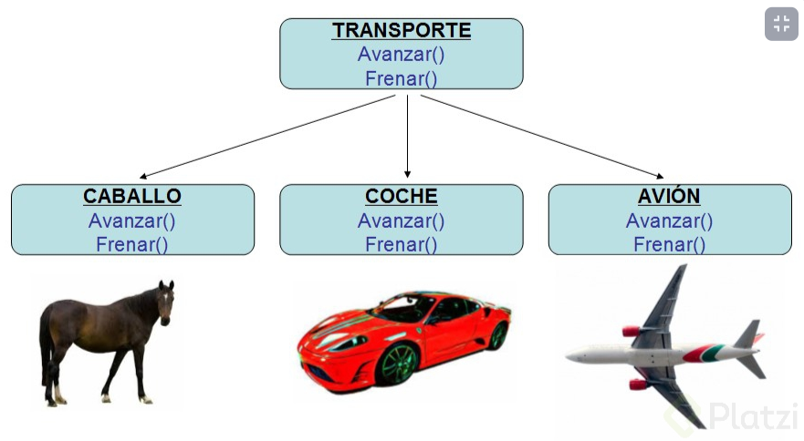

# 00 - Curso Básico de Programación Orientada a Objetos con JavaScript

## Clase 1: Bienvenida 
- Profesor Juan David Castro Gallego
```
Aprende programación orientada a objetos en JavaScript. Comprende la diferencia entre objetos literales, instancias, clases y prototipos en JavaScript
```
## Clase 2: Qué es programación orientada a objetos

>son formas o caminos que podemos seguir para programar las aplicaciones

**Principales paradigmas de programacion**
**Programación imperativa:**
- Los primeros lenguajes de programación y, por extensión, también los primeros programas informáticos, se basaban completamente en este enfoque, que prevé una secuencia regularizada de órdenes o instrucciones determinadas. 
- Este paradigma de programación es la base, por ejemplo, de los veteranos lenguajes Pascal y C, así como de todos los lenguajes ensambladores, entre otros. 
- En la programación imperativa, el centro de atención radica, entre otras cosas, en trabajar lo más cerca posible del sistema. 
- Como consecuencia, el código de programación resultante es fácil de comprender y, a la vez, muy abarcable.
imperativa.png

**Programacion estructurada:**
- La principal modificación del principio básico radica en que, en lugar de instrucciones de salto absolutas (instrucciones que provocan que el procesamiento no continúe con la siguiente instrucción, sino en otro lugar) este paradigma de programación de software prevé el uso de bucles y estructuras de control.

**Programación procedimental:**
- El paradigma de programación procedimental amplía el enfoque imperativo con la posibilidad de desglosar algoritmos en porciones manejables.
- Estos se denominan como procedimientos, dependiendo del lenguaje de programación, o también como subprogramas, rutinas o funciones. 
- El sentido y el propósito de esta distribución es hacer que el código de programa sea más claro y evitar las repeticiones innecesarias de código.

**Programación modular:**
- El código fuente se divide específicamente en bloques parciales lógicos independientes los unos de los otros para proporcionar más transparencia y facilitar el proceso de debugging (resolución de errores). 
- Los bloques parciales individuales, denominados módulos, se pueden probar por separado antes de vincularlos posteriormente a una aplicación conjunta


**Programación declarativa:**
- Radica en la descripción del resultado final que se busca. Por lo tanto, en primera línea se encuentra el `qué` del resultado y no el `cómo` de los pasos que llevan a la solución, como es el caso en la programación imperativa. 
- Esto provoca que el código de la programación declarativa sea más difícil de comprender debido al alto grado de abstracción, aunque resulta muy corto y preciso.


**Programación funcional:**
- Un programa de programación funcional consta de llamadas de función concatenadas en las que cada parte del programa se interpreta como una función. 
- En este sentido, las funciones dentro de la programación funcional pueden adoptar distintas `estructuras`. 
- Por ejemplo, se pueden vincular entre sí como datos o se pueden utilizar en forma de parámetros. 
- Asimismo, se pueden utilizar como resultados de función. 
- En contraposición, el paradigma se ocupa de que no haya asignaciones independientes de valores.


**Programación lógica:**
- El paradigma de software lógico, denominado también como programación predicativa, se basa en la lógica matemática. 
- En lugar de una sucesión de instrucciones, un software programado según este principio contiene un conjuntode principios que se pueden entender como una recopilación de hechos y suposiciones.
- Todas las solicitudes al programa se procesan de forma que el intérprete recurre a estos principios y les aplica reglas definidas previamente para alcanzar el resultado deseado.


## Clase 3: Bonus: fútbol y programación orientada a objetos

**Clase:** Representación de métodos y atributos que representan a una entidad.

**Objeto:** Instancia de una clase.

**Herencia:** Crear nuevas clases con características similares a partir de otras.

**Encapsulamiento:** Esconder datos que solo pueden ser accedidos por la clase.

**Polimorfismo:** Un objeto puede comportarse de muchas formas, ejemplo: En herencia, las clases hijas pueden comportarse como su clase padre y viceversa.


**Pilares de la POO**
- Encapsulamiento: Quiere decir que oculta datos mediante código. 
- Abstracción: Es como se pueden representar los objetos en modo de código.
- Herencia: Es donde una clase nueva se crea a partir de una clase existente.
- Polimorfismo: Se refiere a la propiedad por la que es posible enviar mensajes sintácticamente iguales a objetos de tipos distintos.

## Clase 4: Qué es un objeto en JavaScript

**Podemos crear varios tipos objetos en JavaScript**
**Objetos Literales**
- Son definiciones de objetos que podemos semejar a un arreglo o un diccionario de datos. 
- Recuerda que los objetos literales no es lo mismo que una instancia. 
- Recuerda que este objeto literal no es lo mismo que una programación orientado a objetos. 
- Los objetos literales son los objetos que hemos trabajado toda la vida por ejemplo un array, yo los usaba los objetos como contenedores, ellos instancian por default al prototipo Object

**Ejemplo**
```
let objetoLiteral = {
    nombre: "Juan",
    apellido: "Rodriguez"
}

```

**Objetos Prototipo**
- Para este tipo de objeto no creamos clases todo se maneja por medio de funciones. 
- Se usa la palabra reservada `this` para guardar nuestros atributos 
- Podemos usar tambien la palabra reservada `new`, para por decirlo de manera sencilla asignarlo a nuestro nuevo valor. 
- Las instancias se ven muy semejante a los `objetos literales` 
- Existe un detalle que si lo vemos desde consola de `Dev tool` este indica que es una instancia mientras que el objeto literal no indica instancias. 
- Tenemos una ventaja si usamos `proto` este hereda un conjuntos de metodos del padre PROTO, osea hereda metodos del padre superior de Js. 
  

**Ejemplo**
```
function prototipo () {
    this.name = "Juan P",
    this.apellido = "Rodriguez P"
}

let instanciaPrototipo = new prototipo();
```


**Notas**
-  Todo lo que creamos en JavaScript se le conoce como objeto
-  Los prototipos son un mecanismo mediante el cual los objetos en JavaScript heredan características entre sí

## Clase 5: Objetos literales y prototipos en JavaScript

**Prototipos (Prototypes)**
JavaScript es un lenguaje basado en prototipos, por lo tanto entender el objeto prototype es uno de los conceptos más importantes que los profesionales de JavaScript necesitan saber.

**Ejemplo**
```
//Objeto Prototipado 

function Student(name, age, cursoAprobados){
    this.name = name;
    this.age = age;
    this.cursoAprobados = cursoAprobados; 
}

//Otra forma podemos crearlo por fuera pero debomosusar la palabra reservada prototype
Student.prototype.aprobarCursos = function (nuevoCurso){
    this.cursoAprobados.push(nuevoCurso);
};

const leo = new Student("Leonard", "35", ["Cruso 1", "Curso 2", "Curso 3"]);

```


## Clase 6: Clases en JavaScript

**Que**
- Recueda que Js a pesar de trabajar Orientado a Objetos y permite usar `Clases` este se basa en `prototipo`, las clases son solo sintaxis que nos permite manejar los objetos de forma amigable, en pocas palabras las clases por dentro son  `prototipo`. 

**Ejemplo**
```
//Class - Decription:
 class Estudiante {

    constructor(name, age, cursoAprobados){
        this.name = name;
        this.age = age;
        this.cursoAprobados = cursoAprobados; 
    }

    //Metodos
    aprobarCursos(nuevoCurso){
        this.cursoAprobados.push(nuevoCurso) ;
    }

}//End to Class 


const Leonard = new Estudiante("Jose", 35, ["Cruso 4", "Curso 5", "Curso 36"]);
```


**Ventajas Patron RoRo**
- Podemos usar el patron `RORO`
- Del Inglés “Receive an object, return an object” (Recibe un objeto, devuelve un objeto).
- Nos ayuda cuando tenemos muchos parámetros en nuestro constructor, ya que al instanciar la clase debemos acordarnos del orden de los parámetros y, además, no podemos tener parámetros por defecto.
- No obstante, si recibimos un objeto, sí podemos poner parámetros por defecto y no recibir un parámetros si fuere el caso, sin que pase nada.
- A la hora de enviar los argumentos al instanciar la clase, también debe enviarse un objeto, y otra ventaja es que esos argumentos no hace falta que estén en el mismo orden que están los parámetros del constructor.

## Clase 7: Ventajas de la programación orientada a objetos

**Reusabilidad**
Cuando hemos diseñado adecuadamente las clases, se pueden usar en distintas partes del programa y en numerosos proyectos.

**Mantenibilidad** 
Debido a las sencillez para abstraer el problema, los programas orientados a objetos son más sencillos de leer y comprender, pues nos permiten ocultar detalles de implementación dejando visibles sólo aquellos detalles más relevantes.

**Modificabilidad** 
La facilidad de añadir, suprimir o modificar nuevos objetos nos permite hacer modificaciones de una forma muy sencilla.

**Fiabilidad** 
Al dividir el problema en partes más pequeñas podemos probarlas de manera independiente y aislar mucho más fácilmente los posibles errores que puedan surgir.

**La programación orientada a objetos presenta también algunas desventajas como pueden ser:**

- Cambio en la forma de pensar de la programación tradicional a la orientada a objetos.
- La ejecución de programas orientados a objetos es más lenta.
- La necesidad de utilizar bibliotecas de clases obliga a su aprendizaje y entrenamiento.

## Clase 8:  Abstraccion:

> Es el mecanimos de abstraer un concepto y crear un molde de caracteristicas para poder reaplicarlo en otras entidades. 
> Podemos reducir la complejidad y permitir una implementación y diseño eficiente de los datos.


**Ventajas de uso:**

- Evitamos codigo duplicado, es decir, reusamos codigo.
- Podemos crear múltiples instancias con una sola abstracción.
- Al encapsular datos, los estamos protegiendo
- Evitamos código a bajo nivel.
- Podemos cambiar implementaciones en la clase, sin perjudicar su funcionamiento.

## Clase 9: Abstracción en JavaScript

Se hace una clase especial para crear una abstración


## Clase 10: Qué es encapsulamiento

> Es guardar, proteger o limitar el acceso de cierto atributos y/o propiedades en nuestros prototipos y objetos.

> La encapsulación es el empaquetamiento de datos y funciones en un componente (por ejemplo, una clase) y para luego controlar el acceso a ese componente para hacer un ejecto de “caja negra” fuera del objeto.

**Cuando hablamos de **encapsulamiento **hablamos de:**

- Esconder métodos y atributos 👻
- No permitir la alteración de métodos y atributos ❌

**Formas de aplicar encapsulamiento en JavaScript**
- Getters y setters 🖐
- Namespaces 🙂
- Object.defineProperties 🎈
- Módulo de ES6 🤝

## Clase 11-12: Getters y setters en JavaScript

**Qué son los getters y setters**
Una función que obtiene un valor de una propiedad se llama getter y una que establece el valor de una propiedad se llama setter.

Esta característica a sido implementada en ES2015, pudiendo modificar el funcionamiento normal de establecer u obtener el valor de una propiedad, a estas se les conoce como accessor properties.

**Funcionamiento**
- En ocasiones queremos valores basados en otros valores, para esto los data accessors son bastante útiles.
- Para crearlos usamos los keywords get y set

```
"use strict";

function Student(name, age, nationality) {
  this._name = name;
  this._age = age;
  this.nationality = nationality;
}

Student.prototype = {
  get name() {
    return this._name;
  },
  set name(newName) {
    this._name = newName;
  },

  get age() {
    return this._age;
  },

  set age(newAge) {
    this._age = newAge;
  },
};

let edgar = new Student("Edgar", 25, "Mexico");
edgar.name = "Juan";
edgar.age = 30
console.log(edgar);
```

## Clase 13-14: Módulos de ECMAScript 6

**Enlace**
- https://es.javascript.info/modules-intro

> El uso de los módulos en JavaScript depende de las declaraciones Export e Import.

- Para modular, solo basta que el archivo tenga la extensión .js, pero el motor V8 que es el que corre en los navegadores, recomienda usar la extensión .mjs
- Esto es util porque queda claro cuál archivo es modulo y cual no.
- Asegura que los archivos de modulo sean tratados como tal por la extensión Babel o Node.js

**¿Como Exportar?**
**hay dos formas de exportar:**

- Colocar en frente de cada elemento la palabra export
- Exportar en una sola declaración al final del archivo modulo las características que se quieren exportar, ejemplo:

```
export {PlatziClass, Student, LearningPaths};
```

**¿Como Importar?**
- La importación obviamente se hace en el script que queremos usar dichos elementos.

``` 
import {PlatziClass, Student, LearningPaths} from '/ruta';
``` 

¿Como aplicar el modulo en HTML?
```
<script type="module" src="main.js"></script>
```

**Notas**
- Si bien podemos encapsular atributos y propiedades también podemos encapsular archivos enteros
- Al encapsular archivos enteros podemos restringir y controlar el acceso tanto de variables como funciones o el contenido en sí que tenga dicho módulo
- Para ser utilizados en un sitio web es necesario poder contar con un servidor web y también que sea soportado por el navegador del usuario
- El uso de dichos módulos nos permite usar
```
import {variable} from “./modulo.js”
export variable

```

- En pocas palabras, se están creando funciones fuera de un prototipo, pero aun así el prototipo las llama ya que forma parte de sus metodos}
- Al importar ese prototipo, es imposible acceder a esas funciones, ya que no hacen parte del prototipo mismo, por lo tanto son clases secretas…
- Pero si se pueden acceder a la funciones secretas desde una instancia de clase
- Recuerda que para poder usar code runner debes tener instalado node.js

## Clase 15 - 16: Qué es herencia

`JavaScript en un lenguaje orientado a objetos basado en prototipos, en lugar de estar basado en clases. Debido a esta básica diferencia, es menos evidente entender cómo JavaScript nos permite crear herencia entre objetos, y heredar las propiedades y sus valores.`


> La herencia nos permite crear nuevas clases a partir de otras, la clase principal es llamada la Superclase, esta va a ser la clase general, el molde general. 
> Cuando veamos que tenemos elementos repetidos comenzamos a crear una abstracción, creamos una clase general que nos permita crear nuevas clases.

**Notas**
- Tenemos las subclases, que son las que heredan atributos y métodos de las Superclases, podríamos decir que son las clases hijas. 
- En las clases hijas ponemos los atributos que solo ellas van a utilizar, que son solo características de ellas.
- La herencia nos permite crear `moldes madre` para crear otros prototipos a partir de la clase padre
- La herencia nos ayuda cuando queremos clasificar un grupo de prototipos los cuales queremos que tengan comportamientos bastante similares, pero cada uno con cierta particularidad
- Al referirnos a herencia nos referimos a que obtenemos o heredamos los atributos y métodos de la clase padre
- Para poder heredar de una clase se utiliza la palabra reservada `extends`


**Super**
> La palabra clave super es usada para acceder y llamar funciones del padre de un objeto.


**Ejemplo**
```
class Student {
  constructor({
    name,
    email,
    username,
    twitter = undefined,
    instagram = undefined,
    facebook = undefined,
    approvedCourses = [],
    learningPaths = [],
  }) {
    this.name = name;
    this.email = email;
    this.username = username;
    this.socialMedia = {
      twitter,
      instagram,
      facebook,
    };
    this.approvedCourses = approvedCourses;
    this.learningPaths = learningPaths;
  }
}

class FreeStudent extends Student {
  constructor(props) {
    super(props); //Manera de usar el contructor del padre 
  }

  approveCourse(newCourse) {
    if (newCourse.isFree) {
      this.approvedCourses.push(newCourse);
    } else {
      console.warn("Lo sentimos, " + this.name + ", solo puedes tomar cursos abiertos");
    }
  }
}

class BasicStudent extends Student {
  constructor(props) {
    super(props);
  }

  approveCourse(newCourse) {
    if (newCourse.lang !== "english") {
      this.approvedCourses.push(newCourse);
    } else {
      console.warn("Lo sentimos, " + this.name + ", no puedes tomar cursos en inglés");
    }
  }
}

class ExpertStudent extends Student {
  constructor(props) {
    super(props);
  }

  approveCourse(newCourse) {
    this.approvedCourses.push(newCourse);
  }
}


const juan = new FreeStudent({
  name: "JuanDC",
  username: "juandc",
  email: "juanito@juanito.com",
  twitter: "fjuandc",
  learningPaths: [
    escuelaWeb,
    escuelaVgs,
  ],
});

const miguelito = new BasicStudent({
  name: "Miguelito",
  username: "migelitofeliz",
  email: "miguelito@juanito.com",
  instagram: "migelito_feliz",
  learningPaths: [
    escuelaWeb,
    escuelaData,
  ],
}); 
``` 

## Clase 17 -18 : ¿QUÉ ES EL POLIMORFISMO?

- Es como la herencia reloaded. 
- Es como ‘La Herencia 2.0’. 
- Es un pilar de la OOP. 
- Lo que es importante es lo que se puede hacer con este: Permite a nuestras subclases cambiar o anular los comportamientos de los métodos y atributos del prototipo Padre, de la clase Padre. 
- Aunque herede las propiedades, el polimorfismo permite cambiar su comportamiento.


**Tipos:**

- Polimorfismo de Sobrecarga: ocurre cuando existen métodos con el mismo nombre y funcionalidad similar en clases totalmente independientes entre ellas.
- Polimorfismo Paramétrico: El polimorfismo paramétrico es la capacidad para definir varias funciones utilizando el mismo nombre, pero usando parámetros diferentes (nombre y/o tipo).
- Polimorfismo de Inclusión (JS): La habilidad para redefinir por completo el método de una superclase en una subclase.



```
class Comment {
  constructor({
    content,
    studentName,
    studentRole = "estudiante",
  }) {
    this.content = content;
    this.studentName = studentName;
    this.studentRole = studentRole;
    this.likes = 0;
  }

  publicar() {
    console.log(this.studentName + " (" + this.studentRole + ")");
    console.log(this.likes + " likes");
    console.log(this.content);
  }
}

class Student {
  constructor({
    name,
    email,
    username,
    twitter = undefined,
    instagram = undefined,
    facebook = undefined,
    approvedCourses = [],
    learningPaths = [],
  }) {
    this.name = name;
    this.email = email;
    this.username = username;
    this.socialMedia = {
      twitter,
      instagram,
      facebook,
    };
    this.approvedCourses = approvedCourses;
    this.learningPaths = learningPaths;
  }

  publicarComentario(commentContent) {
    const comment = new Comment({
      content: commentContent,
      studentName: this.name,
    });
    comment.publicar();
  }
}

```

