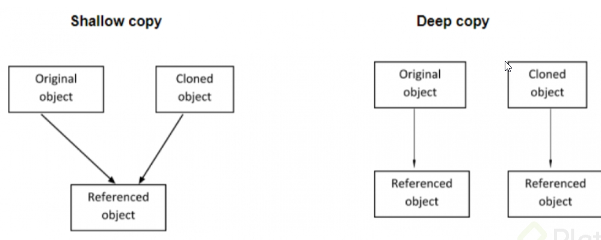

# 09 - Curso Intermedio de Programación Orientada a Objetos en JavaScript

Explora cómo funcionan los objetos en JavaScript a profundidad. Descubre cómo copiar, identificar y encapsular elementos con objetos literales, prototipos o clases. Comprende cómo funciona la memoria de los navegadores web y cómo aprovechar el sistema de herencia en objetos con la propiedad proto. Continúa tu aprendizaje de

## Clase 1: Bienvenida 
- Profesor Juan David Castro Gallego


## Clase 2: Static: atributos y métodos estáticos en JavaScript

> Para acceder a los métodos, atributo o clases de un prototipo hay que tener una instancia, pero esto no es necesario para los métodos estáticos.

`
**static**
Para crear atributos estáticos a los que podamos acceder sin crear un objeto, le ponemos la palabra reservada static
`

```
class Persona {
    static nombre = 'Juan';
}
console.log(Persona.nombre);
// Juan


class Persona {
    static nombre() {
        return 'Juan';
    }
}
console.log(Persona.nombre());
// Juan

```
**Características**
- Cuando se llame por fuera, sin crear instancias, también obtendremos el ‘Juan’
- Madre de todos los prototipos. Object
- La palabra static define un método o propiedad estática en una clase. Los métodos estáticos son llamados desde la misma clase.
- Ni los métodos estáticos o propiedades estáticas pueden ser llamadas en una instancia de la clase.
- Al ser instanciada una clase y esta como estatica este nueva instancia no puede acceder a los atributos ni metodos. 
**Metodos**
- Object.keys() -> Nos devuelve un array con los nombres clave de los atributos del objeto
```
const Objeto = {
    nombre: 'Juan',
    email:"luis.esponeta@gmail.com",
    edad:30,
};
Object.keys(Objeto);
// ["nombre", "email", "edad"]
```

- Object.getOwnPropertyNames() -> Nos devuelve un array con los nombres de los atributos del objeto
```
const objeto = {
    name: "Juan",
    email:"Shimeil@gmail.com"
    age:30
};
Object.getOwnPropertyNames(objeto);
// ["name", "email", "age"]
```


- Object.entries() -> Nos devuelve un array con los keys y los value del objeto
```
const objeto = {
    name: "Juan",
    email:"Shimeil@gmail.com",
    age:30
};
Object.entries(objeto);
/* [
    0: ["name", "Juan"*],1: ["email","Shimeil@gmail.com"],
    2: ["age",30]
    ]
	*/
```

- Object.getOwnPropertyDescriptors() -> Nos devuelve otros atributos “writable, enumerable, configurable”.
Esta es la forma que tiene javascript por dentro para limitar el acceso o la modificación de nuestros atributos u objetos.
```
/*
name: {
    value: "Juan",
    writable: true,
    enumerable: true,
    configurable: true
}
*/
```

- Object.freeze() -> Este método congela un objeto que sea pasado. Es decir:

Impide que se le agreguen nuevas propiedades
Impide que sean eliminas propiedades ya existentes
Impide que sus las propiedades internas (writable, enumerable y configurable) sean modificadas

```
const person = {
  userName: 'zajithcorro',
  age: 26,
  approvedCourses: ['Curso Profesional de Git y Github'],
  addApprovedCourse (course) {
    console.log(this)
    this.approvedCourses.push(course);
  }
}

Object.freeze(person)


person.mail = 'zajith@mail.com'
Object.keys(person) // [ 'userName', 'age', 'approvedCourses', 'addApprovedCourse' ]

person.age = 27
person.age // 26

delete person.userName // false

```


- Object.seal() -> Este método sella un objeto que sea pasada. Es decir:
Impide que nuevas propiedades sean agregadas
Cambia en todas las propiedades configurable: false, con lo que impide que sean borradas
Las propiedades aún puede ser modificadas, ya que writable esta true

```
const person = {
  userName: 'zajithcorro',
  age: 26,
  approvedCourses: ['Curso Profesional de Git y Github'],
  addApprovedCourse (course) {
    console.log(this)
    this.approvedCourses.push(course);
  }
}

Object.seal(person)

person.mail = 'zajith@mail.com'
Object.keys(person) // [ 'userName', 'age', 'approvedCourses', 'addApprovedCourse' ]

delete person.userName // false

person.age = 27
person.age // 27
```
Object.defineProperty(person, "platziPoints", {
    value: 7500,
    writable: true,
    enumerable: true,
    configurable: false
})

- Object.defineProperty() -> Este método permite agregar propiedades a un objeto de manera ordenada y masiva sin necesidad de hacer esto: 
Nota cada objeto creado siempre tienen estas propiedades writable, enumerable, configurable, pero estas no se ven a simple vista debemos usar otro object static llamado `Object.getOwnPropertyDescriptors(Objeto)`
```
 person['userName']= "Ejemplo";
 person['userName']= "Ejemplo 2";
 person['userName']= "Ejemplo 3";
 
 // Podemos hacerlo asi 
 Object.defineProperty(person, "platziPoints", {
    value: 7500,
    writable: true,
    enumerable: true,
    configurable: false
})

``` 


**Ejemplo de funcionamiento**
```
class Car {
  static brand = 'Tesla';
  static model = 'X'
  
  static printName() {
    return `${this.brand} ${this.model}`
  }
}

console.log(Car.brand) // 'Tesla'
console.log(Car.model) // 'X'
console.log(Car.printName()) // 'Tesla X'

const myCar = new Car()

console.log(myCar.brand) // undefined
console.log(myCar.model) // undefined
console.log(myCar.printName()) // Uncaught TypeError: myCar.printName is not a function
```

## Clase 3: Métodos estáticos del prototipo Object


> Explicación condesada de las funciones mas utiles del Objeto  


```
const juan = {
  name: "Juanito",
  age: 18,
  approvedCourses: ["Curso 1"],
  addCourse(newCourse) {
    console.log("This", this);
    console.log("This.approvedCourses", this.approvedCourses);
    this.approvedCourses.push(newCourse);
  }
};

// console.log(Object.keys(juan));
// console.log(Object.getOwnPropertyNames(juan));
// console.log(Object.entries(juan));

console.log(Object.getOwnPropertyDescriptors(juan));
```

## Clase 4: Object.defineProperty

> Nos permite asiganrle valores a nuestras propiedades, ademas podemos editar los valores internos como `configurable,enumerable,writable`

**Caracteristicas**
- Con esta propiedad se pueden definir nuevas propiedades a nuestro objeto.
-  Así mismo, se puede configurar ciertas características de la propiedad tales como:
	- **Configurable**: Esta indica si la propiedad puede ser borrada o eliminada
	- **Enumerable**: Indica si la propiedad puede ser mostrada en la enumeración de las mismas. Existen ciertos métodos que toman como referencia este valor para mostrar la propiedad
	- **Writable**: Esta indica si la propiedad puede ser modificada con el operador de asignación (=)
	
	**Ejemplo**
	
```
//Nuestro Objeto Principal 
	
const person = {
  userName: 'zajithcorro',
  age: 26,
  approvedCourses: ['Curso Profesional de Git y Github'],
  addApprovedCourse (course) {
    console.log(this)
    this.approvedCourses.push(course);
  }
}
	

Object.defineProperty(person, "mail", {
    value: "zajith@outlook.com",
    writable: false,
    enumerable: true,
    configurable: true
})

Object.defineProperty(person, "twitter", {
    value: "zajithcorro",
    writable: true,
    enumerable: false,
    configurable: true
})

Object.defineProperty(person, "platziPoints", {
    value: 7500,
    writable: true,
    enumerable: true,
    configurable: false
})

Object.defineProperty(person, "gender", {
    value: "male",
    writable: false,
    enumerable: false,
    configurable: false
})


```

**Nota**
- Object.keys solo muestra las propiedades que tienen enumerable: true. 
- A diferencia de Object.getOwnPropertyNames que muestra todas las propiedades
- Todo esto es para explicar el encapsulamiento. -> potting 


## Clase 5: Cómo funciona la memoria en JavaScript

**Variables**
- Las variables son una referencia a un espacio en memoria. 
- Dependiendo del tipo de valor que sean serán ubicadas en alguna de las dos tipos de memoria:
	- **Stack** - Mucho más rápida, pero sin tanto espacio
	- **Heap** - Más lenta, pero con mucho más espacio

- Las variables que no tienen un valor de tipo objeto, son almacenadas en la memoria stack. 
- Las variables que tienen como valor un objeto, funcionan de una manera diferente:
	- El valor (objeto) es guardada en la memoria heap
	- En la memoria stack se guarda un apuntador (pointer) hacia la memoria heap
	- Es por esto que cuando nosotros asignamos una variable que tiene como valor un objeto, a una nueva variable, lo unico que hacemos es asignar el apuntador. 
	- Es así que al modificar el objeto, en cualquiera de las dos variables, los cambios se reflejan en las dos
- Solo cuando trabajamos con clases esta usa la memoria `heap`																			
- La memoria `Heap` es amplia pero desordenada
- La memoria `Stack` es muy ordenada pero no muy amplia. 
																				
```
const person = {
 name: 'Zajith',
 email: 'zajith@mail.com',
}

const person2 = person

person2.name = 'Juanito'

person2 // { name: 'Juanito', email: 'zajith@mail.com' }
person // { name: 'Juanito', email: 'zajith@mail.com' }
```	

**Enlace**
- Explicación del uso de memoria -> https://levelup.gitconnected.com/understanding-call-stack-and-heap-memory-in-js-e34bf8d3c3a4

## Clase 6: Shallow copy en JavaScript

**Shallow**
- Copy se refiere a la forma de crear un nuevo objeto a partir de las propiedades de otro. 
- Esta copia solo se hace a un nivel alto, no se hace con objetos dentro de objetos (nested objects). 
- lo que provoca que la modificación de una de sus propiedades, modifique el objeto principal.
- Shallow se rompe cuando tiene objetos dentro de otro objeto. 
- Shallow->[Poco profundo]


```
// Una forma de copiar objeto
const person = {
	name: 'Eduardo',
	email: 'edudardo@mail.com',
  social: {
    facebook: 'Eduardo Garcia',
    twiiter: 'EduGar'
  }
}

const person2 = {}

for (prop in person) {
  person2[prop] = person[prop]
}


```

```
//Forma de realizar copias sin afectar a la copia original 
-- Object.assign
 const person = {
	name: 'Eduardo',
	email: 'edudardo@mail.com',
  social: {
    facebook: 'Eduardo Garcia',
    twiiter: 'EduGar'
  }
}

const person2 = Object.assign({}, person)

person2.name = 'Eduardo Miguel'
person
/* {
  name: 'Eduardo',
  email: 'edudardo@mail.com',
  social: { facebook: 'Eduardo Garcia', twiiter: 'EduGar' }
} */

person2
/* {
  name: 'Eduardo Miguel',
  email: 'edudardo@mail.com',
  social: { facebook: 'Eduardo Garcia', twiiter: 'EduGar' }
} */
``` 

```
//Forma de realizar copias sin afectar a la copia original pero sigue  afectando el objeto interno es decir el objeto dentro del objeto 
-- Object.create
const person = {
	name: 'Eduardo',
	email: 'edudardo@mail.com',
  social: {
    facebook: 'Eduardo Garcia',
    twiiter: 'EduGar'
  }
}

const person2 = Object.create(person)

person2.name = 'Eduardo Miguel'
person
/* {
  name: 'Eduardo',
  email: 'edudardo@mail.com',
  social: { facebook: 'Eduardo Garcia', twiiter: 'EduGar' }
} */

person2
/* {
  name: 'Eduardo Miguel',
  __proto__: {
    name: 'Eduardo Miguel',
    email: 'edudardo@mail.com',
    social: {
      facebook: 'Eduardo Garcia',
      twiiter: 'EduGar'
    }
  }
} */

person2.social.facebook = 'Eduardo Miguel Garcia'
person
/* {
  name: 'Eduardo',
  email: 'edudardo@mail.com',
  social: { facebook: 'Eduardo Miguel Garcia', twiiter: 'EduGar' }
} */

person2
/* {
  name: 'Eduardo Miguel',
  __proto__: {
    name: 'Eduardo Miguel',
    email: 'edudardo@mail.com',
    social: {
      facebook: 'Eduardo Miguel Garcia',
      twiiter: 'EduGar'
    }
  }
} */
``` 

## Clase 7: Qué es JSON.parse y JSON.stringify

**Concepto**
- Es un metodo estatico del Objeto principal 
- El método JSON.stringify() convierte un objeto o valor de JavaScript en una cadena JSON. 
- Reemplazando opcionalmente valores si se especifica una función de reemplazo u opcionalmente incluyendo solo las propiedades especificadas si se especifica una matriz de reemplazo.
													 
**Características**
- Los objetos Boolean, Number, and String se convierten a sus valores primitivos, de acuerdo con la conversión semántica tradicional.
- Si durante la conversión se encuentra un undefined, una Function, o un Symbol se omite (cuando se encuentra en un objeto) o se censura a null (cuando se encuentra en un array). JSON.stringify() puede devolver undefined cuando se pasan valores “puros” como JSON.stringify(function(){}) o JSON.stringify(undefined).
- Todas las propiedades que utilicen Symbol en los nombres de la clave se ignoran por completo, incluso si utilizan una función replacer.
- Las instancias de Date implementan la función toJSON() devolviendo una cadena de texto (igual que date.toISOString()). Por lo que son tratadas como strings.
- Los números Infinity y NaN, así como el valor null, se consideran null.
- El resto de instancias de Object (incluyendo Map, Set, WeakMap, y WeakSet) sólo tendrán serializadas sus propiedades enumerables.													 
 
```
const obj1 = {
    a: 'a',
    b: 'b',
    c: {
        d: 'd',
        e: 'e',
    },
    editA() {
        this.a = 'Abcd'
    }
};

const stringifiedComplexObj = JSON.stringify(obj1);
// "{\"a\":\"a\",\"b\":\"b\",\"c\":{\"d\":\"d\",\"e\":\"e\"},\"f\":[1,\"2\",3]}"

const obj2 = JSON.parse(stringifiedComplexObj); 
// {a: "a", b: "b", c: {d: "d", e: "e"}} 
``` 

**Nota**
- Recuerda usar el `Parse` con objeto esto permite editar distintos objetos sin alterarse uno por el otro.
- No estamos haciendo copias a referencias. 
- Permite resolver el problema de objeto dentro de un objeto al momentos de ser editados.
- Si usamos los metodos estatic de obejto como create() y asing() podemos usarlo en un solo nivel es decir un objeto sin otro objeto adentro
- `Stringify` y `Parse` No clona funciones o metodos de otros objetos no sabe, no los ingresa al objeto de una. 


## Clase8: Qué es recursividad

> La recursividad es el metodo que permite que una función pueda ser llamada así misma y pueda ser instancia multiples veces. 

**¿Por qué escribir programas recursivos?**
- Son mas cercanos a la descripción matemática.
- Generalmente mas fáciles de analizar
- Se adaptan mejor a las estructuras de datos recursivas.
- Los algoritmos recursivos ofrecen soluciones estructuradas, modulares y elegantemente simples.

**Factible de utilizar recursividad**
- Para simplificar el código.
- Cuando la estructura de datos es recursiva
	- ejemplo : árboles.

**No factible utilizar recursividad**
- Cuando los métodos usen arreglos largos.
- Cuando el método cambia de manera impredecible de campos.
- Cuando las iteraciones sean la mejor opción.

**Conclusiones**
- La recursividad consume mucha memoria y tiempo de ejecución.
- La recursividad puede dar lugar a la redundancia (resolver el mismo problema más de una vez)
- A veces es más sencillo encontrar una solución recursiva que una iterativa


**Notas**
- Creo que la recursividad solo se deve usar en casos especificos, para lo demas prefiero usar iteraciones con ciclos de repeticon.
- Lo malo de la recursividad es que es exponencial, vs un ciclo en tiempos pierde siempre, aunque es muy bonita su implementación
- LA RECURSIVIDAD es bastante peculiar porque suele funcionar autoejecutando funciones con un ámbito menos al problema padre.
- La recursividad es una técnica muy usada en programación funcional porque nos evita el uso de iteraciones.

``` 
function recursive(num) {
    console.log(num);
    num < 50 && recursive(num+1)
}
``` 
vs 
```
function forLoop() {
    for(let i = 1; i <= 50; i++) {
        console.log(i)
    }
}
```

**Otro ejemplo**
```
function serie(list) {
  let number = 0;
  if(number < list.length) {
    console.log(list[number])
    list.shift();
    return serie(list);
  }
}


let list =  new Array(1,2,3,5,6);
serie(list);
```

## Clase 9: Deep copy con recursividad

**Deep Copy con recursividad**
- Se dice que el objeto tiene un Deep Copy cuando cada propiedad del objeto apunta a una copia separada. 
- Incluso si la propiedad apunta a un objeto (valores de referencia). 
- Se crea una copia separada del objeto de referencia para el objeto de destino. 
- En caso de copia profunda, las propiedades de referencia del objeto de origen y las propiedades de referencia del objeto de destino apuntan a diferentes ubicaciones de memoria.

**Conclusión**
- El objeto de destino contiene una copia separada del nombre, la edad y la designación.
- Instancias separadas de tipos de valor. Se crea una referencia separada para objetos complejos (“dirección”)


```
function deepCopy(subject) {
  let copy;

  if (Array.isArray(subject)) {
    copy = [];
  } else if (typeof subject === "object") {
    copy = {};
  } else {
    return subject;
  }

  for (key in subject) {
    copy[key] = deepCopy(subject[key]);
  }

  return copy;
}

const studentBase = {
  name: undefined,
  email: undefined,
  age: undefined,
  approvedCourses: undefined,
  learningPaths: undefined,
  socialMedia: {
    twitter: undefined,
    instagram: undefined,
    facebook: undefined,
  },
};

const juan = deepCopy(studentBase);
Object.seal(juan);

```

**Notas**
- En conclusión me llevo que copiar objetos en Javascript es un poco laborioso.




## Clase 10-11:Abstracción con objetos literales y deep copy


**Metodos de Objects**

- Object.isSealed() -> El método **Object.isSealed()** si el objeto está sellado.
- Devuelve true si el objeto está sellado, de lo contrario devuelve false. 
- Un objeto está sellado si no es extensible y si todas sus propiedades no se pueden configurar y por lo tanto no removibles (pero no necesariamente no modificables).


- Object.isFrozen() -> El método **Object.isFrozen()** determina si un objeto está congelado.
- Devuelve true si el objeto está freeze, de lo contrario devuelve false. 
- Un objeto está congelado si y solo si no es extendible, todas sus propiedades son no-configurables, y todos los datos de sus propiedades no tienen capacidad de escritura.


``` 

function deepCopy(subject) {
  let copy;

  if (Array.isArray(subject)) {
    copy = [];
  } else if (typeof subject === "object") {
    copy = {};
  } else {
    return subject;
  }

  for (key in subject) {
    copy[key] = deepCopy(subject[key]);
  }

  return copy;
}


/* Codigo para hacer un DeepCopy */
const studentBase = {
    name: undefined,
    email: undefined,
    age: undefined,
    approvedCourse: undefined,
    learningPaths: undefined,
    socialMedia: {
        twitter: undefined,
        instagram: undefined,
        facebook: undefined,
    }
};

const carlos = deepCopy(studentBase);

// Object.defineProperty(carlos, "name", {
//     value: "Carlitos",
//     configurable: false,
// });

Object.seal(carlos); // Es lo mismo que lo de arriba pero mas easy
carlos.name = "Carlitos";

Object.isSealed(carlos); // Nos muestra con True o False si todas las propiedades estan selladas
Object.isFrozen(carlos); // Nos muestra con True o False si todas las propiedades estan congeladas
``` 
## Clase 12: Factory pattern y RORO

**RORO **
- Recibir un Objecto, y Retornamos otro Objecto.
- Es un patrón de diseño que consiste en crear una función que devuelve un objeto.
- Dentro de una función, recibimos un solo parámetro que es un objecto, 
el cual internamente contiene varias propiedades, con las cuales retornara otro nuevo objeto.

`
{
    name,
    age,
    email,
    twitter,
    facebook,
    instagram,
    approvedCourses,
    learningPaths
} -> Esto es RORO pasar como un objeto para que pueda ser refennciado esto se hace con el propodito de no memorizar el orden ya que si te equivocas pues terminando enviando edad enves de un correo
`


```

function requiredParam(param) {
	if (param == '') throw new Error(`Missing required parameter: ${param}`);
}


function createStudent({
    name,
    age,
    email,
    twitter,
    facebook,
    instagram,
    approvedCourses,
    learningPaths
}) {

    return {
        name: name ?? console.error('Necesitas proporcionar tu nombre'),
        age,
        email:requiredParam(email),
        approvedCourses: approvedCourses ?? 'No tienes cursos aprovados',
        learningPaths: learningPaths ?? 'No haz elegido rutas de aprendizaje',
        socialMedia: {
            twitter,
            instagram,
            facebook,
        }
    };
}


const juan = createStudent({
  name: 'Juan',
  email: 'juan@gmail.com',
  age: 20,
  twitter: '@fjuandc',
})

console.log(juan)
```

## Clase 13: Module pattern y namespaces: propiedades privadas en JavaScript

**Características**
- JavaScript no es un lenguaje fuertemente tipado, osea, que no tenemos que definir el tipo de nuestras variables. 
- JavaScript entenderá que tipo de variable estamos usando.
- En javascript no hay una palabra clave para definir una variable privada por lo que podemos crear una función que nos permita crear esta variable.
- Por lo general, podemos usar el Object.defineProperty() para crear la variable publica o privada

**Nota**
- Para este caso podemos usar el defineProperty y colocar las propiedades -> configurable, enumerable, writable

```
function isObject(subject) {
  return typeof subject == "object";
}

function isArray(subject) {
  return Array.isArray(subject);
}

function deepCopy(subject) {
  let copySubject;

  const subjectIsObject = isObject(subject);
  const subjectIsArray = isArray(subject);

  if (subjectIsArray) {
    copySubject = [];
  } else if (subjectIsObject) {
    copySubject = {};
  } else {
    return subject;
  }

  for (key in subject) {
    const keyIsObject = isObject(subject[key]);

    if (keyIsObject) {
      copySubject[key] = deepCopy(subject[key]);
    } else {
      if (subjectIsArray) {
        copySubject.push(subject[key]);
      } else {
        copySubject[key] = subject[key];
      }
    }
  }

  return copySubject;
}

// const studentBase = {
//   name: undefined,
//   email: undefined,
//   age: undefined,
//   approvedCourses: undefined,
//   learningPaths: undefined,
//   socialMedia: {
//     twitter: undefined,
//     instagram: undefined,
//     facebook: undefined,
//   },
// };

function requiredParam(param) {
  throw new Error(param + " es obligatorio");
}

function createStudent({
  name = requiredParam("name"),
  email = requiredParam("email"),
  age,
  twitter,
  instagram,
  facebook,
  approvedCourses = [],
  learningPaths = [],
} = {}) {
  const private = {
    "_name": name,
  };

  const public = {
    email,
    age,
    approvedCourses,
    learningPaths,
    socialMedia: {
      twitter,
      instagram,
      facebook,
    },
    readName() {
      return private["_name"];
    },
    changeName(newName) {
      private["_name"] = newName;
    },
  };

  Object.defineProperty(public, "readName", {
    writable: false,
    configurable: false,
  });
  Object.defineProperty(public, "changeName", {
    writable: false,
    configurable: false,
  });

  return public;
}

const juan = createStudent({ email: "juanito@frijoles.co", name: "Juanito" });
```

**Esto es iverosimil puedes hakear metodos usando property o seal p frezze podemos evitar esto**
- Aqui video como lo hacen recuerda que Js no es tan seguro pero si cuenta con ciertos aditamentos para hacerlo seguro. 


## Clase 14: Getters y setters

> Los Getters y setters son métodos de acceso, lo que significa que generalmente son una interfaz publica para cambiar miembros de las clases privadas.

**GETTERS Y SETTERS**
- Utilizamos el método estático del prototipo object getOwnPropertyDescriptor().
- Una función obtiene un valor de una propiedad se le llama getter y una que setea(establece) un valor de una propiedad se le llama setter
- Para crearlos simplemente necesitan los keywords get y set

```
const obj = {
    get prop(){
        return this.__prop__;
    },
    set prop() {
        this.__prop__ = value * 2 ;
    },
};
obj.prop = 12;

console.log(obj.prop); // 24
```


## Clase 15-16: Qué es duck typing

**Características**
- El duck typing es la forma de progamar donde identificamos a nuestros elementos dependiendo de los métodos y atributos que tengan por dentro.
- Es un término utilizado por los lenguajes dinámicos que no tienen un tipado fuerte.
- si no cumple los requisitos, significa que no es el mismo objeto
- Es la forma de programar, donde identificamos los elementos por los métodos y atributos que tenga por dentro.
- Se deben tener parámetros para saber diferenciar dos cosas, dos personas, dos elementos. Si queremos determinar quién es quién, se debe mirar por sus atributos y métodos

## Clase 17: Instance Of en JavaScript con instancias y prototipos

**Notas**
`
For … in devuelve los indices o las llaves del array u objeto que esta siendo iterado.
For … of devuelve ya directamente los valores.

.
Personalmente, por esa misma razón casi siempre me gusta dejar exclusivamente el for ... in para objetos y el for ... of para arrays.
`

- RECORDA que para crear prototipos, debemos usar la palabra this y new
- 


**¿Cuál es el uso de la instance of?**

> Como sugiere el nombre, instanceof en Java se usa para verificar si el objeto especificado es una instancia de una clase, subclase o interfaz . También se le conoce como operador de comparación debido a su característica de comparar el tipo con la instancia

> El operador instanceof en java script comprueba si la propiedad de prototipo de un constructor aparece en algún lugar de la cadena de prototipo de un objeto
>

## Clase 18: Atributos y métodos privados en prototipos

- Para asignar los métodos y atributos privados en Clases (ahora en ES21) seran con un #

- El propio JavaScript aplica la encapsulación de privacidad de estas características de clase.

```
class ClassWithPrivateField {
  #privateField;
}
```

**Nota**
- Todo esto es por usar el metodo prototype, sinceramente prefiero crear clases y luego instanciarlas con el método `new` para poder manipular ese dicho objeto desde el patron. 
- Prototype esta cool pero para resolver esos casos especiales. 
- 
