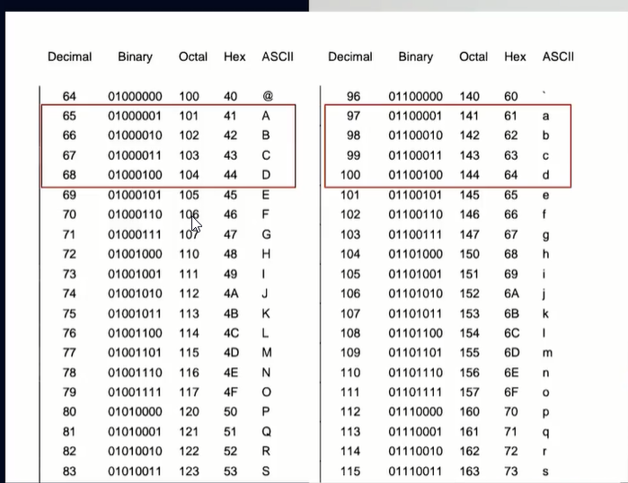

# 05 - Curso de Manipulación de Arrays en JavaScript

## Clase 1: Bienvenida 
- Profesor Nicolas Molina
```
Durante tu carrera como programador, tendrás que usar arrays para crear estructuras de datos que te permitan resolver de una manera más rápida y eficiente los algoritmos que desees. En este curso conocerás los arrays en JavaScript, desde como crearlos hasta los distintos métodos que tiene. ¡Aprende junto a tu profesor Nicolas Molina!
```

## Clase 2: ForEach

**Características**
- El método forEach de los arrays consiste en ejecutar una función (callback) para cada uno de los elementos iterados. 
- Iterar significa repetir una acción varias veces.
- Este método recibe dos argumentos:
	- La función que itera cada elemento del array (obligatorio).
	- Un objeto al que puede hacer referencia el contexto this en la función. 
	- Si se lo omite, será undefined. 
	- Recuerde que this en arrow functions es el objeto global. 


```
array.forEach(function(), thisArg)
array.forEach(function(element, index, array))

``` 


## Clase 3: Mutable o Inmutable

**Diferencia entre mutabilidad e inmutabilidad**
- Mutable es aquella acción que cambia el valor en la referencia en memoria del elemento del array original.  
- Provocando que cambien el original y la copia. 
- Inmutable es la acción en la que se cambia el valor, pero en una referencia diferente del original, 
- provocando que el original siga igual.


**Nota**
`
En JS los datos asignados a una variable pueden ser de dos tipos:

Primitive type (undefined, null, boolean, number, string, symbol), 
Reference type (objects, arrays , functions).

`

## Clase 5: Qué es el método map

- El método map consiste en crear un nuevo array a partir de los elementos originales transformados mediante una función (callback) y es inmutable.
- La transformación implica cambiar cualquier elemento en otro, ya sea un número, un objeto, otro array. 
- Las posibilidades son infinitas.

**Este método recibe dos argumentos:**
- La función que itera y transforma cada elemento del array (obligatorio).
- Un objeto al que puede hacer referencia el contexto this en la función. 
- Si se lo omite, será undefined. 
- Recuerde que this en arrow functions es el objeto global.

**Ejemplo**
```
let otherArray = array.map(function(), thisArg)
```

**La función, que recibe como argumento el método map, utiliza tres parámetros:**

- El valor actual del elemento iterado. Es decir, si es la primera iteración, será el primer elemento, y así sucesivamente.
- El índice del elemento iterado. Es decir, si es la primera iteración, será el índice 0, y así sucesivamente.
- El array que está iterando.

```
const other = array.map(function(element, index, array))

//Otro ejemplo
const numbers = [1,2,3,4,5]
const newNumbers = numbers.map( function(number){
    return number * 2
})
// o 
const newNumbers = numbers.map(number => number * 2)

console.log(newNumbers) // [ 2, 4, 6, 8, 10 ]

```

**Diferencia entre forEach y map**
- La principal diferencia entre estos dos es que forEach solamente itera cada elemento, mientras que map itera y transforma cada elemento en un nuevo array.

## Clase 6: Map Reloaded

> Es la manera sencilla de extraer información usando map pero en `objetos`
- Podemos seleccionar los elementos de un arrays 
- spread operator

```
const orders = [
  {
    customerName: "Nicolas",
    total: 60,
    delivered: true,
  },
  {
    customerName: "Zulema",
    total: 120,
    delivered: false,
  },
  {
    customerName: "Santiago",
    total: 180,
    delivered: true,
  },
  {
    customerName: "Valentina",
    total: 240,
    delivered: true,
  },
]

// Extraigo ordenes 
const totales = orders.map(order => order.total)

console.log(totales) // [ 60, 120, 180, 240 ]

// Ejemplo donde transformas los objetos originales
const tarifas = orders.map(order => {
    order.tax = 0.19
    return order
})

// Ejemplo donde no transformas los objetos originales
const tarifas = orders.map(order => {
    return {
        ...order,
        item: 0.19,
    }
})

tarifas[0] === orders[0] // false

```
## Clase 8: Filter

**Características**
- Consiste en crear un nuevo array a partir de los elementos originales filtrados mediante una función (callback) 
- Si la condición se cumple, retorna el elemento completo.
- Es inmutable
- Este proceso recibe dos argumentos:
  - La función que itera y evalúa si cada elemento del array si cumple con la condición especificada (obligatorio).
  - Un objeto al que puede hacer referencia el contexto this en la función. Si se lo omite, será undefined. Recuerde que this en arrow functions es el objeto global
- La función, que recibe como argumento el método filter, utiliza tres parámetros:
  - El valor actual del elemento iterado. Es decir, si es la primera iteración, será el primer elemento, y así sucesivamente.
  - El índice del elemento iterado. Es decir, si es la primera iteración, será el índice 0, y así sucesivamente.
  - El array que está iterando.
- Filtrar elementos a partir de la propiedad de un objeto
  - Con el método filter puedes filtrar los objetos de un array a partir de una condición referente a la propiedad de cada elemento.
  - Teniendo en cuenta que el nuevo array contendrá el objeto completo que haya cumplido con la condición especificada.

**Ejemplos**
```
//Recibe Dos argumentos 
let otherArray = array.filter(function(), thisArg)


//Recibe tres argumentos 
const other = array.map(function(element, index, array))

//Ejemplo y uso 

const words = ["spray", "elites", "limit", "apple", "exuberant"]

const newWords = words.filter( function(word){
    if (word.length >=6){
      return true
    }else{
      return false
    }
})
// o 
const newWords = words.filter(word => word.length >= 6)

console.log(newWords) // [ 'elites', 'exuberant' ]

//Ejemplo filter objetos 

const orders = [
  {
    customerName: "Nicolas",
    total: 60,
    delivered: true,
  },
  {
    customerName: "Zulema",
    total: 120,
    delivered: false,
  },
  {
    customerName: "Santiago",
    total: 180,
    delivered: true,
  },
  {
    customerName: "Valentina",
    total: 240,
    delivered: true,
  },
]


const newOrders = orders.filter(order => order.total > 150)

console.log(newOrders) 
/* [
  {
    customerName: 'Santiago',
    total: 180,
    delivered: true
  },
  {
    customerName: 'Valentina',
    total: 240,
    delivered: true
  }
]
*/


```


## Clase 10: Reduce

**Características**
- El método reduce es inmutable 
- Retornar un solo valor del array iterado a partir de una función (callback) que indica de qué manera se itera cada elemento para reducirlo
- Nota no devuelve un array devuelve un resultado. 
- Este método recibe dos argumentos:
  - La función que itera y reduce cada elemento del array. (obligatorio)
  - El valor inicial que utilizará como argumento la función. Si no se especifica, en la primera iteración el valor inicial será el primer elemento del array y no ejecuta la función.

- La función, que recibe como argumento el método map, utiliza cuatro parámetros:
  - El valor acumulado por la función (callback). En la primera iteración será igual al valor inicial del argumento del método. (obligatorio)
  - El valor actual del elemento iterado. Es decir, si es la primera iteración, será el primer elemento, y así sucesivamente. (obligatorio)
  - El índice del elemento iterado. Es decir, si es la primera iteración, será el índice 0, y así sucesivamente.
  - El array que está iterando.

- Este método REDUCE, efectivamente hace eso. Solo reduce a un solo valor y no devuelve otro array, simplemente un valor.

**Ejemplo**
```
// Este método recibe dos argumentos:
let reducedValue = array.reduce(function(), initialValue)

// La función, que recibe como argumento el método map, utiliza cuatro parámetros:

let reducedValue = array.reduce(
    function(acumulator,element, index, array), 
    valorInicial
)


// Por ejemplo, hagamos un algoritmo que calcule la suma de los cuadrados de los elementos de un array.
const numbers = [5,4,8,6,2]

const reducedValue = numbers.reduce((suma, number) => suma + number**2)

console.log(reducedValue) // 125

```


## Clase 11: Reduce Reloaded

**Características**
- Objeto de frecuencias
  - Para obtener un objeto de frecuencias de cada elemento de un array es necesario tener presente las siguientes consideraciones:
  - Establecer un objeto vacío como valor inicial del método reduce.
  - El objeto vacío también será nuestro acumulador.
  - Verificar si el elemento ya existe en nuestro objeto de frecuencias.
  - Si no existe, creamos la propiedad referente al elemento del array y le inicializamos en 1.
  - Si ya existe solamente debemos aumentar en una unidad la propiedad de nuestro objeto referente al elemento del array.
  - Finalmente, debes retornar el objeto dentro de la función del método reduce.
- Enlace JS reduce -> https://developer.mozilla.org/en-US/docs/Web/JavaScript/Reference/Global_Objects/Array/reduce
- La salida de un resultado y esto es la entrada de otro se le conoce como `payment`

```
const items = [5, 6, 7, 6, 5, 7, 7, 8]

const frecuencias = items.reduce((objeto, elemento) => {
    if (!objeto[elemento]){
        objeto[elemento] = 1
    }else{
        objeto[elemento] = objeto[elemento] + 1
    }
    
    return objeto
}, {})

// Genera un histograma esta es la salida 

{
  5:2
  6:2
  7:3
  8:1
}


// Otra manera especificando y definiendo la salida 
const arr = [3, 10, 9, 4, 3, 1, 8, 4, 7, 6];
const result = arr.reduce((obj, item) => {
  if (item <= 5) {
    obj['1-5']++
  } else if (item <= 8) {
    obj['6-8']++
  } else {
    obj['9-10']++
  }
  return obj
}, {
  '1-5': 0,
  '6-8': 0,
  '9-10': 0
})

console.log(result)


///Usandolo en combinación de map 

const data = [
  {
    name: "Nicolas",
    level: "low",
  },
  {
    name: "Andrea",
    level: "medium",
  },
  {
    name: "Zulema",
    level: "hight",
  },
  {
    name: "Santiago",
    level: "low",
  },
  {
    name: "Valentina",
    level: "medium",
  },
  {
    name: "Lucia",
    level: "hight",
  },
];

const rta1 = data
.map(item => item.level)
.reduce((obj, item) => {
    if (!obj[item]) {
        obj[item] = 1;
    } else {
        obj[item] = obj[item] + 1;
    }
    return obj;
}, {});

console.log(rta1);

```
## Clase 13-14: Some

> El método somees inmutable y consiste retornar un valor lógico verdadero si existe al menos un elemento que cumpla la condición establecida en la función (callback).
**Nota**
- Este método nos devuelve true o false sí al menos 1 elemento de nuestro array cumple con la condición.

```
const numbers = [1, 2, 3, 5]

const respuesta = numbers.some(item => item % 2 === 0)
console.log(respuesta) // true
```

## Clase 15-16: Every 

> El método everyes inmutable y consiste retornar un valor lógico verdadero si todos los elementos cumplen con la condición establecida en la función (callback).

**Nota**
- Este método nos devuelve true o false sí al menos todos los  elementos de nuestro array cumple con la condición.


```
const numbers = [1, 30, 39, 29, 10, 13]

const respuesta = numbers.every(item => item < 40)
console.log(respuesta) // true
```
## clase 17: Find y FindIndex

> Los métodos find y findIndex consisten en encontrar el primer elemento de un array que cumpla con la condición especificada en la función (callback).

**Nota Find**
- Devuelve un solo elemento que hizo match con la condición y solo el primero, que si hay mas elementos semejante solo retorna el primero si no encuentra alguna condición devuelve indefinido 
- Recibe un arrows function 
    
**Nota FindIndex**
- Devuelve la posicion encontrada sobre la condición impuesta, si no encuentra devuelve -1 
- Recibe un arrows function 


  
```

const numbers = [1, 30, 41, 29, 50, 60]

const respuesta = numbers.find(item => item >= 40)
const respuesta2 = numbers.findIndex(item => item >= 40)

console.log(respuesta) // 41
console.log(respuesta2) // 2
```

## clase 18-19: Include

> El método includes determina si un array o string incluye un determinado elemento. Devuelve true o false, si existe o no respectivamente.


**Nota**
- El método includes se utiliza para arrays y strings. El método es sensible a mayúsculas, minúsculas y espacios
- Los índices positivos comienzan desde 0 hasta la longitud total menos uno, de izquierda a derecha del array.


```
//Utilizando strings
const saludo = "Hola mundo"

saludo.includes("Hola") // true
saludo.includes("Mundo") // false
saludo.includes(" ") // true
saludo.includes("Hola", 1) // false
saludo.includes("mundo", -5) // true

// Utilizando arrays
const frutas = ["manzana", "pera", "piña", "uva"]

frutas.includes("manzana") // true
frutas.includes("Pera") // false
frutas.includes("sandía") // false
frutas.includes("manzana", 1) // false
frutas.includes("piña", -1) // false
frutas[0].includes("man") // true
```

## Clase 20: Join

> El método join une los elementos del array, mediante una separación, y retorna un string. Si un elemento es undefined o null, se convierte en una cadena vacía.
>

```
const elements = ["hola", null, "como", "estas"]

const resultado = elements.join("/")

console.log(resultado) // 'hola//como/estas'
```
## Clase 20 A: split


> El método split de strings, es lo contrario que el método join, consiste en separar un string en substrings, indicando un valor a separar. Este método retornará un array de los elementos separados.

```
const cadena = "JavaScript es maravilloso, con JavaScript puedo crear el futuro de la web."

cadena.split(" ") 
/* [ 'JavaScript', 'es', 'maravilloso,', 'con', 'JavaScript', 'puedo', 'crear', 'el', 'futuro', 'de', 'la', 'web.' ]
*/
cadena.split(", ") 
/* [ 
    'JavaScript es maravilloso', 
    'con JavaScript puedo crear el futuro de la web.' 
]*/
cadena.split("JavaScript")
/* [
    '', 
    ' es maravilloso, con ', 
    ' puedo crear el futuro de la web.' 
]*/
cadena.split(" ", 3) // [ 'JavaScript', 'es', 'maravilloso,' ]

//Palindromo 

const word = 'Arepera'

const palindrome = (word) => {
  // Lo que hace dividir, voltear y luego unirlo con el join...
  return word.split('').reverse().join('').toLocaleLowerCase()

};

console.log(palindrome(word))


//Genera URL 


const title = 'Curso de manipulación de arrays';

const urlFinal = title.split(' ').join('-').toLowerCase();
console.log(urlFinal);

```


## Clase 22: Concat 
> El método concat es inmutable y consiste en crear un nuevo array a partir de la unión de otros valores o arrays especificados como argumentos.

```
const numbers1 = [1,2,3,4]
const numbers2 = [5,6,7,8]
const numbers3 = [9,10,11,12]

const result1 = numbers1.concat("hola", "mundo")
const result2 = numbers1.concat(numbers2)
const result3 = numbers1.concat(numbers2, "hola")
const result4 = numbers1.concat(numbers2, numbers3)

result1 // [ 1, 2, 3, 4, 'hola', 'mundo' ]
result2 // [ 1, 2, 3, 4, 5, 6, 7, 8 ]
result3 // [ 1, 2, 3, 4, 5, 6, 7, 8, 'hola' ]
result4 // [ 1, 2, 3, 4, 5, 6, 7, 8, 9, 10, 11, 12 ]

// spredd operations  ...

const newArray = [...numbers1]
```

## Clase 23: Flat

> El método flat es inmutable que consiste en retornar un array donde los sub-arrays han sido aplanados hasta una profundidad especificada. El aplanamiento consiste en transformar un array de arrays a una sola dimensión.

```
const array = [1,2,[3,4],5,6]
const result = array.flat() 
result// [1,2,3,4,5,6]

const array2 = [1, 2, [3, 4, [5, 6]]];
const result2 = array2.flat() 
result2// [1, 2, 3, 4, [5, 6]]

const array3 = [1, 2, [3, 4, [5, 6]]]
const result3 = array3.flat(2) 
result3// [1, 2, 3, 4, 5, 6]

const array4 = [1, 2, [3, 4, [5, 6, [7, 8, [9, 10]]]]]
const result4 = array4.flat(Infinity) 
result4// [1, 2, 3, 4, 5, 6, 7, 8, 9, 10]

//Flat con recursividad

const matriz = [
    [1,2,3],
    [4,5,6, [1,2, [1,2]]],
    [7,8,9]
];

function profundidad(list) {
    let newList = [];
    if (typeof list != "object") return [list];
    list.forEach(element => {
        newList = newList.concat(profundidad(element));
    });
    return newList;
}

const newArray = profundidad(matriz);

console.log(newArray);

```


## Clase 24-25: FlatMap

>  El método flatMap es inmutable y consiste en la combinación de los métodos map y flat. Primero realiza la iteración de los elementos del array (como si fuera map), y después los aplana en una sola profundidad (como si fuera flat).

**Nota**
- Flatmap no puedes indicar los niveles como flat 

```
const numbers2 = [1,[2,3], 4, 5]
numbers2.flatMap(number => [number *2]) 
// [ 2, NaN, 8, 10 ]
// * Recuerda: NaN = No a Number

//Otro ejemplo 

const users = [
  { userId: 1, username: "Tom", attributes: ["Nice", "Cute"]},
  { userId: 2, username: "Mike", attributes: ["Lovely"]},
  { userId: 3, username: "Nico", attributes: ["Nice", "Cool"]},
]

const rta = users.flatMap(user => user.attributes);
console.log('flatmap', rta);

//Otro Ejemplo 

const calendars = {
  primaryCalendar: [
    {
      startDate: new Date(2021, 1, 1, 15),
      endDate: new Date(2021, 1, 1, 15, 30),
      title: "Cita 1",
    },
    {
      startDate: new Date(2021, 1, 1, 17),
      endDate: new Date(2021, 1, 1, 18),
      title: "Cita 2",
    },
  ],
  secondaryCalendar: [
    {
      startDate: new Date(2021, 1, 1, 12),
      endDate: new Date(2021, 1, 1, 12, 30),
      title: "Cita 2",
    },
    {
      startDate: new Date(2021, 1, 1, 9),
      endDate: new Date(2021, 1, 1, 10),
      title: "Cita 4",
    },
  ],
};

const rta3 = Object.values(calendars).flatMap(item => {
    return item.map(date => date.startDate);
});
console.log(rta3);

```

## Clase 26: Mutable functions

> Las funciones mutables consisten en cambiar el array original. Estos métodos son:

- push    -> Agrega un elemento al arreglo original 
- unshift -> Agrega uno o varios elementos al inicio del arreglo  
- pop     -> Elimina el ultimo elemento del arreglo 
- shift   -> Elimima el primer elemento del arreglo 
- splice  -> Reemplaza un elemento del arreglo `indicando desde donde`  y  `hasta donde` del arreglo
- sort    ->  Ordena un arreglos 

**Método push**
> El método push agrega uno o varios elementos al final del array original. El método recibe como argumento los valores a agregar. Retorna el número de elementos del array mutado.
```
const array = [1,2,3]
array.push(4,5)
console.log(array) // [ 1, 2, 3, 4, 5 ]
```

**Método unshift**
> El método unshift agrega uno o varios elementos al inicio del array original. El método recibe como argumento los valores a agregar. Retorna el número de elementos del array mutado.
```
const array = [3,4,5]
array.unshift(1,2)
console.log(array) // [ 1, 2, 3, 4, 5 ]
```


**Método pop**
> El método pop extrae el elemento del final del array original. El método no recibe ningún argumento. Retorna el elemento extraído, si no se guarda en una variable, el Garbage Collection{target="_blank"} lo elimina.

```
const array = [1,2,3,4]
const lastElement = array.pop()
console.log(lastElement) // 4
console.log(array) // [ 1, 2, 3 ]
``` 

**Método shift**

> El método shift extrae el elemento del inicio del array original. El método no recibe ningún argumento. Retorna el elemento extraído, si no se guarda en una variable, el Garbage Collection{target="_blank"} lo elimina.

```
const array = [1,2,3,4]
const firstElement = array.shift()
console.log(firstElement) // 1
console.log(array) // [ 2, 3, 4 ]
```

**Método splice**
> El método splice extrae uno o varios elementos del array original a partir del índice y los reemplaza con otro elemento especificado como argumento. Retorna un array con los elementos extraídos, si no se guarda en una variable, el Garbage Collection{target="_blank"} lo elimina.

```
// El método splice recibe tres argumentos:

El índice donde comenzará a cambiar el array.
La cantidad de elementos que serán reemplazados.
Uno o varios elementos que reemplazarán a los originales del array.
array.splice(índice, cantidad, items)
array.splice(índice, cantidad, item1, item2, ..., itemN)
Ejemplos utilizando el método splice
const array = [1,2,3,4]
const elements = array.splice(2,1,"tres")
console.log(elements) // [3]
console.log(array) // [ 1, 2, 'tres', 4 ]

const array = [1,2,3,4]
const elements = array.splice(1,2,"dos", "tres")
console.log(elements) // [ 2, 3 ]
console.log(array) // [ 1, 'dos', 'tres', 4 ]
```


```
  	//Inmutable Update
  	const productsV3 = [
  	    {title: 'Pizza', price: 121, id: '🍕'},
  	    {title: 'Burguer', price: 121, id: '🍔'},
  	    {title: 'Hot cake', price: 121, id: '🥞'},
  	];
  	const updateV3 = {
  	    id: '🥞',
  	    changes: {
  	        price: 200,
  	        description: 'delicious'
  	    }
  	}
  	const newArrayV3 = [...productsV3];
  	const newArrayV3Index = newArrayV3.findIndex(item => item.id === updateV3.id);
  	newArrayV3[newArrayV3Index] = {
  	    ...newArrayV3[newArrayV3Index],
  	    ...updateV3.changes,
  	};
  	console.log('productsV3',productsV3);
  	console.log('newArrayV3',newArrayV3);
```

## Clase 27: Sort
> El método sort es mutable y consiste en ordenar un array a partir de los valores Unicode de los caracteres y este retorna un array con la misma referencia en memoria que el original.

**Nota**
- El sort funciona para ordenar gracias a la tabla ASCCHI 
- 

**¿Por qué a - b o b - a?**
La función que le enviamos a sort es la función compareFn donde:
Si compareFn(a, b) devuelve un valor mayor que 0, ordena b antes a.
Si compareFn(a, b) devuelve un valor menor que 0, ordena a antes b.
Si compareFn(a, b) devuelve 0 a y b se consideran iguales.

```
const months = ['Febrero', 'Julio', "fsdf", 'Diciembre', 'Enero'];
functionmonthValue(month) {
    switch (month.toUpperCase()) {
        case'ENERO':
            return 1;
        case'FEBRERO':
            return2;
        case'MARZO':
            return 3;
        case'ABRIL':
            return 4;
        case'MAYO':
            return 5;
        case'JUNIO':
            return 6;
        case'JULIO':
            return 7;
        case'AGOSTO':
            return 8;
        case'SEPTIEMBRE':
            return 9;
        case'OCTUBRE':
            return 10;
        case'NOVIEMBRE':
            return 11;
        case'DICIEMBRE':
            return 12;
        default:
            //Cualquier valor que no coincida se irá de último
            return 13; 
    }
}

months.sort((a, b) => monthValue(a) - monthValue(b))
//array.sort((a,b) => a - b); //-> Ordena de mayor a menor
console.log(months);
```