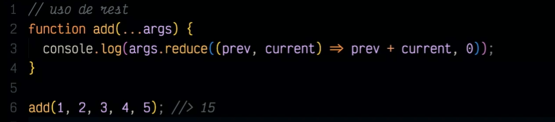
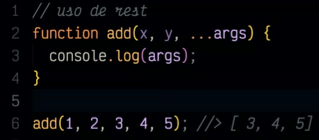
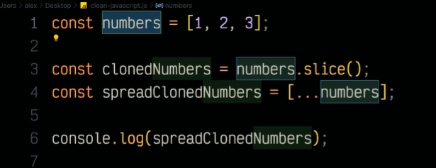
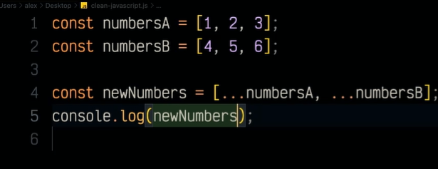
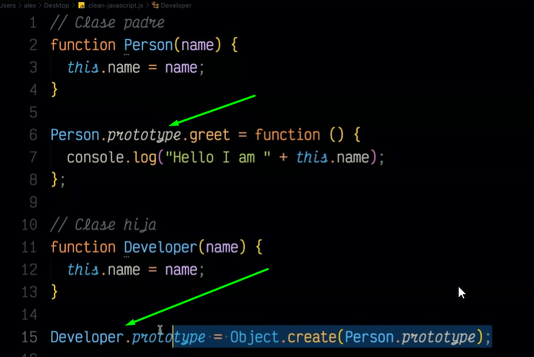

# 06 - Curso de Clean Code y Buenas Prácticas con JavaScript

## Clase 1: Bienvenida 
- Profesor Alex Camacho
```
¡Aprende las mejores prácticas de programación con JavaScript! Descubre nomenclaturas para trabajar con variables, funciones y clases. Comprende cuándo seguir principios y organizaciones populares para trabajar en equipo junto a tu profesora Alex Camacho.
```

## Clase 1: Deuda técnica y refactorización de código

**Notas**
- Nuestro código debe ser simple y directo, debería leerse con la misma facilidad que un texto bien escrito.
- `Grady Booch` Entusiasta del diseño de patrones 
- 1992 fue implementado el concepto de **Deduda Tecnica** por `Ward Cunningham` -> coautores del maniesfiesto agil 
- La deuda técnica en si no es mala, se deja para poder liberar un producto mas agíl, con la promesa que se va pagar esa deuda  
 

**Tipos de deuda técnica:**

- Imprudente y deliberada  -> Se da cuando el desarrollador actua de manera consciente e imprudente, ya que no toma cuenta el factor del error en el código. 
- Imprudente e inadvertida -> No se sabe que se esta dejando un error ya que no se posee los conocimientos
- Prudente y deliberada    -> Se tiene el 100% de consciencia que se esta dejando la deuda y se tiene la promesa que se va a pagar.  
- Prudente e inadvertida   -> Es la mas comun, se obtiene cuando se tiene la idea que el desarrollo es el mas eficiente pero se llega a discusión que se podia realizar ciertas mejoras 

**¿Cómo pagar las deudas?**
- Refactorización -> Es el proceso el cual se pagan las deudas. 
- Refactorizando el código, esto es mejorar el código sin alterar su comportamiento para que sea mas entendible y tolerante a cambios.
- Y es importante que el código tenga tests ( units o integration tests ) automáticos que validen el comportamiento del código.
 

**¿Cuándo refactorizar?**
- Cuando hay código de baja calidad ( duplicación de código, funciones con mas de una acción)
- Se detecta cualquier otro tipo de code smell ( código duplicado, métodos o clases demasiado grandes y complejos, falta de cohesión entre diferentes partes del código, uso excesivo de condicionales y bucles anidados, por ej.)
- Se debe tener test de código para antes refactorizar. 


## Clase 2: 4 reglas del diseño simple

- El código pasa correctamente los test.                                -> Buenos test ayuda al código a garantizar la seguridad en funcionamiento 
- Revela la intención del diseño. El código debe autoexplicarse.        -> Tu código tiene que hablar por sí mismo, revelando cuál es la intensión de ese método, esa variable, esa función. Etc.    
- Respeta el principio DRY: “don’t repeat yourself”, no repitas código. -> No te repitas a ti mismo, no repitas fragmentos de códigos
- Tiene el menor número posible de elementos. 1 función = 1 acción.     -> Mas simple sea tu código es mejor  


## Clase 3: Qué es Clean Code

**Notas**
- Es un termino que se pularizó por Robert C. MArtin en su libro Clean Code: `A handbook of agile software craftsmanship` 2008
- El código limpio es aquel que se ha escrito con la intención de que otra persona lo entienda. 

**Por mi experiencia y duro inicio recomiendo los siguientes tips**
- Antes de programar tener una hoja en blanco y escribir o garabatear lo que vas a hacer esto ayuda mucho organizar tus ideas

- Para mí programar es como jugar o armar bloque de LEGO, esto ayuda a categorizar lo que vas a hacer y ayuda a generar un código limpio por los principios del LEGO cualquier persona puede armar un bloque

- Tener buenas bases, NO hablo de ser experto, o ser un supergenio, Hablo de que sepas que piezas de LEGO puedes usar y entender tus habilidades y limitaciones

- Por favor usar las reglas básicas de doc documents, tú sabes comentar cada variable que no es obvia, y por favor cada función anexarle una descripción

- Mantener un código identado ayuda mucho. 

- Si es algo complejo de hacer es difícil de explicar así que simplifica

## Clase 4: Uso correcto de var, let y const

**Notas**
- ECMAScript 6 2015 ->  introducjo let y const 
- var   -> no respeta ambitos de bloque
- let   -> si respeta ambitos de bloque
- const -> valores que no cambian NUNCA pero pueden cambiar por referencia, pero la constante en sí no puede ser reasignada

```
// var
var age = 28;
{
  console.log("Valor dentro del bloque", age); // 28
  var age = 29;
}

console.log("Valor fuera del bloque", age); // 29
age = age * 2;
console.log("Valor cambiado", age); // 58

// let
let age = 28;
{
  console.log("Valor dentro del bloque", age); // error
  let age = 29;
}

console.log("Valor fuera del bloque", age); // 28
age = age * 2;
console.log("Valor cambiado", age); // 56

// const
const PI = 3.14159;
PI = PI * 2; // error
console.log("Valor cambiado", PI); // no se ejecuta
```

## Clase 5: Reglas para la nomenclatura

**Reglas de nomenclatura.**
- Nombres pronunciables y expresivos. 
	- Preferentemente en inglés usando camelCase, evitando guiones 
	- o _ y abreviaturas.
	- No inicias el nombre de una variables con números. 
	- Ejemplos Recomendado -> `const currentDate=moment.format("YYYY/MM/DD")`
	- Ejemplo No Recomedado -> `const yyyymmdstr=moment.format("YYYY/MM/DD")`
	
- Nombres sin información técnica. 
	- Evitar nombres con relación a la tecnología (tipo de datos, clases, etc). 
	- Ej. “arrayNames” --> “namesList”
- Usar lenguaje ubicuo (Lenguaje que usan los expertos)
	- Aquel que se construye a partir del lenguaje que usan los expertos
	- Es decir: crear un lenguaje en común para desarrolladores e interesados, determinando palabras de uso común.

## Clase 6:  Cómo nombrar según el tipo de dato

- Recordemos que es importante, según las reglas de nomenclatura. 
- No incluir información técnica dentro de los nombres, pero aún así, nuestro código debe ser autodescriptivo
- Por lo tanto, como buena práctica, desde el nombre, debemos denotar el tipo de dato.

**Recomendaciones para Arreglos**
```
// Arrays: lista de elementos, generalmento del mismo tipo.
// Se recomienda usar el nombre de la variable en plural.

// No recomendado
const user = ["Alex", "Mariana", "Jessica"];

// Regular
const userList = ["Alex", "Mariana", "Jessica"];

// Bueno
const users = ["Alex", "Mariana", "Jessica"];

// Excelente
const userNames = ["Alex", "Mariana", "Jessica"];
```

**Recomendaciones para Boolean**

```
// Booleans: solo tiene 2 valores, true o false.
// Se recomienda utilizar ciertos prefijos para identificar las variables: is(¿es?), has(¿tiene?), can(¿puede?).

// No recomendado
const valid = true;
const read = false;
const color = true;

// Recomendado
const isValid = true;
const canRead = false;
const hasColor = true;
```

**Recomendaciones para Numeros**
```
// Numbers
// Se recomienda prefijos que hagan referencia a que la variable contiene números como: max, min y total; son autodescriptivas y también hablan de lo que hace el código.

// No recomendado
const users = 15;

// Recomendado
const maxUsers = 50;
const minUsers = 10;
const totalUsers = 15;
```

**Recomendaciones para Funciones**

```
// Funciones: representan una acción.
// Se recomienda que inicien con un verbo, seguido de un sustantivo, por ejemplo: get como verbo y name como sustantivo.
// Deben ser concisos y estar en camelCase.

// No recomendado
createUserIfNotExist();
updateUserIfNotEmpty();
sendEmailIfIsValid();

// Recomendado
createUser();
updateUser();
sendEmail();

// Funciones de acceso, modificación o predicado.
// Se recomienda añadir el prefijo de get, set o is.

// Ejemplo
getUser();
setUser();
isValidUser();
```

**Recomendaciones para Clases**
```
// Clases
// Para nombrar clases se recomienda utilizar sustantivos, por ejemplo: user o userProfile, pero se debe evitar utilizar nombres genéricos como: data o manager, porque esto puede llevar a que estas clases tengan más de una sola responsabilidad.
// Según el principio de responsabilidad único tanto una clase como una función deben ser responsables de una sola acción.

// No recomendado
class Data {}
class Manager {}
class Info {}

// Recomendado
class User {}
class UserProfile {}
class Account {}
```


## Clase 8:  Ámbito global

**Notas**
- Ambito Global -> Cual quier variable que escriba podra ser accesada por diferene parte del bloque del código. 

```
let age = 0; // variable global
while(age < 18) {
    age = age + 1;
	if(age != 18) {
		console.log('Hoy es mi cumpleaños número: ', age);
	} else {
		console.log(`Hoy cumplo: ${age} años así que ya soy mayor de edad`);
	}
}

// OUTPUT 👇

Hoy es mi cumpleaños número:  1
Hoy es mi cumpleaños número:  2
Hoy es mi cumpleaños número:  3
Hoy es mi cumpleaños número:  4
Hoy es mi cumpleaños número:  5
Hoy es mi cumpleaños número:  6
Hoy es mi cumpleaños número:  7
Hoy es mi cumpleaños número:  8
Hoy es mi cumpleaños número:  9
Hoy es mi cumpleaños número:  10
Hoy es mi cumpleaños número:  11
Hoy es mi cumpleaños número:  12
Hoy es mi cumpleaños número:  13
Hoy es mi cumpleaños número:  14
Hoy es mi cumpleaños número:  15
Hoy es mi cumpleaños número:  16
Hoy es mi cumpleaños número:  17
Hoy cumplo: 18 años así que ya soy mayor de edad
```


## Clase 9:  Ámbito local o de función

**Notas**
- Ámbito local -> solo van a existir dentro de esa función.

```
function orderBreakfast(...menu) {
	let order = menu; // variable local
	console.log('Your breakfast', order)
}

orderBreakfast('coffee','toast','eggs');

// OUTPUT 👇

Your breakfast
Array(3) [ "coffee", "toast", "eggs" ]

```

## Clase 10:  Ámbito Bloque

**Notas**
- Ámbito Bloque -> Para usar el ámbito de bloque, no solo hay que usar las llaves { } sino también las palabras reservadas let y const, ya que las variables declaradas con var se saltan todas las restricciones.

```
{
  let greeting = "Hello World";
  var lang = "English";
  console.log(greeting);
}

console.log(lang); //> English
console.log(greeting); //> Uncaught ReferenceError: greeting is not defined
```

## Clase 11:  Ámbito estático

**Notas**
- Ámbito estático -> es un comportamiento por defecto en JS
- Permite determinar el tiempo durante la compilación y no durante la ejecución  
- Se le dice Ambito lexico 
- No importa desde dónde se llame a la función, siempre va a dar como resultado el primer valor que se le definió a una variable. 

```
const age = 28;

function printAge() {
	console.log(age);
}

function mainApp() {
	const age = 26;
	printAge();
}

mainApp(); // output es: 28, que es el primer valor que se le definió a la variable age

```

## Clase 12:  Hoisting

**Notas**
- El concepto de Hoisting fue pensado como una manera general de referirse a cómo funcionan los contextos de ejecución en JavaScript. 
- Es el mecanimo que usa JS, en tiempo de compilación mover ciertos fragmentos de código dependiendo del ambito que represente. 
- Ejemplo los primero que hace es detectar las variables tipo Var, luego funciones, luegos los let y luego los const esto lo va moviendo a la parte superior cuando se esta compilando permitiendo usar funciones y variables antes de que se hayan declarado. 
- Es como decir que el orden de los factores no altera los productos
- El Hoisting trabaja de manera un poco misteriosa cuando definimos variables. 
- Si usamos doble uso de parentesis se refire a funciones autoinvocadas `()()` no necesitan ser llamadas

```
var greet = "Hello";

function saludar() {
  console.log(greet); //> undefined
  var greet = "Hi";
  console.log(greet); //> Hi
}

saludar(); // se invoca la función

```

**Funciones autollamadas**

```
var greet = `Hola`;

(
	function(){
		console.log(greet);//> undefined
		var greet = 'hi';
		console.log(greet);//> Hi
	}

)();

//Output 
//> undefined  -> El hoisting intervine y solo hace su magia dentro del bloque autollamado de la funcion 
//> Hi 

/* El Porque undefined

	JavaScript, cada vez que se define una variable dentro de una función, 
	se crea una nueva instancia de esa variable en un ámbito local dentro de la función. 
	Es decir, la variable local greet dentro de la función saludar() se refiere a una 
	instancia diferente de la variable greet que la variable global greet que está 
	definida fuera de la función, es otro espacio de memoria.

*/


```

## Clase 13: Declaración y expresión de funciones

**Funciones**
> Las funciones son entidades organizativas de cualquier lenguaje de programación. 


**Declaración de funciones:**
```
function myFunction() {
  return "Mi función a través de su declaración"
}

myFunction();

```

**Expresión de funciones:**
```
const myFunction = function () {
  return "Mi función a través de su expresión"
}

myFunction();
```

**función de expresión utilizando arrow function.**
```
const getResult = () => "Results";

getResult()
```

## Clase 14: Parámetros y argumentos

**Paramentros**
- son aquellos que utilizamos dentro de nuestra función para trabajar con elementos externos
- son los valores que trabajan una función 
- Podemos declarar paramentros por defecto -> No abuzar del paramentro por defecto

**Ejemplo**
```
```

**Argumentos**
- Son aquellos que se usan en al llamado de las funciones 
- Son los valores que se le envian a la función 
- No mas de tres argumentos
- 


**Ejemplo**
```
```


**Nota**
- Una característica muy importante del spread operator es que es inmutable, es decir, copia los valores y no la referencia y devuelve un nuevo array que asignamos a una nueva variable o constante.
- Si se usa como parametro unifica los valores de tu objeto 
- 
```
// En este ejemplo podemos ver que los arrays: numbersA, numbersB y numbersC no cambiaron y sí pudimos generar una copia de sus valores.

const numbersA = [1,2,3];
const numbersB = [4,5,6];
const numbersC = [7,8,9];

const newNumbers = [...numbersA, ...numbersB, ...numbersC];

console.log('numbersA', numbersA);
console.log('numbersB', numbersB);
console.log('numbersC', numbersC);

console.log('newNumbers', newNumbers);
```


**Para expandir parametros en tu función**
- debe estar de ultimo el (...)
- 
- 

**Para Clonar**

- 
- 

**Para UNIFICAR**

- 

## Clase 15: Funciones de flecha y el this

- Una expresión de función flecha es una alternativa compacta a una expresión de función tradicional, pero es limitada y no se puede utilizar en todas las situaciones. 
- Diferencias y limitaciones: No tiene sus propios enlaces a this o super y no se debe usar como métodos.
- Esta funcionalidad viene con el EMAC6 
- Cuando creas una  `arrow functions` su `this` queda relacionado al ambito externo. 


```
// El return está implícito sino añadimos las llaves.
const getResult = () => "Results";

//Sin arrows functions
[1, 2, 3]
  .map(function (n) {
    return n * 2;
  })

  [
    // Con arrows functions
    (1, 2, 3)
  ].map((n) => n * 2);

// Ejemplos del this
const counter = {
  number: 0,
  increase() {
    setInterval(() => console.log(++this.number), 1000);
  },
};

counter.increase(); //> 1 2 3 4 5

const counter = {
  number: 0,
  increase() {
    setInterval(function () {
      console.log(++this.number);
    }, 1000);
  },
};

counter.increase(); //> NaN, NaN, NaN, NaN, NaN

const counter = {
  number: 0,
  increase() {
    setInterval(
      function () {
        console.log(++this.number);
      }.bind(this),
      1000
    );
  },
};

counter.increase(); //> 1 2 3 4 5

```

## Clase 16: POO con ES6 (constructores, métodos y herencia)

**Clase**
- A raíz de EMAC6 podemos usarlo
- Antes se debia usar el prototype para poder emular clases 
- Recuerda una clases es una abstracción para representar ciertos elementos del mundo real 
- Nos ayudar organizar mucho nuestro código usando clases 

**Ejemplo**
```
//intaxis a partir de ES6:
class Cat {
  constructor(cat) {
    this.name = cat;
  }
  greet () {
    return 'Hola! Mis dueñ@s me llaman ' + this.name;
  }
}

const cat = new Cat("Michi");

// Antes de ES6
function Person(name) {
  this.name = name;
}
var person = new Person("Alex");
console.log(person.name); //> Alex


```

## Clase 17: Herencia en JavaScript

- Recuerda que al usar Clases tenemos la habilidad de generar herencia
- Desde el EMAC6 podemos usar la palabra reservada `extends` para crear herencias
- Anteriormente se usaba `prototype` para generar herencia 


**Ejemplo Herencia con EMAC6**
```
//Clase padre
class Person (name) {
  constructor(name) {
    this.name;
  }

  greet() {
    console.log(`Hola, mi nombre es ${this.name}`);
  }
}

//Clase hija
class Developer extends Person () {
  constructor(name) {
    super(name);
  }
  writeCode(coffe) {
    coffee ? console.log ("Estoy desarrollando una nueva feature") : console.log("Necesito más café...")
  }
}
```

**Ejemplo Herencia Antes del EMAC6**

- 

## Clase 18: Tamaño reducido (responsabilidad única)

- Este concepto viene del manifiesto SOLID que son las bases para la Programación POO. 

```
S : The single-responsibility principle: "There should never be more than one reason for a class to change. In other words, every class should have only one responsibility."
O : The open–closed principle: "Software entities ... should be open for extension, but closed for modification."
L : The Liskov substitution principle: "Functions that use pointers or references to base classes must be able to use objects of derived classes without knowing it. See also design by contract."
I : The interface segregation principle: "Many client-specific interfaces are better than one general-purpose interface."
D : The dependency inversion principle: "Depend upon abstractions, [not] concretions."
```
 

## Clase 19: Organización

- Variables           → Son conocidas como propiedades en el mundo POO → son todos esos elementos donde vamos a guardar información. 
- Constantes          → Son todos esos elementos que no van a cambiar su valor, también son conocidas como propiedades
- Variables estáticas → Son elementos que pueden o no estar en la clase.
- Métodos             → Tus métodos son tus funciones, solo que en POO se le reconoce así, no olvides que dentro de una clase los métodos deben ser ordenados de mayor importancia a menor importancia. Lo ordenas de la siguiente manera, creas una clase y esta clase tiene un método funcional y los otros métodos que se crean es para apoyar el primer método. 
- Funciones estáticas → se le dicen estáticas, ya que estas no deben ser heredadas a otra clase, solo se usan en la clase principal. 
- Getters y setters → Estas permiten alterar y obtener alguna propiedad de tu clase. Recuerda esto se usa para no poder acceder directamente a la propiedad JS si lo permite, pero NO es buena práctica. 

## Clase 20: Cuándo usar comentarios


**El comentario no debe explicar:**

- ❌ El ¿Qué? ⇒ porque el código debe ser Autodescriptivo
- ❌ El ¿Cómo? ⇒ el código debe ser Autoexplicativo
- ✅ Sino el ¿Por qué? // Comentar explicando los Criterios, aportando valor
- “No comentes código mal escrito, reescríbelo.”

**Brian Kernighan**
>Si bien, al usar correctamente la nomenclatura, el ordenamiento de nuestras variables, funciones y clases y respetar el principio de responsabilidad única, va a hacer que nuestro código sea mucho más fácil de entender, no significa que se deba dejar de añadir comentarios. Por ejemplo, añadir un comentario sobre alguna librería externa que se haya utilizado.

- 

## Clase 21: Formato coherente (codear en equipos)


**Reglas para trabajar en equipo**

- Para tener un formato coherente es recomendable:
  - Problemas similares, soluciones similares: seguir patrones.
  - Densidad, apertura y distancia vertical: todo lo que esté relacionado, manterlo junto en las líneas de código.
  - Lo más importante va primero: de la funcionalidad principal se van a llamar otras funciones o métodos y se desglosarán a partir de ahí, es más intuitivo.
  - Indentación: respetar mismos espacios de tabulación (2 o 4).

## Clase 22: Formato coherente (codear en equipos)

- Principio DRY: Don’t repeat yourself (No te repitas a ti mismo).
- No repetir código, sino extraerlo a una clase o función para poder reutilizarlo.
- 