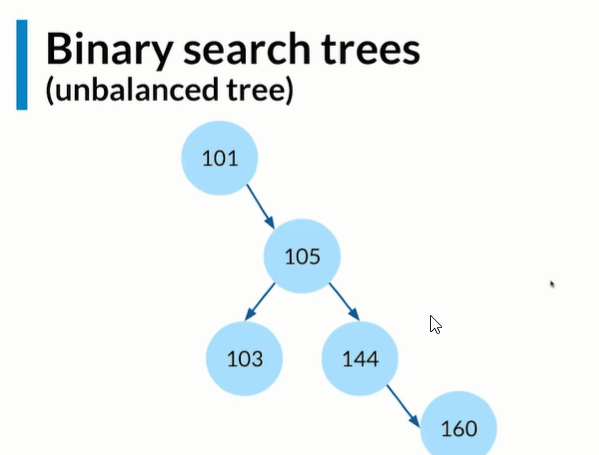
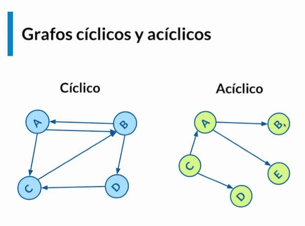

# 07 - Curso de Estructuras de Datos con JavaScript 

## Clase 1: Bienvenida 
- Profesor->  Diego De Granda @degranda10
```
Aumenta tus habilidades técnicas y organiza mejor la información con estructuras de datos. Domina lo que son listas, árboles, grafos y más para crear código más eficiente.
```
## Clase 2: ¿Qué son las estructuras de datos?

**Ideas/conceptos claves**
- Estructuras de datos son colecciones de valores. 
- Nos permiten crear operaciones que se pueden aplicar a los datos.

**Notas**
- Nos ayudan a Solucionar problemas Guardar datos
- Nos pueden dar un poco ordenada
- Nos ayuda a guardar muchas cosas entre ellas información
- Nos ayudan a resolver problemas en especifico
- No todas son buenas para todos los casos
- Existen diferentes formas para guardar información
- JavaScript de por si no tiene algunas estructuras de datos construidas ⇒ Nosotros debemos construirlas

**RESUMEN:** 
- Las estructuras de datos son aquellas que nos permiten optimizar el espacio y el orden en que almacenamos la información. 
- Nos ayudan en problemas específicos y algunos lenguajes tienen estructuras de datos ya definidas por el lenguaje en si mientras en otros lenguajes como JavaScript es necesario definirlas


## Clase 3: Memoria y cómo se guardan los datos

**Memory Slot** -> Es el  espacio donde guardamos información en bits. 

**Notas**
- Dependiendo del lenguaje la forma de guardar los datos puede llegar a ser diferente en este caso analizaremos el lenguaje JavaScript
- La memoria se puede representar como una tabla la cual cada espacio se llama Memory Slot
- En un memory Slot podemos guardar un byte [8 bits]
- Cuando se guarda la información, se lo hace de forma aleatoria
- Se sabe dónde está cada cosa por la dirección [address]
- La computadora busca los bytes necesarios para guardar la información
- El address sera la “punta” de un cuadro de la tabla donde encontraremos la información que solicitamos

**RESUMEN:** 
- La información se guarda en la memoria la cual contiene memory slots en cada uno llega a guardar un byte. 
- la información lo hace de una manera aleatoria por lo cual se identifica a través de un address (Punteros)


## Clase 4: Arrays

- **Array**: Es una colección de información
- **Arrays estáticos**: Son aquellos que se quedaran fijos debido a que definimos cuantos espacios tendremos, es decir que le diremos a la maquina cuantos slots deberá usar. 
- **Arrays**: Dinámicos son aquellos que podemos mutar. 


**Notas**
- Los arrays son como una lista con indices numerales consecutivas
- Tambien son conocidas como listas
- Si nosotros agregamos un elemento al inicio debe haber ciertas operaciones que deben suceder
- Tenemos diferentes métodos construidos por el lenguaje
	- Push ⇒ Agregar un elemento al final del array
	- Pop ⇒ Borra el último elemento
	- Unshift ⇒ Agrega un elemento al inicio del array
	- Shift ⇒ Borra el primer elemento
	- Splice ⇒ Agrega un elemento en una parte del array

**RESUMEN:** 
- Existen dos tipos de listas. 
- Los estáticos que estas cuentan con slots de memoria definidos por nosotros 
- Los dinámicos, estos se usan por defecto JavaScript, requieren una considerable cantidad de memoria la cual puede crecer a medida que lo necesitemos

**Ejemplo Emular un Arrays con una clase**
```
class MyArray {
  constructor() {
    this.length = 0;
    this.data = {};
  }

  get(index) {
    return this.data[index];
  }

  push(item) {
    this.data[this.length] = item;
    this.length++;
    return this.data;
  }
}

const myArray = new MyArray();
myArray.push('Diego');
myArray.push('Karen');
myArray.push('Oscar');
console.log(myArray);
console.log(myArray.get(1));
console.log(myArray.length);
```

## Clase 6-7-8: Eliminando elementos del Array

> Tomando en cuenta el ejercicio anterior podemos hacer lo siguiente: 
```
class MyArray {
	constructor() {
		this.length = 0;
		this.data = {};
	}

	get(index) {
		return this.data[index];
	}

	push(item) {
		this.data[this.length] = item;
		this.length++;
		return this.data;
	}
	pop(){
		const lastItem = this.data[this.length - 1];
		delete this.data[this.length - 1]; //Elimina 
		this.length--;
		return lastItem;
	}
	delete(index){
		const item =  this.data[index];
		this.shiftIndex(index);
		return item;
	}
	shiftIndex(index){
		for(let i=index; i<this.length -1; i++){
			this.data[i] = this.data[i+1];
		}
		delete this.data[this.length - 1]; 
		this.length --;
	}  
}

const myArray = new MyArray();
myArray.push('Diego');
myArray.push('Karen');
myArray.push('Oscar');
myArray.push('Leo');
myArray.delete(2);
console.log(myArray);

```

## Clase 9: Strings

> String inmutables se refiere a que una vez definido no lo podemos cambiar

**Notas**
- De por si no es una estructura de datos, pero la forma en la que se guarda en memoria es como una estructura de datos
- Tenemos un string en una variable
- Cabe recalcar que en muchos lenguajes incluyendo JavaScript, los strings son inmutables
- Para generar un cambio en el string sera necesario:
	- Tomar todos los datos de los memory slots
	- Buscar nuevos memory slots
	- Pegar en los memory slots necesarios con los nuevos elementos
- Hacer todos estos pasos puede llegar a ser un problema generando un problema de computo
- Cuando generamos strings con JavaScript casi nunca tenemos modificarlos
- Los strings se guardan como un arreglo


## clase 10:  Hash Tables

**Concepto**
- Funcionan similar a un Array, 
- Solo que en vez de índices numéricos se tienen índices o keys en caracteres.
- Es necesario una función intermedia que convierte el key en caracteres en índice numérico.
- Es una estructura de datos asociativa que relaciona una llave con un valor utilizando la funcion hash

**Ejemplos**

- 

- 


## Clase 11-12-13-14-15: Construyendo una Hash Table

**Metodos**
- uuid https://www.npmjs.com/package/uuid
- bcrypt https://www.npmjs.com/package/bcrypt
- shortid https://www.npmjs.com/package/shortid


**Ejemplos**
```
class HashTable {
  constructor(size) {
    this.data = new Array(size);
  }
  hashMethod(key) {
    let hash = 0;
    for (let i = 0; i < key.length; i++) {
      hash = (hash + key.charCodeAt(i) * i) % this.data.length;
    }
    return hash;
  }
  set(key, value) {
    const address = this.hashMethod(key);
    if (!this.data[address]) {
      this.data[address] = [];
    }
    this.data[address].push([key, value]);
    return this.data;
  }
  get(key) {
    const address = this.hashMethod(key);
    const currentBucket = this.data[address];
    if (currentBucket) {
      for (let i = 0; i < currentBucket.length; i++) {
        if (currentBucket[i][0] === key) {
          return currentBucket[i][1];
        }
      }
    }
    return undefined;
  }
  getAllKeys() {
    const keys = [];
    for (let i = 0; i < this.data.length; i++) {
      if (this.data[i]) {
        for (let j = 0; j < this.data[i].length; j++) {
          keys.push(this.data[i][j][0]);
        }
      }
    }
    return keys;
  }

  remove(key) {
    const address = this.hashMethod(key);
    const currentBucket = this.data[address];
    if (currentBucket) {
      for (let i = 0; i < currentBucket.length; i++) {
        if (currentBucket[i][0] === key) {
          const deletedValue = this.data[address][i];
          this.data[address].splice(i, 1);
          return deletedValue;
        }
      }
    }
    return undefined;
  }  
}

const myHashTable = new HashTable(50);
```

## Clase 15-16-17: Linked List - Agregar nodos a la lista


**Concepto**
- Son simplemente un conjunto de nodos ordenados 
- Contienen los valores que necesitemos (numbers, strings, boolean, etc). 
- Cada uno tiene un valor y una referencia a un siguiente nodo.

**Metodos**
- Prepend ⇒ Agregar un nodo al inicio
- Append ⇒ Agregar un nodo al final
- Lookup / Search ⇒ Buscar un nodo
- Insert ⇒ insertar un nodo en la lista
- Delete ⇒ Borrar un nodo

**Estrcuturas Singly Linked List**

- 

**RESUMEN:** 
> Un singly linked list es aquella que en sus nodos están su valor actual y la relación con el siguiente, si deseamos acceder a un determinado valor debemos recorrer si o si todos los elementos anteriores para llegar al lugar deseado.

**Ejemplo en JavaScript**

```
// ¿Cómo se ve una linked list?

//El null permite un colocar un nodo nuevo
1 --> 2 --> 3 --> 4 --> 5 --> null

//La linked List nos regresa un objeto, como la que se muestra a continuación
let singlyLinkedList = {
    head: {
        value: 1,
        next: {
            value: 2,
            next: {
                value: 3,
                next: {
                    value: 4,
                    next: null
                }
            }
        }
    }
}

// A continuación construimos la clase en Javascript de el objeto mostrado.

//Cada uno de los elementos tiene que tener un nodo, así que hacemos una instancia del Nodo con una clase para no tener que repetir código en la class MySinglyLinkesList.

class Node {
     constructor(value) {
         this.value = value
         this.next = null
     }
}

class MySinglyLinkedList {
    //El valor nos permite iniciar esta estructura de datos con un elemento dentro. 
    constructor(value) {
        //Cabeza de la Linked List
        this.head = {
            value: value,
            next: null,
        }
        //La cola de la Linked List también está apuntada a la cabeza por lo que no existe ningún otro valor 

        this.tail = this.head

        //Contamos los elementos de la lista
        this.lenght = 1
    }
    append(value) {
        //Recibimos el valor y lo añadimos al final
        let currentNode = new Node(value)
        //Cambiamos el valor siguiente(next) de la cola(tail).
        this.tail.next = currentNode
        //El último Nodo se convierte ahora en la nueva cola (tail)
        this.tail = currentNode
        this.lenght++
    }
  prepend(value) {
    const newNode = new Node(value);

    newNode.next = this.head;
    this.head = newNode;

    this.length++;

    return this;
  }
  insert(index, value) {
    if (index >= this.length) {
      return this.append(value);
    }

    const newNode = new Node(value);
    const firstPointer = this.getTheIndex(index - 1);
    const holdingPointer = firstPointer.next;
    firstPointer.next = newNode;
    newNode.next = holdingPointer;

    this.length++;

    return this;
  }

  getTheIndex(index) {
    let counter = 0;
    let currentNode = this.head;

    while (counter !== index) {
      currentNode = currentNode.next;
      counter++;
    }

    return currentNode;
  }	
}

let mySinglyLinkedList = new MySinglyLinkedList(1)
```
**Notas**
- TIP: Para comentar todas las líneas juntas: simplemente aprietan Ctrl + K + C.
- TIP: Para quitar el comment a todas las líneas juntas: simplemente aprietan Ctrl + K + U. 

## Clase 20-21: Stacks

**concepto**
- Un stack basicamente es una pila, es decir, algo que estás apilando, 
- Lo primero que entra se queda hasta abajo y lo último que entra se queda hasta arriba, de ahí su nombre LIFO, 
- Las In (El último que entra), First Out (Es el primero que sale).

**Tenemos diferentes métodos para esta estructura de datos**
- Pop ⇒ Remover el último elemento
- Push ⇒ Agregar un elemento al final
- Peek ⇒ Tomar el último elemento de la línea 

**RESUMEN: Un stack es una pila que los últimos elementos en entrar son los primeros en salir**


**Ejemplo**
```
class Node {
  constructor(value) {
    this.value = value;
    this.next = null;
  }
}

class Stack {
  constructor() {
    this.top = null;
    this.bottom = null;
    this.length = 0;
  }
  peek() {
    return this.top;
  }
  push(value) {
    const newNode = new Node(value);
    if (this.length === 0) {
      this.top = newNode;
      this.bottom = newNode;
    } else {
      const holdingPointer = this.top;
      this.top = newNode;
      this.top.next = holdingPointer;
    }

    this.length++;

    return this;
  }
  pop() {
    if (!this.top) {
      return null;
    }
    if (this.top === this.bottom) {
      this.bottom = null;
    }
    this.top = this.top.next;
    this.length--;

    return this;
  }
}

const myStack = new Stack();
```

## Clase 22: Queues

**Conceptos**
- Una cola o queue es una estructura de datos muy similar a una Pila. 
- Cuando usamos una Pila, ésta opera con una modalidad LIFO (Last In First Out), 
- Mientras que con una Cola es FIFO (First In First Out), 
- Es decir, siempre el primer elemento que agreguemos, será el primero que saquemos de ella.

**Tenemos diferentes métodos para trabajar con el primer elemento, es decir el que entra y sale**
- Enqueue ⇒ Agregar un elemento al final de la línea
- Dequeue ⇒ Remover el primer elemento de la línea
- Peek ⇒ Tomar el primer elemento de la línea

**Ejemplo**
```
class Node {
  constructor(value) {
    this.value = value;
    this.next = null;
  }
}

class Queue {
  constructor() {
    this.first = null;
    this.last = null;
    this.length = 0;
  }
  peek() {
    return this.first;
  }
  enqueue(value) {
    const newNode = new Node(value);
    if (this.length === 0) {
      this.first = newNode;
      this.last = newNode;
    } else {
      this.last.next = newNode;
      this.last = newNode;
    }
    this.length++;

    return this;
  }
  dequeue() {
    if (!this.first) {
      return null;
    }
    if (this.first === this.last) {
      this.last = null;
    }
    this.first = this.first.next;
    this.length--;

    return this;
  }
}

const myQueue = new Queue();

```

## Clase 23: Queues

**Concepto**
- Los arboles son una estructura de datos que puede ser lineal o no 
- Los arboles tienen una estructura con nodos que estos representan ser los hijos 
- En un tree tenemos un nodo principal de donde se ira ramificando
- tenemos parents ⇒ tienen ramas
- Tenemos hojas o nodos finales

**Tipos**

- Binary Tree
	- Es un nodo balanceado ya que tiene la misma cantidad de nodo en ambos lados
	- Existen diferentes clases de arboles
	- 
- Binary Search Tree
	- Nos ayuda para buscar información
	- La forma en la que se acomodan los datos son la siguiente
	- Una de las reglas es que los números que van de aumento van en el derecho y decremento en el lado izquierdo
	- Nos ayuda a buscar entre grandes cantidades de datos que podemos llegar a tener con la técnica “divide y vencerás”
	- 
- Binary Search Trees: unbalanced tree
	- Existen árboles que no están balanceados, para ello existen ciertos algoritmos que nos ayudan a balancearlos
	- 
**Los métodos que contienen esta estructura de datos son los siguientes:**
- Search ⇒ Buscar por un nodo
- Insert ⇒ Insertar un nodo
- Delete ⇒ Borrar un nodo	

**RESUMEN: Un arbol es una estructura de datos la cual nos ayuda a organizar de una manera eficiente grandes cantidades de datos, es una estructura la cual tiene hijos los cuales pueden contener otros hijos, además que se pueden ordenar de una manera determinada**

**Ejemplo**

```

//Logica 
//     10  -> root 
//  4       20 -> Children 
// 2   8   17  170 -> grand children 


class Node(){

	constructor(value){
		this.left  = null;
		this.right = null;
		this.value = value;
	}
}

class BinarySearchTree(){
	constructor(){
		this.root = null;
	}
	
	insert(value){
		const newNode = new Node(value);
		
		if(this.root === null){
			this.root = newNode;
		}else{
			let currentNode = this.root;//Esta variable me permite recorrer el root y validar si es mayor o menor, nos indica si lo movemos a la iz o a la dere
			while(true){//Loop para recorrer
				if(value < currentNode.value){
					//Si es menor valor al current se tiene que ir al lado izquierdo 
					if (!currentNode.left){//si no existe 
						currentNode.left = newNode;//agregamos un nuevo nodo en caso que no exista
						return this;
					}
						currentNode = currentNode.left; 
					
					
				}else{
					//si es mayor se tiene que ir al derecho 
					if (!currentNode.right){ //si no existe 
						currentNode.right = newNode;//agregamos un nuevo nodo en caso que no exista
						return this;
					}
						currentNode = currentNode.right; 
				}
			
			}
		} 
	}
	
	search(value, tree = this.root) {

			if (tree == null) {
				return "El elemento no se encuentra.";
			}
			else if(value > tree.value) {
				return this.search(value, tree.right);
			}
			else if(value < tree.value) {
				return this.search(value, tree.left);
			}
			else {
				return "¡El elemento ha sido encontrado!";
			}

	}	
}//fin del arbol

const tree = new BinarySearchTree(); 
tree.insert(10);
tree
tree.insert(4);
tree.insert(20);
tree

```

## Clase 26: Graphs


**Concepto Grafo**
- Grafo es un conjunto de objetos llamados vértices o nodos unidos por enlaces llamados aristas o arcos. 
- Esto permiten representar relaciones binarias entre elementos de un conjunto.

**Concepto Dijkstra**
- El algoritmo de Dijkstra es usado para buscar el camino más corto.
- Dado un vértice origen, hacia el resto de los vértices. 
- Es usado para los grafos que tiene pesos en cada arista (ponderado). 


**Tipos de Grafos**

- 

- 


- 
- **Esta estructura de datos está compuesta por**
	- Nodos [vértice] -> Grafo es un conjunto de objetos llamados vértices o nodos unidos por enlaces llamados aristas o arcos.
	- Edge [Borde] -> Edge es lo que conecta es decir el pointer.

- **Ejemplo**
- Facebook ⇒ un amigo está conectado con otro, es decir que ambos tendrán la información del otro
- Twitter ⇒ un seguidor solo puede obtener la información del otro sin la necesidad que el otro lo siga

- 
- Ponderados ⇒ Hay un peso, un digito o valor en el vértice
- No ponderados ⇒ No tienen un valor en los vertices

- 
- Cíclico ⇒ Es un grafo en el cual puedo recorrer un nodo y luego volver a ese nodo
- Acíclico ⇒ No puedo regresar a un punto en específico una vez recorrido el grafo

**Ejmplo de codigo 
``` 

/* 
   2 - 0
  / \
 1 - 3
*/

// Edge List

const graph = [
  [0, 2],
  [2, 3],
  [2, 1],
  [1, 3],
];

// Adjacent List
//               0    1     2        3
const graph = [[2], [2, 3], [0, 1, 3], [1, 2]];

const graph = {
  0: [2],
  1: [2, 3],
  2: [0, 1, 3],
  3: [1, 2],
};

// Adjacent Matrix

const graph = [
// ==== NODOS ====
// 1  2  3  4 
  [0, 0, 1, 0], // 0
  [0, 0, 1, 1], // 1
  [1, 1, 0, 1], // 2
  [0, 1, 1, 0]  // 3
];

const graph = {
  0: [0, 0, 1, 0],
  1: [0, 0, 1, 1],
  2: [1, 1, 0, 1],
  3: [0, 1, 1, 0],
};


class Node{
    constructor(value){
        this.value = value
        this.edges = []
    }
}
        
class Edge{
    constructor(nodeFrom, nodeTo){
        this.nodeFrom = nodeFrom
        this.nodeTo = nodeTo
    }
}


class Graph {
  constructor() {
    this.nodes = 0;
    this.adjacentList = {};
  }
  addVertex(node) {
    this.adjacentList[node] = [];
    this.nodes++;
  }
  addEdge(node1, node2) {
    this.adjacentList[node1].push(node2);
    this.adjacentList[node2].push(node1);
  }
}

const myGraph = new Graph();


//Hace ya un buen tiempo hice un curso de estructuras de datos en Python, y en unos de los ejercicios nos daban un grafo, en el cual nos pedían crear tres funciones las cuales retornaran un edge list, un adjacency list y un adjacency matrix. Me tomé el tiempo de pasar el código de Python a JS, aquí lo dejo

class Graph{
    constructor(nodes = [], edges = []){
        this.nodes = nodes
        this.edges = edges
    }
    insertNode(value){
        this.nodes.push(new Node(value))
    }
    insertEdge(fromValue, toValue){
        let fromFound = null
        let toFound = null

        this.nodes.forEach(node=>{
            if(fromValue === node.value){
                fromFound = node
            }
            if(toValue === node.value){
                toFound = node
            }
        })

        if(!fromFound){
            fromFound = new Node(fromValue)
            this.nodes.push(fromFound)
        }
        if(!toFound){
            toFound = new Node(toValue)
            this.nodes.push(toFound)
        }
        const newEdge = new Edge(fromFound, toFound)
        fromFound.edges.push(newEdge)
        toFound.edges.push(newEdge)
        this.edges.push(newEdge)
    }
    getEdgeList(){
        const edgeList = []
        for(let edge of this.edges){
            edgeList.push([edge.nodeFrom.value, edge.nodeTo.value])
        }
        return edgeList
    }
    getAdjacencyList(){
        const maxIndex = this.edges.length
        // Create a list with maxIndex +1 elements, all null
        const adjacencyList = Array.from(new Array(maxIndex+1), x => null)

        for(let edge of this.edges){
            if(adjacencyList[edge.nodeFrom.value]){
                adjacencyList[edge.nodeFrom.value].push(edge.nodeTo.value)
            }
            else{
                adjacencyList[edge.nodeFrom.value] = [edge.nodeTo.value]
            }
        }
        return adjacencyList
    }
    getAdjacencyMatrix(){
        const len = this.nodes.length + 1
        //Create a matrix of dimensions len x len, filled with zeros 
        const adjacencyMatrix = Array.from(new Array(len), x => new Array(len).fill(0))
        for(let edge of this.edges){
            adjacencyMatrix[edge.nodeFrom.value][edge.nodeTo.value] = 1
        }
        return adjacencyMatrix
    }
}
const graph = new Graph()
graph.insertEdge(1,2)
graph.insertEdge(1,3)
graph.insertEdge(1,4)
graph.insertEdge(3,4)

// Should be [[1, 2], [1, 3], [1, 4], [3, 4]]
console.log(graph.getEdgeList())
// Should be [ null, [ 2, 3, 4 ], null, [ 4 ], null ]
console.log(graph.getAdjacencyList())
// Should be [[0,0,0,0,0],[0,0,1,1,1],[0,0,0,0,0],[0,0,0,0,1],[0,0,0,0,0]]
console.log(graph.getAdjacencyMatrix())

``` 

## Clase 29: 

- Es la base de la programación ya que contiene logicas basicas y las vas complementando 
- https://leetcode.com/explore/learn/ -> Practicas 
- 