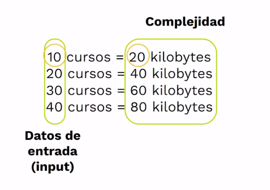
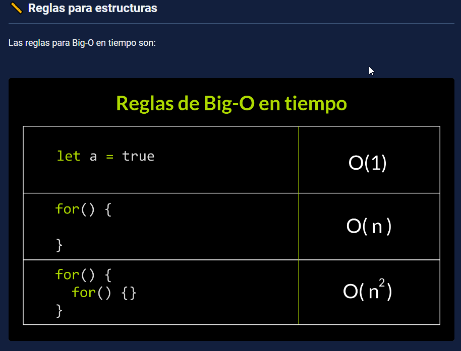
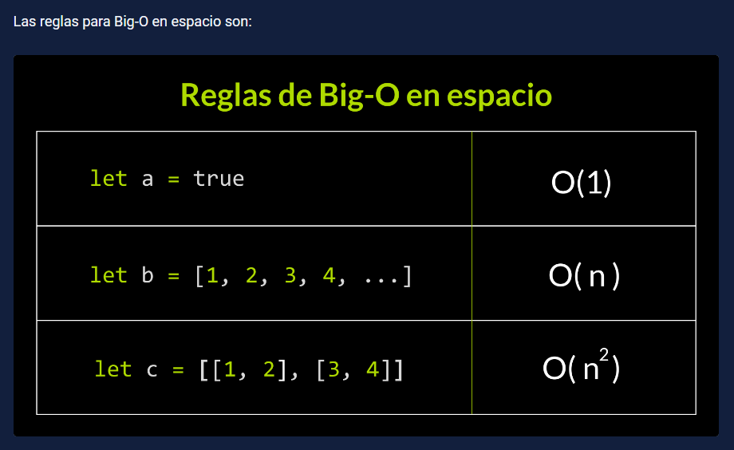
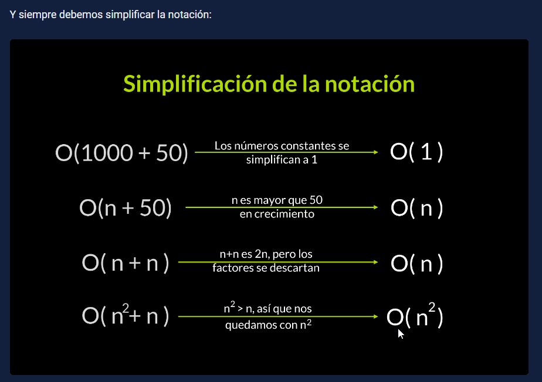
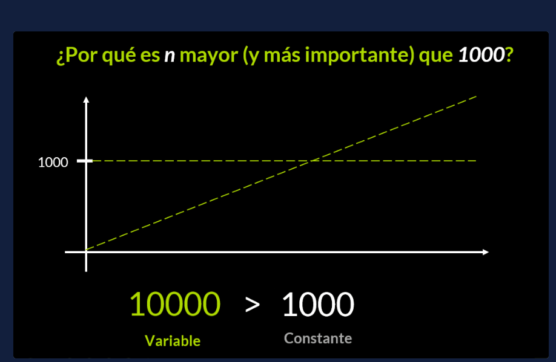

# 00 - Curso de Complejidad Algorítmica con JavaScript

## Clase 1: Bienvenida 
- Profesor: Marcelo Arias, Frontend Developer 
```
En este curso aprenderás a:

Dominar el concepto de complejidad algorítmica.
Evaluar qué tan eficiente es un algoritmo.
Seleccionar algoritmos basados en consumo de recursos.
Crear software más eficiente a través de la selección de algoritmos.
```
## Clase 2: Estructura de un algoritmo

Un algoritmo es una secuencia de instrucciones ordenadas para solucionar un problema. La estructura de un algoritmo consiste en un proceso que mediante una entrada de datos se obtiene una salida. Los algoritmos que se analizarán tienen que contar al menos con datos de entrada (input).

## Clase 3: ¿Cómo elegir un buen algoritmo?

- El espacio y el tiempo son dos conceptos determinantes en la evaluación de un algoritmo. El espacio es la cantidad de memoria que utilizas para resolver un problema. El tiempo consiste en la velocidad que se ejecuta ese algoritmo.
- Para encontrar un buen algoritmo podemos ver qué tanto tarda en ejecutarse, o qué tanto espacio ocupa en la memoria.
- Tiempo o espacio, ¿cuál es mejor para el desarrollo de un algoritmo?
- Lo ideal en una solución, es que el espacio sea lo mínimo posible y el tiempo sea lo más rápido. Sin embargo, esto no siempre se cumple.
- Podemos sacrificar uno para dar prioridad al otro. Por ejemplo, usar más memoria para aumentar la velocidad, como ocurre en Chrome. También, podemos reducir la velocidad, pero con un uso de memoria mínimo, como en las aplicaciones Lite (Facebook Lite).
- Dependiendo del objetivo de tu aplicación, el buen uso de espacio y tiempo es crucial para el desarrollo de un algoritmo óptimo, tomando en cuenta cada situación o el problema que se quiera resolver.

**Rendimiento en dispositivos embebidos**
- En dispositivos embebidos, el buen manejo de la memoria es crítico, ya que se requiere maximizar el espacio que ocupa, sin importar cuánto dure su procesamiento.

**Rendimiento en JavaScript**
- En particular, en JavaScript es más relevante apuntar más al tiempo, que al espacio. 
- Porque el código JavaScript usualmente no corre en dispositivos con memoria muy limitada (como sí sucede en dispositivos embebidos).
- Esto no significa que no haya casos particulares, o que el espacio siempre sea menos importante que el tiempo, solo es el ambiente del software con JavaScript.


## Clase 4: Introducción a complejidad algorítmica


> La complejidad algorítmica consiste en entender el crecimiento de recursos que requiere un algoritmo al momento de ejecutar un número determinado de elementos.
- En otras palabras, el algoritmo puede que se comporte de una manera con 10, 15 o 20 elementos. Sin embargo, con cientos o miles de elementos, el algoritmo probablemente se comportará de manera diferente, con respecto al tiempo y el espacio.

**Los recursos para medir la complejidad de un algoritmo son el tiempo y el espacio:**
- El tiempo es representado en milisegundos, segundos, minutos, etc.
- El espacio es representado en bytes, kilobytes, megabytes, gigabytes, etc.

**Teoría de la complejidad**
- La teoría de la complejidad estudia el consumo de recursos (tiempo / espacio) que un algoritmo ocupa.
- La complejidad algorítmica no hace referencia al tiempo de ejecución del algoritmo (segundos, minutos, horas, etc.), sino al ritmo y qué tan eficiente puede ser un algoritmo, con base en el problema que está resolviendo.
- A través de la complejidad buscamos entender el crecimiento de recursos, no su tamaño. Es el crecimiento de recursos lo que importa.

## Clase 5: Complejidad espacial

> La complejidad espacial es la cantidad de espacio en memoria que un algoritmo emplea al ejecutarse. 
- En otras palabras, cómo el algoritmo ocupa espacio en memoria con la cantidad de elementos de entrada que debe procesar.

**Comparación de algoritmos**
- Comparemos dos algoritmos que resuelven el mismo problema: “Visión” y “Nova”. 
- El primer algoritmo aumenta su espacio mientras más estudiantes sean ingresados. 
- Mientras que el segundo algoritmo aumenta exponencialmente su espacio necesario.

> Aunque ambos algoritmos resuelven el mismo problema, manejan la cantidad de memoria utilizada de manera diferente a medida que procesa más elementos.

## Clase 6: Complejidad temporal

> La complejidad temporal es la cantidad de tiempo en el que un algoritmo tarda en ejecutarse. En otras palabras, cómo el algoritmo aumenta en el tiempo, con respecto a la cantidad de elementos de entrada que debe procesar.

**Comparación de algoritmos**
- Comparemos dos algoritmos que resuelven un mismo problema: “Astronauta” y “Experto”. 
- El primer algoritmo aumenta su tiempo de ejecución mientras más estudiantes sean ingresados. 
- El tiempo de ejecución del segundo permanece constante.

> Aunque ambos algoritmos resuelven el mismo problema, manejan sus tiempos de ejecución de manera diferente a medida que procesa más elementos.

> La complejida no se trata de cuando mas o menos se tarda, sino **como aumenta feadual en el tiempo** 

## Clase 7: Curso de Complejidad Algorítmica con JavaScript


> Comandos para validar en javascript para medir redimiento de nuestros bloques de código 

`
**Los métodos perfomance.now() y console.time()** 
- se utilizan para medir el tiempo entre dos líneas de código en milisegundos. 
- La diferencia entre ambos es que performance.now() es más preciso.
- Para explicarlo, emplearemos un algoritmo de contar números.
`

```
//Funciona en navegador 
function contar(n) {
  for (let i = 0; i < n; i++) {
    console.log(i);
  }
}

console.time("duracion-contar");
contar(5);
console.timeEnd("duracion-contar");
```

```
//Funciona en Node.js 
const performance = require("perf_hooks");

function contar(n) {
  for (let i = 0; i < n; i++) {
    console.log(i);
  }
}

let inicio_tiempo = performance.performance.now();
contar(5);
let final_tiempo = performance.performance.now();
let duracion = final_tiempo - inicio_tiempo;

console.log(`El algoritmo contar ha durado ${duracion}ms.`);
```

## Clase 8:  Complejidad espacial en práctica

**Concepto**
- La complejidad espacial es diferente a la complejidad temporal. 
- Los diferentes compiladores asignan un espacio distinto de memoria para almacenar variables.
- La diversidad de tamaños y formas con las que el compilador almacena información es interesante, pero para el propósito que tenemos, podemos simplificarlo a contar cuántas variables se definen para almacenar arreglos, números o cadenas.

**Ejemplos de complejidad espacial**
- El algoritmo contar recibe como parámetro un número y cuenta hasta ese número. 
- ¿Qué se genera en el algoritmo? Una variable i que almacena un número.


## Clase 9: El estado de la complejidad

Los recursos que se analizan en Ciencias de la Computación van más allá del tiempo y del espacio. Existen complejidades como:

Accesos a memoria.
Procesos paralelos.
Comparaciones.
Entre otras más.
ㅤ
Complejidad en el futuro

Si descubrimos interesante optimizar el uso de un recurso en computación, allí tendremos un nuevo campo de estudio de complejidad.

## Clase 10: Introducción a análisis asintótico

- El análisis asintótico ⇒ Es un método para describir el comportamiento limitante de una función
- Análisis Asintótico es la forma con la que encontramos una función matemática similar a la medición de la complejidad.
- El comportamiento asintótico de una función f(n) se refiere al crecimiento de f(n) a medida que n crece.
- En el análisis asintótico, evaluamos el rendimiento de un algoritmo en términos de tamaño de entrada (no medimos el tiempo de ejecución real)
- Calculamos cómo aumenta el tiempo (o espacio) que toma un algoritmo con el tamaño de entrada.



## Clase 16: Curso de Complejidad Algorítmica con JavaScript

⏲ Cuando esperas a que cargue una aplicación web o cuando una pestaña de un navegador ocupa mucho espacio, estamos consumiendo recursos como tiempo o espacio.

📈 Los algoritmos que se ejecutan al realizar acciones pueden ser medibles en la notación Big-O.

👩‍💻 Para calcular la notación Big-O aplicamos una serie de reglas a través de nuestro código.









¿Por qué necesitamos Big-O? ¿Por qué una notación?
Un algoritmo o un programa podrían ejecutarse en cinco o diez horas, incluso si hablamos de una o varias computadoras. Big-O viene a poner orden todo eso, dándonos una forma fácil de leer en la que podemos determinar la eficiencia de un algoritmo.

¿Por qué asignamos Big-O a cada estructura?
Big-O medirá el recurso generado respecto a la entrada del algoritmo. Y las estructuras son un aspecto sencillo de convertir en medición de recursos.

Por ejemplo:

Con los bucles es sencillo, los bucles repiten instrucciones, y al repetir toman más tiempo en la computadora.

Con los arreglos es igual, repiten una serie de elementos, y al repetir esos elementos toman más espacio de la computadora.

¿Por qué nos quedamos con el grado mayor al simplificar Big-O?
En Big-O queremos comprender qué tanto recurso (como tiempo o espacio) nos gasta un algoritmo cuándo aumentamos los datos. Y cada grado aumenta a un ritmo totalmente distinto.

Por ejemplo n crece más que 1000:




¿Solo hay Big-O para espacio y tiempo?
No, la complejidad es el estudio de los recursos que utilizan los algoritmos. Estos recursos pueden ser cualquier concepto de hardware y software. Como acceso a la memoria, comparaciones de condiciones, o lo que se necesite limitar.

La buena noticia de esto, es que no se requiere inventar nuevas notaciones. Big-O es suficiente para que personas como tú, desarrolladores/as de software o científicos/as de computación trabajen sobre esto.