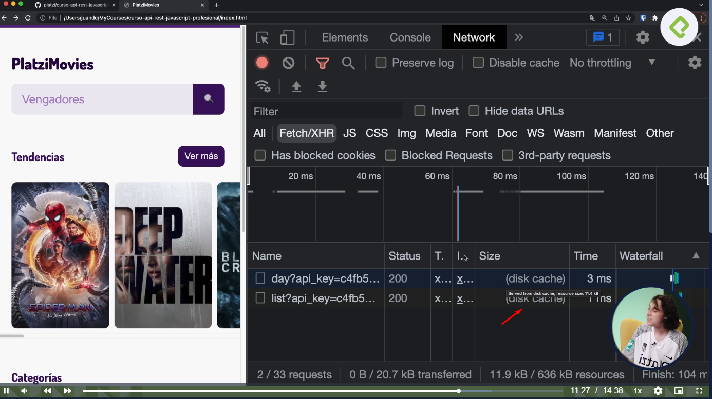

# 11 - Curso de API REST con Javascript: Performance y Usabilidad 

## Clase 1: Bienvenida 
- Profesor: Juan David Castro Gallego

## Clase 2: Caché vs. memoria

**Cache**
- Su pronunciación en English -> `kaSH` como dinero 
- Es la forma que el navegdaor que siempre nostraiga la ultoma información del backend del API 
- Siempre nos de la información que no de en cahce 

**Propiedades**

- default        -> 
- no-store       -> 
- reload         -> 
- no-cache       -> 
- force-cache    -> 
- only-if-cached -> 

**Memorization**
- Nosotros mismos podemos guardar las peticiones y solucitudes http para luego consumirlas. 

**Pasos**
- Crear un Objeto 
- Preguntar si el objeto tiene la información que necesitamos
- Si la tenemos la podemos usar. 
- Si  no esta la información, hacemos el calculo o volvemos a consumir el API 
- Solo se guarde hasta tiempo de compilación, ya que si recargas se vuela el calculo o la petición 

**Posibles Problemas**
- Nosotros no sabemos si ha cambiado la información del backend.  
- Nosotros no sabemos si la cahce o memorization esta actualizada o des-actualizada.

## Clase 3: Debuggeando caché y networking

> Explicación de como usar el debugger de network del navegador 




## Clase 4-5: Loading spinners vs. loading skeletons

**Buenas características de las pantallas de carga:**

- Facilidad de comprensión del estado de carga
- tiempo de carga amigable
- experiencia de carga divertida

**Tenemos dos estrategias principales para manejar las pantallas de carga:**

- Spinner de carga
- Un anillo cargando animado
- No comparta información clara sobre el embarque
- No sabemos si perdimos la conexión wifi o la web se colgó
- Cargando esqueletos
- tener buenas prácticas usuario disfrutar


**Los Usuarios**
- Odian esperar
- Odian no tener el control 
- 

## Clase 6-7-8: Intersection Observer


**Codigo Ejemplo**
```
// Función a la detección del observador
const loadImages = (entries, observer) => {
    entries
        .filter((entry) => entry.isIntersecting)
        .forEach((entry) => {
            const container = entry.target; // DIV
            const image = container.querySelector('img');
            image.classList.add('fade-in');
            const { src, alt } = image.dataset;
            image.src = src;
            image.alt = alt;
            observer.unobserve(container);
        });
};

// Parámetros de la instancia del observador
const options = {
    root: null,
    rootMargin: '0px',
    threshold: 0.5,
};

// Creando instanicia del observador
const observerSection = new IntersectionObserver(loadImages, options);

// Registrando imagen al observador
const registerImage = (target) => {
    observerSection.observe(target);
};

export default registerImage;

//Aqui lo implementa 

const trendingMoviesPreview = async () => {
    try {
        // Agregando loading screen
        addLoadindScreenImageContainer(trendingMoviesPreviewList, 6);
        // Importando datos
        const { status, data } = await api.get(URL_TRENDING_RES('movie', 'day'));
        if (status !== 200) throw new Error(`Error en la petición GET. Código HTTP: ${status}`);
        const movies = data.results;
        movies.forEach((movie) => {
            const container = addImageContainer({
                nodeContainer: trendingMoviesPreviewList,
                id: movie.id,
                posterPath: movie.poster_path,
                title: movie.title,
            });
            // Agregando imagen al observador
            if (intersectionObserverIsSupported) registerImage(container);
        });
        // Removiendo loading screen
        const trendingMoviesPreviewListUpdate = document.querySelector(
            '.trendingPreview-movieList',
        );
        removeLoadindScreenContainer(trendingMoviesPreviewListUpdate);
    } catch (error) {
        requestError(error);
    }
};
```

**Enlace**
https://developer.mozilla.org/en-US/docs/Web/API/Intersection_Observer_API

## clase 9-10: Scroll infinito vs. paginación

Yo considero que en el caso de Platzi movies lo mejor es el scroll infinito, 
porque a final de cuenta me parece que las películas van a tener un orden y si algún usuario quiere encontrar algo, 
puede recordar “más o menos” el orden donde estaba. 

Además el hecho que es importante hacerlo adictivo, para el usuario es una joya hacer scroll e interactuar con las páginas.

Pero ojo, lo que considero más importante es TESTEAR siempre. ¿Por qué no hacer una versión A y una B de la aplicación? Y 
después con DATOS te das cuenta de qué es lo que más hacen tus usuarios.

Como frontend es lo que más nos interesa, que los usuarios estén felices con la aplicación y la utilicen, todo lo demás sobra.

*Paginación**
- Esta realizado para que el usuario pueda navegar usando paginador 
- Es un poco mas ordenada y el usuario puede decidir como navegar
- Se mantiene la misma cantidad de elementos que se desea mostrar 
- Es bueno para encontrar contenido 
- No es adictivo 
- Hay mayor control 


**Scroll Infinito**
- Todo carga en la misma paginación
- La misma pagina te va dar nuevos resultados a memdida que vas generndo scroll 
- No hay control 
- Si hay mas adicción 
- Algun día llegaras al final 
- Hace sentir mal al footer 


## Clase 11: Infinite Scrolling: evento de scroll

**Recordar**

- document.documentElement.clientHeight  -> muestra el total del contenido en alto -> Cuanto es el alto d ela ventana de los usuarios 
- document.documentElement.scrollTop     -> muestra el tamalo del scroll desde el top 
- document.documentElement.scrolHeight -> Nos indica cuanto scroll podemos hacer en esa pantalla es la combinación de ambos. 

**Explicación Diferencia entre Bubbling y Capturing**

```
En JavaScript cuando se ejecuta un evento en un elemento del DOM, se tienen 3 fases diferentes las cuales se ejecutan en el siguiente orden:

Capturing phase (captura), es la fase en la que desde el nodo padre, se va descendiendo hasta el nodo objetivo, no es muy utilizada esta propiedad pero puede ser muy útil en ciertos casos
Target phase (objetivo), fase que se ejecuta al llegar al elemento objetivo
Bubbling (propagación), ultima fase, en la que el evento se propaga de vuelta al nodo padre desde el elemento objetivo.

Como puedes ver, si hacemos click sobre el elemento objetivo, se activa el alert de este primero, posteriormente del Div y al final en el Form, esto es bubbling, desde el objetivo hasta el padre.

Ahora vamos con capturing, el cual es en sentido inverso y lo podemos ver en funcionamiento utilizando la funcion addEventListener(evento, manejador[, capturing]) sobre un elemento, veamos un ejemplo:
```

**enlace ** 
- https://es.stackoverflow.com/questions/105687/diferencia-entre-bubbling-y-capturing

## Clase 12: Infinite Scrolling: limitando la carga de datos

```
También creé un Observer en vez de un eventListener de scroll (me pareció mas eficiente)

let loadMoreMoviesObserver = new IntersectionObserver((loadMoreObjetcs) => {
    loadMoreObjetcs.forEach(loadMoreButton => {
        
        if (loadMoreButton.isIntersecting) {
            loadMoreButton.target.click();
        }
    })
})5230
```

## Clase 13: Infinite Scrolling: closures de navegación

Resumen de Closure
.
Un closure es la combinación entre una función y el ámbito léxico en el que esta fue declarada. Con esto, la función recuerda el ámbito en el que se creó

Recuerda la asignación anterior

**Enlace**
- https://www.youtube.com/watch?v=JXG_gQ0OF74 -> Explica un closures 

## Clase 14: Local Storage vs. API real

**Datos interesantes**

- El localStorage guarda de 5 a 10mb de datos (dependiendo del navegador)
- No necesita bases de datos ni backend
- Excelente para probar ideas y hacer testing de funcionalidades
- Solamente guarda STRINGS
- Se guarda por cada navegador
- Es inseguro para guardar información


## Clase 15:Botón de like
corazones para sus proyectos
💞💘💖💗💓💕❤💙💚💛💜🤎🤍🧡

**Truco para crear css un botton con icon**

- 
- 

**Truco toggle javascript**

- 

## Clase 16:Guardando películas en Local Storage

**Truco stringify y parse**
- stringify -> Pasa un objeto a string 
- parse -> pasa un string a objeto 
- Recomendado para ser usado en los localStorage
- En un solo curso explicado una decadencia en mi vida 
- Object.value() -> transforma un objeto a arreglo 

- 