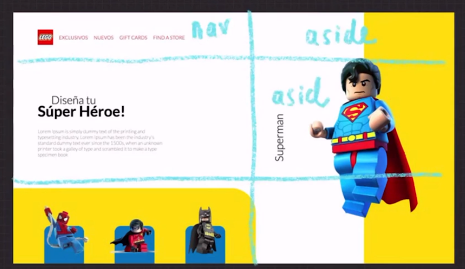

# 00 - Curso Práctico de Maquetación y Animaciones con CSS

## Clase 1: Bienvenida 
- Profesor  -> Estefany Aguilar
```
Aprende a maquetar sitios web profesionales con HTML, CSS, JavaScript y animaciones. Crea la estructura, diseño web, animaciones y microinteracciones de tu proyecto con CSS Grid. Accede al DOM de tu aplicación con JavaScript para interactuar con tus usuarios. Pon en práctica tus habilidades como frontend developer con tu profesora Estefany Aguilar.
```
## Clase 2: Estructura del proyecto

**Pasos**
- Paso 1: Crear tu wireframe y empezar idea la segmentación de tu portal pagina web lading page 
- Paso 2: empezar a maquetar la estructura pero con elemento basicos de html en esta etapa no tenemos css 
- Paso 3: Recuerda ir creando las secciones de manera mentaly usando lapiz y papel como recomendación 

**Ejemplo**



## clase 3: 

**Clave para animar**

```
 .loader {
    background: #E1E66C;
    width: 100%;
    height: 100%;
    display: flex;
    align-items: center;
    justify-content: center;
    position: absolute;
    z-index: 3;

    animation: loader 2s linear forwards;
  }

  @keyframes loader {
    0% {
      opacity: 1;
      
    }

    95% {
      opacity: 1;
      
    }

    100% {
      opacity: 0;
      pointer-events: none;
    }
  }

  .loader div {
    background: #992D29;
    width: 40px;
    height: 40px;
    border-radius: 50%;
    margin: 10px;

    transform: scale(0);

    animation: scaling 2s ease-in-out infinite;
  }
  
  /*Animar las esferas de manera secuencial*/
  .loader div:nth-child(1) {
    animation-delay: 0.4s;
  }

  .loader div:nth-child(2) {
    animation-delay: 0.6s;
  }

  .loader div:nth-child(3) {
    animation-delay: 0.8s;
  }

  @keyframes scaling {

    0%,
    100% {
      transform: scale(1);
    }

    50% {
      transform: scale(.2);
    }
  }
```

## clase 4: Conteiner con grid 

**Debo estudiar un poco mas sobre esto**

```
  .container {
    position: absolute;
    z-index: 1;

    display: grid;
    grid-template-columns: 55% 45%;
    grid-template-rows: 20% 50% 30%;
    grid-template-areas: "nav       aside"
                          "section  aside"
                          "footer   aside";

    height: 100%;
    width: 100%;                          
  }
```


## clase 6: Tipos de efectos 

> Las animaciones CSS3 permiten animar la transición entre un estilo CSS y otro. Las animaciones constan de dos componentes: un estilo que describe la animación CSS y un conjunto de fotogramas que indican su estado inicial y final, así como posibles puntos intermedios en la misma.

**Notas**
- Podemos usar una herramienta chrome llamada `cubic-bezier` para validar animaciones 

**Animaciones **
- https://developer.mozilla.org/es/docs/Web/CSS/CSS_Animations/Using_CSS_animations 

**Ejemplo**

