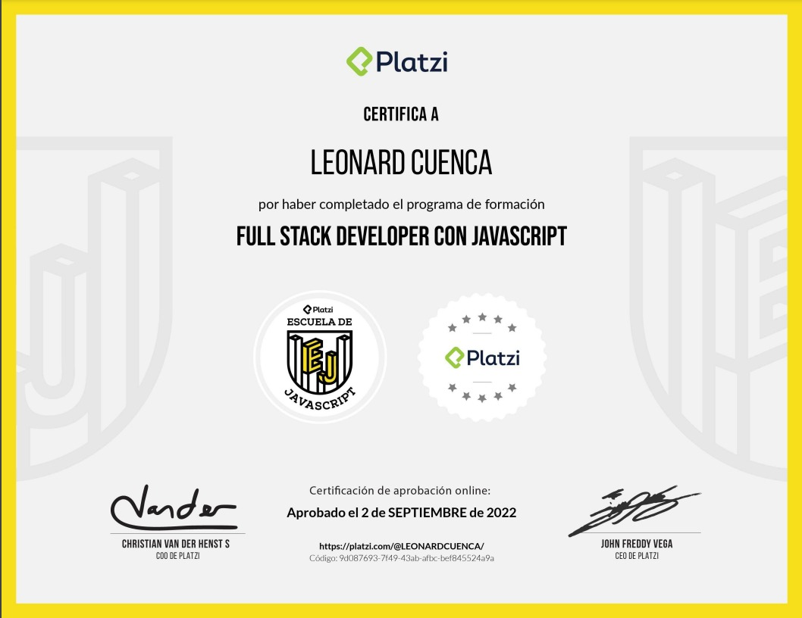
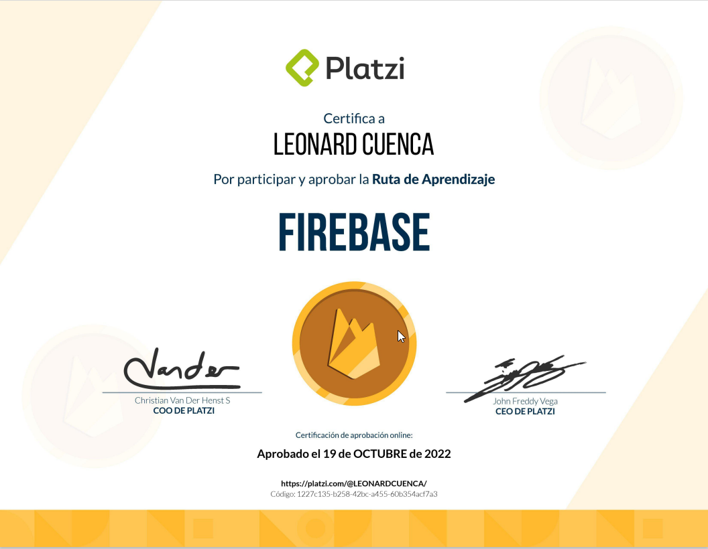

# JavaScript School

```Part of my initiative to improve my learning and professional growth, take Leonard to the LeoSan Professional Version 4.0 All About JavaScript, which is the future of the web, it is impressive everything that can be done with js, interfaces, api rest with node .js, imagine coding everything with a single language..```
  
- 🎓 Program Certificate  -> [Certificado](https://github.com/LeoSan/EscuelaJavaScript2021/blob/main/2022_Diploma-escuela-javascript_PLATZI.pdf)

> Learning about JavaScript - Basic 

- 🎓 Computación Basica - [Ver Certificado](https://github.com/LeoSan/EscuelaJavaScript2021/blob/main/01_Basico/00_Computaci%C3%B3n_Basica/2022_Diploma-computacion-basica_PLATZI.pdf)
- 🎓 Curso Practico Frontend Developer I - [Ver Certificado](https://github.com/LeoSan/EscuelaJavaScript2021/blob/main/01_Basico/04_CursoPracticoFrontendDeveloper_I/Certificado/2021_Diploma-frontend-developer_I_PLATZI.pdf)
- 🎓 Curso Básico Javascript [Ver Certificado](https://github.com/LeoSan/EscuelaJavaScript2021/blob/main/02_Medio/01_Curso_Basico_JavaScript/Certificado/2022_Diploma-basico-javascript_PLATZI.pdf)
- 🎓 Curso ECMAScript6 [Ver Certificado](https://github.com/LeoSan/EscuelaJavaScript2021/blob/main/02_Medio/03_CursoECMAScript6/Certificado/2022_Diploma-ecmascript-6_PLATZI.pdf)
- 🎓 Curso Gestión Dependencias Paquetes NPM [Ver Certificado](https://github.com/LeoSan/EscuelaJavaScript2021/blob/main/02_Medio/05_CursoGestinnDependenciasPaquetesNPM/Certificado/2022_Diploma-npm_PLATZI.pdf)


> Learning about JavaScript - Medio 

- 🎓 Curso Webpack - [Ver Certificado](https://github.com/LeoSan/EscuelaJavaScript2021/blob/main/02_Medio/06_CursoWebpack/Certificado/2122_Diploma-webpack_PLATZI.pdf)
- 🎓 Curso Practico React - [Ver Certificado](https://github.com/LeoSan/EscuelaJavaScript2021/blob/main/02_Medio/07_CursoPracticoReact/Certificado/2021_diploma-react-practico_platzi.pdf)
- 🎓 Curso JavaScript Engine V8 Navegador - [Ver Certificado](https://github.com/LeoSan/EscuelaJavaScript2021/blob/main/02_Medio/08_Curso_JavaScript_Engine_V8_Navegador/Certificado/2022_Diploma-javascript-navegador_PLATZI.pdf)
- 🎓 Curso Closures Scope JavaScript - [Ver Certificado](https://github.com/LeoSan/EscuelaJavaScript2021/blob/main/02_Medio/09_CursoClosuresScopeJavaScript/Certificado/2022_Diploma-scope_PLATZI.pdf)
- 🎓 Curso Práctico Nextjs - [Ver Certificado](https://github.com/LeoSan/EscuelaJavaScript2021/blob/main/02_Medio/11_CursoPr%C3%A1cticoNextjs/Certificado/2022_Diploma-nextjs-practico_PLATZI.pdf)
- 🎓 Curso Nivel Medio Nextjs - [Ver Certificado](https://github.com/LeoSan/EscuelaJavaScript2021/blob/main/02_Medio/11_CursoPr%C3%A1cticoNextjs/Certificado/2022_Diploma-profesional-nextjs_PLATZI.pdf)
- 🎓 Curso Nivel Medio Nextjs - [Ver Certificado](https://github.com/LeoSan/EscuelaJavaScript2021/blob/main/02_Medio/11_CursoPr%C3%A1cticoNextjs/Certificado/2022_Diploma-profesional-nextjs_PLATZI.pdf)


> Learning about JavaScript - Advanced

- 🎓 Curso Curso de Fundamentos de Node.js - [Ver Certificado](https://github.com/LeoSan/EscuelaJavaScript2021/blob/main/03_Avanzado/01_CursoFundamentosNodeJS/Certificado/2022_Diploma-fundamentos-node_PLATZI.pdf)
- 🎓 Curso Curso de Backend con Node.js: API REST con Express.js - [Ver Certificado](https://github.com/LeoSan/EscuelaJavaScript2021/blob/main/03_Avanzado/02_CursoBackendNodejsAPIRESTExpress/Certificado/2022_diploma-backend-nodejs-postgres_PLATZI.pdf)
- 🎓 Curso Curso de Backend con Node.js: Base de Datos con PostgreSQL - [Ver Certificado](https://github.com/LeoSan/EscuelaJavaScript2021/blob/main/03_Avanzado/02_CursoBackendNodejsAPIRESTExpress/Certificado/2022_diploma-backend-nodejs-postgres_PLATZI.pdf)
- 🎓 Curso Curso de Backend con Node.js: Autenticación con Passport.js y JWT - [Ver Certificado](https://github.com/LeoSan/EscuelaJavaScript2021/blob/main/03_Avanzado/04_CursoBackendNodejs_Autenticacion_Passportjs_JWT/Certificado/2022_Diploma-passport_PLATZI.pdf)
- 🎓 Curso Basico Mongo DB - [Ver Certificado](https://github.com/LeoSan/EscuelaJavaScript2021/blob/main/03_Avanzado/05_CursoBasicoMongoDB/Certificado/2022_Diploma-mongodb_PLATZI.pdf)
- 🎓 Curso de Firebase 5 para Web - [Ver Certificado](https://github.com/LeoSan/EscuelaJavaScript2021/blob/main/03_Avanzado/06_CursoFirebase5Web/Certificado/2022_Diploma-firebase-5-web_PLATZI.pdf)
- 🎓 Curso de Firebase 5: Cloud Functions - [Ver Certificado](https://github.com/LeoSan/EscuelaJavaScript2021/blob/main/03_Avanzado/07_CursoFirebase5CloudFunctions/Certificado/2022_Diploma-firebase-cloud_PLATZI.pdf)
- 🎓 Curso de Introducción a Google Cloud Platform - [Ver Certificado](#)


> Final certificate compiled from all courses

- 🎓 Program Certificate  -> [Certificado](https://github.com/LeoSan/EscuelaJavaScript2021/blob/main/2022_Diploma-escuela-javascript_PLATZI.pdf)


> Final certificate compiled about **Firebase**

- 🎓 Program Certificate  -> [Certificado](https://github.com/LeoSan/EscuelaJavaScript2021/blob/main/2022_Diploma-firebase_PLATZI.pdf)


> Learning about JavaScript - Professional - In Course

- 🎓 Curso de Closures y Scope en JavaScript - [Ver Certificado](#)
- 🎓 Curso Profesional de JavaScript - [Ver Certificado](#)
- 🎓 Curso de Estructuras de Datos con JavaScript - [Ver Certificado](#)
- 🎓 Curso de Node.js: Base de Datos con MongoDB y WebSockets - [Ver Certificado](#)
- 🎓 Curso de Node.js: Autenticación, Microservicios y Redis - [Ver Certificado](#)
- 🎓 Curso de Node.js para IoT: Pub/Sub con MQTT, Testing y WebSockets - [Ver Certificado](#)
- 🎓 Curso de JavaScript Full Stack con Sails.js - [Ver Certificado](#)
- 🎓 Curso de Desarrollo de APIs con Sails.js - [Ver Certificado](#)
- 🎓 Curso de Node.js con Hapi - [Ver Certificado](#)
- 🎓 Curso de Backend con NestJS - [Ver Certificado](#)
- 🎓 Curso de NestJS: Programación Modular, Documentación con Swagger y Deploy - [Ver Certificado](#)
- 🎓 Curso de NestJS: Persistencia de Datos con TypeORM - [Ver Certificado](#)
- 🎓 Curso de NestJS: Persistencia de Datos con MongoDB - [Ver Certificado](#)
- 🎓 Curso de NestJS: Autenticación con Passport y JWT - [Ver Certificado](#)
- 🎓 Curso Práctico de Webpack - [Ver Certificado](#)
 

> Personal Project  - still in development
```Due to the pandemic, a lot of anxiety is generated, this time and money management tool helps to validate in which section of your life time, these two resources are being better invested.```
- 💻 AppVerifyAnts [Fase Beta ](https://github.com/LeoSan/AppVerifyAnts) 
