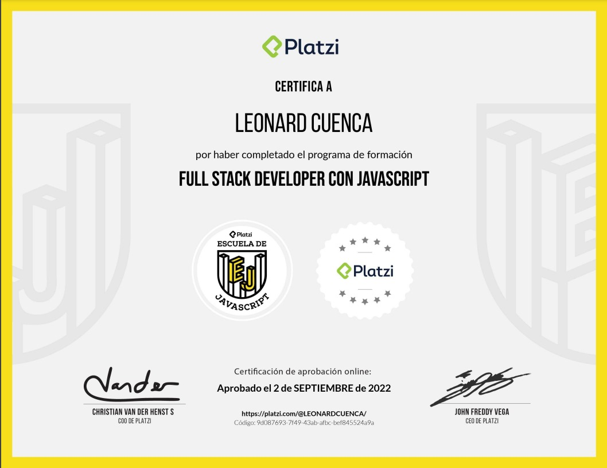
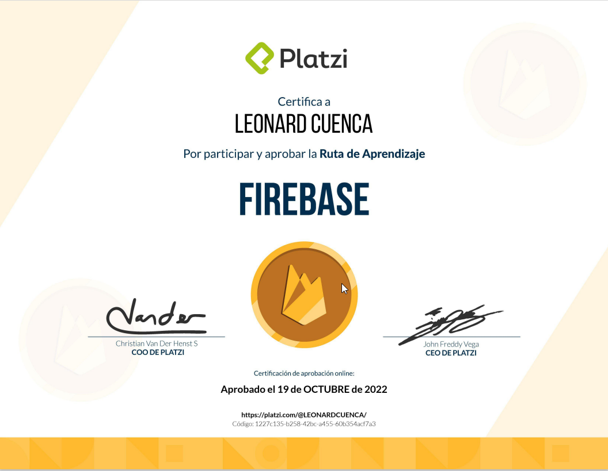
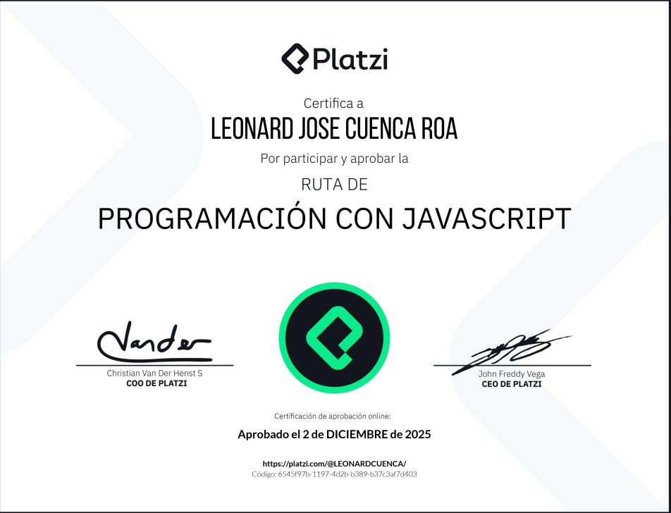

# 🚀 JavaScript School: Path to Full Stack

> **Iniciativa de Crecimiento Profesional - LeoSan v4.0**
>
> Este repositorio documenta mi trayectoria completa en el dominio de **JavaScript**, el lenguaje que impulsa el futuro de la web. Desde interfaces interactivas hasta APIs robustas con Node.js, mi objetivo es dominar el ecosistema Full Stack.

---

## 🛠️ Tech Stack & Herramientas
Estas son las tecnologías que he aprendido y aplicado a lo largo de este programa:

---

## 📜 Certificación Principal

| Programa | Estado | Credencial |
| :--- | :---: | :---: |
| **Escuela de JavaScript (Platzi)** | 🏆 Completado | [Ver Certificado](https://github.com/LeoSan/EscuelaJavaScript2021/blob/main/2022_Diploma-escuela-javascript_PLATZI.pdf) |

---

## 📚 Ruta de Aprendizaje

### 🟢 Nivel Básico: Fundamentos
*Bases sólidas en computación y sintaxis de JS.*

| Curso | Certificado |
| :--- | :---: |
| Computación Básica | [Ver PDF](https://github.com/LeoSan/EscuelaJavaScript2021/blob/main/01_Basico/00_Computaci%C3%B3n_Basica/2022_Diploma-computacion-basica_PLATZI.pdf) |
| Curso Práctico Frontend Developer I | [Ver PDF](https://github.com/LeoSan/EscuelaJavaScript2021/blob/main/01_Basico/04_CursoPracticoFrontendDeveloper_I/Certificado/2021_Diploma-frontend-developer_I_PLATZI.pdf) |
| Curso Básico JavaScript | [Ver PDF](https://github.com/LeoSan/EscuelaJavaScript2021/blob/main/02_Medio/01_Curso_Basico_JavaScript/Certificado/2022_Diploma-basico-javascript_PLATZI.pdf) |
| Curso ECMAScript 6+ | [Ver PDF](https://github.com/LeoSan/EscuelaJavaScript2021/blob/main/02_Medio/03_CursoECMAScript6/Certificado/2022_Diploma-ecmascript-6_PLATZI.pdf) |
| Gestión de Dependencias (NPM) | [Ver PDF](https://github.com/LeoSan/EscuelaJavaScript2021/blob/main/02_Medio/05_CursoGestinnDependenciasPaquetesNPM/Certificado/2022_Diploma-npm_PLATZI.pdf) |

### 🟡 Nivel Intermedio: Frontend Moderno & Arquitectura
*Profundización en el motor V8, React, Next.js y herramientas de build.*

| Curso | Certificado |
| :--- | :---: |
| Webpack | [Ver PDF](https://github.com/LeoSan/EscuelaJavaScript2021/blob/main/02_Medio/06_CursoWebpack/Certificado/2122_Diploma-webpack_PLATZI.pdf) |
| Curso Práctico de React.js | [Ver PDF](https://github.com/LeoSan/EscuelaJavaScript2021/blob/main/02_Medio/07_CursoPracticoReact/Certificado/2021_diploma-react-practico_platzi.pdf) |
| JavaScript Engine (V8) y Navegador | [Ver PDF](https://github.com/LeoSan/EscuelaJavaScript2021/blob/main/02_Medio/08_Curso_JavaScript_Engine_V8_Navegador/Certificado/2022_Diploma-javascript-navegador_PLATZI.pdf) |
| Closures y Scope | [Ver PDF](https://github.com/LeoSan/EscuelaJavaScript2021/blob/main/02_Medio/09_CursoClosuresScopeJavaScript/Certificado/2022_Diploma-scope_PLATZI.pdf) |
| Next.js Práctico | [Ver PDF](https://github.com/LeoSan/EscuelaJavaScript2021/blob/main/02_Medio/11_CursoPr%C3%A1cticoNextjs/Certificado/2022_Diploma-nextjs-practico_PLATZI.pdf) |
| Next.js Profesional | [Ver PDF](https://github.com/LeoSan/EscuelaJavaScript2021/blob/main/02_Medio/11_CursoPr%C3%A1cticoNextjs/Certificado/2022_Diploma-profesional-nextjs_PLATZI.pdf) |

### 🔴 Nivel Avanzado: Backend & Cloud
*Desarrollo del lado del servidor, bases de datos y despliegue.*

| Curso | Temas Clave | Certificado |
| :--- | :--- | :---: |
| Fundamentos de Node.js | Node, Event Loop | [Ver PDF](https://github.com/LeoSan/EscuelaJavaScript2021/blob/main/03_Avanzado/01_CursoFundamentosNodeJS/Certificado/2022_Diploma-fundamentos-node_PLATZI.pdf) |
| Backend con Node.js | API REST, Express | [Ver PDF](https://github.com/LeoSan/EscuelaJavaScript2021/blob/main/03_Avanzado/02_CursoBackendNodejsAPIRESTExpress/Certificado/2022_diploma-backend-nodejs-postgres_PLATZI.pdf) |
| Base de Datos PostgreSQL | SQL, Relaciones | [Ver PDF](https://github.com/LeoSan/EscuelaJavaScript2021/blob/main/03_Avanzado/02_CursoBackendNodejsAPIRESTExpress/Certificado/2022_diploma-backend-nodejs-postgres_PLATZI.pdf) |
| Autenticación (Passport/JWT) | Seguridad, Auth | [Ver PDF](https://github.com/LeoSan/EscuelaJavaScript2021/blob/main/03_Avanzado/04_CursoBackendNodejs_Autenticacion_Passportjs_JWT/Certificado/2022_Diploma-passport_PLATZI.pdf) |
| MongoDB Básico | NoSQL, Atlas | [Ver PDF](https://github.com/LeoSan/EscuelaJavaScript2021/blob/main/03_Avanzado/05_CursoBasicoMongoDB/Certificado/2022_Diploma-mongodb_PLATZI.pdf) |
| Firebase Web & Cloud Functions | Serverless, Realtime | [Ver PDF](https://github.com/LeoSan/EscuelaJavaScript2021/blob/main/03_Avanzado/06_CursoFirebase5Web/Certificado/2022_Diploma-firebase-5-web_PLATZI.pdf) |
| Google Cloud Platform | Cloud Intro | [En Proceso](#) |

---

## 🎓 Especializaciones Completadas

### Full Stack JavaScript

### Firebase Development

### Update Development 2025 javaScript

---

## 🚧 En Curso: Nivel Profesional (Mastery)

Actualmente profundizando en arquitecturas avanzadas, microservicios y NestJS.

- [ ] Curso Profesional de JavaScript
- [ ] Estructuras de Datos con JavaScript
- [ ] Node.js: Microservicios y Redis
- [ ] Node.js para IoT (MQTT, WebSockets)
- [ ] **Especialización en NestJS** (Modular, TypeORM, Mongo, Auth)
- [ ] Desarrollo Full Stack con Sails.js

---

## 💡 Proyectos Personales

### 🐜 AppVerifyAnts (Beta)
> *Herramienta de gestión de tiempo y recursos para combatir la ansiedad generada durante la pandemia.*

Esta aplicación ayuda a validar en qué áreas de tu vida se están invirtiendo mejor dos recursos vitales: tiempo y dinero.

- **Repositorio:** [AppVerifyAnts](https://github.com/LeoSan/AppVerifyAnts)
- **Estado:** 🛠️ En Desarrollo

---

#### 📝 Notas y Recursos
- [Gist: Mis extensiones favoritas de VS Code](https://gist.github.com/Klerith/5a572bf9835b090d4cd8304d523365c7)
